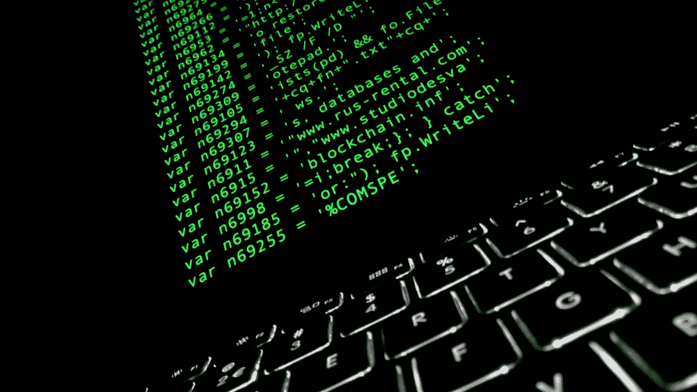

# 智能合同漏洞仍然是一个明显的现实危险

> 原文：<https://medium.com/hackernoon/smart-contract-vulnerabilities-remain-a-clear-and-present-danger-59acaf82213f>

Source: [Christiaan Colen](https://www.flickr.com/photos/christiaancolen/)

一月份，以太坊被迫在最后一刻推迟了备受期待的君士坦丁堡升级，以应对一个安全漏洞，该漏洞可能允许智能合同被利用来获得额外资金。ETH 的价格立即感受到了压力，在强劲反弹至该点后的几个小时内下跌了 11%。很多乐观围绕更新，特别是“第三次”，或减少到 33%的采矿奖励。这将降低以太坊的通货膨胀率，同时引入代码优化并降低智能合约存储的费用。

问题中的安全缺陷是潜在的“重入攻击”[利用 EIP 1283](/chainsecurity/constantinople-enables-new-reentrancy-attack-ace4088297d9) 中的代码，在最坏的情况下允许攻击者窃取资金。长期以来，这在理论上一直是可能的，但是智能合约存储的抑制价格阻止了攻击者追求这一路线。君士坦丁堡会降低这个价格，因此开发商被迫推迟硬分叉工作的永久解决方案。

以太坊团队非常了解智能合约漏洞的后果。众所周知，该平台完成了一次硬分叉，以回应道黑客攻击，这是该行业短暂历史上最臭名昭著的事件之一。这利用了一个“递归调用”来不断地从 DAO smart 合同请求和接收总计约 7000 万美元的资金。

刀，当然，不是以太坊的团队开发或领导的。它是由 Christoph Jentzsch 向全世界提出的，并成为一个开源项目，由其利益相关者投票决定为项目筹集和分配资金。但是考虑到当时已经众筹了 1200 万 ETH，这是现有以太坊的一大块，该社区面临着一个艰难的决定:“用硬叉子回滚”该漏洞，并将受影响的 ETH 归还给其所有者，或者继续正常运行，允许黑客从任何未来收益中获利，而投资者则被晾在一边。虽然没有吸引力，但后者是其白皮书中提出的以太坊哲学和区块链技术哲学的真实写照——任何个人或组织都不应有权决定哪些交易是合法的或非法的。然而，分叉发生了，以太坊经典坚定地相信那些不变性的原则，从长远来看失败了(很可能使黑客在这个过程中变得非常富有)。也许关于那个不幸时期的最好文章来自彭博大学的马修·莱辛，强烈推荐阅读。

区块链最大的漏洞背后的关键问题可以归结为:为什么这个领域最好的程序员会犯这么多错误？指责君士坦丁堡开发者的任何疏忽都是不公平的——他们确实发现了漏洞[，并用彼得斯堡附加补丁](https://github.com/ethereum/go-ethereum/releases/tag/v1.8.22)禁用了 EIP 1283。但是这个问题是在计划发射的同一天被发现的，所以它非常接近于一个潜在的灾难。

努里埃尔·鲁比尼[(我们之前已经讨论过他)](https://hackernoon.com/debating-crypto-critics-nouriel-roubinis-testimony-before-the-us-senate-7cfccb74cf72?source=your_stories_page---------------------------)在向美国参议院委员会作证期间，对整个区块链行业提出了一些不准确的批评，但他的怀疑恰恰是在一个领域——聪明的合同开发商和区块链开发商更广泛地犯了很多错误。他引用的研究发现:

[“以太坊上的智能合约甚至比非金融的商业代码还要糟糕；截至 2016 年 5 月，以太坊合约平均每 1000 行代码中有 100 个明显的错误(如此明显，机器可以发现它们)。(相比之下，微软代码平均每 1000 行有 15 个错误，NASA 代码每 500，000 行大约有 0 个。)"](https://davidgerard.co.uk/blockchain/ethereum-smart-contracts-in-practice/)

[新加坡国立大学的研究人员呼应了这些担忧](https://eprint.iacr.org/2016/633.pdf)，他们的研究显示，他们检查的智能合同中约有 30%存在潜在漏洞。这令人担忧，不是因为这是对以太坊的攻击，而是恰恰相反——因为以太坊可以很好地维持最好的程序员社区，至少在区块链领域是这样。如果他们的关键更新代码有类似君士坦丁堡之前发现的问题，人们可能只会想象在其他智能合约平台中存在多少问题。[赌博 DAPPs 似乎特别有针对性，EOS 上的一个这样的例子在 2018 年被打了 20 万美元。](https://thenextweb.com/hardfork/2018/09/14/eos-gambling-app-hacked/)

这是区块链空间担忧的合理原因。智能合约和去中心化虚拟机是一项几乎不可思议的创新，但如果漏洞继续出现，它将永远被掩盖。没有人期望美国宇航局的水平是完美的，但智能合同支持的区块链项目需要在安全性方面胜过大多数其他类型的技术。毕竟他们是在和人的钱打交道。

Viewnodes 编辑拜伦·墨菲的文章。所有观点均为作者个人观点。Viewnodes 帮助客户建立和维护当前支持的货币的主节点。要联系我们了解 masternode 服务的信息，请提交此[联系表](https://docs.google.com/forms/d/e/1FAIpQLSd6AXWZtPnmeklGFg-l4tAAKWsxHJ0LW-d0wFUxT4NRJ__e9Q/viewform)。