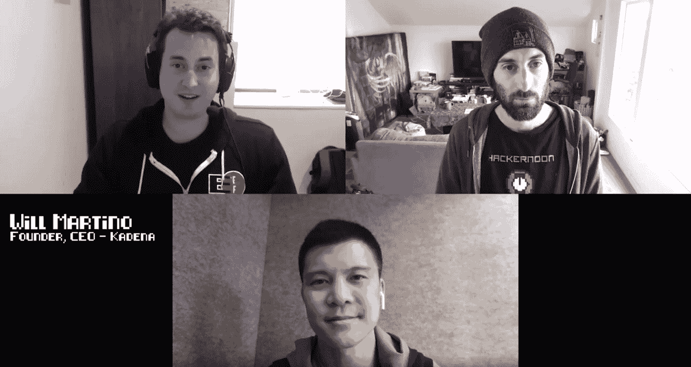

# Will Martino 和 Tony Pham 关于区块链的智能合同

> 原文：<https://medium.com/hackernoon/smart-contracts-on-blockchain-with-will-martino-and-tony-pham-c05cc9b62bed>

## [黑客午间播客](https://podcast.hackernoon.com/)第 42 集:采访[嘉手纳](https://kadena.io/en/)创始人& CEO 威尔·马蒂诺和[嘉手纳](https://kadena.io/en/)营销负责人托尼·法姆。

## 在 [iTunes](https://itunes.apple.com/us/podcast/product-iteration-with-hacker-noon-interim-cto-dane-lyons/id1436233955?i=1000421970409&mt=2) 上听采访，或者[谷歌播客](https://play.google.com/music/m/Dfuna5a4pzsmjr76bxabkxdrhim?t=Product_Iteration_with_Hacker_Noon_Interim_CTO_Dane_Lyons-Hacker_Noon_Podcast)，或者在 [YouTube](https://www.youtube.com/channel/UChu5YILgrOYOfkfRlTB-D-g) 上看。

在这一集[中，特伦特·拉平斯基](/@trentlapinski)采访了[嘉手纳](https://kadena.io/en/)的创始人兼首席执行官威尔·马蒂诺和营销主管托尼·法姆。您将了解他们正在开发的东西，这是一种新的编程语言，用于智能签约和可伸缩性，以及企业区块链解决方案的用例。

*“这一切都是为了协调平台三个核心用户的激励机制。你有矿工谁想要更多的采用，他们想要一个更大的网络每秒处理更多的交易。你有不想付高额费用的用户。他们想要高安全性，他们想要去中心化，他们想要不信任，他们想要开放性，他们也不想付费。企业希望知道，如果他们开始使用这个平台，他们开始拥塞网络，因为想想 Cryptokitties——它启动了，以太坊阻塞了一周，他们希望知道网络可以增长，以支持他们需要的吞吐量，因为他们找到了他们的产品市场。”*

*“总的来说，我认为整个领域的发展方向是共享经济，即企业共享经济。这是一个重新定义消费者和企业如何互动的领域。”*

***——****将马蒂诺*

 [## Will Martino 和 Tony Pham 关于区块链的智能合同

### 黑客正午播客第 42 集:采访 Kadena 创始人兼首席执行官 Will Martino 和……

www.podbean.com](https://www.podbean.com/media/share/pb-jwdut-b0b55c) 

社区:[https://community.hackernoon.com/](https://contribute.hackernoon.com/)

德里克·伯纳德制作和音乐—[haberdasherband.com/production](http://haberdasherband.com/production?fbclid=IwAR2d8t0cNGHRm1ajmUNWKZ-TMUMawREhvIHSy54LKcOElf7v_TOvkAjZ78Y)

主持人:特伦特·拉平斯基—【https://trentlapinski.com 

【https://hackernoon.com/ 

[https://contribute.hackernoon.com/](https://contribute.hackernoon.com/)

[https://sponsor.hackernoon.com/](https://sponsor.hackernoon.com/)

[https://podcast.hackernoon.com/](https://podcast.hackernoon.com/)

[https://twitter.com/hackernoon/](https://twitter.com/hackernoon/)

[https://facebook.com/hackernoon/](https://facebook.com/hackernoon/)

## 还可以查看[五月头条](https://hackernoon.com/archive/2019/05)、[最新报道](https://hackernoon.com/latest-tech-stories/home)和[今日首页](http://hackernoon.com/)。