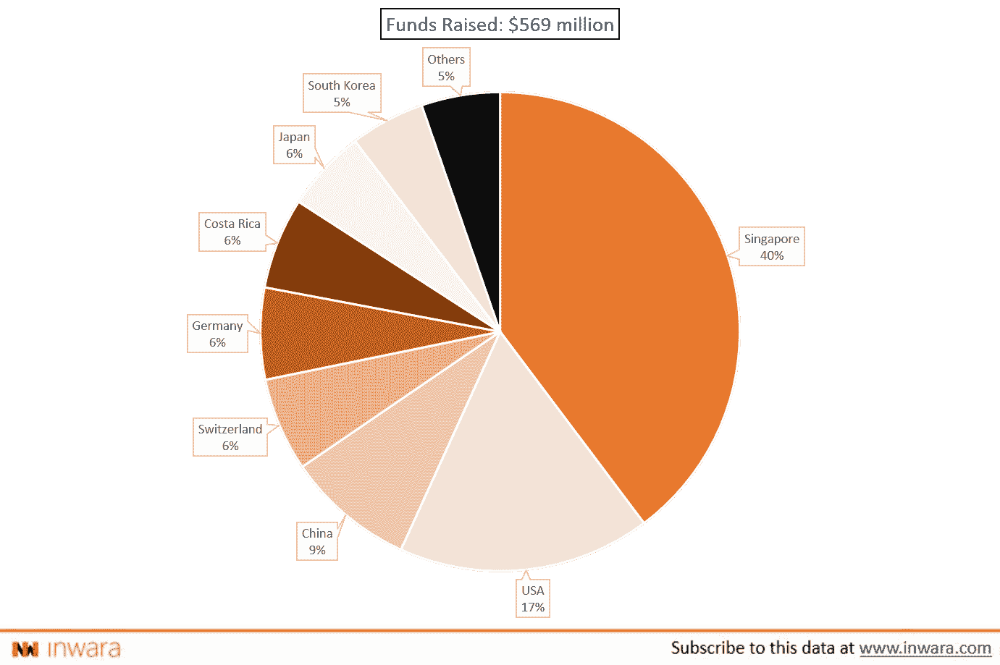

# 精明的资金正在流向亚洲区块链和加密市场

> 原文：<https://medium.com/hackernoon/smart-money-is-going-to-asian-blockchain-and-crypto-market-cb01cfe8c37d>

Image by [Sofia Terzoni](https://pixabay.com/users/sofi5t-6957643/?utm_source=link-attribution&utm_medium=referral&utm_campaign=image&utm_content=4141578) from [Pixabay](https://pixabay.com/?utm_source=link-attribution&utm_medium=referral&utm_campaign=image&utm_content=4141578)

回想起来，美国和欧洲国家喜欢瑞士；在创新、企业解决方案和采用方面，英国在区块链和加密领域处于领先地位。

虽然没有这些国家那么突出，但亚洲国家如新加坡已经参与了相当一段时间，尽管它主要是在 ICO 领域。但现在的数据表明，风险资本家正在大举投资亚洲区块链和加密初创公司。

**区块链风险投资:2019 年 4 月**

> *2019 年，区块链的风险投资基金和亚洲市场以外的加密初创公司首次超过了美国和欧洲的同行，而且幅度也很大。(来源:*[*in wara 2019 年 4 月报道*](https://www.inwara.com/report/monthly-report-april-2019) *)*

风险投资家是否将他们的注意力(和资金)集中在亚洲的区块链和密码市场？这是从报告中摘录的一些有趣的数据。你是法官。

[来源](https://www.inwara.com/report/monthly-report-april-2019)

仅在 4 月份，就有惊人的 3 . 41 亿美元投资于区块链和 crypto ventures。其中高达**2 亿**美元投资于韩国公司，占募集资金总额的 59%。

除了韩国，中国是本月另一个吸引大量风险投资的亚洲国家。风险投资家向中国公司投资了整整 4000 万美元，这些公司都属于区块链和加密领域。

此外，风险投资家向越南的初创公司 Utop 投资了 300 万美元。亚洲区块链和加密初创公司的投资总额高达 2.43 亿美元，占本月风险投资总额的 71%。

**ICO 景观:2019 年 4 月**

不仅仅是风险投资家认为亚洲区块链和加密空间有巨大的增长潜力。就连散户也这么认为。

**各国通过 ICOs 筹集的资金—2019 年 4 月**

[**来源**](https://www.inwara.com/report/monthly-report-april-2019)

总部位于韩国的 ICOs 成功筹集了 2700 万美元，但它并不是本月全球代币销售额的最大贡献者，这个头衔属于新加坡。

总部位于新加坡的 ICOs 成功筹集了高达 2.14 亿美元的资金，占本月全球筹资总额的 40%。成功筹集大量资金的其他亚洲国家包括中国(4600 万美元)、日本(3000 万美元)和印度(560 万美元)。在这些国家中，仅通过象征性销售就筹集了约 3 . 25 亿美元，相当于全球筹资总额的 57%。明显的多数。

许多因素可能会推动这种转变。首先，越来越多的亚洲国家正在实施区块链和加密友好的法规-实现这项技术的潜力，以推动经济增长。

其次，亚洲国家相对较高的人口基数，加上缺乏适当的金融结构，使亚洲成为一个主要市场，可以推动加密和区块链的大规模采用。

*免责声明:本文使用的上述数据均来源于 InWara 的市场情报平台。*