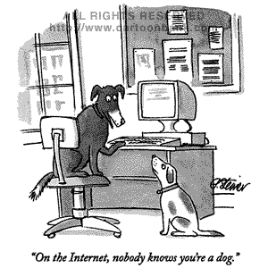
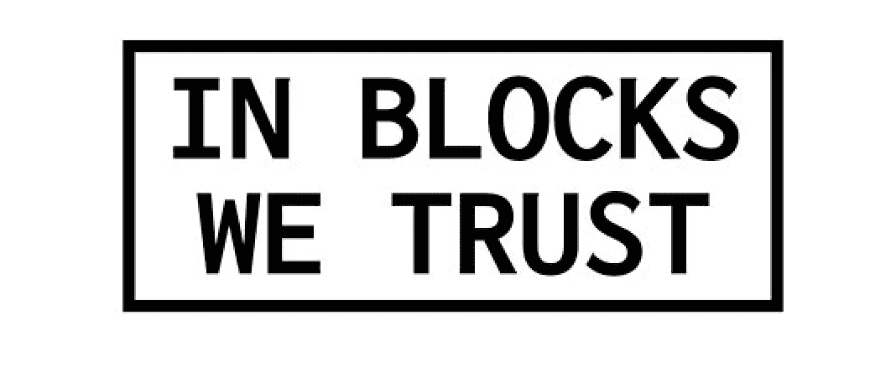

# 智能使用区块链技术可以修复互联网的信任缺失

> 原文：<https://medium.com/hackernoon/smart-use-of-blockchain-technology-can-fix-the-internets-lack-of-trust-bbf8b224efc2>

Shyft 网络联合创始人约瑟夫·温伯格

一开始，有了互联网。插入的部分乐趣在于匿名性，即*缺乏*意识——你可以与任何人互动，任何人都可以与你互动，没有任何障碍。这是培养新体验的理想方式，但却是做生意的糟糕方式。建造互联网的科学家和工程师并不关心这些。他们只是想让你能够随心所欲地与他人联系。困扰互联网的永恒问题现在和过去一样:*我怎么知道你是你所说的那个人？*

这不仅仅是一个在线问题:缺乏现成的在线信任阻碍了我们对互联网潜在的更大用途。例如，考虑与获得新公寓相关的麻烦。房东需要你保证你会是一个好房客，会按时付房租。这通常需要分享甚至不相关的敏感信息，更不用说依赖信用评级和其他可能无法准确反映你财务状况的指标。

在二十多年无法通过在线解决方案解决此类基本问题后，区块链技术公司为我们提供了一个构思更好方法的途径。

# 在线身份的演变

让我们把我之前描述的互联网的初始阶段看作“**第一阶段**”随着每个阶段的过去，需要服务的用户群呈指数级增长。

在线信任问题的原始解决方案优雅而简单，但显然不可扩展:用户名和相关密码，尤其是为了保护您的电子邮件服务。(**二期**)。)把这些想象成借记卡或信用卡和 PIN 的数字模拟。随着这个出现，对大多数人来说，不管是有意识的还是无意识的,“ID”不是一个东西，而是两个。说到你的“轻”ID(你的邮箱，你的博客等。)，也许一个用户和密码解决方案就足够了，假设在机构级别和您的日常实践中都有合适的密码标准。然而，这些做法对“笨重”的身份证——你的护照、驾照——不起作用。对于这些人来说，没有什么可以替代参观实体政府或机构办公室。

所以在这个阶段，有某种程度的认同在起作用，但绝对不能保证你就是你所说的那个人。你们只需要互相信任。

在第三阶段，密码/用户名解决方案开始失效。要记住的密码实在太多了，而且重置得太频繁了，过不了多久，你就会重复使用它们，或者求助于“1234”或“guest”的变体，到那时，你还不如让你的账户一直开着。因此，我们开始依赖 ID 管理器(即脸书或谷歌认证器)，对于大多数人来说，大多数时候，这通过将繁重的验证工作交给可信的第三方来解决扩展问题。除了用于登录身份验证服务的密码之外，不再需要密码管理。不过，这只是解决了轻度身份识别的问题——重度身份识别仍然是数字无人区。

就目前的情况来看，大多数普通互联网用户的“软 ID”需求都得到了满足。他们可能不喜欢脸书或谷歌处理数据的所有方式，但他们喜欢他们的服务可靠地提供与他们兴趣相关的内容和推荐。

依靠这些服务处理 ID 还有另一个问题。例如，你现在依赖脸书来进行身份验证。当然，这对个人消费者来说是“免费”的，但这意味着你把你有价值的数据交给了一家公司，让它肆意从中获利。在这里，你的数据已经进入了某种市场，除了脸书是唯一的奸商。(更不用说其他形式的数据误用了。)此外，这些主要服务正在形成巨大的集中式数据池，这些数据池是攻击的漂亮且有利可图的目标。大多数互联网用户在这一阶段运行，但有些人仍在第二阶段萎靡不振。

那么接下来会发生什么呢？这条进化曲线的第四阶段——以及最终的**第五阶段**。

# 区块链上的信任

在第四阶段的**，**区块链技术使用户和机构能够透明、安全、高效地进行交易，其信任级别与我们目前对重度 ID 级别的要求相关联，这是重度 ID 第一次真正上线。这将是可能的，这要归功于主要的、可信任的实体的合作，它们可以作为信任的发行者。这些解决方案正在构建中。

这就是我的公司 Shyft 正在做的事情。我们正在与其他网络和司法管辖区合作，使用户能够以这样一种方式共享个人身份信息，即信息本身永远不会存储在网络上，由那些“受信任的实体”处理存储，并根据需要简化发布我们所谓的关于您数据的“证明”，前提是您已经同意。

这个阶段会是什么样子？好吧，让我们回到我之前提到的房东/房客的例子。

你又一次与新房东互动以获得租约。只是这一次，你们都在 Shyft 上，你的银行也是。无需分享任何额外信息(例如，您的社会保险号或您的照片身份证复印件)，您的银行就可以证明您的财务状况良好，或拥有相当于一定财务限额的资产。这个过程几乎可以立即完成。

但这只是一个简单的应用。

# 在线身份的新模式

**第五阶段**是这些阶段中最具开放性和推测性的阶段，但从广义上讲，在生态系统合作伙伴的帮助下，这些新解决方案提供了一个全新的应用和用例领域。这个阶段也将为理解在线身份引入一个全新的模型，在这个模型中,“轻”和“重”身份作为光谱的两端而存在，而不是固定不变的概念。随着这种二元结构成为一个光谱，一套全新的被剥夺公民权的个人入职模式开启了。

这就是我们应该如何思考网络信任的未来，当我们开始沿着这些思路思考时，无法预测互联网最终会变得多么自由和强大。

========================================

*在* [*Shyft 了解更多。网络*](https://www.shyft.network/) *或者给我们讲讲* [*电报*](https://t.me/shyftnetwork) *。*