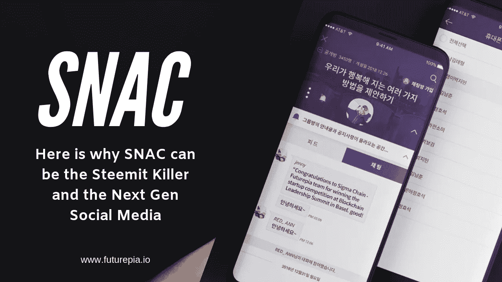
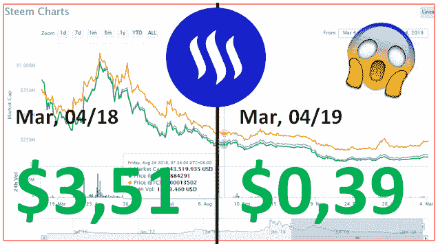
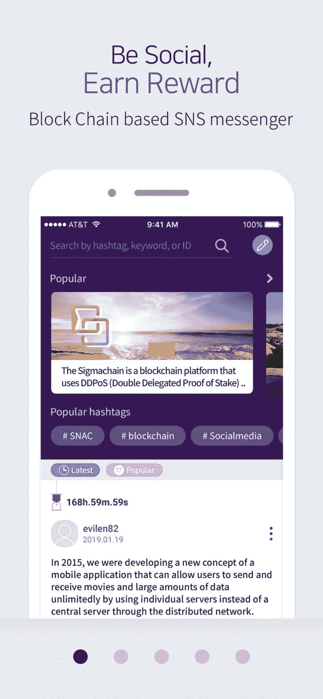
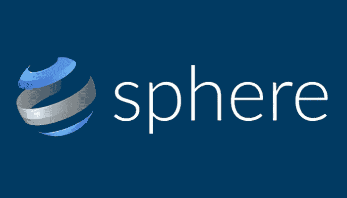
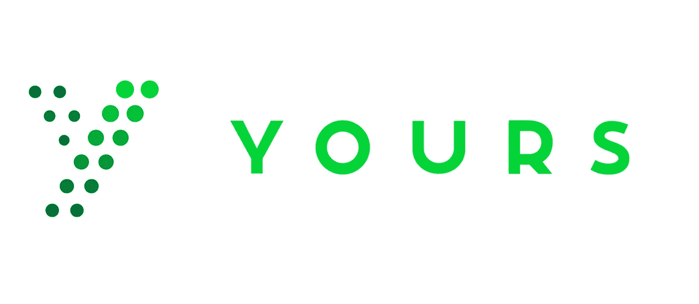
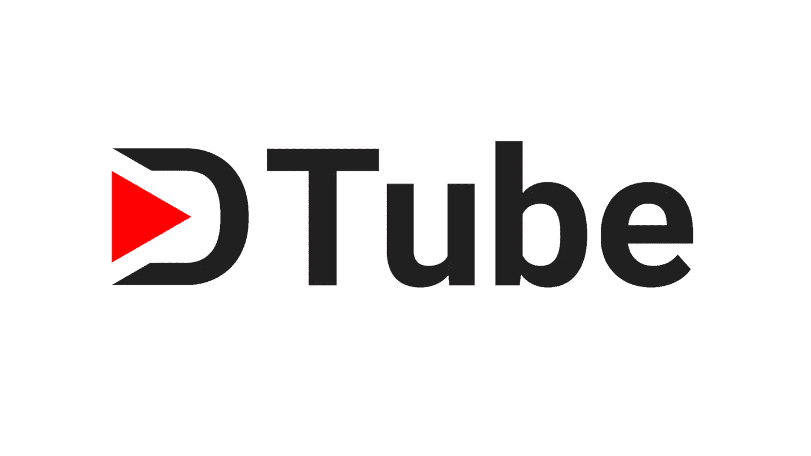

# 这是下一个黑仔和下一代社交媒体平台

> 原文：<https://medium.com/hackernoon/snac-a-steemit-killer-3581d878211>

你知道吗，根据最新的[调查](https://www.digitalinformationworld.com/2019/01/how-much-time-do-people-spend-social-media-infographic.html)显示，普通人每天花在社交媒体上的时间差不多有 2 个小时。这是很可怕的事情。在上下左右滑动的微小动作中，我们将一天 12.5%的时间交给了社交媒体巨头(考虑到平均 8 小时的睡眠时间)。但是我们都需要问自己的一件事是“除了更多的喜欢&的粉丝，我们从 insta gram/脸书中获益过吗”？答案可能是一个大大的“不”！

# 传统社交媒体是如何运作的

想象一下，你刚买了一台别致的相机，拍了一些非常酷的风景照。你开始觉得很有创意，最后花了几分钟写了一些激励性的帖子，并把这些照片上传到了脸书。最终结果—喜欢、评论和更多喜欢。

难道你不想为自己的努力得到回报吗(不管对别人来说多么微不足道，但你确实为此付出了时间)？难道你不想有一个社交媒体来奖励每个人在这个平台上花费的时间和增加的价值吗？难道你不希望看到一些有价值的类似功能，而不仅仅是看到一个*‘瞬间按下的按钮’吗？*

对于传统的社交媒体(推特、脸书、Instagram)，这是不可能的。想象一下，脸书开始在 5 亿多内容创作者每次创作或上传图片时向他们支付费用？马克·扎克伯格将在一个月后破产。这就是区块链的社交媒体应用程序(如[斯蒂米特](https://steemit.com)、[阿卡夏](https://akasha.world)、 [DTube](https://d.tube/) 、 [Sapien](https://www.sapien.network/) )加入救援的原因。

# 斯蒂米特的故事——兴衰

当 Steemit 第一次出现时，每个人都梦想着某种社交媒体革命的发生。内容创作者终于有望因他们创作的内容质量而获得回报，内容消费者也第一次高兴地有机会为他们为平台付出的时间赚取一些钱。

由于 Steemit T1 的想法很独特，在它推出的第一年，它就成了镇上的话题，每个人都认为它很快就会成为 T2 下一个脸书 T3。但现在感觉 Steemit 已经被“Myspaced”了，感觉像是过去的*。*

*就在最近，有消息称 S [teemit 裁员 70%](https://www.coindesk.com/steemit-lays-off-70-of-its-staff-citing-crypto-bear-market)。即使该公司指责熊市的垮台，让我们承认这是因为无聊的用户界面/UX，缺乏移动应用程序，缺乏多样化的内容和非常低的报酬。*

*为了解决所有这些问题，并重振内容创作者和消费者的希望， [Futurepia](http://www.futurepia.io) (最快的 mainnet 之一)推出了 [SNAC](https://futurepia.io/info/apkdownload?lang=en) 。*

**

*Credits: [@fd](http://twitter.com/fd)-sa (on steemit)*

# *什么是 SNAC？*

*[SNAC](https://futurepia.io/info/apkdownload?lang=en) 是有史以来第一个总部位于区块链的奖励分享平台(由一家韩国公司开发)，它正在彻底改变内容创作者和内容消费者在线赚钱的方式。这是一个集所有功能于一身的应用程序，也是你所见过的最强大的应用程序。它是 whatsapp+脸书+Steemit 的融合，允许用户创建群组、写帖子、开始私人聊天、关注社区，并通过撰写优质内容赚钱。SNAC 的稳定硬币也被称为 SNAC，它的价值是:*

*1 SNAC = 1 韩元(将近 1 美分)*

*拥有一个稳定的硬币真的是这个 app 的妙处。下面是 SNAC 界面的样子。*

****

*与 Steemit 不同，SNAC 可以在 iOS 和 Android 版本上使用，很快也可以在网络和 PC 版本上使用。要了解在 SNAC 赚钱的不同方式，请访问[本指南](/futurepia/make-money-on-snac-51dc970e4fbb)，并下载【SNAC】，点击[此处](https://futurepia.io/info/apkdownload?lang=en)。*

# *Steemit 的其他替代品*

*尽管 SNAC 可以被称为 Steemit 的最佳替代者，但也有许多其他优质的 dapps，它们拥有比 Steemit 更好的补偿政策和健壮的 UI/UX 设计。在其他平台上试试运气总是更好，因为没有人知道什么最适合你。在这里，我列出了你应该寻找的 Steemit 的前 3 名竞争对手。*

## *一)[球体](https://sphere.social/hello/)*

*Sphere 是首批专为智能手机打造的奖励分享平台之一(iOS 和 Android 均可使用)。它引入了社交活动代币(SAT)的概念，并根据用户上传内容的质量给予奖励。Sphere 的唯一问题是它没有完全去中心化，并且被指责误导了人们对他们的[集中式令牌结构的理解。另一方面，SNAC 是完全分散的，因为每个活动的奖励都可以在](https://www.reddit.com/r/SphereSocial/comments/7t9895/review_of_sphere_social/)[街区浏览器上确认。](https://futurepia.io/explorer)*

**

*Credits: ICO Ranker*

## *b)[Yours.org](https://www.yours.org/)*

*你的也是作为一个奖励分享平台推出的，以解决 Steemit 面临的问题。即使他们有一个很好的开始，做了一个成功的 ICO，他们也不能保持这种势头。Yours.org 提出了座右铭“[为你的内容赚取比特币](https://www.yours.org/)”，人们在开始时确实赚了不少钱。但由于营销不善和仅基于网络的版本等因素，用户正在一天天离开该平台。尽管如此，它的设计和内容的多样性使它看起来比 Steemit 漂亮得多。*

**

*Credits: Yours.org*

## ***c) D 型管***

*嗯，你不能称它为 Steemit 的替代品(由于两个平台上的内容的性质)，但总的来说，老实说，DTube 是迄今为止最酷的，可能是唯一一个基于区块链的奖励分享视频平台。正如你可能已经猜到的，D-Tube 是去中心化 Tube 的简称，它基本上是 Steemit 区块链上的 *Youtube。想法很简单，设计也很简单。用户上传视频，如果他们的视频获得更多的喜欢和观看，就可以在 cryptos 中获得奖励。相信我，如果这个视频在网上疯传，人们可以在 DTube 上赚很多钱。另一方面，DTube 的一个主要缺点是由于较低的 TPS 速度，上传视频需要花费很长时间，尤其是如果视频长度为 10 分钟以上。**

**

*Credits: [Valleyarm](http://www.valleyarm.com/dtube-differ-youtube/)*

*这些是我个人最喜欢的 Steemit 的替代品。让我知道这些平台中哪一个是你最喜欢的？或者如果你知道其他更好的选择，不要忘记与我们分享。*