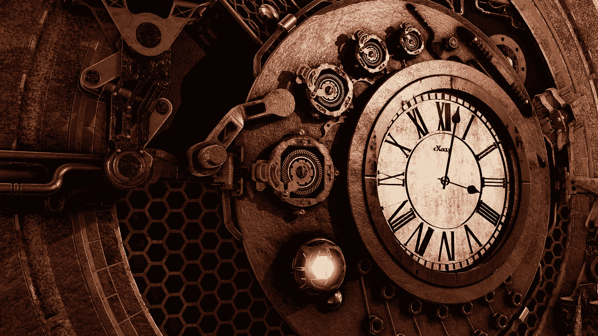
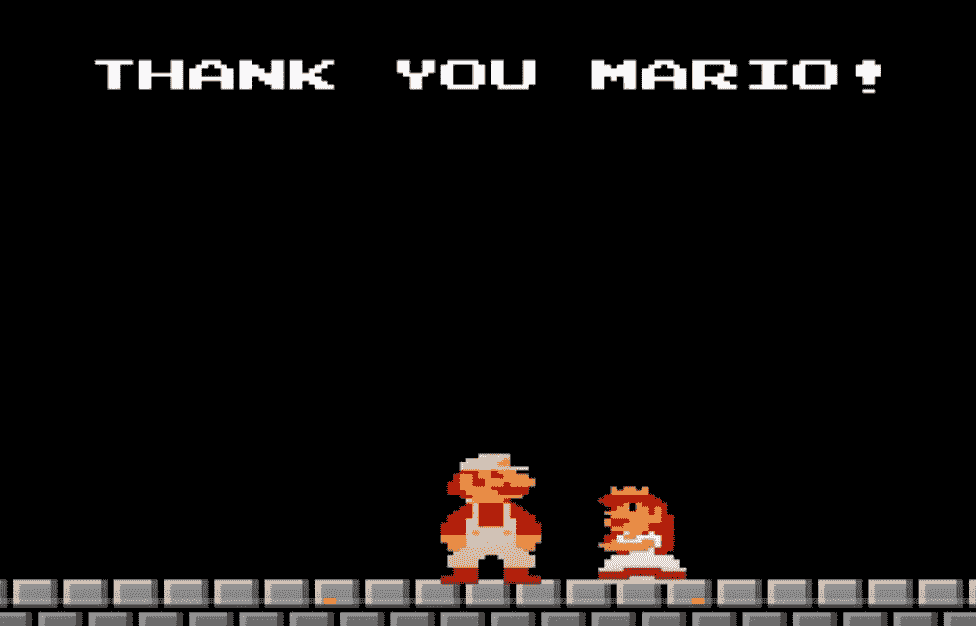

# 我们的模拟是什么时候开始的？

> 原文：<https://medium.com/hackernoon/so-when-did-our-simulation-begin-46445cc7b8b0>

多亏了同为黑客的 Noon 作家和[模拟假说](https://hackernoon.com/are-we-already-in-the-matrix-7492e89be433)的作者 Riz Virk，由牛津大学的 Nick Bostrom 和 Elon Musk 推广的模拟理论或论点现在已经开始渗透到技术世界和其他领域。

当我第一次听到这个理论时，我发现它与两个哲学上的新神学运动相类似，我认为这两个运动至少有必要联系起来:Chassidut(250 多年前在乌克兰东部开创的犹太神秘运动)和禅宗。两者的形而上学基础，在其中他们讨论了世界存在的本质，但只是一个幻觉(查西杜特的*米茨拉伊姆*和佛教的*轮回*)看起来像是模拟理论的很好的神学契合。

然而，我这篇文章的主旨不是讨论这两种理论的相似性，而是提出一个更基本的问题，即这种理论对我们宇宙的各种公认理解的影响。

# 粉碎我们的信念

如果模拟理论是真的(我个人认为是真的),那么它所揭示的最大基础和信念之一可能就是我们宇宙的年龄。现在，当我们通过科学镜头观察宇宙时，我们看到它已经有几十亿岁了。令人惊讶的是，对于我们这些信奉希伯来圣经的人来说，这从来没有冲突过。犹太教中的年数是从亚当被创造时算起的。圣贤非常正确地警告我们不要试图理解创世的六天，因为它超出了我们的理解范围。这意味着这 6 个宇宙日可以容纳数十亿年。

我提到这一点是因为理解这一点很重要，从我的角度来看，我提出模拟理论和宇宙年龄的问题不是来自神学挑战，而是模拟理论可能是那些遵循西方科学公认基础的技术专家的最大分水岭时刻。

模拟理论让关于宇宙年龄的辩论变得过时，就像它让关于进化或环境变迁或恐龙是否真实存在的问题变得过时一样。作为“游戏”的一部分，所有这些都可以很容易地编入模拟程序中

# 什么是现实？

这是最具变革性的一点——我们在这里所拥有的一切都不是真实的。只有模拟的*构造者*或*建筑师*是真实的，因为我们在模拟中，我们实际上不能理解它到底是什么。

既然很有可能我们对现实的过去所闪烁的东西都不是具体的(要么它们从一开始就被编程到我们的模拟中，要么每当模拟需要调整时，构造者就改变了基础)，那么也许是时候让人类不管我们是 PC(玩家角色)还是 NPC(非玩家角色)或者两者的结合来弄清楚构造者到底想从我们这里得到什么，以及如何达到最终的“水平”，当然还有拯救众所周知的“公主”

