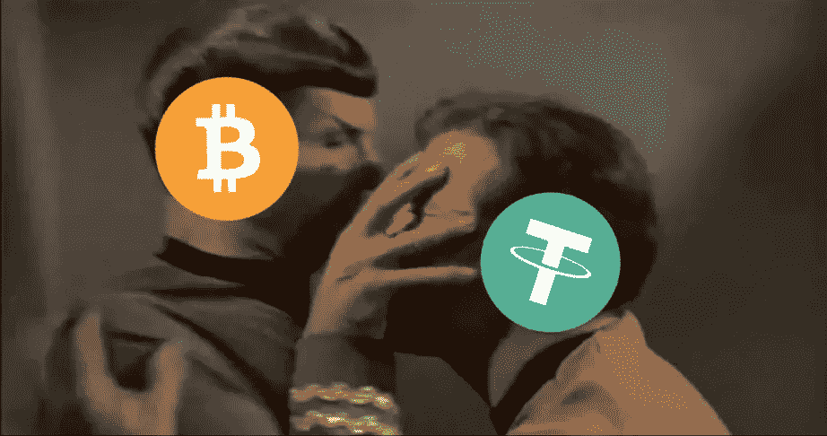

# 所以你在 2018 年霍德？你应该重新平衡的！

> 原文：<https://medium.com/hackernoon/so-you-hodled-in-2018-you-should-have-rebalanced-334768977343>

这种简单的加密技术可以在下一次熊市中大幅减少你的损失。

声明:我不是财务顾问。过去的表现不是未来结果的指标。请自行研究。

## 什么是再平衡？

资产再平衡是一种久经考验的策略，投资者在传统市场已经使用了几十年。将目标百分比分配给投资组合中的每项资产后，定期自动再平衡可以在交易所执行必要的交易，以保持初始目标百分比的一致性。通过自动应用低买高卖的方法，你可以不断地将资产的短期收益放进你的钱包。否则，你可以将这些收益在你的其他资产中重新分配。

数据显示，自动重新平衡加密货币投资组合通常会带来更好的表现。虽然你确实支付了更多的交易费用，但总体而言，只要你选择正确的资产组合来配合你的再平衡策略，你就可以在繁荣时期赚更多的钱，在崩溃时期损失更少的钱。

## 生活方式选择

我个人认为再平衡策略是一种免费的保险政策和红利再投资计划，不管市场如何变化，我都会定期从中获利。

我的回报来自于我的投资组合中非相关和表现最好的资产之间的频繁净值收益，然后将它们分配到我的其他资产中。我不依赖少数异常值(如 AAPL、AMZN 或它们的加密类似物)，这可能需要很长时间才能得到回报。相反，随着时间的推移，我的回报是合理的，这给了我更多的自由退出市场。不仅如此，我也没有从分析市场和自己做交易中得到多少乐趣。我每天最喜欢花在审查或管理自己投资组合上的时间大约是 10 分钟。自动再平衡使这成为可能。

## 案例示例

利用历史价格数据，让我们进行一些实验，以了解在不同市场条件下，不同资产组合的再平衡表现如何。请注意，对于所有前面的例子，我的计算已经包括了所有必要交易中应付给交易所的 0.25%的佣金。

还要注意，再平衡策略表现中最重要的因素(除了选择可靠的资产)是这些资产之间不相关的波动程度。

一、我们假设在 2018 年 2 月 6 日到 8 月 6 日之间，你的投资组合价值 1 万美元，在比特币(50%)和 Tether (50%)之间平分。到 8 月 6 日，每日再平衡策略将帮助你获得价值 10，326 美元的投资组合。如果你在此期间没有重新平衡，你就会亏损——你的投资组合价值 9838 美元，剩下大约 500 美元——这相当于你 6 个月投资组合价值的 4.88%，在支付所有交易费用后，年化收益率接近 10%。在一个大多是熊市的时期，比特币对系绳的投资组合本来是有利可图的。

二。作为同一时期的另一个例子，想象一下你的“2 月 6 日”10，000 美元的投资组合稍微多样化一些，包括比特币(25%)、以太坊(25%)、Ripple (25%)和 Tether(25%)——并且也在每天的再平衡计划中。六个月后，到 8 月 6 日，你的每日再平衡投资组合现在价值 8259 美元，相比之下，没有再平衡的投资组合价值 7981 美元。这相当于同期储蓄了 2.77%，折合成年率为 5.54%。没什么可轻视的！

在 2018 年 2 月至 8 月的 6 个月期间，我们在 [Portfolio.io](https://portfolio.io) 对前 50 名硬币的 100 种不同投资组合配置(硬币组合加上再平衡频率和阈值等)进行了回溯测试。我们发现，通过使用自动再平衡，一些投资组合可以提供高达 200%以上的年化 PnL 百分比(%)。

**稳定币在自动再平衡战略中的重要性** 在你的投资组合中放一些(USDT)或者任何其他预期交易价格为 1 美元的稳定币，可以起到和你银行账户中有现金一样的作用。

当单独持有时，现金或 USDT 对你没有太大帮助——由于通货膨胀和机会成本，它永远失去了购买力，但如果作为自动再平衡投资组合的一部分，它可以帮助抵御市场低迷，并捕捉其他资产的价格波动。它还可以确保当您或您的经纪人在价格下跌时买入某些资产时，您或您的经纪人可以使用一步交易对和资本。

换句话说，当你的投资组合中包含一枚稳定的硬币时，加密资产的再平衡投资策略会更有成效。因为我们知道像 USDT 这样稳定的硬币的价值不会波动太大，所以价值可以在你的比特币和另类硬币的高点和低点之间无缝转移到安全的 USDT，在那里可以锁定利润。

Overview of crypto rebalancing — Co-founder and CTO at Portfolio.io

如果你想开始重新平衡你的加密组合，有几个工具已经可用并且正在工作，比如 Shrimpy。然而，我对这些现有工具的理解是，它们不代表你进行交易，也不提供托管解决方案。它们依赖于你在币安和北海巨妖等加密交易所独立开户，并通过个人 API 密钥将你在这些交易所的账户与你选择的重新平衡工具关联起来。由于这个原因，它们是时间密集型的，容易出错，不适合普通的非技术投资者。这种再平衡工具还缺乏其他可以进一步自动化和增强加密投资体验的增值服务，如轻松多样化和智能订单路由(即在多个交易所中寻找最便宜的资产价格)。

**再平衡战略的关键要点**

*   作为一种可以保护和受益于市场波动的策略，自动再平衡对投资加密货币的人很有用。
*   虽然日内交易者可能已经利用了加密市场的波动性来优化他们的表现，但他们在手工买卖波动上浪费了太多的时间。
*   有了正确的自动再平衡工具，你可以毫不费力地从市场的起伏中创造价值。即使你支付更多的交易费用，你仍然可以在上面。
*   在一个自动再平衡的投资组合中，持有一枚稳定的硬币和不相关的波动性资产，可能会给你带来最好的结果。

**关于 Portfolio.io** 如果你有兴趣将自动再平衡作为一种投资策略，并以最简单的方式建立一个加密投资组合，你可以观看我们的视频并在 [portfolio.io](https://portfolio.io) 注册

作为 [Portfolio.io](https://portfolio.io) 的用户，您无需管理自己的加密钱包或在交易所开立第三方账户。在提供一些身份证明后，您可以在 60 秒内创建一个自动重新平衡的投资组合，包括排名前 50 的加密货币。对于不熟悉加密或不确定应该选择什么硬币的用户，我们还提供由经验丰富的加密分析师精心挑选的“一键”预制投资组合配置。

如果你是开发人员或密码爱好者，请随时给我写信，我们可以将你添加到 Portfolio 的高级测试版。对于其他人来说，我们将为尽早在我们的网站注册的[提供高达 5000+美元的奖励。](https://portfolio.io)