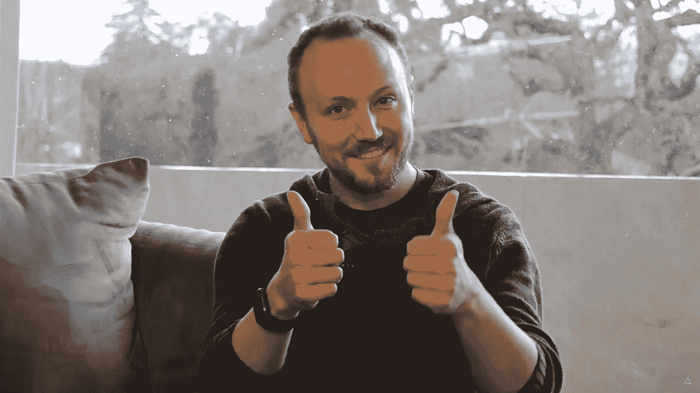
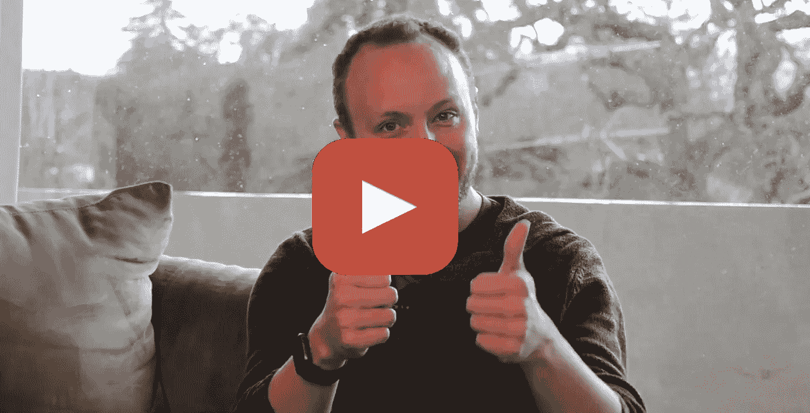

# 社会抵押品和经济

> 原文：<https://medium.com/hackernoon/social-collateral-and-the-economy-fd94ef3a748d>

MetaMask 联合创始人丹·芬利对货币未来的思考

Dan Finlay, MetaMask co-founder and CEO

人的需求是有形的商品，现金只是交换有形商品的手段。那么，按照我们目前的理解，一个完全有效的经济体不需要现金。

[丹·芬利](https://twitter.com/danfinlay)、 [MetaMask](https://metamask.io/) 的联合创始人认为，健康的经济依赖于建立信任网络——在这种网络中，人们相互依赖以满足那些有形的需求。他认为，区块链的力量在于其“前所未有的自动化程度”，在这种程度上，一个人可以轻松地将其他人添加到他们安全的共享资源池中。个人可以通过区块链授予“可传递的信任”,而不是处理冗长的贷款申请和金融合同，这允许受信任的其他人安全地访问自己的有形资源。

人们被迫遵守他们的承诺(兑现“贷款”等。)因为如果他们搭便车或失败，就会失去社会抵押品。作为向他人捐赠有形资源的交换，投资者可以从借款者为最初的可传递信任提供的资源折扣中获利。

Click to watch the full length interview.

丹·芬利举了下面的例子:一名医科学生可能会在住院期间向朋友和家人寻求书籍、住房或食物等形式的帮助。作为交换，学生可以为未来的医疗保健做出承诺(即医疗设施代币)。违反合同将会限制学生将来获得资源帮助的能力。在这个分散的市场中，信任和经济能力随着承诺的遵守和违背而生与死。

如果你对这个愿景感兴趣，[观看长篇访谈](https://www.youtube.com/watch?v=NukJAHe-AK8&list=PL-UMfJVuezk-YgNUNSgpv-fE6q5Qjokdp&index=5&t=0s)，了解更多丹·芬利的想法！

我正在用[时代](https://era.eco/#step1)构建去中心化网络的平等主义基础设施。*如果你喜欢这篇文章，如果你为它鼓掌，分享它，并在*[***Twitter***](https://twitter.com/ambercazzell)*上与我联系，这将意味着很多！也可以订阅我的*[***YouTube***](https://www.youtube.com/channel/UCJsTKB06gr8smQQIkbIXc9Q)**频道！**