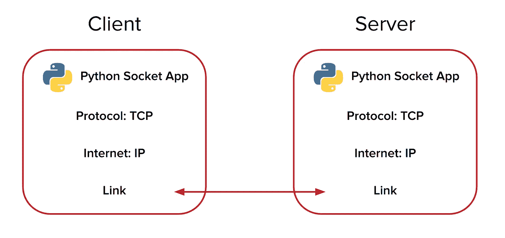

# Python 中的套接字编程:客户端、服务器端和对等端示例

> 原文：<https://medium.com/hackernoon/socket-programming-in-python-client-server-and-peer-examples-a25c9782b584>

套接字(又名套接字编程)使程序能够在任何给定的时刻双向发送和接收数据。本教程介绍了如何使用套接字[编程](https://hackernoon.com/tagged/programming)在 [Python](https://www.python.org/) 中从**设备到设备**、**客户端到服务器**以及**客户端到服务器**发送数据。

# 为什么使用套接字发送数据？

需要实时操作的互联网连接应用程序从其**网络代码**中**套接字**的实现中获益匪浅。使用套接字编程的应用程序示例如下:

*   显示实时通知的网页(脸书、Twitch、易贝)
*   多人在线游戏(英雄联盟，哇，反恐精英)
*   聊天应用(WhatsApp、微信、Slack)
*   实时数据仪表板(比特币基地罗宾汉)
*   物联网设备(Nest、August Locks)

[Python](https://hackernoon.com/tagged/python) 与 JavaScript 不同，是一种同步执行的语言。这就是开发 asyncio 的原因——让 Python 更健壮，特别是对于套接字编程的本质。

使用流式套接字，可以随时发送或接收数据。如果您的 Python 程序正在执行某些代码，其他**线程**可以处理新的套接字数据。像 asyncio 这样的库实现了多线程，所以你的 Python 程序可以异步工作。

# Python 套接字编程教程

Python 本身提供了一个 [socket 类](https://docs.python.org/3/library/socket.html)，因此开发人员可以在他们的源代码中轻松实现 **socket 对象**。要在程序中使用套接字对象，首先要导入套接字库。不需要安装一个包管理器，它是 Python 自带的。

现在我们可以在代码中创建套接字对象。

这段代码创建了一个 socket 对象，我们将它存储在“sock”变量中。为构造函数分别提供了一个族和类型参数。family 参数设置为默认值，即**地址格式 Internet** 。

type 参数设置为 **Socket Stream** ，这也是默认设置，通过 **TCP** [1](http://man7.org/linux/man-pages/man2/socket.2.html) 启用“有序、可靠、双向、基于连接的字节流”。

一旦我们有了一个初始化的 socket 对象，我们可以使用一些方法打开一个**连接**，**发送**数据，**接收**数据，最后**关闭**连接。

# Python 套接字服务器

现在我们知道了一些传输字节的方法，让我们用 Python 创建一个客户机和服务器程序。

这段代码制作了一个 socket 对象，并将其绑定到 **localhost 的端口 8080** 作为 **socket server** 。当客户端通过套接字连接到该地址时，服务器监听数据，并将其存储在“data”变量中。

接下来，程序使用“print”记录客户机数据，然后向客户机发送一个字符串:**我是服务器**。

让我们看一下将与这个服务器程序交互的客户机代码。

# Python 套接字客户端

下面是**客户端**套接字演示代码。

这个客户端打开一个与服务器的套接字连接，但是只有当服务器程序当前正在运行时。要自己测试，你需要同时使用 **2 个终端窗口**。

接下来，客户端向服务器发送一些数据:**我是客户端**

然后，客户端从服务器接收一些预期的数据。

搞定了。您现在可以开始使用一些基本的 Python 网络编程在客户机和服务器之间传输数据。

# 你如何在客户端之间发送数据？

通过互联网在两个或更多客户端设备之间发送数据**是很棘手的。由于网络安全实施的保护措施，并非所有连接到万维网的设备都具有可公开访问的互联网协议(IP)地址。**

这意味着我们实现的 Python 代码对于在我们的实时应用中发送对等数据来说不是 100%可靠的。我们在传输**点对点数据**时如何实现**可靠性**和**速度**？

这可以使用中间的服务器**来完成。使用互联网的客户端设备可以连接到具有公共 IP 地址(或网站域)的服务器。然后，中间的这个代理可以传递路由到一个或多个客户端的消息。**

PubNub 用**发布/订阅 API** 做得最好。它快速、可靠、安全，并且易于在**任何客户端设备**上实现。无论你有 Python 服务器、JavaScript 网站，还是介于两者之间的任何东西，你都可以使用 PubNub 在 250 毫秒内将数据发送给**的任何人。**

通过**一对多**、**一对一**或**多对多**，PubNub **自动扩展**以支持任何应用程序负载。使用该 API 可以在所有拥有发布/订阅 API 密钥的客户端之间打开一个即时的、始终在线的连接。这实现了与套接字连接相同的目标。

# 使用 SSL 连接的 PubNub 和 Python

这里有一个**点对点数据**的例子，它是用 PubNub 在一个通道上用 **SSL** 发送的。您可以将此想象成通过 TCP 套接字发送数据。当你注册一个免费的 PubNub 账户时，你可以使用几乎无限的频道来实时发送信息。在你尝试代码之前，一定要**制作一个** [**免费的 PubNub 账号**](https://dashboard.pubnub.com/signup/?utm_source=Syndication&utm_medium=Medium&utm_campaign=SYN-CY19-Q1-Medium-Jan-22) 。

# 客户端 1

# 客户端 2

可以在命令行上为这两个客户端程序输入字符串。PubNub 发布的最大邮件大小为 32kb。使用 2 个终端窗口来测试代码！

本文中的所有代码都托管在 Python Socket 演示库的 [GitHub 上。](https://github.com/ajb413/python-socket-demo)

PubNub 是完全免费的，每月高达 100 万条消息。要了解 API 的更多功能，请查看 [PubNub Python v4 SDK 文档](https://www.pubnub.com/docs/python/pubnub-python-sdk?utm_source=Syndication&utm_medium=Medium&utm_campaign=SYN-CY19-Q1-Medium-Jan-22)，或任何其他 [75+ PubNub 客户端 SDK](https://www.pubnub.com/developers/?utm_source=Syndication&utm_medium=Medium&utm_campaign=SYN-CY19-Q1-Medium-Jan-22)。

*原载于*[*www.pubnub.com*](https://www.pubnub.com/blog/socket-programming-in-python-client-server-p2p/)*。*