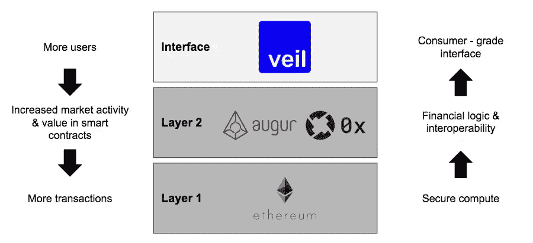

# 密码中的软件可组合性

> 原文：<https://medium.com/hackernoon/software-composability-in-crypto-a705700c3816>

密码学中最有趣的突破之一是该技术给软件开发带来的高度可组合性。可组合性是以不同方式组合软件栈的各种组件的能力。为了简单起见，我们将堆栈分成两部分:前端和后端。今天网络上的应用程序，包括像 Twitter，Amazon，脸书，都开发并拥有自己的专有软件栈。驱动今天的专有堆栈的主要因素有两个:**封闭的数据结构**和**垄断的商业模式。**更多的用户数据通过定向广告等策略增加了公司的盈利潜力，并引发了强烈的用户锁定。因此，web 应用程序被鼓励垄断用户体验和软件堆栈。专有的前端为公司提供了垄断用户体验的途径，而后端则捕获和处理收集到的用户数据。

Crypto 通过数据结构和业务模型的变化彻底改变了这种动态:

1.  **数据商品化:**支撑加密网络的技术区块链是开放的数据库，任何人都可以利用和建立。虽然 API 已经为第三方提供了对集中式数据库的访问，但底层公司决定如何暴露他们的数据，并有权在任何给定时间更改规则。相比之下，区块链在设计上是无信任系统，不允许单个实体任意改变依赖/高阶技术的规则。
2.  **基于令牌的商业模式:**令牌是协调加密网络的工具，是一种全新的商业模式，激励共享价值的创造。一个设计良好的*加密网络的令牌，当更多的产品/服务建立在网络之上时，当它看到使用增加时，就会增值。*

开放数据网络上的共享价值创造模式取代了由专有数据孤岛刺激的垄断商业模式。软件开发中更大程度的可组合性是由区块链的设计实现的，并通过一个新的商业模型来激励。

**基于分散协议的接口**

当在 crypto 中构建应用程序时，从事底层协议(后端)工作的团队不一定是在顶层构建接口(前端)的团队。

Veil 是一个建立在 Augur 和 0x 协议之上的接口，它是实践中一个很好的例子。Veil 利用 Augur 协议处理预测市场的逻辑，利用 0x 协议处理这些市场的股票交易。这些协议背后的开发团队将他们的时间集中在构建其他开发人员可以构建的公共基础设施上，而不是最终用户应用程序上。Veil 团队可以自由地利用现有技术的两个部分，并创建一个专注于最终用户体验的产品。

**软件开发的专业化**

增加的可组合性允许开发团队专注于堆栈中的不同层。从事底层协议工作的团队可能与设计消费级界面的团队拥有不同的技能。自由利用其他团队开发的软件的能力，意味着团队不必雇佣更多的开发人员来提高他们在整个堆栈中的能力。从事底层协议工作的后端/智能合约工程师团队可以依靠独立的前端工程师/设计师团队在顶层构建接口，并将他们的核心技术推向市场。

与建立在集中式平台上相反，加密网络向开发人员保证他们的基础设施依赖性不会突然消失。这对创新来说是一个福音，因为它进一步降低了启动成本，并引发了复合创新。团队可以保持较小的规模，并专注于他们的核心竞争力。

**跨堆栈共享价值创造**

随着技术开始相互利用，网络效应被触发，有望使堆栈中的每个组件变得更有价值。

Simplified application stack in crypto: layers 1 and 2 constitute the back-end while the interface is the front-end. Each component in the stack is developed by different teams.

看看价值如何从栈顶向下流动，像 Veil 这样的界面可以作为主流用户与某些去中心化技术交互的入口。更多的用户上面纱，增加总价值，流入奥格网络通过增加现有市场的活动，并创造新的市场。市场活动和数量的上升提高了对 auger 平台的未平仓兴趣和对 auger 本地令牌 REP 持有人的潜在费用。随之而来的是对 REP 的需求和价格的增加。以太坊是为发生的交易标记时间戳的基础计算链。

从自下而上的角度来看，以太坊为其他人的交易和构建提供了一个安全的计算平台。Augur 和 0x 协议提供了金融逻辑(预测市场和交易所)以及一定程度的互操作性。互操作性指的是开放协议如何为构建在其上的技术提供共享体验，例如不同接口之间的共享流动性池。有了开放构建的可用后端基础设施，可以在其上开发界面，为主流用户提供功能丰富的消费级体验。

> 堆栈中的每一层都需要其他层才能茁壮成长，因为接口和协议形成了一种共生关系:接口依赖于底层逻辑和安全性的协议，而协议需要接口来推动主流采用。

**前进**

这种新的软件开发范例导致了更大的劳动分工，这将导致更小的和更专注的团队在堆栈中构建他们的层。在界面层，这并不一定意味着任何地方的商业机会都会变小，但差异化的因素会变小。垄断用户体验和建立大型数据集将不再是赢家。随着用户在选择他们想要参与的产品/服务方面拥有更多优势，并且体验到几乎为零的转换成本，新的商业模式将得到发展。最终，这将重振自下而上的创新。启动成本降低得更多。一个设计师团队可以在现有开放基础设施的基础上创建一个覆盖数百万用户的金融产品。