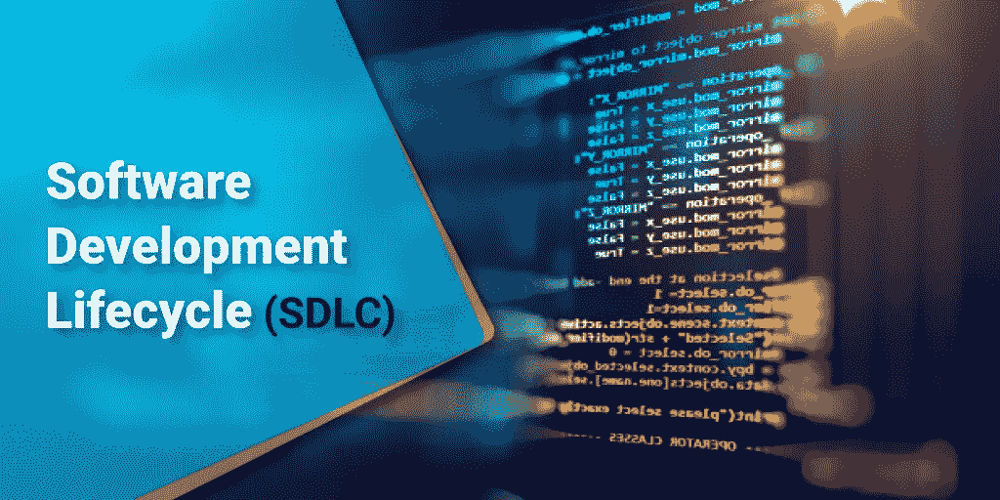
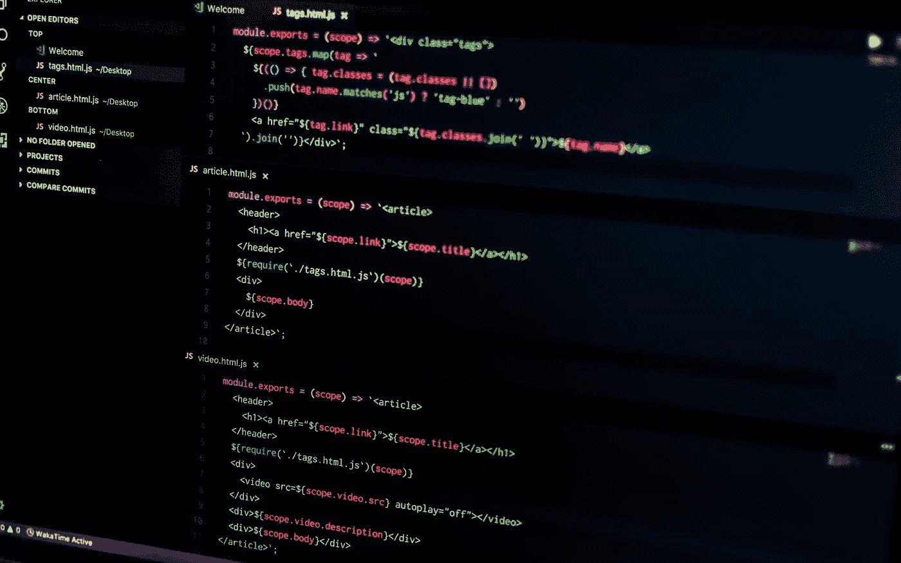

# WTF 是软件开发生命周期(SDLC)？

> 原文：<https://medium.com/hackernoon/software-development-lifecycle-sdlc-a-simple-explanation-78d77c466355>

## 最简单的解释

# 什么是软件开发生命周期(SDLC)？

SDLC 或**软件开发生命周期**基本上有五个阶段来开发具有最佳质量和优化设计的软件。这些阶段是以一种系统的方式构建的，可以是对每个阶段的一次性访问，也可以是基于您所遵循的**软件开发生命周期**模型类型的迭代。

It 项目的[开发有五个不同的阶段](https://www.cuelogic.com/blog/agile-software-development-methodologies)来描述和吸收每个步骤中涉及的不同阶段和活动。随着组织或团队的成长，它往往会发展，因此可以随着他们的经验进行修改和改进。

下面是 SDLC 流程的五个不同阶段，以及每个阶段涉及的步骤和它们倾向于为产品增加的价值种类。

# 规划

在这里，头脑风暴发生了，专家讨论和收集项目的各种需求。他们倾向于讨论软件产品的各个方面和未来，并试图吸收他们的客户想要什么，他的需求是什么，他到底想从产品中得到什么。

他们还倾向于分析开发软件产品的可行性，以及在开发过程中会遇到的各种技术和其他困难。

他们可能会发现他们需要额外的资源来开发该产品，或者所有的利益相关者是谁，该产品会给公司的未来带来什么价值等等。

他们也倾向于看到什么是项目范围内的，什么是项目范围外的。很多时候，如果一开始就没有正确定义，那么资源往往会浪费在许多不必要的任务上，如镀金来取悦客户。

此外，他们倾向于决定如何迎合项目中可能出现的任何类型的变更，以及一旦产品完全开发出来，项目的操作和维护将如何进行。

# 设计

SDLC 的下一个阶段是设计阶段。任何种类的[软件都需要一个原型](https://hackernoon.com/innovation-at-pace-rapid-prototyping-practices-for-software-engineering-teams-442929fdd5ea)来理解开发它时所涉及的各种复杂性。

团队也需要这种原型来理解项目的可行性，它进一步为开发人员分解软件产品，以便于开发。

它既涉及项目的设计美学，也涉及项目的技术层面。它是在一个非常高的层次上设计的，当团队批准它时，客户的批准也在这个阶段进行。

这正式形成了客户所描述的产品，以及架构师和项目经理对产品的理解。

在这一阶段，还审查了技术细节和各种风险以及项目限制，并为项目的进一步发展批准了最佳设计方法。

该产品可分为不同的模块，以满足项目中不同时间的需求，并讨论了流程和数据库通信。

此外，在此阶段结束时，会生成正式的设计规格文档。这个阶段主要是与项目的系统分析师一起进行的，他们在项目的各个方面工作并产生这个规范文档。

# 履行

第三阶段是软件开发生命周期中最关键的阶段。这是软件产品成型的时候。开发人员开始根据前几个阶段提交给他们的规范文档对软件产品进行编码，并开始将它与数据库管理员开发的产品数据库连接起来。

前端开发人员创建必要的界面和 GUI，以便与规范文档中定义的所有后端流程和程序进行交互。

这个阶段需要很多时间，并且完全取决于开发者的技能和知识，产品将会是什么。开发人员倾向于在将新代码传递到下一阶段之前，由测试人员对其进行测试。

这是开发阶段的生产阶段，也是最关键的阶段。如果这里一切顺利，那么下一阶段的测试人员只需要很少的时间就可以测试产品并向最终客户推出。

# 集成和测试

第四阶段是关于软件产品的集成和测试。在这里，测试软件产品的质量和功能，以确定设计的产品是否满足客户和各种其他商业利益相关者设定的初始商业目标。

这可能是一个迭代的过程，测试人员测试组件，然后将它返回给开发人员进行修改，然后从头开始再次测试，因为这种修改可能会影响产品的其他功能。

只有在这一阶段结束时，软件产品才会针对最终发布进行全面验证。有各种方式和方法来测试产品，如探索性测试，这是基于经验的测试方法或其他形式的测试方法可能是隐含的。

这里，软件产品的集成也可以发生在预期的机器上，以测试它和它的处理与该机器的兼容性。

# 部署和维护

软件开发生命周期的最后一个阶段是部署和维护。这里隐含了一种生命周期维护方法，它倾向于定义如何满足软件的各种版本和变更，以及如何使用它来满足不同的业务目标。

有时，一两个开发人员可能不得不长期致力于产品的维护，以满足不同客户的需求和要求。

此阶段还可能开始在生产环境中实际安装软件产品及其所有组件和数据库。这种集成通常会带来各种各样的复杂性。

在操作和维护阶段，软件会进一步优化，并随着时间的推移添加新的功能和能力。

# 结论

尽管它看起来很简单，但需要多年的经验来掌握每个阶段，它催生了各种创新的软件架构师，他们往往具有不同的能力来完成不同类型的软件产品。

它们也为一个组织增加了相对于其他组织的竞争优势，这通常决定了该产品的商业成功。

这种资源能力也有助于公司让他们的客户 [**将软件开发**](https://www.cuelogic.com/outsource-software-development) 外包给他们。解决方案架构师总是希望通过使生命周期更加可靠、透明和防失败来改进生命周期。使用各种工具，你可以自动化某些部分，降低软件开发的复杂性。你如何计划你的 SDLC？