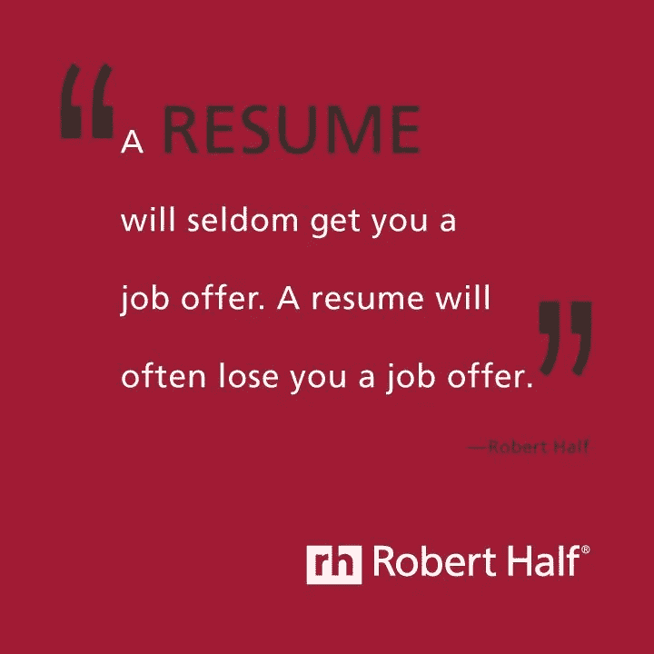
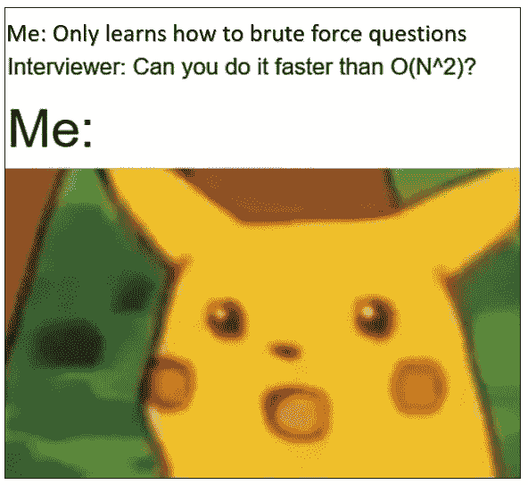

# 软件工程访谈—解码！

> 原文：<https://medium.com/hackernoon/software-engineering-interviews-decoded-90aecd1424bd>

我们开始吧！我刚刚从南加州大学毕业，我必须说这是一个神话般的经历。在研究生院，你会花很多时间寻找合适的机会，并让它们发挥作用。但我向你保证，你付出的每一寸努力迟早都会有回报。我会尽我所能总结我所有的经验和一些我能提供的建议。

> 我在整篇文章和最后都附上了一些重要的链接。

# **坚如磐石的简历**

我的第一条建议是早点开始。专注于建立一份有助于你脱颖而出的简历。扪心自问！该项目产生了什么影响？如果你申请的是数据科学(或分析)的职位，突出你的项目中关注数据的方面。提及所有数字(绩效指标、培训测试划分等。)，以及使用的具体算法。同样，对于软件工程职位，提及使用的技术堆栈、整体架构、使用的测试框架和其他项目特定的细节。**我建议保留两份不同的简历，突出你项目的数据和软件相关方面。**

当你进入研究生院时，每个人都会在简历中提到课程项目。课程项目很棒，但是有影响力的团队项目可以帮助你脱颖而出。尝试自愿成为你大学里任何一个实验室的研究员。你可能不知道，你们大学正在进行一些令人兴奋的研究工作。通过在其中一个实验室工作，我最终学到了很多关于系统设计、Kafka、Spark Streaming 的知识，这最终帮助我在基于项目的面试中胜出。

# 强大的 LinkedIn 游戏

彻底建立你的 LinkedIn 档案。学会与人交往。尝试联系你正在考虑的公司的工程经理、招聘人员、校友和其他个人。在发送连接请求之前添加信息性说明。明智地使用这些电子邮件信用。向人们询问他们的项目、公司文化，甚至让他们对你的简历进行评估。在这个过程中，你可以礼貌地请求推荐( *'* ***)你觉得你可以推荐我到 XYZ 这个职位吗？****’*)。合适的人做出回应需要时间，但有效的对话可能会帮你抓住一些绝佳的机会。

# 过 LeetCode 生活！

现在是最重要的部分。 **LEETCODE！**从[破解编码面试本](http://www.crackingthecodinginterview.com/)开始。这是这本书的 pdf 链接。

相信我，这是让你开始编码面试的一个很好的跳板。当你完成这本书的时候，把你的手放在 [LeetCode](https://leetcode.com/) 上。如果你掌握了这个东西，你就完了。LeetCode 会带你去一些地方。

> ***从你在学校的第一个学期开始，尽你所能让这成为一种习惯。每天三个问题。如果你有很多时间，做两个中等和一个简单的问题。要不，做一个中题，两个易题。***

周末继续修改问题。试着想出你的方法。**想！**多看多解。将会有一个点，从那里你将开始获得正确方法的直觉。继续练习。没有严格的计数。但是一旦你练习了 200 道以上的题，你就会开始有自信了。一天三个问题会让你在几个月内回答 200 个问题。**继续修改！**

# 继续接受采访！！

破解面试的最好方法是不断接受无数次面试。有一个叫 Pramp 的网站可以帮你安排模拟面试。试试那个！我不停地接受采访，失败了很多次。你往往表现不佳；有时是因为紧张，有时是因为缺乏练习。通过面试会给你 10 倍的信心。我几乎所有的技术面试都失败了，因为我不能及时解决问题，也不能在面试中大声思考。 ***尽量快速解题！*** 在你解决问题的最后留些时间讨论复杂性。 ***向面试官陈述多种方法。这一点非常重要。***

如果可能，尽量采用 python 进行竞争性编程。这将节省你在面试中写代码的大量时间。Python 可以帮助你编写简洁明了的代码。维护一份你申请的公司的 excel 表格。检查 Glassdoor，甚至考虑 LeetCode Premium 来解决公司内部的问题。在你准备的过程中，保留一份包含所有笔记的文档。跟踪你遇到的所有有用的链接！ ***这里有一份*** [***公司名单***](https://docs.google.com/spreadsheets/d/1v3B1_EnflxiombmBkKxm50vXq4nd6nctiTfVxjme-YI/edit?usp=sharing) ***供你参考*** 。可能会有更多的公司加入这个名单。

# 系统设计进入场景！

最后，一些科技公司确实会去参加系统设计面试。作为一个没有经验的人；这很难开始。我通过这些资源为我的系统设计面试做准备。

1.  Youtube 视频([图沙尔·罗伊](https://bit.ly/2RRdXU9)

2.[系统设计基础](http://www.aosabook.org/en/distsys.html)

3.[钻研系统设计面试](https://bit.ly/2nJUvbV)【考虑团购】

> 回顾我面试过的所有公司，以下是我对每个公司的看法:

way fair——有一个编码任务和一个电话，讨论我的方法和同样的额外修改。接下来是最后一次行为面试。

ESRI——首先，我接受了几次电话采访，其中既有技术方面的讨论，也有行为方面的讨论。我被邀请参加一轮现场面试。全天有 10 场面试。大多数都是项目讨论和编码的混合体。我认为 ESRI 是一个拥有一些令人敬畏的导师和基于 GIS 的优秀项目的地方。

亚马逊(Amazon)——我进行了两次技术评估。根据你在评估中的表现，你会被分配一到三次最终面试。最后的面试是标准的简单中等 LeetCode 问题。

脸书——第一次电话面试，随后是大学日的邀请。我有三次现场采访，都是再次编码(可能是 LeetCode 中硬)。

**微软** —最好的面试过程。我和我团队的工程经理进行了交流，他非常完美。有五次现场采访。所有这些都是编码和一些系统设计概念的混合。每个面试官都非常乐于助人，非常有风度。这个团队也很棒。我在微软有过最棒的面试经历。

那都是我这边的。我将作为一名软件工程师加入脸书。如果你有任何问题，请给我发电子邮件。你可以打***dramnani@usc.edu***找到我

***贯穿文章的一些重要环节:***

[简历模板](https://docs.google.com/document/d/18E5sDB2JE99LfFjFesbjnk-PK5r1j3GpCKPmcp0bgO4/edit)

(我在简历上按照 ***学历—技能—工作经历—项目—成果*** 设计。)

[公司名单](https://drive.google.com/open?id=1v3B1_EnflxiombmBkKxm50vXq4nd6nctiTfVxjme-YI)

[破解编码面试(PDF)](https://github.com/ShreyasD/CrackingTheCodingInterviewSolutions/blob/master/Cracking%20the%20Coding%20Interview,%206th%20Edition%20189%20Programming%20Questions%20and%20Solutions.pdf)

[系统设计基础](http://www.aosabook.org/en/distsys.html)

