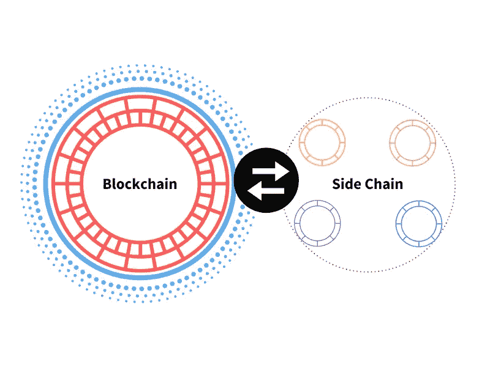
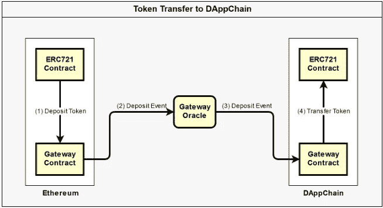
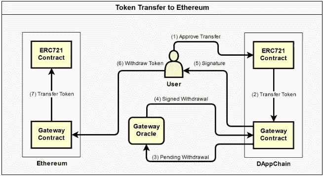
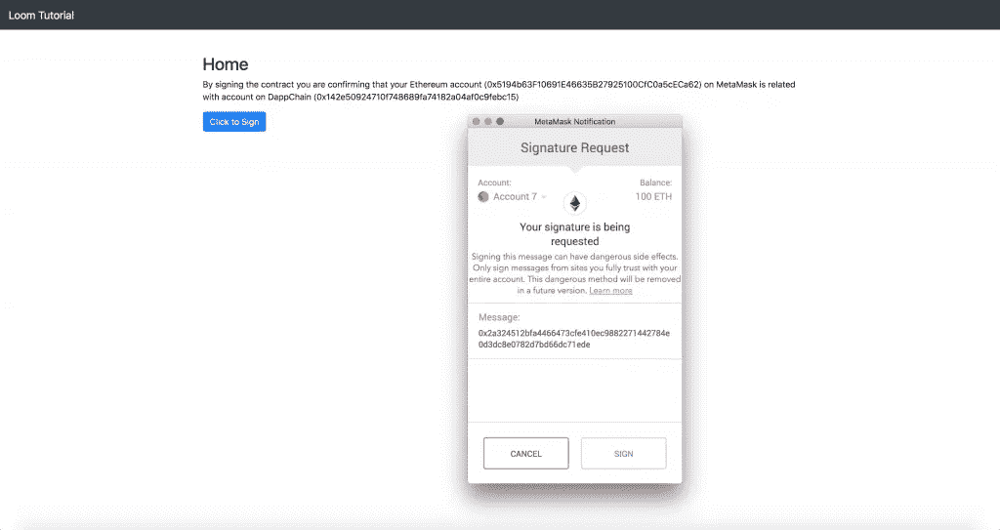
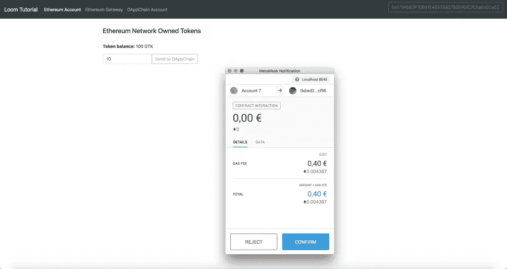

# 通过织机侧链解决以太坊的可扩展性(教程)

> 原文：<https://medium.com/hackernoon/solving-scalability-of-ethereum-through-loom-sidechains-tutorial-2837307d454>

不仅仅是[以太坊](https://hackernoon.com/tagged/ethereum)的可扩展性，基本上每个[区块链](https://hackernoon.com/tagged/blockchain)的可扩展性都是一个没有人想听到和担心的问题，直到 2017 年，当 Cryptokitties 项目以指数级增长时，网络开始变慢，油价如此之高，以至于每个人都认为这应该是头号问题

现在谈论 Cryptokitties 是在打死马，因为这个话题在每个秘密新闻中都被谈论了几个月。除了受欢迎之外，Cryptokitties 还向我们展示了一件非常重要的事情。以太坊网络的状态还没有准备好迎接巨大数量的用户和流量，这是随着一个成功的应用程序的推出而出现的。因此，有必要找到解决这一问题的方法，这也是本文的主题。

Source: Unsplash.com

# **三难困境**

有一种区块链技术理论认为，网络一次只能支持这三个选项中的两个:安全性、去中心化和可扩展性。这种“三难困境”过去是，现在也是以太坊开发者面临的一个巨大挑战，因为他们总是希望保持区块链技术的两个基本原则——去中心化和安全性，同时试图适应这种技术，并为大众“人性化”(UX)。有一些提议的解决方案，但它们损害了最基本的原则，即前面提到的分散化和安全性。

利用替代硬币是可伸缩性问题的第一个理论化解决方案之一。原则是放弃一个区块链的想法，所有的操作都在那里进行，而是利用几个替代硬币共存的模型，其中每个替代硬币都使用自己的分类账。通过减少每个区块链的操作并为每个应用程序创建单独的区块链侧链，应该有助于任何区块链的可扩展性。但是这并没有解决三难问题。因为在每个这样的侧链中，每个网络的节点数量越少，网络中攻击和有害用户的可能性就越大。因此，这种解决方案虽然解决了可伸缩性问题，但严重损害了其安全性。

还有另一个提议的解决方案——增加块大小。如果以太坊社区投票赞成增加块的大小，网络上的所有节点都将像以前一样处理网络上的所有操作，但是它们将在同一时间处理更多的事务。这将导致更大的运行效率——通俗地说，提高网络速度。然而，更大的块需要更多的能量。这意味着只有少数矿工能够继续工作。未来将是只有一小组超级计算机运行网络，导致一个集中的网络。

区块链技术的主要目标一直是去中心化和安全性。现在可伸缩性的主要障碍是网络中的每个节点处理每个事务。这个过程不可否认是安全和分散的，但它没有给我们太多的增长空间。三难问题来了。我们是否能够在不损害安全性和去中心化的情况下，将以太坊技术应用到我们的应用中，并且仍然能够扩展它？

现在有四个协议正在开发中，正在解决这个问题——分片、等离子、雷电。第四个是 Casper，也值得注意，但它是在以太坊协议中开发的，这是一个独立的主题。

在本文中，我们将讨论 Vitalik Buterin 和 Joseph Poon 于 2017 年 8 月 10 日推出的名为 [Plasma](https://plasma.io/plasma.pdf) 的侧链和可扩展性解决方案。

# **等离子概括地说**

像比特币闪电网络一样，等离子体引入了解决方案，或一种处理链外交易的方法，而这些操作的安全性由“母亲”区块链提供，在等离子体技术的情况下是以太坊区块链。等离子体允许创造“孩子”区块链，它仍然与“母亲”区块链相连。这些“子链”也可以创建自己的“孙子链”。原则上，血浆和侧链是与母链相连的几条链的分支。智能合同的处理方式与以太网相同，只是只有结果保存在主链上，即只有结果投射在主链上。我们可以把它想象成一个区块链的层级结构，周期性地把信息处理回母链。

最终，它向我们表明，由于侧链中的节点数量最少，并且由于速度更快，gas 的成本可以忽略不计，我们可以处理更复杂的操作，即智能合同中更复杂的代码，其中只有最终结果会投射回主链，对于等离子体来说是以太坊。这使得开发人员能够为成千上万的用户创建基于区块链技术的完整应用程序，而没有可伸缩性或其他限制的问题。

**等离子的主要优势是什么？**

*   等离子体帮助以太坊处理比现在大得多的数据集
*   由于交易能力/吞吐量的大幅增加，它允许具有更复杂操作的应用程序在区块链上运行
*   较低数量的节点仅处理来自侧链的事务，这导致每个事务的成本可以忽略不计
*   血浆将使我们摆脱无用的数据，暂时存储在主链上。这将节省大量能量和主链节点上的存储容量。
*   Plasma 兼容不同的链上可扩展性解决方案，如分片、不同的块大小等。

# 使用中的血浆——血浆现金和血浆链

目前，整个 dapplication 生态系统效率低下，将金融交易与智能合约上的交易混合在一起，并与 dapplication 功能进行交互，无论是智能合约中的指令还是在钱包之间转移数百万美元，每个这样的交易都以相同的安全级别进行处理。这本身不是问题。安全永远是第一位的，因为一个智能合同命令可能价值数百万。问题在于可伸缩性和情况，智能合约中的命令不仅仅是释放资金，还包括数据操作或一些更新。就像为高级功能付费，而只需要一个基本的功能。并非应用程序中的每个事务都需要相同的安全级别。攻击者或黑客对利用和破坏应用程序中的交易(在这里我们讨论微交易)的兴趣要小得多，而对诸如价值数百万欧元的重复消费等攻击的兴趣要小得多。

# 织机网络

正是这个问题 Dapplications 的可伸缩性问题解决了[织机项目](https://loomx.io/)和他们的 DAppChain。DAppChain 作为以太坊区块链之上的另一层。Loom DappChain 的主要理念是为每个 dapp 创建一个独立的侧链，它与以太坊主链并行运行，并通过等离子技术保护资产。

> 1 个 dapp = 1 个侧链

根据织机来源，这种哲学 1dapp =侧链带来了几个优势。第一个优点可以是利用替代的共识机制，例如 DPoS =授权的利害关系证明，这将带来链可伸缩性的显著优化。第二个优势是使用以太坊区块链作为核心侧链，这允许 ERC20 和 ERC721 等令牌在侧链上工作，并通过等离子体与以太坊区块链进行通信。根据 Loom 的说法，上述授权的利益一致证明的实施允许开发交易的强大应用程序，这些交易是“无气体”的，这意味着它们没有通常的气体成本，这在以太坊主链上是必需的，并且这些交易在一秒钟内完成。这种设置允许开发在普通链上不是很有效的应用程序，或者非常昂贵的应用程序，例如游戏或游戏中的代币经济，或者整个分散的社交网络。

在这种情况下，等离子体的作用是保护以太坊主链和 dapchain 之间的信任，即，将 ERC20 或 ERC721 令牌从以太坊主链传输到 dapchain，然后再传输回来，而无需将信任放入 dapchain 上的共识机制。但是，让我们离开理论，进入实践，让我们在真实的例子中展示这一点。

# 织机传输网关

作者声明——本教程是为更有经验的区块链和以太坊开发者编写的。如果你是刚入门，我会推荐你从 [*松露网*](https://truffleframework.com/tutorials) *开始。*

传输网关代表以太坊区块链和织机 DappChain 之间的网关，用于旁路上的令牌传输及其随后在以太坊主链上的传输。根据官方的 Loom 网络文档，目前只支持 ERC721 令牌标准，对 ERC20 的支持应该很快就会实现。虽然稍加改动，我们已经能够在主链和侧链之间转移 ERC20，也就是 ERC223。在我们开始编写代码之前，让我们先解释一下 Transfer Gateway 到底是什么以及它是如何工作的。

*   以太坊区块链端网关智能合约
*   织机 DAppChain 侧的网关智能合同
*   织机 DAppChain 端的地址映射器智能映射器
*   将网关 Oracle 作为独立进程

以太坊 blokchain 上每个想要与 Loom DAppChain 交互的钱包地址都必须与之配对。基本上，令牌传输会在 Loom DAppChain 上自动创建钱包的配对地址。

为了允许用户在 DappChain 上转移令牌，他必须首先在以太坊区块链上的网关智能合约上转移令牌，然后以太坊发出“存款事件”，即用户在网关智能合约上发送令牌的信息。该存款事件随后由网关 oracle 接收，其作用是观察以太坊区块链上的智能合约的这些事件，并将这些事件通知织机 DappChain 端的网关智能合约。一旦在 Loom 端的网关智能合约具有关于以太坊网关上存放的令牌的信息，Loom DappChain 网关就在 Loom DappChain 端创建这些令牌的克隆。

Source: [https://loomx.io/developers/docs/en/](https://loomx.io/developers/docs/en/)

如果用户想把他的令牌转移回区块链以太网，他必须首先在 Loom DappChain gateway 上转移它们，这将产生一个令牌提取的需求，准备签名。Gateway oracle 将提取该需求，对其进行签名，并将签名信息转发给 Loom gateway，Loom Gateway 会通知用户其令牌已在以太坊网关上准备好，用户可以通过交易将这些令牌收回到自己的钱包中。

Source: [https://loomx.io/developers/docs/en/](https://loomx.io/developers/docs/en/)

为了更好地描述织机链是如何工作的，让我们来看看代码。您可以从我的 [Github 库](https://github.com/OndroS/looom-transfer-gateway-tutorial)中克隆源代码来启动您自己的 Dappchain。

**最低要求:**

*   节点> = 8
*   wget
*   nc(控制被占用的端口。)
*   [MetaMask](https://metamask.io/)
*   让我们从克隆存储库开始:

克隆存储库后，我们将看到文件结构如下

├── dappchain
├──松露-以太坊
├──松露-dappchain
├──转账-网关-脚本
└──网络客户端

*   **dappchain** —包含二进制到 loom dappchain、dappchain oracle 和一个配置文件
*   **transfer-gateway-scripts**—JS 脚本，负责钱包地址映射
*   **truffle-dappchain** —以太坊核心织机 dappchain，包含智能合约的源代码和用于部署的脚本
*   **truffle-ethereum** —本地以太坊链 na Ganache，用于测试和主链模拟，包含智能合约的源代码和用于部署的脚本
*   **webclient** —包含主链和 dappchain 之间的 UI 组件和逻辑

克隆存储库后，我们可以通过启动一个脚本来安装所有需要的组件:

在设置好所有的包之后，我们准备启动 sidechain

传输网关脚本和启动命令将启动本地服务器，并为 Ganache Ethereum 区块链和 Loom dappchain 启动 deploy。部署由松露提供。过去接触过 TruffleNetwork 的人将很容易理解侧链是如何工作的，以及最终如何对其进行修改。

要与数据应用程序交互，我们必须安装元掩码。因为我们要与区块链的本地实例进行交互，所以我们必须在本地主机网络上切换元掩码，默认设置为端口 8545。

切换网络后，我们导入一个默认帐户，该帐户是由 Ganache 实例在 privatekey 的帮助下自动生成的:

> 0 xbb 63 b 692 f 9 D8 f 21 f 0 b 978 b 596 dc2b 8611899 f 053d 68 AEC 6 C1 c 20 D1 df 4 F5 b 6 ee 2

这里没有足够的空间来浏览整个源代码，否则这篇文章会变成狄更斯的小说，所以我将选择几个关键部分，我将简单描述一下。结构和代码本身非常容易理解，所以更有能力的 JS 程序员会很快理解其中的关系。或者，完整的官方转会通道文件是可用的，这肯定会有所帮助。

让我们从第一个文件“dappchain”的 yaml 文件配置开始。该文件包含所有实际的重定向和链接，是 loom 二进制文件和 oracle 二进制文件的基础，保护了两个链之间的连接。从评论中可以清楚地看出哪一行属于哪一行:

最重要的部分是网关智能合约本身。它关心的是在用户存入令牌后立即发出事件。发出的事件然后被 Loom Oracle 接收，然后如前所述转发，或者释放令牌以撤销它们。这个特定的网关智能合约不仅处理 ERC721 的管理，还处理 ERC20 和以太网的管理。

如果我们打开文件夹 truffle 中用于 loom dappchain 和 Ethereum 的智能合约，也不过是关于 ERC 令牌的智能合约对，在本教程中不值一提，只是操作的基础。对我们来说，ERC20 更重要:

truffle-ethereum 文件夹中合同的基本修改是在网关智能合同上存款的功能。

回到 Truffle-dappchain 端，该文件夹包含用于在 loom dappchain 端管理和铸造令牌的智能合约。当用户从以太坊区块链向 dappchain 存放 ERC20 令牌时，dappchain 侧的网关合约铸造相应数量的令牌:

我们必须记住 dappchain 端的网关契约必须被授权在其端铸造令牌。这意味着，钱包必须总是成对的，并且以太坊区块链上的钱包必须是存放在网关的以太坊区块链侧的代币的可证明的所有者。

对于那些不想运行整个应用程序的人，我提供了几个截图。第一个是从登录到应用程序，在这个背景下发生钱包地址配对。

在登录之后，我们看到令牌的余额，我们可以将它转移到 Loom dappchain。因为我们还在转机去以太坊，所以我们必须支付汽油费。

在后台，在以太坊网关上存放之后，发出事件，在此基础上，Loom oracle 将有关存放的信息转发到 Loom 端的网关。随后，代币被铸造并准备好在 Dappchain 上的钱包中使用。

**结论**

本教程只是对以太坊区块链上的侧链问题和可扩展性解决方案的基本介绍。我只从官方的 Loom 网络文档中获取信息。遗憾的是，文档非常不完整，人们必须花费大量时间来理解和实现。所有这些时间都可以通过利用编写良好的文档来节省，而不仅仅是现在由 Loom 提供的基本指令。我希望这在未来会有所改善，因为我个人认为 Loom 是一个在未来具有巨大潜力和广泛应用的项目，而不仅仅是在游戏行业。我们会看到的。如果你有一个有趣的话题要谈，或者你想亲自见我，我知道一个很好的见面地点——在我们的[共同工作的](https://cowork.progressbar.sk/)进步吧。