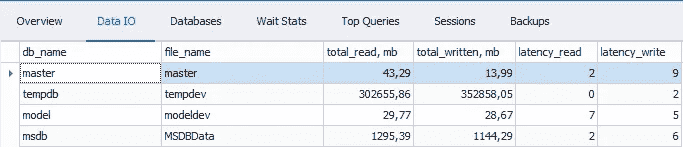
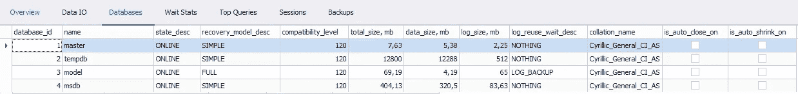
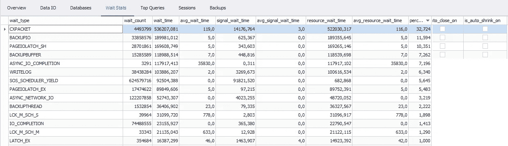
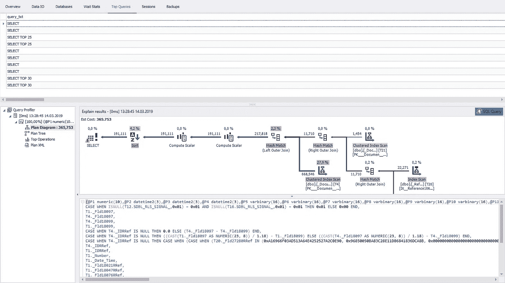
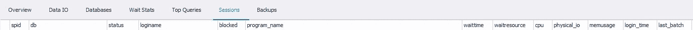
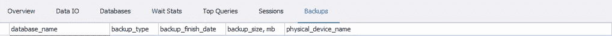

# MS SQL Server 监视的某些方面。第二部分。

> 原文：<https://medium.com/hackernoon/some-aspects-of-ms-sql-server-monitoring-part-2-548a1c3375a1>


在本文的这一部分中，我们将查看用于监视 MS SQL Server 状态的主要系统计数器，回顾 tempdb 系统数据库监视的过程，并了解更多有关 SQL Server 性能监视器特性的信息。

# **用于 MS SQL Server 监控的主系统计数器**

下列系统计数器通常用于监视 MS SQL Server 的状态:

## 1.内存:

**每秒页面数—** 显示从磁盘读取页面或向磁盘写入页面以解决硬页面错误的速率。该值表示每秒输入页数和每秒输出页数的总和，同时还包括为满足文件系统缓存(通常由应用程序请求)和未缓存的映射内存文件中的错误而检索的页。这是在高内存使用负载和过多页面交换时应该跟踪的主要计数器。此计数器表示页面交换的强度，因此其非峰值应该接近零。如果交换值在增长，那么就需要增加 RAM 的数量或者限制服务器运行的应用程序的数量。

**页面错误/秒—** 该值代表页面错误的数量。当程序请求的页面地址不在当前的内存驻留页面集中时，就会发生页面错误。此计数器包括需要磁盘请求的页面错误，以及由内存驻留页面集中当前不存在的页面导致的错误。大多数 CPU 可以处理后一种类型的故障，没有明显的延迟。然而，前一种类型的页面错误在被处理时会导致显著的延迟。

**可用字节—** 跟踪可用于执行各种进程的内存(以字节为单位)。低值是内存不足的迹象。这里的解决方案是增加内存量。在大多数情况下，此计数器应该大于 5000 Kb。
基于以下考虑因素，手动设置可用兆字节阈值可能是有益的:

*   50%的可用内存=优秀
*   25% =需要注意
*   10% =可能的问题
*   小于 5%的可用内存=临界状态，需要干预。

## 2.处理器(总数):%处理器时间

此计数器显示处理器为非空闲线程执行各种操作所花费的时间百分比。这个值可以看作是花在生产性工作上的时间的表示。每个处理器可以分配给一个空闲线程，该线程使用其他线程不使用的非生产性处理器周期。这种计数器很自然地会出现短暂的活性峰值，通常达到 100%。但是，如果有很长一段时间处理器负载超过 80%,您的系统将受益于使用更多的 CPU 核心。

## 3.MS SQL Server:访问方法

SQL Server 中的 Access Methods 对象提供了帮助跟踪对数据库中逻辑数据的访问的计数器。可以使用缓冲区管理器计数器跟踪对磁盘上数据库页面的物理访问。跟踪特定数据库中的数据访问方法将允许您决定哪种提高查询性能的方式是最好的:添加或更改索引、节、文件或文件组、索引碎片整理或更改查询文本。此外，通过控制每个服务器实例的大小和碎片，可以使用对象的访问方法计数器来跟踪数据库中的数据大小、索引和可用空间。过多的索引碎片会导致性能显著下降。

**页拆分/秒—** 由于索引页溢出而每秒执行的页拆分次数。如果该值很高，则可能意味着 SQL Server 必须执行大量占用大量资源的操作，以便在插入和更新数据时拆分页面并将现有页面的一部分移动到新位置。如果可能的话，应该避免这样的操作。我们可以尝试使用以下方法之一来解决这个问题:

*   为自动增量列创建聚集索引。在这种情况下，新记录将按顺序放置在新页面上，而不是已经被数据占用的页面上；
*   通过增加 Fillfactor 参数的值来重建索引。此参数允许您在索引页中保留空间，然后这些空间可用于放置新数据，而实际上不需要进行页拆分操作。

**每秒完全扫描数—** 每秒无限制完全扫描操作的数量。这种操作包括主表扫描和完全索引扫描。如果该值稳步上升，则可能是系统退化的迹象(缺少索引、索引碎片严重、存在未使用的索引)。但是请记住，当在小表中使用时，完全扫描并不总是不必要的——如果一个表可以完全适合系统的 RAM，那么执行完全扫描会更快。但是在大多数情况下，这个计数器值的稳定增长意味着系统的退化。所有这些信息只适用于 OLTP 系统。另一方面，在 OLAP 系统中，全扫描被认为是完全正常的。

## 4.MS SQL Server:缓冲区管理器

通过提供以下功能，缓冲区管理器对象允许您监视 SQL Server 如何使用不同的资源:

*   跟踪用于数据页存储的存储器；
*   SQL Server 读写数据库页时用于跟踪物理输入输出的计数器；
*   通过使用快速非易失性存储器，即 SSD，扩展缓冲池和缓冲区高速缓存；
*   跟踪 SQL Server 的内存和计数器使用情况。这有助于检索以下信息:

a)存在由物理内存不足引起的瓶颈。如果经常使用的数据无法缓存，SQL Server 需要直接从磁盘读取；

b)通过增加总内存量或通过将额外的内存量专用于数据缓存或存储 SQL Server 的内部结构来提高查询执行性能的可能性；

SQL Server 从磁盘直接读取数据的频率。与其他操作(例如内存访问)相比，物理输入输出要耗费更多的时间。

减少输入-输出量可以提高查询执行性能。

**缓冲区缓存命中率—** 显示 SQL Server 如何将数据完全放入缓存中。该值越高越好，数据页应该放在缓存缓冲区中，并且应该没有物理输入输出操作，以便 SQL Server 有效地访问这些页。如果这个计数器的值不断减少，您应该考虑为您的系统增加更多的 RAM。对于 OLTP 系统，此计数器应始终大于 90%,对于 OLAP 系统，应始终大于 50%。

**页面预期寿命—** 显示页面在其当前状态下将包含在内存范围内多长时间。如果该值持续下降，则系统过度使用缓冲池。这样，工作记忆会导致性能下降。需要注意的是，没有通用的页面预期寿命值来表示系统的缓冲池过度使用(自 MS SQL Server 2012 以来，300 秒的值不再适用)。

## 5.MS SQL Server:常规统计信息

常规统计对象提供跟踪服务器整体活动的计数器。例如，您可以查看运行 SQL Server 实例的计算机上每秒的并发连接数和用户数。这些值可以用在大型 OLTP 系统中，在这些系统中，大量的客户端连接到 SQL Server 实例并从其断开连接。

**阻塞的进程—** 当前阻塞的进程数。

**用户连接数—** 当前连接到 SQL Server 实例的用户数量。

## 6.MS SQL Server:锁

Locks 对象提供有关 SQL Server 中不同资源类型的锁的信息。针对资源(如事务读取或更新的行)发出锁，以避免资源同时被多个事务使用。例如，当一个事务对表中的一行发出一个排他锁(X 锁)时，任何其他事务都不能更新该行，直到该锁被释放。减少锁的使用可以积极地影响并行性，从而提高整体性能。可以跟踪 Locks 对象的几个实例，每个实例代表一个针对特定类型的资源发出的锁。

**平均等待时间(毫秒)—** 所有需要等待的锁请求的平均等待时间，以毫秒为单位。此计数器显示用户进程在对资源发出锁之前平均需要等待的时间。没有办法为此计数器定义一个通用的最大值，因为它完全取决于您当前的任务是什么。此计数器的高值可能表明数据库中的块有问题。

**锁等待时间(毫秒)——**最后一秒钟范围内锁等待时间的总量，以毫秒显示

**锁等待/秒—** 在最后一秒内，由于锁请求，线程必须等待的总次数。

**锁超时/秒—** 无法通过循环请求获得锁的次数。自旋计数器配置参数的值设置了在超时发生和线程进入空闲状态之前的最大次数(自旋)。

**每秒锁请求数—** 每秒指定类型的锁请求总数。

**每秒死锁数—** 每秒相互阻塞(死锁)的数量。死锁的存在表明查询构造不当，导致相互请求的资源被锁定。

## 7.MS SQL Server:内存管理器

内存管理器对象提供计数器来跟踪整个服务器上的内存使用情况。这种类型的监视和评估用户动作和资源使用可以帮助识别性能问题。SQL Server 内存控制允许您检查:

*   缓存中是否存在存储常用数据的物理内存不足。如果没有足够的内存，SQL Server 将需要直接从磁盘中检索数据；
*   如果可以通过添加内存或增加可用内存的大小来缓存数据或内部 SQL Server 结构，则可以提高查询的性能。

**Memory Grants Outstanding—**统计已成功接收专用工作区内存的进程总数。如果该值持续下降，则应增加 RAM 的容量。

**Memory Grants Pending —** 显示当前等待接收工作内存专用区域的进程总数。如果这个值稳定增长，RAM 的数量应该增加。

## 8.MS SQL Server:统计信息

Statistics 对象确保计数器跟踪发送到 SQL Server 实例的请求的编译和类型。通过监视查询的编译次数和重复编译次数以及 SQL Server 收到的包的数量，您可以大致了解 SQL Server 执行用户请求的速度以及查询优化器处理用户请求的效率。

**每秒批处理请求数—** 每秒接收的 Transact-SQL 命令包数。该值受任何限制的影响，如输入输出、用户数量、缓存大小、查询复杂性等。大量的包请求意味着高吞吐量。

## 9.逻辑磁盘:

**Avg Disk sec/Read —** 显示从磁盘读取文件所花费的平均时间，以秒为单位。该计数器的平均值不应超过 2 毫秒，其最大值不应大于 10 毫秒。在某些情况下，可以接受 25–50 毫秒的峰值。但是具体情况取决于系统的性能要求。

**Avg Disk sec/Write —** 显示将数据写入磁盘所花费的平均时间，以秒为单位。该计数器的平均值不应超过 5 毫秒，其最大值不应高于 25 毫秒。

除了这些主要的性能计数器之外，如果在这个过程中需要的话，还可以根据您的特定环境设置附加的性能计数器。

# **监控 tempdb 系统数据库的性能**

随着时间的推移，专用于 tempdb 数据库的文件数量可能会变得不足。为了检查这一点，我们可以使用以下查询:

在这个查询的帮助下，我们试图在 tempdb 数据库中找到 PFS、GAM 和 SGAM 页面的闩锁。

如果此查询不返回任何内容，或者只返回“不是 PFS、GAM 或 SGAM 页面”行，则很可能意味着在当前情况下没有必要增加 tempdb 文件。

评估 tempdb 系统数据库文件的等待时间也很重要，这可以通过使用以下查询来完成:

```
SELECT files.physical_name, files.name,stats.num_of_writes, (1.0 * stats.io_stall_write_ms / stats.num_of_writes) AS avg_write_stall_ms,stats.num_of_reads, (1.0 * stats.io_stall_read_ms / stats.num_of_reads) AS avg_read_stall_msFROM sys.dm_io_virtual_file_stats(2, NULL) as statsINNER JOIN master.sys.master_files AS filesON stats.database_id = files.database_idAND stats.file_id = files.file_idWHERE files.type_desc = 'ROWS'
```

可接受的值取决于您的特定系统及其性能要求。但是，通常情况下，以下值可以作为一个很好的参考点:

1.  avg_read_stall_ms 不超过 1 毫秒
2.  avg_write_stall_ms 不超过 5 毫秒

# **获取 MS SQL Server 实例的一般信息**

通过获取最重要的基本信息，对特定的 MS SQL Server 实例有一个全面的了解是很重要的。这可以通过使用以下查询来实现:

这样，我们获得了以下信息:

**1)服务器\实例—** 安装 MS SQL Server 实例的服务器的名称

**2)SQL Server version****—**复合 MS SQL Server 信息(版本、CPU 架构、构建日期、版本、OS 版本)

**3)service instance—**MS SQL Server 实例的名称(对于未命名的实例，返回“MS SQL Server”)

**4)当前数据库名称** **—** 存储所有相关信息的数据库的名称

**5)当前登录—** 系统指定的当前登录的名称

**6)当前用户名** **—** 当前用户名

在此之后，将显示有关 MS SQL Server 实例的更多信息。您可以通过以下链接了解有关这些属性的更多信息:

[https://docs . Microsoft . com/SQL/t-SQL/functions/server property-transact-SQL？view=sql-server-2017](https://docs.microsoft.com/sql/t-sql/functions/serverproperty-transact-sql?view=sql-server-2017)

查询结束时，将显示以下字段:

**1)** **服务器启动**—MS SQL Server 实例上次启动的日期和时间

**2) DaysRunning** —自上次启动以来 MS SQL Server 实例一直工作的总天数

**3)seconds running**—MS SQL Server 实例自上次启动以来一直工作的总秒数

这三个字段是从 tempdb 系统数据库的属性中检索的。这是因为每次重新加载 MS SQL Server 实例时都会创建 tempdb 系统数据库。这就是为什么可以从 tempdb 数据库中检索 MS SQL Server 实例上次启动的日期和时间及其自上次启动以来的总工作时间。

# **db forge Studio For SQL Server 中的 SQL Server 监控统计数据**

dbForge SQL Monitor 通过本文第一部分中提到的专用概述选项卡显示主要的 SQL Server 性能统计数据。在 Overview 选项卡中，您可以查看关键的 sql 活动统计信息，如 CPU 利用率、内存利用率、磁盘活动和 IO 延迟。

如果您想深入研究实时统计数据并跟踪有关数据库、最耗费资源的查询、当前活动的进程、等待统计数据和其他方面的信息，您可以使用 dbForge Studio for SQL Server 中的其他 SQL Monitor 选项卡。

## 1.数据 IO —实时文件读写统计:



Fig.1\. Data IO tab

这里，延迟以毫秒为单位显示

可以通过执行以下查询来检索此信息:

## 2.数据库—关于数据库的实时信息:



Fig.2\. Databases tab in SQL Monitor

可以使用以下查询获取该数据:

## 3.等待统计—实时等待类型统计:



Fig.3\. Wait Stats tab

## 4.实时显示前 10 个最占用资源的查询。

Elapsed Time 参数有助于定位对性能影响最大的查询:



Fig.4\. Top Queries tab

该选项卡还可以显示详细的查询文本和执行计划

您可以通过执行以下命令来获取此信息:

## **5。会话 MS SQL Server 实例中当前活动的进程:**



Fig.5\. Sessions tab of SQL Monitor tool

可以通过以下查询获取该数据:

**6。备份—关于最新数据库备份的信息:**



Fig.6\. Backups tab of SQL Monitor

您可以通过执行以下命令来检索此信息:

**总结**

在本文中，我们研究了 MS SQL Server 活动监控的方法，这些方法允许我们检测 RAM 和自由线程的缺乏，以及其他不太明显的问题。

我们还看到了由 [Devart](https://www.devart.com/?utm_source=hackernoon.com&utm_medium=referral&utm_campaign=articlemssqlmonitor) 开发的[db forge Studio for SQL Server](https://www.devart.com/dbforge/sql/studio/monitor.html?utm_source=hackernoon.com&utm_medium=referral&utm_campaign=articlemssqlmonitor)如何帮助 MS SQL Server 进程。