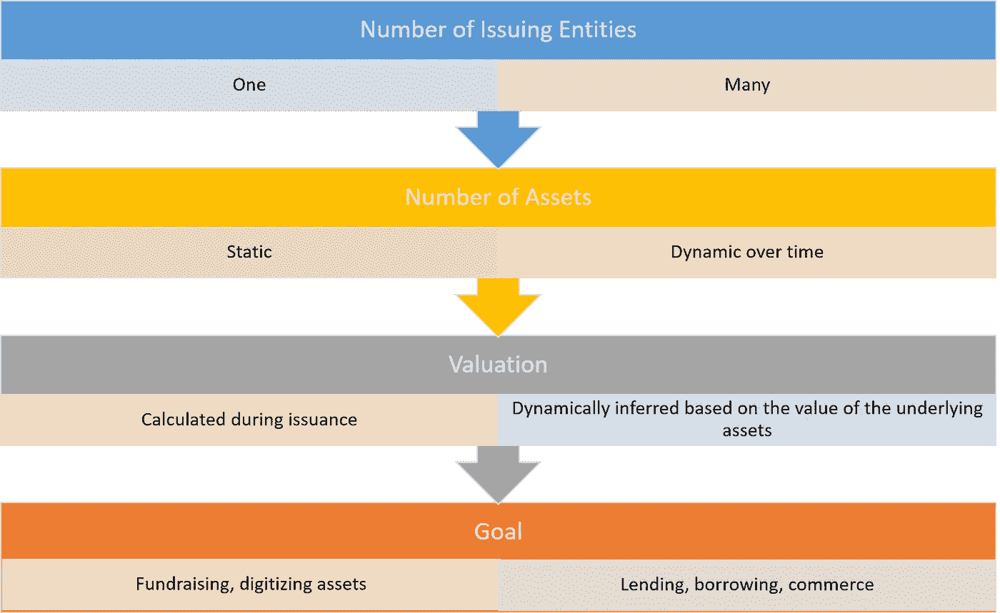
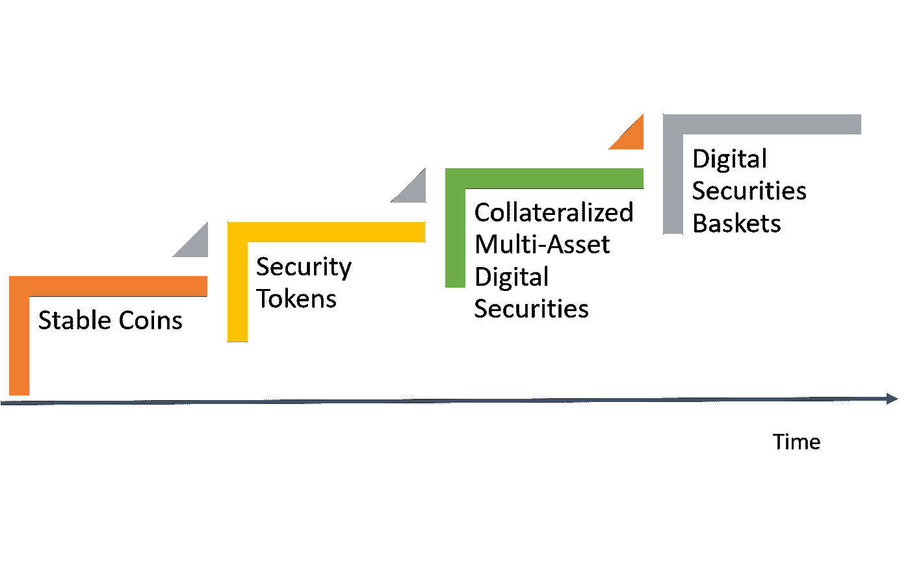

# 关于抵押多资产证券的一些想法:第一部分

> 原文：<https://medium.com/hackernoon/some-ideas-about-collateralized-multi-asset-security-tokens-part-i-7dea880d79bf>

当人们问我关于安全令牌最让我兴奋的事情时，我通常会回答“我们现在没有在做的事情”😉。我坚信，安全令牌领域最大的机会不是对现有资产进行令牌化，而是使用开放的可编程协议重新构想金融系统。可编程性让我们有机会创造新的金融形式，而这在传统金融体系中是很难或者根本不可能创造的。最近我花了很多时间思考的加密证券的一种新形式是我喜欢称之为抵押多资产数字证券(CMADS)。即使您不喜欢这篇论文，我也恳请您帮我为这种类型的安全令牌找到一个更好的名称😉

CMADS 背后的想法是创造能够基于基础资产动态池增值的加密证券。这个概念可能看起来类似于金融产品，如债务抵押债券(CDO)或房地产投资信托基金(REITs)，只要这些产品是开放的、可编程的、简单的和透明的，而且……你知道……没有欺诈性😉让我们想象一个由动态的房地产资产池或动态的美国市政债券池担保的证券令牌。所谓动态，我们的意思是抵押资产的数量会随着时间的推移而变化。为了理解 CMADS，让我们将其与现有的一代安全令牌进行比较。

# 单资产与多资产安全令牌

安全令牌的传统模型通常生成与特定实体所拥有的资产相关的加密安全。例如，安全令牌可以代表特定公司(实体)中的股份(资产)。在这种模式下，资产及其估值在发行前是众所周知的，其构成在代币的整个生命周期中不太可能改变。在抵押多资产数字证券(CMADS)模型中，资产将被动态添加或删除，从而影响整体证券的价格。

让我们用一个例子来说明 CMADS。假设我们创建市政债券令牌(MBT)作为美国市政债券的令牌化表示。如果你不熟悉市政债券，它们是这种不太性感的金融工具，代表国有实体的债务义务，美国市政债券有三个关键特征:它们相对稳定、流动性相对较高、相对乏味😉。

在当前的市场条件下，我们的 MBT 证券将从价值 1 亿美元的初始市政债券池开始，但我们希望随着时间的推移提高估值。《MBT 协议》将允许任何市政债券持有人以其持有的债券为抵押获得 MBT(如何实现这一点将是第二部分的主题)。同样，MBT 持有者可以赎回他们的代币，收回他们的市政债券。这个模型借鉴了稳定币[制作者道](https://makerdao.com)的一些想法，但也带来了将该模型应用于数字证券的独特角度。

将 CMADS 与传统安全令牌进行比较，可以发现几个方面的重要差异:

# CMADS 与稳定硬币和令牌化篮子

抵押多资产数字证券(CMADS)借鉴了其他令牌化产品(如稳定硬币)或令牌化衍生品(如令牌化篮子)的理念。CMADS 不同于稳定硬币，因为如果我们假设稳定性与菲亚特汽车是一对一的关系，那么 CMADS 就不一定是“稳定”的。然而，稳定硬币的抵押、赎回机制和程序化稳定维护机制与 CMADS 的相关性令人难以置信。通过注册美国市政债券的所有权位置来接收 CMADS 的过程与 stable coins 使用的基于法定储备发行新加密硬币的机制没有什么不同。

数字篮子是由像 [SET](https://setprotocol.com/) 这样的协议支持的概念，这些协议创建了由其他加密令牌组成的加密令牌衍生物。在证券代币的背景下，我们可以想象一个数字篮子，它代表一个代表美国市政债券的基础代币池。这里的区别非常明显:数字篮子需要底层安全令牌，而 CMADS 直接从底层资产中获取价值。此外，我们应该考虑到数字购物篮仍处于非常早期的阶段，在安全令牌领域还没有已知的应用。

如果我们需要在时间轴上描绘 CMADS 与其他复杂形式的数字证券的对比，我们将得到如下结果:

# CMADS 优势

作为本文第一部分的总结，我想强调抵押多资产数字证券(CMADS)模型的一些主要优势。

## 高估值

对于实现数十亿美元估值的证券令牌，要么是因为它基于数十亿美元的资产，要么是因为基础资产的估值随着时间的推移而激增。这两种情况在更广泛的令牌化证券背景下都是非常小的统计表现。CMADS 工具更有可能实现高估值，因为它们可以代表大量的基础资产。稳定的硬币是这种动态的一个很好的例子。

## 对冲头寸

单一资产证券容易受到单一资产市场表现的影响。CMADS 提供了一种机制来维持一定的价格稳定性，以适应不同的市场条件。例如，代表曼哈顿、上海和英国房地产的 CMADS 可以针对这些单独市场中房地产市场的表现对冲其价格。

## 借贷工具

CMADS 是一个很好的贷款机制。例如，在我们的美国市政债券(MBT)方案中，债券持有人可以获得以其持有的债券为抵押的 MBT。例如，他们可以将 MBT 兑换成美元，用于偿还特定债务，然后他们可以通过向 CMADA 智能合约发送 MBT 来赎回他们的美国市政债券。

## 投资收益

稳定的硬币是一种很好的商业机制，但对投资者来说不是很有吸引力，因为它们的价格不会与基础法定货币相差太远。CMADS 工具提供了稳定硬币的一些好处，同时对投资者也很有吸引力。代表美国国债池的 CMADS 每年的收益率仍将在 2——3%之间。

## 资产流动性

流动性仍然是当前一代安全代币的最大挑战。向这一领域注入流动性的机制之一，是将能够进入股票、债券或大宗商品等流动性市场的资产证券化。CMADS 是实现这一目标的近乎完美的工具。

到目前为止，你要么真的很困惑，要么真的被抵押多资产数字证券(CMADS)的概念所吸引。虽然 CMADS 的概念似乎显而易见，但是创建这种类型资产的协议却远非如此。在本文的第二部分，我将深入研究一些能够实现第一波 CMADS 的协议模型。