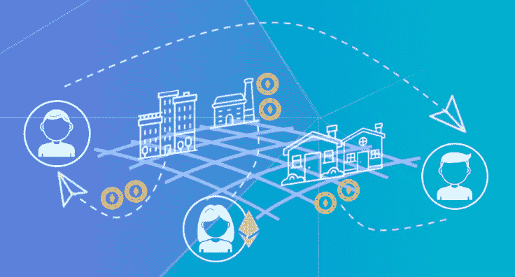
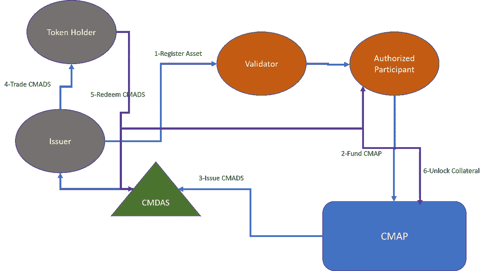

# 关于抵押多资产证券的一些想法:第二部分

> 原文：<https://medium.com/hackernoon/some-ideas-about-collateralized-multi-asset-security-tokens-part-ii-101da5b28211>

这是探讨抵押多资产数字证券(CMADS)概念的文章的第二部分。第一部分探讨了 CMADS 背后的一些一般原则，以及它们与其他形式的安全令牌的关系。今天，我将深入探讨其中的一些想法，探索创建 CMADSs 的协议。

CMADS 背后的想法是创建由多种资产抵押的安全令牌。虽然单一资产证券代币是私人公司股票等资产的绝佳数字表现形式，但政府或公司债券或房地产租赁等许多其他资产类别都是成组交易的。例如，举一个房地产基金的例子，该基金希望将一批财产租赁进行令牌化。尽管技术上可行，但每次租赁发行一个代币似乎不切实际，因为大多数投资者希望投资于更大的基础租赁。由整组房地产租赁担保的单一证券似乎是一个更有吸引力的主意。然而，这种 CMADS 的实现并不简单。

# 原则与挑战

我认为抵押多资产数字证券(CMADS)是安全令牌发展过程中不可避免的一步。虽然从概念上看微不足道，但从技术和财务角度来看，CMADS 车辆的实施提出了一些切实的挑战。在这些挑战中，我认为有三个挑战是 CMADS 动态的基础:

**动态资产注册和赎回:**CMADS 应该能够根据令牌持有者的请求动态地添加和删除资产。

**估值调整:**为了与基础资产保持稳定的相关性，CMADS 需要能够根据特定的市场条件动态调整其估值。

**做市商依赖性:**CMADS 中的估值调整要求能够以适当的规模购买或出售资产。为了实现这一点，CMADS 协议依赖于具有购买能力的实体来维护加密安全性和底层资产之间的相关性。

# 密码和非密码灵感

实施抵押多资产数字证券(CMADS)绝非易事。虽然挑战很多，但好消息是我们可以从加密和金融市场的成熟产品中借鉴不同的解决方案和灵感。具体来说，我认为有两个模型为 CMADS 的实现提供了很多相关的想法:

****【协议】制作者** **:** 制作者，就是协议中那个势力[的通俗加密货币戴](https://coinmarketcap.com/currencies/dai/)。Maker 使用可编程的机制将戴的价格维持在接近 1:1 的水平。与其他稳定的货币不同，戴能够在依靠乙醚等不稳定的抵押品的情况下维持稳定的价格。Maker 通过提供一个可编程的机制来根据市场波动调整戴的估值，从而实现了这一目标。**

**[**ETF 创建/赎回流程**](https://www.investopedia.com/articles/mutualfund/05/062705.asp) **:** 交易所交易基金(ETF)是一种跟踪股票、债券或商品等基础资产池的有价证券。ETF 的基础是基于一个称为创建/赎回的过程，其中做市商(称为授权参与者(AP))可以购买或出售 ETF 中的资产，以维持与基础抵押品相关的价格。例如，如果 ETF 的价格超过了基础资产的价值，AP 将进行干预，增加他们在组成 ETF 的基础资产中的头寸，以稳定价格。**

**结合来自 Maker 协议和 ETF 创建/赎回模型的思想，我们可以概述 CMADS 协议的基础。**

# **CMADS 协议**

**抵押多资产数字证券(CMADS)协议的完整机制超出了本文的范围，但希望我能够概述一些基本概念，以实现这种新形式的安全令牌。在高层次上，CMADS 协议将有以下参与者:**

****发行人:**负责担保特定资产并接收相应 CMADS 的实体。**

****令牌持有者:**在任何给定时间持有 CMADS 的实体。在 CMADS 生命周期的不同时间，令牌持有者和发行者可能是同一个人。**

****验证者:**验证者是断言特定资产价值的参与者。这个过程可以完全脱离链。**

****授权参与者(AP):**AP 是独立的行为者，受激励维持 CMADS 的价格稳定。**

****神谕:**神谕是用来确保 CMADS 公平定价的外部信息来源。**

****抵押多资产头寸:**一种保持基础资产和 CMADS 之间相关性的智能合约。重要的是要注意，要使 CMADS 有效运作，它们需要被基础资产过度抵押。**

**在一种非常简单的形式中，CMADS 协议可以概括为以下交互:**

**1)发行者向给定的验证者注册一组特定的资产。**

**2)在收到来自验证者的确认后，授权参与者(AP)将创建抵押多资产头寸(CMAP ),并使用该头寸向 CMADS 智能合约添加额外资金。**

**3)CMADS 智能合约将相应的 CMADS 发放给发卡行。**

**4)在任何给定的时间点，发行者可以与特定的令牌持有者交易 CMADS。**

**5)当发行者或代币持有者想要赎回他们的 CMADS 时，他们将向 CMADS 智能合约发送一笔金额，以支付 CMAP 并赎回基础资产。**

**6)AP 会解锁目标资产，并烧掉一部分收到的 CMADS，以维持价格稳定。**

**7)在此过程中，验证器将利用 Oracles 来确保 CMADS 的正确价格相关性。如果出现任何变化，美联社将进行干预，以维持价格稳定。**

****

**抵押多资产数字证券似乎是安全令牌发展过程中不可避免的一步。从长期来看，安全令牌将继续作为单一基础资产的代表的想法是不可持续的。希望这篇由两部分组成的文章中概述的一些想法能够有助于引发关于这种新形式的安全令牌的讨论。**