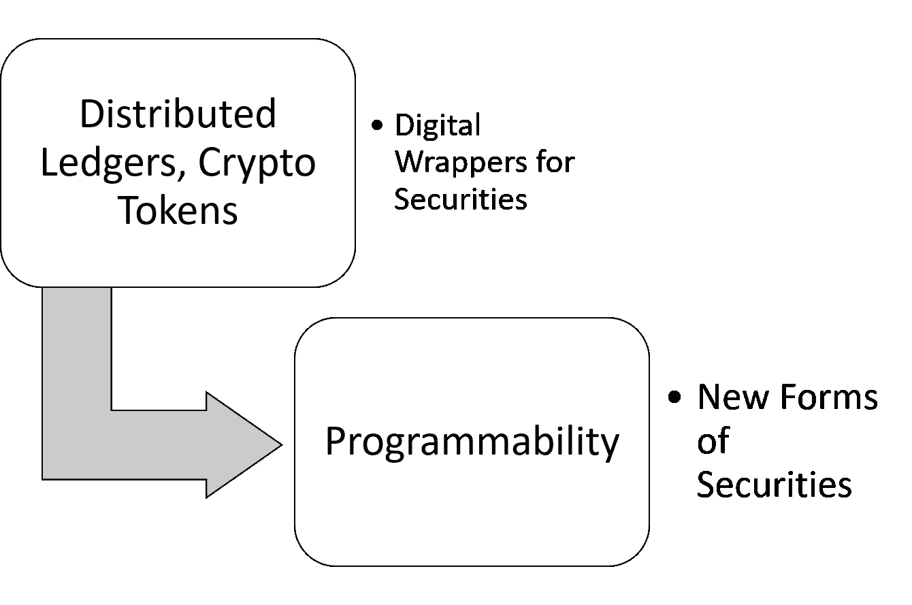
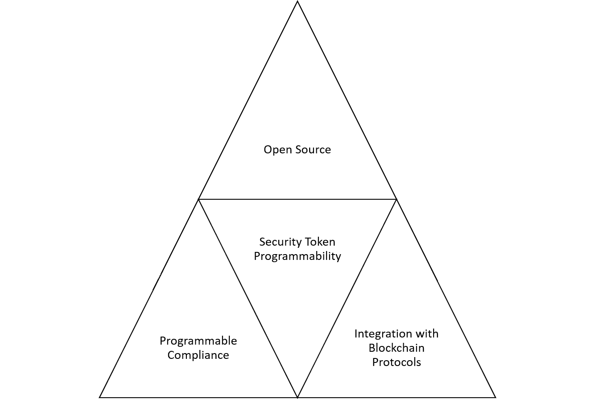
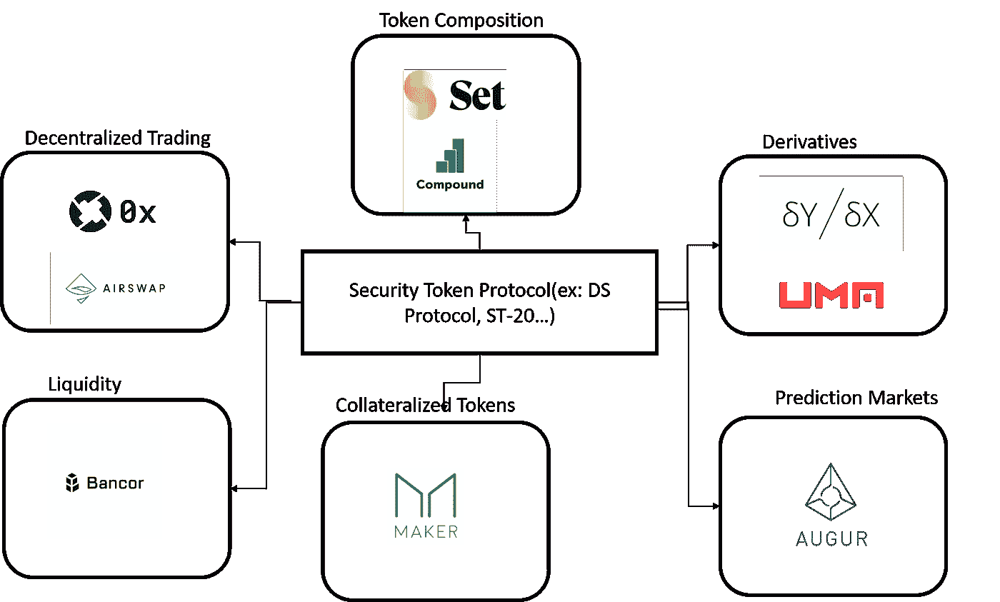

# 解除安全令牌可编程性的一些想法

> 原文：<https://medium.com/hackernoon/some-ideas-to-unlock-programmability-in-security-tokens-19407dbd4bb7>

可编程性是安全令牌趋势的圣杯之一。从某些角度来看，你可以说，如果没有可编程接口和强大的开发者生态系统来帮助我们重新想象证券世界，安全令牌的承诺就不会实现。尽管有其潜力，可编程性在加密证券领域仍然是一个高度理论化的想法，从某种逻辑上讲，更多的平台优先关注监管而不是可编程接口。显然，为安全令牌创建可行的可编程模型绝非易事，尤其是考虑到生态系统的不成熟性。最近，我一直在思考一些有助于在短期内释放加密证券可编程性价值的战略途径，我决定在这里分享一些想法。

# 为什么可编程性很重要？

如果你看看当前的安全令牌生态系统，你会不禁质疑可编程性的相关性。可编程性真的有必要吗？或者，围绕加密证券的法规约束会阻止任何链上可编程模型的可行性？从哲学的角度来看，可编程性是允许我们创造新形式证券的唯一工具。虽然区块链的不变性和一致性模型使得围绕现有证券的数字包装成为可能，但可编程性提供了一条用今天不可能的能力完全重新想象生态系统的道路。账本给了我们数字包装，可编程性给了我们未来。

关于可编程性的价值的哲学争论是显而易见的，但这并不意味着它在短期内有任何价值。安全令牌平台应该关心可编程性吗？在我看来，他们绝对应该这样做有几个战略原因，但它们都可以归结为一个简单的加密经济原则:*将生态系统的价值从安全令牌扩展到安全令牌网络*。

可行的可编程模型将允许第三方 DApps 建立在安全令牌协议之上。这种动态不仅为底层加密安全协议创造了粘性和防御性，还将生态系统的价值从孤立的令牌扩展到了应用网络。有了正确的内置激励机制，安全令牌协议可以根据令牌和由它们支持的 DApps 的数量成比例地增加价值。此外，可编程性将允许创建开发人员社区和各种难以预先想象的网络效果。

# 排除不是求是法

评估可编程性对于安全令牌生态系统的价值的另一种方式是通过分析相反的现象或者哲学家们所说的 via negativa(通过否认的方式)。链上可编程模型的缺乏给安全令牌带来了一些不容忽视的切实风险:

**对现有者的脆弱性:**如果没有协议网络效应的可编程性，恐怕整个安全令牌生态系统都容易受到进入该领域的企业软件现有者的财务影响。目前，进入这一领域的高盛或富达可以接管整个证券代币市场。可编程性是确保安全令牌可防御的最有效工具之一。

**碎片化&缺乏互操作性:**缺乏可编程模型将间接影响孤立和不可互操作平台的扩散，这将增加安全令牌生态系统的碎片化。虽然一定程度的分裂在技术运动中是好的，但太多的分裂会导致脆弱性。

**防止衍生产品和可编程金融模型:**如果你读了这篇博客，你就会知道我相信衍生产品将成为释放该领域真正潜力的安全标志的终极表现。嗯，加密衍生品不过是依赖于基础资产或协议的可编程智能合约。所以，没有可编程性，衍生品就不会发生。

# 在安全令牌中启用可编程性的初始步骤

即使您完全相信安全令牌的可编程性的价值，当您开始研究实现它的具体策略时，也会感到气馁。释放加密证券可编程性的价值绝非易事。冒着把问题过于简单化的风险，我认为有三个基本问题可以导致在加密证券中实现某种程度的可编程性的初始策略:

a)安全令牌的哪些方面可以编程？

b)哪些具有大型开发人员社区的区块链协议可以适用于安全令牌？

c)可以实施哪些分发机制来吸引开发人员加入安全令牌生态系统？

对这些问题进行详细的研究，可以为我们提供一个基本策略的三个主要组成部分，以释放安全令牌中的某些级别的可编程性。

# 可编程顺从性

法规遵从性和监管是可通过可编程模型实现的安全令牌领域。市场上的大多数安全令牌都基于简单的监管结构，如了解客户、认证或反洗钱。然而，有数百个法规或合规性检查点与不同的资产类别、司法管辖区或行业相关。我认为假设一两个安全令牌平台能够实现大多数监管检查点是不现实的。构建链上或混合可编程模型，允许开发人员以智能契约或甲骨文的形式编码合规性逻辑，这是一个可以使整个生态系统受益的领域。可编程的规则具有可组合、可测试和可立即执行的优点。我知道，我知道……法规纯粹主义者会告诉你，有许多过程不能以编程方式建模，但我们可以从某个地方开始。

# 与瘦协议集成

在加密安全应用程序中培养可编程性的最简单的方法是将安全令牌协议与区块链协议集成在一起，这些协议拥有健康的开发人员社区。想象一下这样的可能性:开发者可以基于与[达摩](https://dharma.io/)整合的安全代币发行债务，使用[制造商](https://makerdao.com/)构建新形式的抵押稳定币，使用[占卜](https://www.augur.net/)运行预测模型，使用[集合](https://setprotocol.com/)将代币组合成新的证券……希望你能明白。这种策略不仅对整个生态系统有利，而且第一个实现这一点的安全令牌平台也变得非常容易防御。下图显示了我认为可以在短期内为安全令牌生态系统带来价值的一些区块链协议组。

# 开源分发

著名的奥卡姆剃刀哲学原理告诉我们，复杂问题的解决方案往往是最简单的；)采用开源分发模型是为安全令牌构建可编程模型的最简单也可能是最有效的途径。尽管继承了区块链生态系统的开源精神，大多数安全令牌平台仍然保持封闭源代码，并且很少致力于构建他们的开发者网络。诚然，建立一个稳固的开发者社区并不容易，但是潜在的好处是巨大的。

从安全令牌的所有功能来看，我认为可编程性是能够帮助释放空间的真正潜力的一种功能。可编程性，而不是不可变的分类账或代币，是通向加密证券未来的道路。解决可编程性可能是安全令牌社区面临的最重要的挑战，但遗憾的是，这一点却被忽视了。