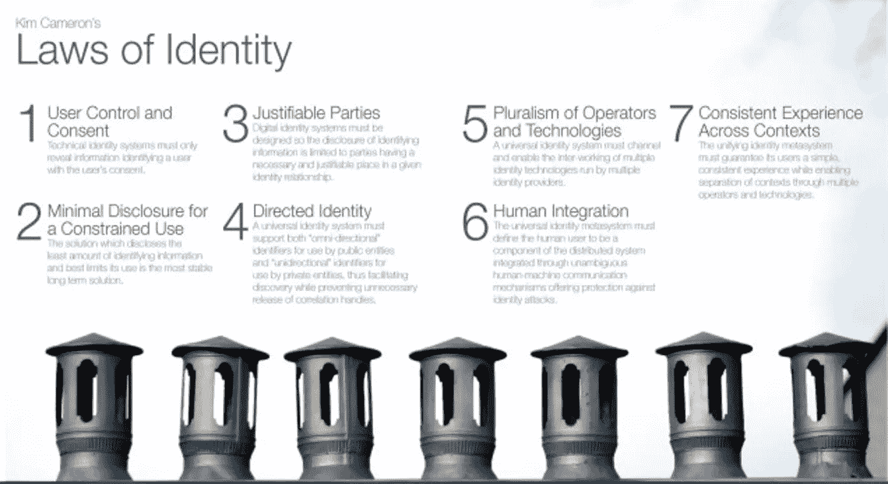
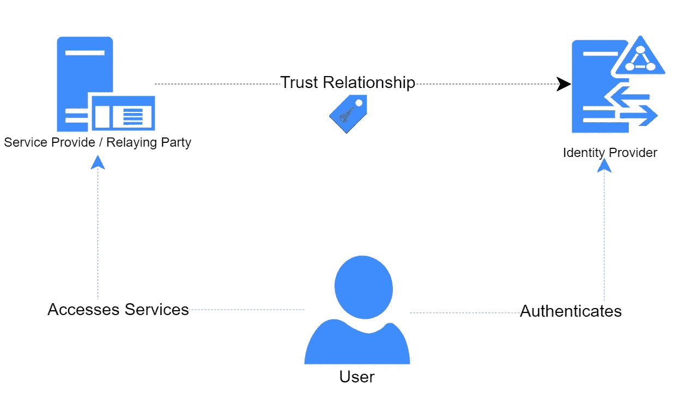
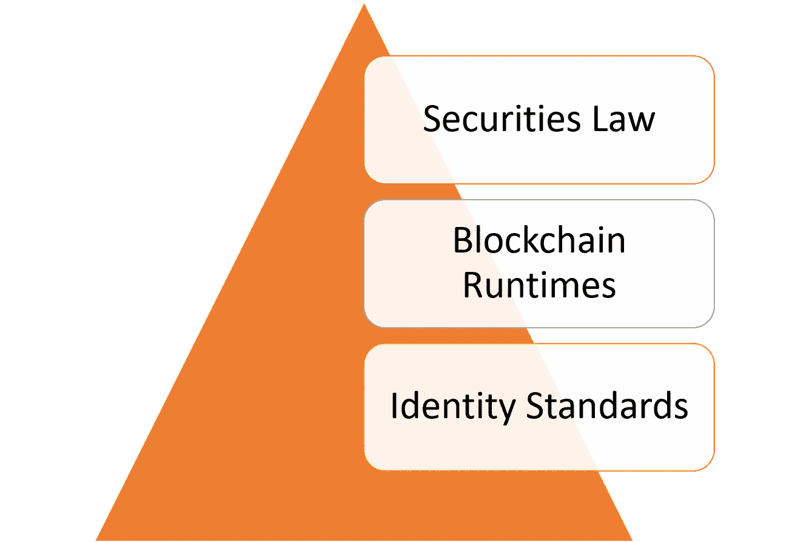
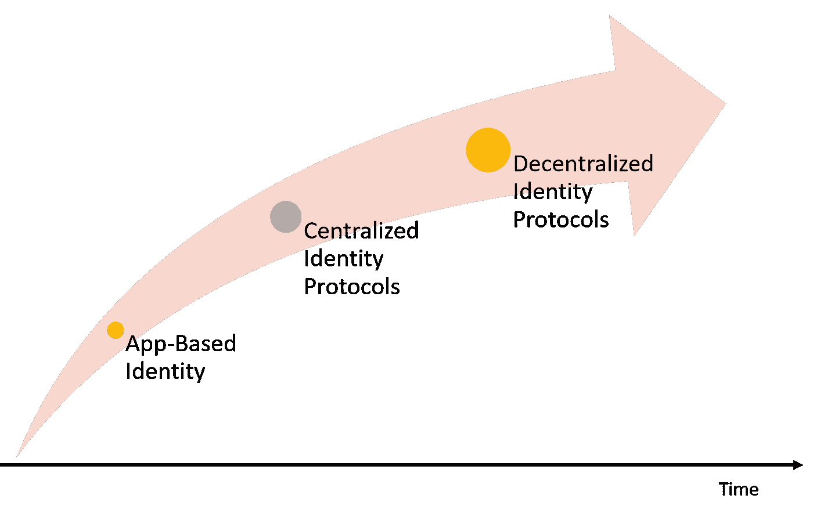

# 关于身份和安全令牌的一些思考:第一部分

> 原文：<https://medium.com/hackernoon/some-reflections-about-identity-and-security-tokens-part-i-e9ed2da93a6b>

身份是安全令牌区别于其他区块链协议的关键因素。在当前一代的安全令牌平台中，身份被限制为使用“白名单”，白名单代表被批准执行特定交易的投资者的目录。虽然白名单支持基于身份的功能，但它们本身并不代表某种形式的身份。随着安全令牌空间的发展，身份应该作为独立的协议发展，在不同的安全令牌平台上使用。要实现这一点，需要在证券法、分布式分类账运行时的特征以及数十年来对身份管理协议的研究之间保持谨慎的平衡。在这篇由两部分组成的文章中，我将探讨一些与下一波安全令牌平台相关的身份协议的想法。

身份的主题是非常复杂的，当我们推断到分散的架构时就更复杂了。冒着过分简化一些想法的风险，我将尝试提供一个逻辑推理路径来理解安全令牌中身份系统的特征，以及从技术角度来看这些想法是如何实现的。在安全令牌的上下文中理解身份可以看作是一个三步问题。

# 避免互联网的错误

在解释身份在安全令牌模型中的相关性时，我发现一个非常强大的想法是将其与互联网上的身份挑战进行比较。身份一直被认为是互联网的“基本缺失块”之一。从架构上来说，互联网不包含身份协议，这意味着随着互联网的发展，我们必须开发第二层和第三层身份解决方案。关于什么是互联网上的身份缺乏普遍共识，这是生态系统日益分裂的根本原因，这已转化为网络安全攻击的脆弱性。

就像互联网一样，区块链没有一等公民的身份。在共识协议中表达的通过计算的身份的概念不足以对许多以用户为中心的业务过程建模，例如在证券转移中需要的那些。安全令牌显然依赖于身份表示来实施特定交易的合规性检查点，但我认为这种愿景是短视的。合规只是身份在数字证券中的众多应用之一。为了避免互联网的错误，身份应被确立为安全令牌平台架构中的一级构建模块，以及该领域中任何其他协议的关键使能因素。

# 同一性法则

已经有很多关于身份的计算机科学论文，但是没有一篇影响了我对空间的思考，比如微软杰出的工程师[金·卡梅隆](https://www.identityblog.com/)发表的[身份法则](http://www.identityblog.com/stories/2005/05/13/TheLawsOfIdentity.pdf)。在论文发表时，我很幸运地定期与卡梅伦互动，我肯定是用我的愚蠢问题让他发疯了，这些问题试图解决我对一个在那之前我认为显而易见的主题的缺乏理解。写于 2005 年的[《身份法则》](http://www.identityblog.com/stories/2005/05/13/TheLawsOfIdentity.pdf)是一篇影响了整整一代身份管理解决方案的论文，这些解决方案至今仍统治着市场。在他的论文中，Cameron 解释了互联网中身份的许多挑战，并概述了支持数字身份系统应考虑的七个关键原则:

1) **用户控制和同意:**技术身份系统必须仅在用户同意的情况下披露识别用户的信息。

2) **受限使用的最小披露:**披露最少量识别信息并最好地限制其使用的解决方案是最稳定的长期解决方案。

3) **正当当事人:**数字身份系统的设计必须使识别信息的披露仅限于在给定身份关系中具有必要和正当地位的当事人。

4) **定向身份:**通用身份系统必须支持公共实体使用的“全向”标识符和私有实体使用的“单向”标识符，从而在防止不必要的相关句柄释放的同时促进发现。

5) **运营商和技术的多元化:**通用身份系统必须引导和实现由多个身份提供商运行的多种身份技术的互通。

6) **人类集成:**通用身份元系统必须将人类用户定义为分布式系统的一个组件，通过明确的人机通信机制进行集成，提供针对身份攻击的保护。

7) **跨上下文的一致体验:**统一身份元系统必须保证其用户获得简单、一致的体验，同时通过多种操作符和技术实现上下文分离。

身份七定律将身份管理空间从单一解决方案发展到基于基于声明的身份这一新概念的联合架构。从根本上说，基于主张的同一性理论有四个基本要素:

**身份:**身份是一组声明，代表关于与特定主体或个人相关的真理的断言。

**身份提供者:**能够生成基于声明的关于特定用户的断言的实体。

**依赖方:**接受并信任由特定提供者发布的身份的实体。

**用户:**由身份表示抽象的实体。

让我们以一个人去酒类商店购买一些酒精饮料的例子来实践这四个概念。在完成购买之前，用户需要向商店代表出示有效的身份证明，比如驾照。该身份包括关于用户的某些声明，如由可信身份提供者(如美国的机动车部门)声明的年龄或地址。在该示例中，商店代表充当信任由身份提供者声明的依赖方。

同一性法则在当时是变革性的，但它们也是为一个有着集中看门人的世界而创造的。仅仅是可信身份提供者的概念就引入了对中央权威机构的间接依赖。区块链和去中心化运行时的出现迫使身份法则适应这样一个世界，在这个世界中，信任代替了数学和密码学，而不是中央集权。

# 身份和安全令牌:从应用到协议

在安全令牌的上下文中，身份的明显好处是强制执行证券法和遵从规则。然而，如果我们将身份的价值降低到这些元素，我们就极大地限制了加密证券的潜力。通用身份表示为安全令牌架构带来了许多无形的好处，这些好处对于空间的发展至关重要。

**以用户为中心的身份与以应用为中心的身份:**在区块链运行时，比如运行安全令牌平台的运行时，用户应该能够拥有自己的身份，并使用它与不同的应用进行交互。这与当今的安全令牌模型形成鲜明对比，在当今的安全令牌模型中，每个平台都创建自己的身份表示。

**互操作性:**想象一下，如果同一个投资者可以重用 KYC 过程的结果来投资不同平台发行的安全令牌。

**可移植性:**投资者可以使用单一身份登录与安全令牌交互的不同市场或 DApps。

**可编程的符合性:**符合性规则可以根据通用身份表示来创作，而不依赖于特定平台。

**共识模型:**身份应该是新形式共识的基础，如避免昂贵的计算逻辑的权威证明。

在安全令牌环境中，身份模型位于身份协议、分散式区块链体系结构和证券法的交叉点。

在安全令牌解决方案中发展身份的关键挑战是从以应用为中心的身份模型(如专有 KYC)过渡到可编程身份协议。这种转变可能会在开始时包括一些集中式模型，但最终会发展成更加分散的协议。

考虑到前面列出的方面，我们可以得出安全令牌中通用身份表示的一些特征:

**用户所有，应用强制:**在安全令牌模型中，身份应该由用户所有，并由不同的安全令牌应用强制执行，如发行平台或交易所。

**基于声明:**安全令牌应用中的身份应该是一组关于特定用户或实体的声明或断言。

**可逆:**为了执行证券法，身份表示应该是可逆的，这意味着监管机构应该能够检索用于生成用户断言的文档。

**基于身份标准:**在过去的几年中，安全令牌行业产生了许多高质量的标准，如 SAML 或 OpenID Connect，这些标准已被我们日常使用的许多应用程序所采用。我认为安全令牌协议应该利用一些已建立的标准作为其协议的一部分，而不是建立新的标准。

**可编程:**身份应该能够在其他安全令牌协议中重用。

考虑到这一点，我们可以开始考虑如何为安全令牌设计一个身份协议。这将是我下一篇文章的主题。