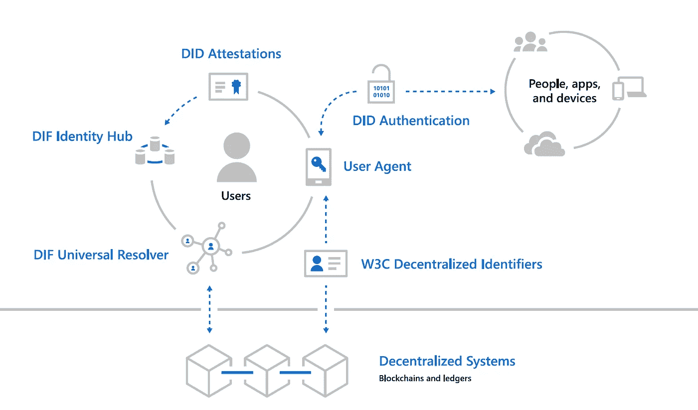
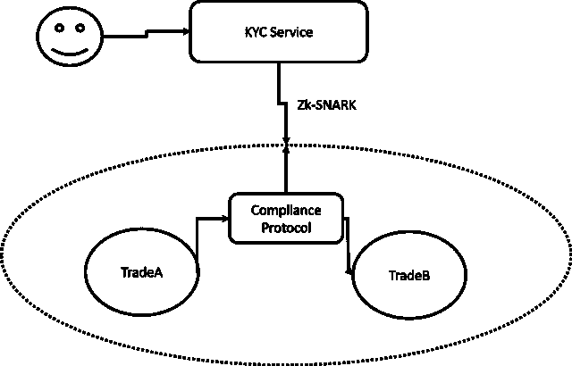

# 关于身份和安全令牌的一些思考:第二部分

> 原文：<https://medium.com/hackernoon/some-reflections-about-identity-and-security-tokens-part-ii-d4152affea5b>

这是探讨安全令牌中身份功能的文章的第二部分。在第一部分中，我们探索了身份的一些基本原理，并将其推广到加密证券领域。今天，我将重点介绍一种技术模型，它可以将其中一些原则与现有的安全令牌平台相集成。

这篇由两部分组成的文章的主要前提是，身份应该作为安全令牌体系结构的独立协议而发展。身份应该成为跨安全令牌平台的互操作性的基本构建块之一，而不是被绑定到特定的安全令牌协议或发行模型。[本文的第一部分](https://hackernoon.com/some-reflections-about-identity-and-security-tokens-part-i-e9ed2da93a6b)概述了安全令牌上下文中身份表示的五个关键属性:

**用户所有，应用强制:**在安全令牌模型中，身份应该由用户所有，并由不同的安全令牌应用强制执行，如发行平台或交易所。

**基于声明:**安全令牌应用中的身份应该是一组关于特定用户或实体的声明或断言。

**可逆:**为了执行证券法，身份表示应该是可逆的，这意味着监管机构应该能够检索用于生成用户断言的文档。

**基于身份标准:**在过去的几年中，安全令牌行业产生了许多高质量的标准，如 SAML 或 OpenID Connect，这些标准已被我们日常使用的许多应用程序所采用。我认为安全令牌协议应该利用一些已建立的标准作为其协议的一部分，而不是建立新的标准。

**可编程:**身份应该能够在其他安全令牌协议中重用。

将这五个原则应用于安全令牌模型为身份应该如何工作提供了指导。投资者应提交身份证明，以便通过了解客户(KYC)、反洗钱(AML)或认证等程序。身份证明可以是从现有提供者携带的文档或身份的形式。完成该过程后，应该使用一组声明来建立用户的身份，这些声明声明与证券法相关的属性(例如:管辖权、行业认证等)。在加密证券的转移过程中，这些属性将被用作合规规则的一部分。最后，正确的监管者可以利用用户的身份来检索相关文档，以进行合规流程。

# 身份困境:分散还是不分散

在安全令牌模型中启用身份协议的基本问题是遵循传统的集中式方法还是新兴的分散式身份模型。集中式方案依赖于充当身份令牌的颁发者和验证者的身份提供者。

这种集中式模型似乎与当前一代的安全令牌平台非常一致，但显然在安全令牌架构中引入了另一个级别的集中化。集中式身份模型本身没有任何问题；整个互联网都依赖于他们。然而，当您有一个基于分散协议的运行时，集中式身份模型会引入一个明显的摩擦。毕竟，当一个协议的一个关键功能依赖于一个中心机构时，它能有多分散呢？

为了解决在区块链运行时启用身份的挑战，该行业已经稳步转向分散的身份模型，将区块链协议作为一等公民。该领域一些最具前瞻性的工作来自于[分散身份基金会(DIF](https://identity.foundation/) ),该基金会汇集了身份管理和区块链市场中一些最重要的参与者。

# 安全令牌的分散身份模型

新兴的分散身份领域希望在分散运行时的新世界中利用身份方法和标准方面几十年的技术进步。为了实现这一点，身份需要被重新构建，使用一种架构将许多传统的身份动态转移到参与者的分散网络中。

在过去的 20 年中，微软一直是身份管理领域的领导者之一，但即使是他们也意识到区块链运行时需要一种新的身份模型。受 DIF 的启发，微软最近提出了一个前瞻性的架构，在区块链运行时支持分散身份。Microsoft 体系结构包括以下组件:

**W3C 分散标识符(DIDs):** IDs 用户独立于任何组织或政府创建、拥有和控制。did 是链接到分散公钥基础设施(DPKI)元数据的全局唯一标识符，这些元数据由包含公钥材料、身份验证描述符和服务端点的 JSON 文档组成。

**分散系统:** DIDs 根植于提供 DPKI 所需的机制和特性的分散系统。

**DID 用户代理:**让真实的人使用分散身份的应用。用户代理应用程序有助于创建 DID、管理数据和权限，以及签署/验证与 DID 相关的声明。

**DIF 通用解析器:**一种服务器，它利用 DID 驱动程序的集合为跨实现和分散系统的 DID 提供标准的查找和解析方法，并返回 DID 文档对象(DDO ),该对象封装了与 DID 相关联的 DPKI 元数据。

**DIF 身份枢纽:**加密个人数据存储的复制网格，由云和边缘实例(如手机、PC 或智能音箱)组成，有助于身份数据存储和身份交互。

**DID 证明:** DID 签名证明基于标准格式和协议。它们使身份所有者能够生成、提交和验证声明。这形成了系统用户之间信任的基础。

上面概述的体系结构可以适用于安全令牌模型，而无需大的修改。在安全令牌环境中，我们可以设想安全令牌平台发布包含用户 KYC-AML 流程结果证明的 did。这些 did 将通过分散的集线器在链上捕获，并将作为合规协议的一部分，如 Securitize 的 Ds、TREX 或 ST-20。

# 零知识证明数据存储

证明或声明以及分散中心的概念是分散身份模型的一些最重要的原则。一个有趣的想法是将分散的集线器与零知识证明协议(如 zk-SNARKs)结合起来，为 DIDs 增加另一层隐私，同时允许其他协议验证身份证明。我喜欢称这个概念为零知识仓库，它已经被像 [uPort](https://www.uport.me/) 这样的协议所接受。例如，我们可以设想一个安全令牌协议，它需要验证投资者是否被认可并位于德国。这些声明/证明可以表示为 SNARKs，并在传输时进行验证，而不会泄露任何有关用户身份的信息。我最近[提交了一篇关于 zk-SNARKs 和 KYC 模型](https://hackernoon.com/private-and-compliant-about-zero-knowledge-proofs-and-security-token-protocols-3a46a853e48d)的论文，该论文提供了一个零知识商店可能有效的想法。

# 一些可能有帮助的协议

分散身份的空间当然是非常新生的，但是已经有一些相关的努力可以为安全令牌协议提供灵感。以下是我最喜欢的一些:

[**uPort**](https://www.uport.me/)**:**uPort 一直在稳步构建一系列协议和解决方案，用于在分散式应用中管理身份。当前堆栈与以太坊智能合约兼容，可以在许可的区块链应用中使用

[**Azure BaaS:**](https://azure.microsoft.com/en-us/solutions/blockchain/)Azure 团队在扩展不同区块链的核心协议以利用 Azure Active Directory 身份方面做得非常出色。这项工作最近的一个例子是在以太坊应用中实现了[权威证明共识协议](https://docs.microsoft.com/en-us/azure/blockchain/templates/ethereum-poa-deployment)。

[**side tree**](https://github.com/decentralized-identity/sidetree-core/blob/master/docs/protocol.md)**:**它是代码级组件的组合，包括确定性处理逻辑、内容可寻址存储抽象和状态验证程序，可以部署在第 1 层分散式分类帐系统(如公共区块链)之上，以产生无许可的第 2 层 DID 网络。

就像法规遵从性一样，身份可能会成为安全令牌体系结构的一个独立构建块，并且应该成为其他功能的使能器。虽然集中式模型可能是构建第一代身份模型的最简单的方法，但从长远来看，分散式身份架构可能会占据主导地位。像 DIF 这样的努力，或者像微软和 uPort 这样的公司的工作，可以为在安全令牌中启用分散式身份模型提供一个坚实的起点。