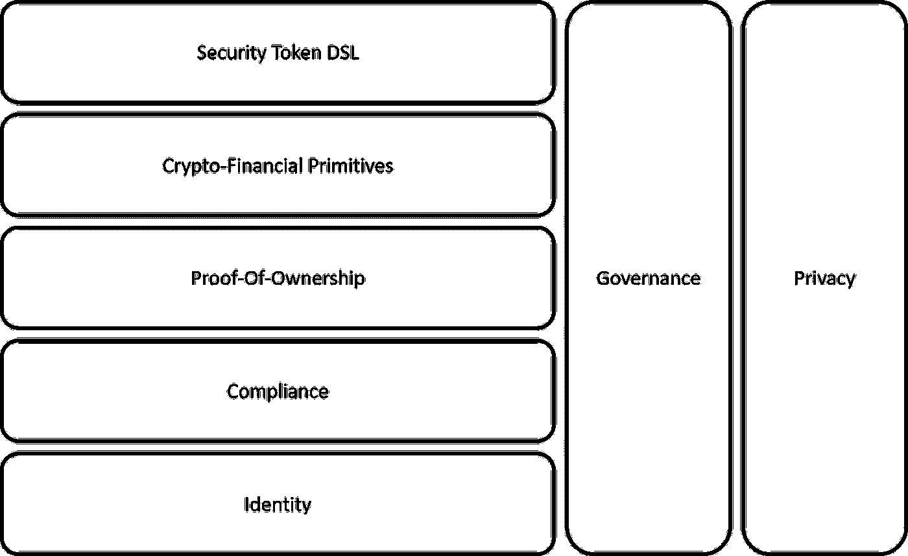

# 关于安全令牌网络的一些思考[下]

> 原文：<https://medium.com/hackernoon/some-thoughts-about-security-token-networks-part-ii-4b56eb198cbb>

这是一篇文章的第二部分，该文章探讨了关于安全令牌网络这一新兴领域的想法。[第一部分](https://hackernoon.com/some-thoughts-about-security-token-networks-part-i-d94518e7f32e)讨论了安全令牌网论文的一些经济和技术基础。今天，我将重点介绍此类解决方案的技术构件及其与安全令牌的相关性。

总结一下前一篇文章中[概述的一些想法，安全令牌网络很可能成为安全令牌近期最有趣的趋势之一。从概念上讲，安全令牌网络是被许可的区块链，提供本地构造来发行、分发和交易安全令牌。需要注意的一个重要方面是，安全令牌网络的最终表现形式应该是少数大型区块链，它们将零售投资者和机构聚集在一起，能够在网络的不同部分实现访问控制和隐私保护。最初，安全令牌网络的价值主张有三个基本要素:](https://hackernoon.com/some-thoughts-about-security-token-networks-part-i-d94518e7f32e)

1) **网络效应:**安全令牌网络可能是在加密证券中产生真正网络效应的唯一途径。

2) **链上资产:**安全令牌网络可能是确保创建链上第一安全令牌的最有效机制。

3) **真正的脱媒:**安全令牌网有机会为去除证券市场不必要的中间人奠定基础。

虽然安全令牌网络的价值主张可能看起来很清楚，但它的技术实现并不简单。在目前的市场状况下，建立一个安全令牌网络既是一项技术挑战，也是一项金融和监管挑战。从这个角度来看，让我们探讨一下安全令牌网络第一次迭代中应该出现的一些关键特性。

# 安全令牌网络的关键能力

安全令牌网络的目标是为管理加密证券的生命周期提供一个本地基础。从技术角度来看，这一愿景需要一系列构建模块来抽象安全令牌的本机功能以及相应的体验，以实现安全令牌的创建和发布后管理。设计安全令牌网络是在启用丰富的功能集和认识到短期内技术上可行之间的平衡行为。从可能与安全令牌网络相关的许多技术功能中，我选择了一小部分，我认为它们在这类平台的第一次迭代中是必不可少的。

## 所有权证明协议

如果存在安全令牌网络应该确保的单一能力，则是令牌转移和所有权转移之间的相关性。如今，安全令牌的转移需要与建立所有权转移的链外流程相关联。尽管许多人认为安全令牌转移是转移所有权的完全合法的机制，但技术基础仍然缺失。

在安全令牌网络中，所有权证明(PoO)协议将负责确保作为令牌转移一部分的资产所有权的合法转移。PoO 协议可以是安全令牌网络的共识机制的一部分，该机制要求多个节点对加密安全的基础资产的所有权转移进行投票。

## 合规协议

可以说，遵从性是安全令牌网络中最明显的组成部分。当前版本的安全令牌平台从根本上着眼于合规性模型，坦率地说，它们中的大多数看起来其中一些协议可以适用于更广泛的安全令牌网络。

需要注意的一件重要事情是，我们不应该期待一个单一的遵从协议，而是一组解决特定遵从需求的协议。在安全令牌网络中，发行者应该能够组合不同的协议来满足他们的合规性要求，而无需编写全新的智能合同。

## 安全令牌 DSL

安全令牌网络需要一种对安全令牌进行编程的方法。假设大多数安全令牌网络将建立在第 1 层区块链之上，它们将依赖底层智能合约语言来创建安全令牌。然而，一个新的加密证券运行时应该伴随着一种新的语言来模拟这些新的工具。

安全令牌的领域特定语言(DSL)是一个声明性模型，它抽象了加密安全的功能。DSL 的结果应该翻译成底层智能合约语言的可执行代码。除了抽象安全令牌的创建，DSL 模型还可以作为网络中安全令牌的可查询、可搜索的定义。

## 隐私

访问控制和数据隐私应该是安全令牌网络的关键组成部分。在某种程度上，隐私可以被认为是采用公共区块链作为安全令牌运行时的主要障碍。虽然我们认为安全令牌网络应该对零售投资者公开，但它应该为网络的不同发行者或部分提供访问控制和隐私机制。

隐私协议应该是安全令牌网络的一等公民。在隐私协议中嵌入零知识证明等技术可以确保与安全令牌传输相关的数据的隐私性，而不必牺牲合规性要求。同时，安全令牌网络应该在网络的不同部分实施访问控制策略，以允许发行者和投资者之间的安全交互。

## 身份

没有身份表示，安全令牌网络无法运行。共识、合规或治理等功能在很大程度上依赖于一个通用的身份模型，该模型唯一地代表了安全令牌网络中的参与者。随着身份被确立为安全令牌网络中的一等公民，对计算上昂贵的共识机制的需求变得不太相关。

身份协议必须是安全令牌网络的基本构件。以可移植和可执行的格式表示发行者、投资者和网络中其他节点的身份，将是解决安全令牌的复杂用例的新形式的合规性和隐私协议的使能器。

## 治理协议和激励措施

任何网络都需要治理模型来确保其参与者的正确行为。加入或离开节点的简单过程需要一些治理结构来避免游戏化攻击。在安全令牌的上下文中，考虑到生态系统的受管制性质，治理甚至更加重要。

治理协议应该是安全令牌网络的另一个基本元素。治理协议的作用是执行投票决策，以规范网络的正确行为。根据去中心化的程度，治理协议可能需要某种形式的令牌化激励来奖励节点参与网络的治理动态。

## 加密金融原语

安全令牌最终是一种金融模型的可编程表示，如债务、股权、可转换债券或许多其他模型。如今，大多数安全令牌都需要在底层智能合约中手工实现该逻辑。随着空间的发展，许多动态将被抽象为可重用的协议。

为了简化加密证券的发行和生命周期管理，安全令牌网络应该提供一流的协议来抽象关键资产类别的行为。这些加密金融协议可以任意组合，以构建更复杂形式的加密证券，为可编程金融提供真正的基础。

好了，你知道了。这些是第一波安全令牌网络中我最喜欢的一些功能。似乎不可避免的是，这些形式的第二层分散式网络将成为安全令牌生态系统的重要元素。获得正确的技术基础将是决定这种新形式的加密证券运行时可行性的关键。