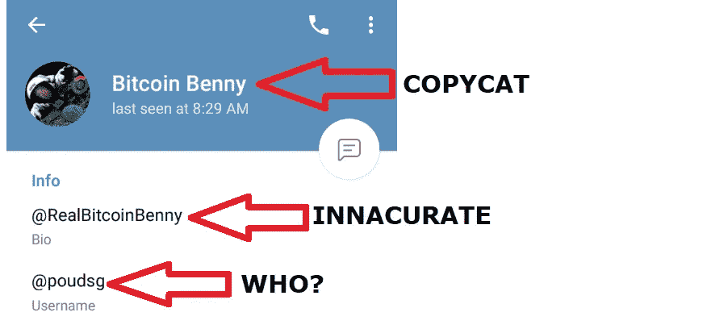
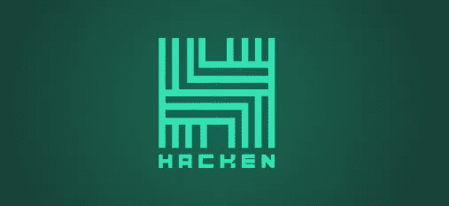

# 东南亚密不透风的区块链堡垒

> 原文：<https://medium.com/hackernoon/southeast-asias-impenetrable-blockchain-fortress-d92fcd9cd645>

## RedFOX 实验室如何击败网络入侵者

## 去区块链的任何地方，你都会发现有人试图窃取你的密码。

Photo courtesy of actual Telegram scammer

我在这里，静静地在[**RedFOX Labs Telegram**](https://t.me/redfoxlabs)频道做自己的事。

丁。一份通知。会是谁呢？

嗯，不是别人，正是那个人自己，假比特币本尼。嗯……那么，为什么 RedFOX 的首席执行官兼联合创始人会给我发私信呢？

没有特别的原因。只是来看看我这个小老头，看他能不能帮上忙。因为，你知道，项目首席执行官们有充足的时间与成千上万的成员进行随机聊天。

现在，加密新手确实会不时被骗，但任何足够明智的人都能看穿这种类型的骗局。

当您看到这些指标时，红旗飘扬，警钟长鸣:

*   **聊天管理员先给你发信息，然后再给你发信息**
*   **用户名和简历与真实管理员的不匹配**
*   **蹩脚的英语**
*   **询问关于您的加密资产或项目投资的试探性问题**
*   **天价回报保证——本例中为每周 11%**

是的，当然，“伙计”，这里的一切都是光明正大的！

不幸的是，人身攻击只是骗子从区块链盗取资金的众多手段之一。

加密空间的总体盗窃量达到了令人难以置信的数字。在退出骗局、交易所黑客和基础设施入侵之间，网络窃贼仅在 2019 年就带着**3.56 亿美元在 Q1 潜逃。**

**区块链产业平均每月流失 1 亿美元的密码——这意味着黑客今年将吸走 12 亿美元。那些是一些沉重的袋子！**

**虽然 RedFOX 不可能保护他们不断增长的社区中的每一个成员，但他们正在采取最大限度的预防措施，确保他们的区块链不受不良分子的影响。**

**现在，区块链行业最危险的攻击之一是 51%变种——坏人通过暂时控制大部分计算能力来霸占区块链网络。**

**如果你不熟悉 51%的攻击是如何发生的——以及 RedFOX 如何使用来自 [**Komodo 平台**](https://komodoplatform.com/) 的现成技术来防止它们——这里有一篇文章可以帮助你快速了解:**

** [## 避免区块链最邪恶的加密劫持

### Komodo 平台如何防止盗版者掠夺工作证明网络

hackernoon.com](https://hackernoon.com/avoiding-blockchains-most-nefarious-crypto-hijackings-503a96ac2533) 

但是今天的文章不一定是关于如何做；更多的是关于*为什么* RedFOX 实验室选择科莫多的延迟工作证明(dPoW)来保持他们的链处于锁定和私钥之下。

然而，在我们继续之前，我想坦白告诉你:

> ***免责声明*** *:这不是投资或理财建议。本文中的信息主要是推测性的观点，仅供娱乐。*
> 
> *在参与任何项目之前，无论是在 cryptoland 还是在 cryptoland 之外，都要进行自己的研究。作者持有 RedFOX Labs 的$RFOX & Komodo 平台的$KMD 加密货币。*** ****

**Photo courtesy of [Tushar Petare](https://www.pexels.com/@eretushar) via Pexels**

# **高速增长的高科技燃料**

**一些区块链项目在将产品推向市场之前搁置了数年。毕竟，这是一个运行大量复杂算法的复杂行业。**

**随着行业的发展，仅仅依靠白皮书已经不够了。那些足够敏捷，能够在竞争之前实施自己想法的公司是那些跑在最前面的公司。**

**敏捷是 RedFOX 竞争优势的一部分。随着团队确定要复制的业务，预烤技术意味着他们正在创造下一个东南亚独角兽的路上。**

**现在，如果你还不知道 RedFOX 在 SEA 这一高科技领域的计划，这里有一个概述:**

** [## 区块链的独角兽复制器

### RedFOX Labs 如何将成熟的商业模式引入新兴市场

hackernoon.com](https://hackernoon.com/blockchains-unicorn-replicator-b9ab02cf9373) 

我再怎么强调科莫多的技术对火狐的快速发展有多大的好处都不为过。

大量区块链初创公司仍在构建、测试和修补他们的技术。但是，RedFox Labs 拥有充分利用久经考验的技术的特权，这些技术已经准备就绪。

RedFOX 的 Komodo 供电的安全性的核心是 dPoW 协议。** ****

**Photo courtesy of [Richard Clark](https://unsplash.com/@clarky_523) via Unsplash**

# **进行抵抗**

**你认为一个骗子更喜欢偷一个有狗叫的房子还是一个没有狗的房子？我相信你有明确的答案。**

**同样的概念也适用于区块链安全。当谈到防止你的网络屈服于攻击时，没有比比特币更响亮的声音了。**

**光是成本就足以阻止任何黑客试图制服比特币。坏演员认识到网络是不可战胜的，并转移到更容易的目标。**

**通过古老的公证艺术，dPoW 链每 10 分钟就有一份网络拷贝直接植入比特币区块链。**

> **与试图依附 BTC 网络的易受攻击的闭源协议不同，RFOX & KMD 等 dPoW 项目使用 BTC 网络来公证其区块链的备份。**

**通过使用 Komodo 的 dPoW 发明，RedFOX 基本上将他们的区块链变成了一个被比特币护城河包围的城堡。**

**能够利用比特币的保护是 KMD 最初创建 dPoW 的原因。通过利用 dPoW，RedFOX 的网络和比特币一样安全。这是你在加密空间里能得到的最安全的了。**

**但是，RedFOX Labs 并没有走捷径，固步自封，而是通过签署新的合作伙伴关系来提升他们的安全努力。**

****

**The RedFOX + Hacken partnership keeps network invaders in check**

# **防灼伤措施**

**用区块链技术做生意可能是一件危险的事情。而 RedFOX 的安全第一的方法带领团队与网络安全公司 [**Hacken**](https://hacken.io/) 合作。**

**Hacken 是一群白帽黑客——有道德的那种——与公司合作发现并修复漏洞。提前修补网络漏洞可以最大限度地降低攻击威胁。**

> **Cryptoland 是做生意最危险的市场之一。**

**RedFOX Labs 是一家风险投资公司。建立以区块链为动力的企业需要将网络安全放在首位。**

**随着 RedFOX 构建企业级解决方案，Hacken 将审计每个初创公司的代码，并深入进行安全评估。**

**因此，由 RedFOX 支持的初创公司不仅可以享受比特币本身的安全性，还可以直接接触到全球网络安全咨询公司的领导者。**

**为了确保这种关系是平等的，RedFOX 向 Hacken 提供产品和服务的开源访问。**

**像任何值得尊敬的合作伙伴一样，RedFOX 和 Hacken 拥有相同的价值观。加密联盟是至关重要的，因为它们结合并增加了为共同目标而工作的个体数量。**

**对于 Hacken 和 RedFOX 实验室来说，任务是为所有有兴趣建立一个安全、无入侵者的区块链。**

# **包扎**

**让我们面对现实吧——区块链环境的不成熟使其成为骗局的温床。困惑的新来者很容易成为猎物。**

**虽然某些活动超出了大多数项目的控制范围，但聪明的项目会认真对待网络安全。毕竟，如果你允许小偷从你这里偷走它们，利润有什么用？**

**当企业在区块链感到安全时，他们可以随心所欲地飞翔。反过来，增强的安全性导致分布式分类账被更广泛地接受和使用。**

**区块链技术开启了一个无限可能的领域，现在与 Hacken 合作的 RedFOX Labs 正在建立在区块链安全黄金标准下运营的业务。**

****

**Photo courtesy of [Artem Bali](https://www.pexels.com/@belart84) via Pexels**

## **无耻的插头**

**如果你喜欢这本书，并且想帮助你把你的加密信息传播给大众，我很想听听你的项目。**

**即使你只想聊聊加密或你最喜欢的区块链创新，你也可以在这里找到我:Gmail 的 blockchainauthor**

**并且，你可以随时联系 [**加密推特**](https://twitter.com/CryptoBlastoff)**