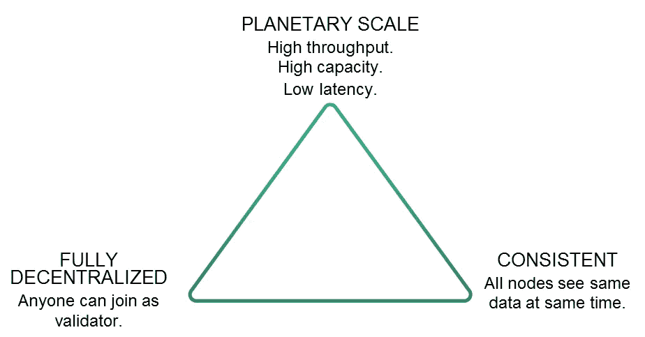

# 发现区块链创新——与 Insolar 一起建设区块链

> 原文：<https://medium.com/hackernoon/spotting-blockchain-innovation-building-blockchains-w-insolar-5ad0d78067ef>

最近，在寻找我的区块链创新系列时，我遇到了 Maxim Safronov，他是 Insolar 的项目经理。在简单介绍了这个项目之后，我对写下他们正在做的事情很感兴趣。

该项目的主要目标是成为市场上最面向业务的 DLT 解决方案。然而，在引擎盖下，我们可以发现很多隐藏的创新。

我们将讨论的主要内容是节点角色分配和分片的结合，这使得 Insolar 区块链的性能达到每秒 19，500 次以上(Insolar explorer 上的[证明](https://explorer.insolar.io/))。除此之外，在网络中使用这些不同的角色使 Insolar 能够在链上处理业务文档，这对企业来说是一个巨大的好处，并给予他们在链上的合法权利。

然而，扩大区块链通常会带来一些后果。分散的系统在向上扩展时变得更加集中，最著名的例子是困扰许多项目的矿工集中。

根据 [DCS 定理](https://arxiv.org/ftp/arxiv/papers/1801/1801.04335.pdf)，在****【共识】******【规模】*** 中只能同时实现两个属性。DCS 定理实际上是一个三角形，它定义了三个属性之间的关系。尽管三角形表明只有两种性质是可能的，但通过适当地构造问题，该定理可以被“欺骗”。让我们来了解一下！*

*   *伪随机节点选择。由称为*脉冲*的信号触发。脉冲也带有随机性/熵的来源，由*脉冲星*节点每 5-15 秒产生一次。*
*   *嵌入式合同([第 3 节](/insolar/what-makes-insolar-different-2636708f2426))*
*   *GDPR 符合许可或私人网络(搜索一些信息)*

**

*DCS Triangle by [BigchainDB](https://blog.bigchaindb.com/the-dcs-triangle-5ce0e9e0f1dc)*

# *块存储和节点角色分配*

*第一个有趣的方面是 Insolar 组织其网络的方式。该网络由 ***储存*** 和 ***加工*** 节点组成，而储存节点又可分为*【重】**【轻】*物料。*

**重*节点负责存储由分类帐组成的块，但是没有一个节点存储完整的分类帐。这一决定不仅考虑到安全性，还考虑到存储容量。*

**Light* material 节点只保存分类帐的最近历史，用于内部网络流量。*

**处理*节点负责计算任务和验证事务。通常情况下，像以太坊这样的其他链，每个节点都知道网络中的智能合同，它们都可以处理它的交易。*

*Insolar 决定选择异步处理来进一步提高性能。每个智能契约被委托给单个节点，而其他随机选择的节点负责验证来自处理节点的结果(*【验证器】*)。*

*通过像 Insolar 那样划分职责，他们能够在链上处理业务合同，这是企业大规模采用的重要标准。*

*此外，这种分离可以提高数据安全性，因为只有某些节点在有限的时间内保存一组数据。因此，事务由一个随机节点执行，并由其他几个随机节点验证。*

*这里的创新之处在于，节点执行的每个动作都被记录下来(验证、它们接收了哪些数据，等等。)，这意味着谁接收了您的潜在敏感数据完全透明。(更多信息请参见'[数据安全](/insolar/data-security-on-the-insolar-platform-70347c53807f)')。*

# *嵌入式合同*

*企业业务逻辑需要能够创建复杂的智能合同，其中包含大量的分类帐。在以太坊契约模型中，所有数据都存储在契约中。因此，流行的合同分类帐持续增长，这使得用户使用它们的成本很高(来源:[section 3 Smart Contracts Insolar](/insolar/what-makes-insolar-different-2636708f2426))。*

*或者，Insolar 决定为他们的智能合同使用键值存储，因为这是最简单和轻量级的数据存储形式。每当需要存储时，契约调用所需的数据，而不是像以太坊智能契约那样调用完整的状态，以太坊智能契约将所有数据存储在契约中。*

*使用 Insolar 的方法，用户或合同创建者都不需要为使用大型智能合同支付过多的费用。同样，智能合约使用的可预测成本对企业来说是一大优势。*

*契约本身可以使用 Golang (Java 和其他语言将很快加入)开发，因为这种语言在处理逻辑时非常高效。*

# *切碎的 BFT*

*最后，让我们看看 Insolar 嵌入的替代拜占庭容错(BFT)实现。BFT 目前的问题是，每当网络中的节点数量增加时，达成 BFT 共识就变得更加复杂，主要是因为达成共识需要更长的时间，并且存在更多非活动/空闲节点的风险。*

*因此，Insolar 节点不是强制所有节点同意所有事务，而是首先同意(使用 BFT)谁是活动的(有效节点)以及什么是新的熵(随机性)，然后，通过使用一组活动节点和熵，使用域共识协议将节点分配到更小的节点组内处理事务。*

*由于这种方法仍然限制网络只能增长到大约 1000 个节点以保持其效率，Insolar 提出了一种有趣的方法，即创建多个域，每个域最多 1000 个节点。关于“*球状体”*和“*球状体”*概念的更多信息可以在他们的[关于可伸缩性的博客文章](/insolar/insolar-consensus-algorithms-achieving-10k-tx-s-61a333f8c38a)中找到。*

**

# *其他创新方法*

*这只是 Insolar 与众不同之处的摘录。其他有趣的读物包括:*

*   *[Pulsar 通过熵(随机性)选择节点](/insolar/insolar-consensus-algorithms-achieving-10k-tx-s-61a333f8c38a)*
*   *[域共识协议](/insolar/insolar-domains-simply-explained-7183dc56d8ca)*
*   *[数据安全(GDPR)](/insolar/data-security-on-the-insolar-platform-70347c53807f)*
*   *[Insolar 中的结垢和碎片](/insolar/scaling-and-sharding-at-insolar-f77c7771c7c1)*