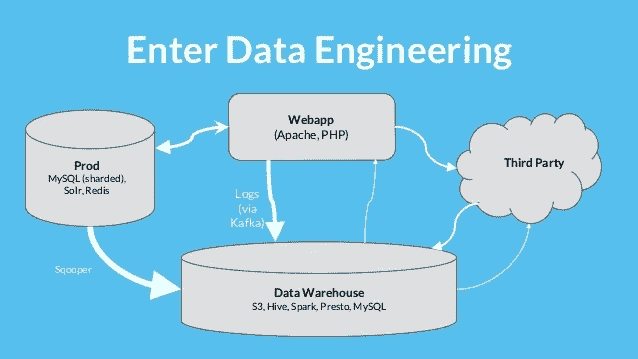

# SQL 最佳实践—设计 ETL 视频

> 原文：<https://medium.com/hackernoon/sql-best-practices-designing-an-etl-video-1933665f9861>

数据工程有许多方面。数据工程师承担的最常见的项目之一是开发从操作数据库到数据仓库的 ETL 管道。我们的团队想要涵盖 ETL 的总体设计。

典型的主要成分、阶段、考虑因素等是什么？

我们首先编写了[创建 ETL 第 1 部分](https://hackernoon.com/best-practices-creating-an-etl-part-1-bdb563381025)(更多内容将在后面介绍)，现在我们已经制作了一个视频，演示了整个过程。我们想讨论为什么每个阶段都很重要，当数据从原始状态进入阶段时会发生什么，为什么我们需要原始数据库等等。

数据工程是一门复杂的学科，它将自动化、编程、系统设计、数据库和分析结合在一起，以确保分析师、数据科学家和最终用户能够访问干净的数据。

这一切都从基本的 ETL 设计开始。

我们正在为即将举办的关于使用 Python 和 SQL 进行 ETL 开发的网络研讨会做准备。网上研讨会本身更具技术性，会更深入地探讨视频中描述的每个部分。然而，我们想看看万一我们需要白板时，它的使用效果如何。

如果您想注册免费的网络研讨会，我们将在 2 月 23 日上午 10 点(太平洋时间)举办。欢迎在下面报名！如果您有其他问题，请联系我们。

