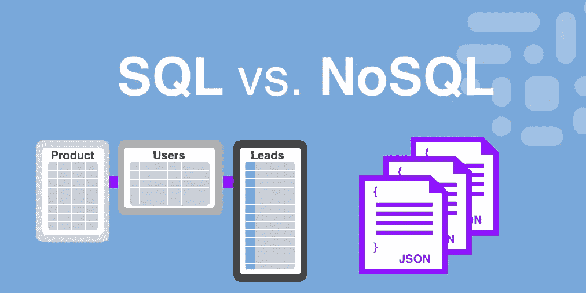
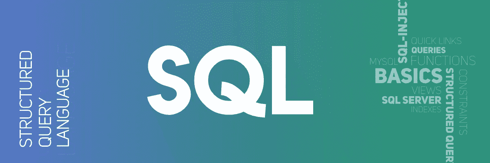
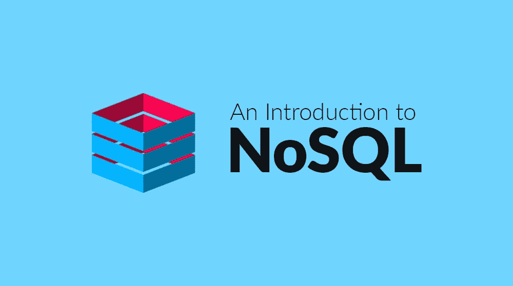
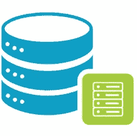
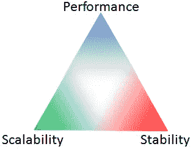
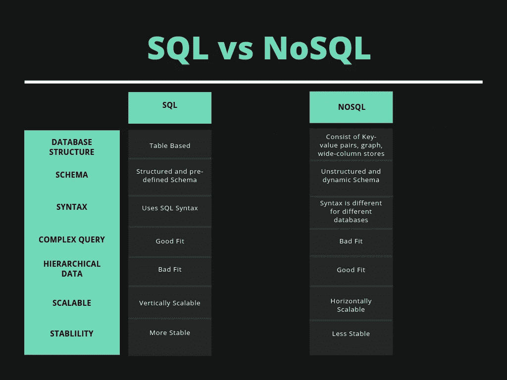

# SQL 与 NoSQL——哪个对你更好？

> 原文：<https://medium.com/hackernoon/sql-vs-nosql-what-is-better-for-you-cc9b73ab1215>



无论你是否已经使用过数据库，即将使用数据库，或者根本没有使用过数据库，这个话题都是你应该知道的。

您需要始终首先考虑您的数据是什么样子，您将如何查询它，以及您的可伸缩性要求是什么。无论是为个人项目还是为组织选择完美的数据库，选择关系型(SQL)还是非关系型(NoSQL)数据结构都是一个重要的决定。

本文不是讨论哪种类型更好，而是讨论哪种类型适合您当前的项目需求。每一种都有明显的优点和缺点，必须牢记在心。

***如果你只是想看本文提到的要点，直接跳到最后。***

***现在说完了，让我们开始***



# 什么是 SQL？

> SQL 或结构化查询语言读作" *S-Q-L"* 或有时读作" *see-quel"* 是访问和操作关系数据库的标准语言。

它使用户能够创建查询来插入、删除、更新、搜索、修改数据库，以及对数据库做更多的事情。它是一种非常强大的语言，被许多开发人员所偏爱，因为它也可以处理非常复杂的查询。

使用 SQL 的关系数据库的常见和流行的例子有

*   关系型数据库
*   神谕
*   SQLite
*   Postgres
*   微软 SQL

SQL 语句的一个非常基本的语法模式是—

```
General--
SELECT * FROM <TABLENAME> WHERE <ATTRIBUTE> = <VALUE>Practical--
SELECT * FROM EMPLOYEE WHERE Salary > 90000
```



# 什么是 NoSQL？

> 顾名思义，NoSQL 是“**而不是**”SQL，换句话说，它是非关系数据库，是非结构化的。由于其非结构化的性质，它有时被称为 **UnQL**

它遵循一种可以采用各种数据模型的数据库设计。它主要由键值对、图、文档等组成。它尤其用于存储大型分布式数据集。

NoSQL 数据库的常见和流行的例子是—

*   Mongo 数据库
*   大表格
*   卡桑德拉
*   Hbase
*   雷迪斯

在这种类型的非结构化数据库中，信息可以以多种方式存储，但一种广泛采用的方法是以 ***JSON*** 格式存储信息。

```
{
  role: "employee", 
  salary: "90000"
}
```

# 比较 SQL 和 NoSQL

既然我们对 SQL 和 NoSQL 数据库的含义有了基本的了解，那么比较这两种类型并找出哪一种更适合您的需要就容易多了。现在让我们来比较一下。

# 数据库结构

一个 SQL 数据库遵循一个类似于**表的结构**，它可以有一个**无限数量的行**，并且数据库中存在的每一个数据都是用预定义的模式、**、**正确构建的**，它基本上用于操作**关系数据库管理系统**。**



NoSQL 数据库是一个**分布式数据库**，其中的数据是非常**非结构化的，具有动态模式**。与 SQL 不同，它不能有无限的行，但它遵循 ***标准模式定义*** ，并且可以以**键-值对、图形数据库、文档或宽列存储**的形式存储具有大型分布式数据的各种数据模型。

# 句法

SQL 是一种非常强大的语言，在访问和操作不仅简单而且非常复杂的查询时非常方便。它使用 SQL 语法来定义和操作数据。这种语法的一个例子是—

```
SELECT * FROM STUDENT WHERE NAME = "Sayan" AND MARKS > 80;
```

而在 NoSQL，查询主要集中在大文档的 ***集合*** 上，这不是操纵复杂查询的好选择。由于有不同类型的 NoSQL 数据库可用，因此它 ***不遵循单一的语法基础*** ，语法因数据库而异。存储数据最常用的格式是 **JSON。**

```
{
   name:"Sayan",
   marks:"85"
}
```

# 等级制度

SQL 数据库以包含 n 行的表格的形式存储，因此**不能遵循**分层方法，而是所有数据都单独出现在每一行的特定属性下，具有其自身的重要性。


而 NoSQL**非常适合**分层数据存储，因为它以 JSON 格式的**键值对**的形式存储数据，因此更适合大型分布式数据。

# 可量测性


一个 SQL 数据库总是**垂直可伸缩的**。这句话的意思是，如果服务器上有更多的负载，那么它**可以通过增加 CPU、SSD、RAM 等**来处理。这只适用于一个**服务器。因此，通过这一点，你可能已经意识到这需要单个服务器上的 ***更多的应变*** 。**

另一方面，NoSQL 数据库是可水平伸缩的。这意味着，如果服务器上有额外的负载，那么它将简单地**增加几个服务器**来处理大流量。它简单而 ***高效*** 并且防止服务器无响应。

# 稳定性

SQL 数据库更加稳定，在处理大量事务时总是首选。原因是它通过**数据完整性和原子性**保持数据非常**安全**。它遵循**酸**属性，代表 ***原子性、一致性、隔离性、持久性。***

[*点击了解更多酸*](https://www.tutorialspoint.com/dbms/dbms_transaction.htm)

当服务器上有高负载时，甚至在执行复杂的事务时，NoSQL 数据库都不如 SQL 数据库稳定。它遵循 **Brewers CAP 定理**，代表**一致性、可用性和分区容差。**

[*点击了解更多酿酒人上限定理*](https://howtodoinjava.com/hadoop/brewers-cap-theorem-in-simple-words/)



# 对你的企业来说，什么是正确的选择？

这个决定完全取决于业务类型和业务的构思。如果您想使用预定义的结构并设置模式，那么 SQL 数据库是您的正确选择。如果您正在构建类似于库存监控系统或会计系统的东西，那么 SQL 数据库是一个更好的选择。

但是，如果你想建立一个动态模式的应用程序，或者如果你的业务增长非常迅速，但没有模式定义，那么 NoSQL 数据库是你需要的。如果你不能确定你的应用程序需要的模式类型，或者你想让它随时变化，比如移动应用程序、分析或内容管理，那么 NoSQL 是一个更好的选择。

# 简而言之要点



感谢您阅读本文。我真的很感激所有的努力。如果你有任何疑问，请在下面评论，我会尽力解答。

和平结束。✌️