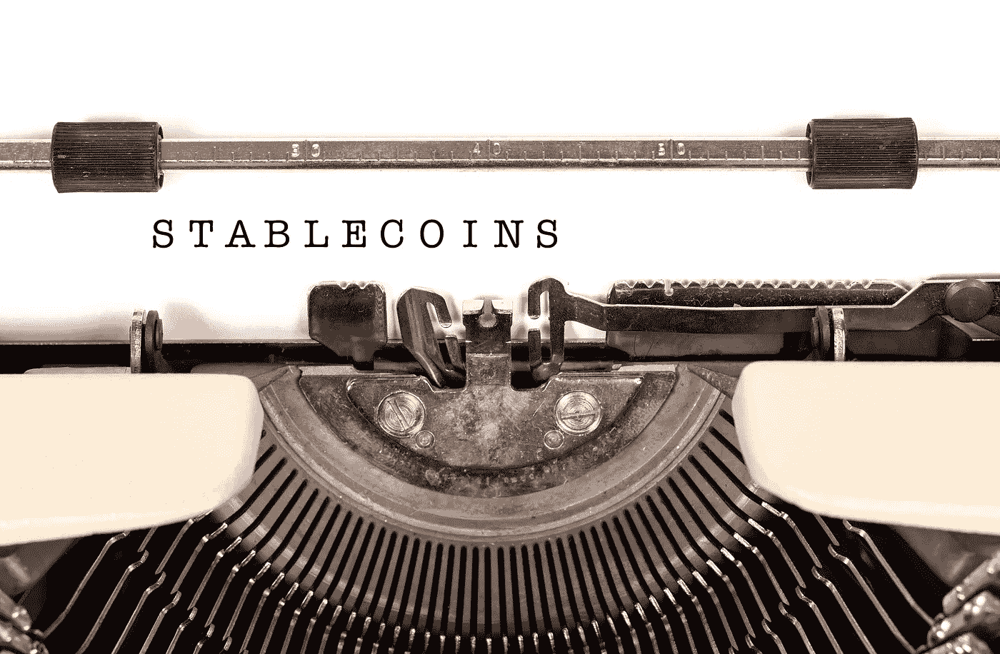
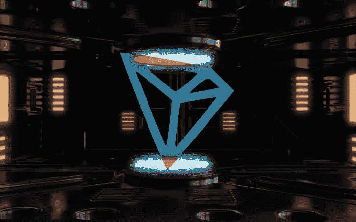
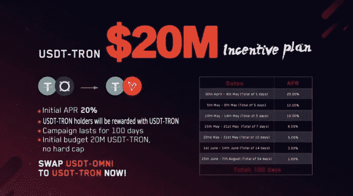

# 稳定的硬币和加密货币的大规模采用

> 原文：<https://medium.com/hackernoon/stablecoin-cryptocurrency-tron-tether-ff5afe55dcda>

## TRON-Tether 合作伙伴关系将为加密货币领域增添又一枚稳定的硬币。稳定硬币扩散的最新例子将增加数字货币的用例，并有助于增加主流采用。

## TRON-Tether 伙伴关系

2019 年 3 月，Tron ( [TRX](https://cointelegraph.com/tags/tron) )和 Tether (USDT) [宣布](https://cointelegraph.com/news/tron-and-tether-partner-to-issue-usdt-on-the-tron-network-by-q2-2019)合作发行由 Tron 区块链支持的 stablecoin。根据[的新闻稿](/tron-foundation/usdt-is-now-on-tron-18936385a287)，新硬币将允许用户在 TRX 生态系统内交易美元。

2019 年 4 月 16 日，新的 TRX-USDT 在 TRON 的区块链上推出。稳定币的加入给创带来了很多好处。它拓宽了 TRON 生态系统以及零售和分散金融领域的现有用例。例如，它使基于 TRON 协议的 dApps 有可能与 Paypal 和 Stripe 竞争商家和购物者之间的跨境汇款和支付。

然而，最重要的是，新的稳定货币将增加数字资产的流动性，并鼓励机构和企业用户考虑使用加密货币。这就是为什么另一种稳定币产品的出现对整个加密货币行业有利。

## 波动性是采用的障碍

加密货币市场是出了名的不稳定。2019 年 4 月 1 日，比特币的价格在一天内飙升了 20%。如此快速的价值变化是加密货币主流采用的障碍。为什么？对于希望价格稳定且可预测的零售商和企业来说，不稳定的货币是不可取的。同样，消费者也不希望使用加密货币进行购物后，它的价值立即增加，让他们觉得自己花了太多钱。

加密货币有明显的使用案例，但由于其价值波动如此剧烈，这些案例受到了阻碍。主要例子是全球汇款和跨境支付市场。汇款是在国外工作的人寄回家给家人的资金。根据[世界银行](http://documents.worldbank.org/curated/en/805161524552566695/pdf/125632-WP-PUBLIC-MigrationandDevelopmentBrief.pdf)的数据，汇款约占跨境价值流的 7000 亿美元，预计这一市场将从 2019 年到 2024 年增长 [25%](https://www.marketwatch.com/press-release/at-251-cagr-digital-remittance-market-size-is-expected-to-exhibit-us-5890-million-by-2024-2019-02-19) 。

## 输入稳定的点数

简而言之，稳定的货币是一种应对价格波动的机制。在加密货币行业发展的现阶段，这种对冲机制是必要的，以使价格更具可预测性。

出于这个原因，稳定货币将在从法定货币向基于加密货币的经济转型中发挥不可或缺的作用。[专家估计](https://ethereumworldnews.com/stablecoin-cryptocurrency-adoption-2019/)在接下来的两年里，稳定的加密货币将成为最“令牌化的流动资产”,并为加密货币领域的增长做出巨大贡献。

## 不同种类的稳定玉米

有两种主要类型的稳定线圈。有用法币抵押的(如系绳)，也有用数字资产抵押的(如创客的戴)。前者最常见，但后者也越来越受欢迎。

泰丝(USDT)是第一个稳定的硬币。它是法定抵押，并与美元挂钩。在 2017-18 年的 altcoin [上涨](https://elementus.io/token-sales-history)期间，Tether 变得流行起来，并且[仍然主导着](https://cryptobriefing.com/tether-trading-volume-usdt/)稳定的 coin 领域。2018 年 12 月，它占所有 stablecoin 交易量的 75%，是市值第七大加密货币。

Tether 的一个关键特性是它基于一个元协议工作，该元协议允许其令牌在不同的区块链上运行。例如，有一个基于比特币的系绳版本(USDT-Omni)和一个基于以太坊的版本(USDT-ERC-20)。

## 一个新的稳定中心来统治他们？

创区块链给稳定的硬币部门带来的好处是巨大的。与 USDT-奥姆尼相比，基于 TRC20 的 USDT 具有[优势](https://twitter.com/justinsuntron/status/1118856409339142144)，例如零交易费用和即时交易。没错，当比特币价格飙升时，网络很难满足用户对 USDT-OMNI 交易的需求。每当 BTC 价格大幅上涨或下跌时，该网络都不会以最高效率运行。正如 TRON 首席执行官 Justin Sun 所说，*“这些问题将在我们推出 USDT Tron 后得到解决，我们将把 USDT-Omni 的大部分迁移到 USDT-Tron。”*因此，Tron 的最终目标是将 USDT 从基于比特币的协议转移到 TRON 网络。

与 USDT-OMNI 相比，创稳定币将会有更多的用途。正如孙[解释的](https://thecryptochick.io/011):

> “[TRX-美元]是基于智能合同，所以你可以在 USDT 上做很多部署工作，这是奥姆尼区块链不能提供的。”—创基金会首席执行官 Justin Sun

以太坊网络呢？还有一种基于以太坊的 USDT 币，与 dApp 开发兼容。 [Justin Sun 在最近的一次采访中也谈到了这一点](https://thecryptochick.io/011),他说 TRON 和以太坊之间的竞争最终是一件好事:

> 我们都知道 Tron 和以太坊在竞争……但我认为这肯定会产生更好的产品,(而且)以太坊和 Tron 之间的竞争有利于整个行业……我认为未来我们甚至会与很多以太坊开发者合作。” *—* 创基金会首席执行官孙正义

## 2000 万美元的 USDT 激励计划

作为这场友好竞争的一部分，TRON 基金会宣布了一项针对 TRX-USDT 持有者的 2000 万美元[激励计划](/@Tronfoundation/tron-incentive-plan-rewards-earlier-usdt-tron-adopters-847729e72ee5)，其中包括持有稳定硬币的 20%初始年化利率【APR 】,这明显高于 USDT-Omni。TRON 还宣布了一项为期 100 天的促销活动，用户可以用 USDT-TRON 替换 T14，并获得更多的 USDT-TRX 奖励

除了 TRON 驱动的分散式交易所，三大加密交易所——Huobi Global、OKEx 和 Gate-io——已经在[官方](https://huobiglobal.zendesk.com/hc/en-us/articles/360000225582) [公告](https://support.okex.com/hc/en-us/articles/360025599151)中宣布支持基于 [Tron](https://cointelegraph.com/tags/tron) 的[系绳](https://cointelegraph.com/tags/tether)版本，其中 Huobi Global 和 OKEx 都提到了用户对更稳定的硬币交易的需求。

## 结论

很明显，在加密货币发展的现阶段，需要稳定的硬币。当前市场的价格波动限制了流动性，是数字货币主流化和新用例开发的重大障碍。这就是为什么新的 TRX-USDT 稳定硬币将有助于推动该领域的增长。

*关注我的* [*中*](/@minadown) *和* [*推特*](https://twitter.com/minad21) *频道如果你想了解更多关于区块链和加密货币项目的信息。

如果您对本文有任何疑问，请在下面的栏目中发表评论。谢谢大家！*