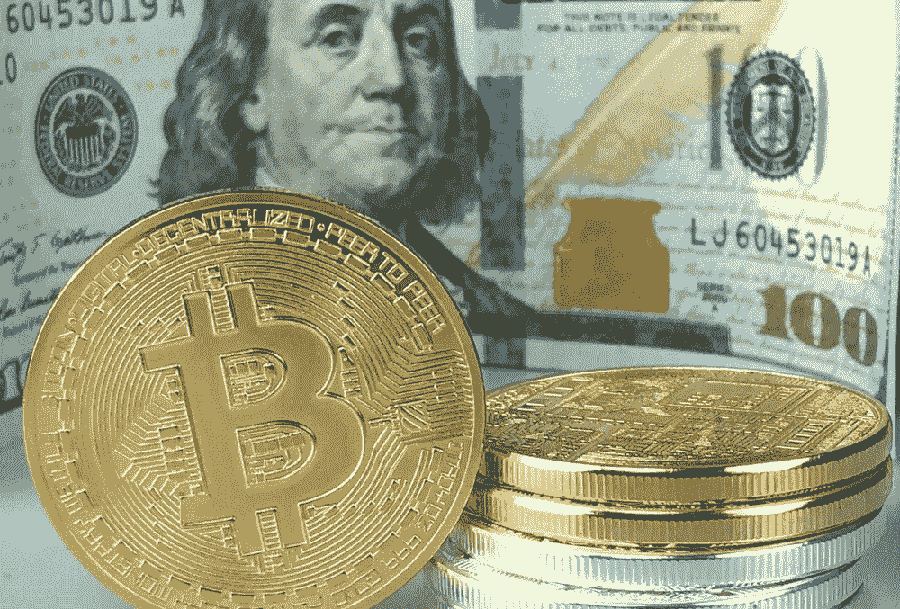
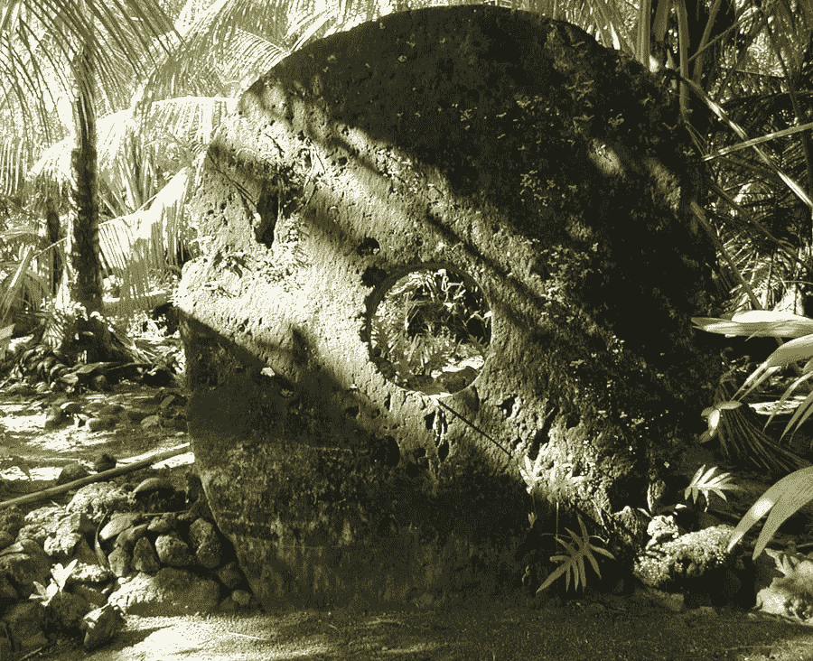
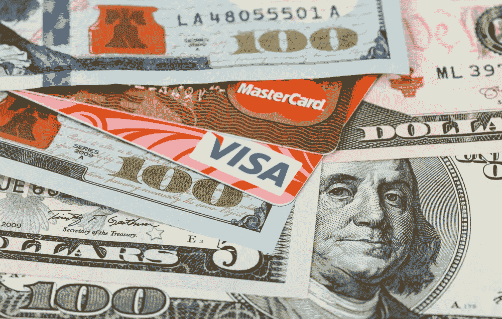
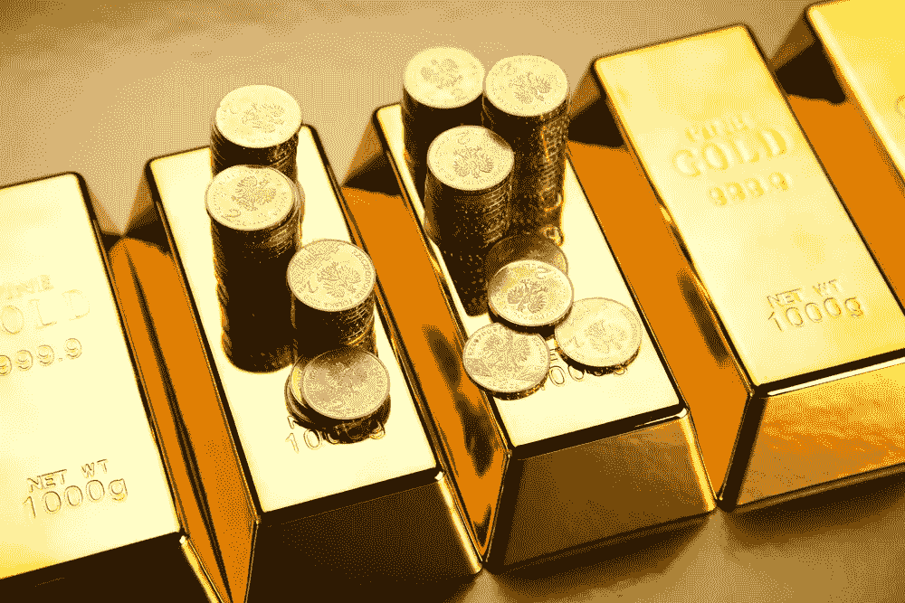

# 稳定的硬币正在使古老的货币现代化

> 原文：<https://medium.com/hackernoon/stablecoins-are-modernizing-age-old-money-6473ba5b1bd0>

**Stablecoins are typically regulated and are pegged 1:1 to U.S. dollar (or other major fiat). Fiat reserves are audited by third party. Stablecoins provide relief from cryptos’ volatile prices.** Photo credit: Shutterstock

T 他越是事情变化，*就越是保持不变*。创新可能会把新技术带到前沿，但创造性的解决方案仍然可能是基于古老实践的**。**

**加密货币通过私钥指定资金的所有权:在可编程资金的设计中至关重要的软件代码。但是授予财务控制权的书面密码类似于密克罗尼西亚石币。几个世纪以来，西太平洋雅浦岛的居民使用圆盘状的石头来记录交易和转移(各种资产的)所有权，而不用移动石头圆盘。**

**你可以说，Rai stones 是分布式分类账的原始形式:只要村民知道交易，资产转移就有效。这是区块链矿工熟悉的概念。**

***(故事下文继续。)***

****

****The Yapese used rai stones for recording transactions. The disc-shaped stones may be primitive form of distributed ledger. As long as villagers were aware of transaction, the asset-transfer was considered valid.** Photo credit: Wikipedia**

****什么是 Stablecoins？****

**“稳定币是区块链发行的代币，与美元或其他法定货币 1:1 挂钩。你可以说这些是*数字化的美元*,[稳定公司的首席执行官 Kory Hoang](https://www.linkedin.com/in/koryhoang/) 告诉 Hacker Noon。稳定地是西雅图的 stablecoin 风险投资公司。**

**“在我们的案例中，StableUSD 用托管账户中的美元支持每个 USDS 代币，这些账户由受监管的受托人管理。Hoang 说:[对 stablecoins]的好处是，消费者、商家和投资者可以保护自己不受 cryptos 的长期波动的影响，同时能够进行无摩擦的跨境支付。**

**这取决于你住在哪里。对于技术领先的美国人和欧洲人来说，这完全是为了方便和降低风险。**

**但是在通货膨胀的经济体中，如委内瑞拉、土耳其和阿根廷，钉住美元的汇率制度可以将人们从金融深渊中解救出来。例如，委内瑞拉正在经历美元化，这意味着当地人不再使用几乎毫无价值的玻利瓦尔——不管马杜罗政权怎么说。相反，委内瑞拉人现在使用美元(因此有了“美元化”这个术语)和密码(如比特币、Dash 和 stablecoins)进行购物，并保持购买力。**

**Hoang 说:“我们通过使人们使用和转换 stablecoins 变得尽可能容易和便宜来增加采用率。“这种破坏正在为转移和结算资金创造一个高效的全球基础设施。”**

***(故事下文继续。)***

****

****Global banks such as JPMorgan, HSBC, Bank of America, Citigroup, Barclays, Capital One, and others are experimenting with blockchain and tokenization to save costs, increase settlement speed, and improve customer experience.** Photo credit: Shutterstock**

****监管严格的行业****

**银行和信用卡公司每天处理价值 14 万亿美元的交易，这给消费者、商家和投资者带来了巨大的累积费用。对于银行来说，通过数不清的司法管辖区转移、审计和结算如此大量的资金成本也很高。**

**今年 2 月，总部位于伦敦的银行业巨头汇丰银行报告称，通过使用区块链，其外汇交易节省了 25%。该银行每天处理 3，500 到 5，000 笔交易，价值 3，500 亿美元。**

**“便宜和无摩擦是关键优势，但围绕稳定硬币的创新不仅仅是象征性的美元或欧元，”稳定首席执行官 Kory Hoang 说。“区块链风险投资也在将商品货币令牌化。这些包括贵金属、钻石、化石燃料和其他价格波动性(比加密货币)更小的易货资产。在我们的例子中，我们正在开发一个包含一篮子不同稳定硬币的亚稳定硬币。这将允许人们**减少风险敞口**并**分散风险**。**

***(故事下文继续。)***

****

****Physical cash, gold, fiat coins, and other commodity-monies are expensive to transport, secure, store, monitor, and trade. Thus, blockchain-powered tokenization is promising disruption which aims to digitize real-world assets. It could also bring new era of barter economies worldwide.** Photo credit: Shutterstock**

**实物货币的低效率**

**据估计，全球 3-4%的法定货币是实物形式(现金和硬币),其余的是电子形式。实物现金(就像实物黄金一样)运输、储存和保护起来都很昂贵——美国公司每年要花费 60 亿美元来通过自动取款机、装甲卡车、安全人员、24/7 摄像机、点钞机和其他安全密集型基础设施进行操作。**

**经济对可靠交易媒介的需求就像古罗马的银币一样永恒。皇帝们通过去除银币的内含物来降低银币的价值，最终导致硬币变得一文不值。因此，罗马公民和商人转向可靠的货币形式，如(价格稳定的)黄金、白银和其他商品来结算交易。**

**人类使用商品货币已经有几千年了。我们的祖先用羊奶换鱼；水果用玉米；用牛换银子。可交易的商品正在获得现代化的特征——数字化——但是基础资产及其**价格稳定的特征**满足了市场对*可靠的交易和价值储存媒介的需求。***

**就像他们说的，“事情改变得越多……”**