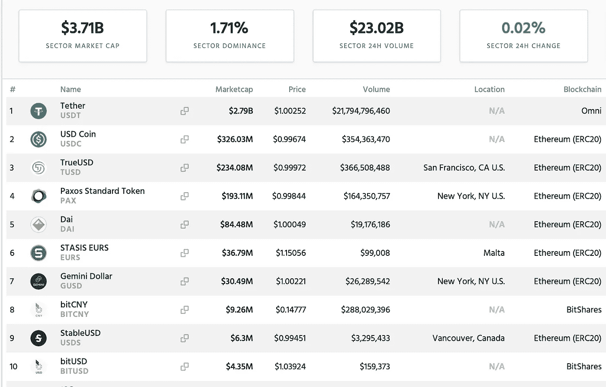

# 稳定密码不是密码的未来，而是现在。

> 原文：<https://medium.com/hackernoon/stablecoins-are-not-the-future-of-crypto-they-are-the-present-6fd8994de8fd>

Photo by [Stanislaw Zarychta](https://unsplash.com/@stahooo?utm_source=medium&utm_medium=referral) on [Unsplash](https://unsplash.com?utm_source=medium&utm_medium=referral)

在 2018 年寒冷的加密冬天，加密货币行业的一个部门仍在蓬勃发展。Stablecoins。在这篇文章中，我们将尝试对 Stablecoins 有一个全面的了解，并理解它们对加密空间的重要性，然后讨论 Stablecoins 正在经历的问题和一些创新的解决方案。

# 什么是稳定币？

稳定币是一种非易失性加密货币，通常与美元或欧元等货币挂钩。加密货币因其波动性而臭名昭著，受市场供求周期的影响。为了缓解这一问题，稳定债券被设计为由基础资产支持，以最大限度地降低其波动性。

大多数稳定债券都有货币抵押品支持，由可信的第三方实体(通常是银行)持有。在这种情况下，要发行一个单位的稳定硬币，必须将 1 美元或€1 存入相应的银行账户。稳定存款和抵押存款之间的这种一一对应关系确保了 peg 的稳定性。

> 这些货币支持的稳定货币中最大的是美元债券，也称为 USDT。它目前占有全球稳定币市场份额的 75%,然而它饱受透明度和监管问题的困扰。

另一种稳定货币由加密货币抵押品支持。其中最著名的是由马克尔道基金会颁发的[戴](https://makerdao.com/en/dai)。这是一种分散的稳定货币，其盯住美元的汇率由以太坊区块链和以太坊抵押品的一系列智能合约维持。就其复杂性而言，这是一个令人着迷的项目，我们将讨论它的成就和困难。

> 截至今天，Stablecoins 的市值为 37.1 亿美元，占加密货币总市值的 1.71%。

Market cap data courtesy of CryptoSlate.com

# 为什么我们需要稳定的硬币？

> “释放区块链巨大潜力的真正钥匙将随着 Stablecoins 的广泛采用而到来。”— Rune Christensen，MakerDAO 的创始人

Stablecoins 的创建首先是为了解决加密货币的一个主要问题:**波动**。

波动性是比特币和其他加密技术在商业中应用的巨大障碍。商家不愿意接受加密，因为他们知道它的价值会在一天之内下降 20%。Stablecoins 绝对解决。只需将您的比特币兑换成稳定的硬币，然后用它支付给对所收费用的价值有信心的商家。

碰巧的是，加密货币还没有在电子商务中得到广泛采用，但 stablecoins 已经找到了另一个“杀手级应用”:加密货币交易所。

交易所总是需要两样东西:

1.  法币入口，即一种将法币兑换成加密货币的便捷方式。
2.  这是交易者保护自己免受加密波动影响的一种方式，而无需退出菲亚特。

Stablecoins 已被证明是满足这些要求的完美答案。如今，你可以将你持有的加密货币出售给 USDT 或其他特定交易所使用的稳定货币，如果你希望加密货币下跌，并以这种方式保护你的存款，而不用将你的钱转移到菲亚特。

稳定的硬币也是各种主要交易所的法定货币。当大型机构客户进入加密市场时，他们通常会将他们的纸币存入银行，获得相应的稳定币值，并使用它在交易所进行交易。

> Stablecoin 就像是传统金融世界和加密金融世界之间的桥梁。

直到 2018 年，大多数交易所都将美元系留用于这些目的，但作为一种不受监管的业务，系留声誉不佳，特别是在美国，金融当局仍在试图将其取缔。我们将在下一部分更详细地讨论这些问题。

这就是为什么美国的各种交易所都发行了自己的受监管的 stablecoins，例如 CoinBase 发行了 [USDC](https://www.coinbase.com/usdc) ，Gemini 紧随其后发行了 [GUSD](https://gemini.com/dollar/) 。其他美国团队已经发布了 [PAX](https://www.paxos.com/pax/) 和 [TrueUSD](https://www.trusttoken.com/trueusd/) 。

非美国的大型交易所，如币安和 Bitfinex(与 Tether 团队有关)仍然主要使用 USDT 和上面提到的其他 stablecoins。

总而言之，稳定硬币是一种将法定货币的稳定性与区块链的所有优势结合起来的手段:快速、不受审查的交易。它们也是交易员对冲其存款的一种有价值的工具。

# 流行音乐的问题是

正如我们在上面看到的，稳定的硬币并不是没有问题。按市场份额计算，最大的稳定货币[泰瑟/USDT](https://tether.to) ，是加密货币行业监管问题的典型代表。

由于 Tether 并不完全遵循国际 KYC/反洗钱法规，绝大多数银行都厌倦了与它打交道。这就是为什么 Tether 不得不在离岸地点的小银行之间转移现金存款，并与其他不受监管的金融服务提供商打交道。

最近，一家在美国注册的公司 Crypto Capital LLC 因向 Bitfinex 和 Tether 提供金融服务而被起诉银行欺诈。

Tether 一直在使用不受监管的金融服务，试图逃避美国政府的监管，这使得他们的财务天生不透明。投资者无法真正知道 USDT 稳定债券是否由实际的美元抵押品支持。

透明度的缺乏给本已动荡的加密货币行业带来了额外的风险。

系绳有两个主要风险:

1.USDT 的投资者必须盲目相信自己有足够的现金存款支持。**没有透明的方法来验证 Tether 的财务状况**。关于他们的财务状况已经说了很多，但最终没有独立的方法让投资者确切知道。

2.各国政府，尤其是美国政府，可能会在任何时候没收 Tether 的现金抵押品，因为 Tether 违反了金融法规。

其他由总部设在美国的交易所，如 GUSD 和 USDC 交易所发行的稳定债券更加透明，并由可信的第三方进行审计。然而，以美国为基地会导致一个主要的不利因素。**遵守美国金融监管要求能够按需审查(即黑名单)交易**。换句话说，这种资产的持有者可能会突然发现，由于政府的行动，他们的余额已经消失了。这使得国际投资者定期使用这些稳定的货币风险很大。

# 介绍解决方案

新一代的 Stablecoins 已经被创建来处理上述问题。让我们来看看其中的两个。

# 谢罗

[xEuro](https://xeuro.online/) 的诞生是为了向欧洲和全球市场提供一种流动性稳定的货币，能够与菲亚特进行快速交换。它带来了充分的透明度和对欧洲金融法规的遵守。

## xEuro 的透明度

一旦经过验证的用户将现金存入运营商的银行账户，就会生成 xEuro Stablecoins。相应地，当 xEuro Stablecoins 被发送回智能合约的地址时，它们被烧掉(即退出流通)，现金被发送回用户。这样，流通中的稳定货币数量和银行账户中的现金抵押总是相等的。

xEuro 的银行账户余额透明地显示在运营商的网站上，任何人在购买或归还 xEuro stablecoin 时都可以验证余额的变化。

## xEuro 的法规合规性

为了遵守欧洲金融条例，xEuro 由一家爱沙尼亚公司 Etna Development OÜ经营，该公司持有在爱沙尼亚经营虚拟货币的许可证，并进而在欧盟经营虚拟货币。

对于反洗钱/KYC 合规性(即反洗钱和“了解您的客户”法规)，只有经过数字认证的用户才能购买 xEuros。数字验证是通过在英国注册的数字身份验证服务 [Cryptonomica](https://cryptonomica.net/) 完成的。这保证了非法经营者无法购买 xEuro stablecoin，并消除了政府对该系统采取行动的风险。

尽管 xEuro 在欧洲金融法规下运营，但美国法律也会被考虑在内。由于稳定的货币没有利润预期，所以 xEuro 不被认为是一种证券，因此美国公民可以合法使用。

综上所述，xEuro 是一个基于 EU-的解决方案，可以解决我们与 Tether/USDT 概述的风险。xEuro 对 Tether 的麻烦的解决方案是完全的监管合规性、严格的用户验证和完全的银行透明度。

# 停滞 EURS

[欧元](https://eurs.stasis.net)是另一种新的与欧元挂钩的稳定货币，它提供了完全的[透明度](https://eurs.stasis.net/transparency/)。其储备账户余额由值得信赖的马耳他会计公司 BDO·马耳他审计，根据他们的报告，约有 3200 万欧元在流通，由现金储备支持。

Stasis 处理合规性问题的方式与 xEuro 略有不同。xEuro 可以出售给任何经过数字验证的人，这些人可以将欧元转移到他们的银行账户，Stasis 旨在与交易所和支付系统进行交互。

xEuro 和 Stasis 是新一代 Stablecoins 的好榜样，他们不像他们的前辈(看着你，Tether)乐于提供完全透明的银行账户，并严格在法律范围内运作。与 USDC 等总部位于美国的稳定公司不同，xEuro 既不需要也没有能力审查交易。

# 秘密抵押债券

在稳定币领域还有另一个流行的创新角度，那就是加密抵押稳定币。

> 像 USDT 和瑟罗这样的稳定货币是由银行里的现金支持的，而加密抵押稳定货币是由加密货币支持的。这太不可思议了，因为它将传统金融体系完全排除在外。

例如，使用这些系统中最受欢迎的 MakerDAO，您只需将您的 ETH 锁定在一个智能合约(技术上称为 CDP，即“抵押债务头寸”)中，然后就可以获得戴稳定币。当你存入你的存款，你就可以取回你的存款。

与平板支持的稳定硬币相比，这既有明显的优点也有明显的缺点。

如上所述，这样做的好处是银行系统不在这个过程中。该系统是 100%透明和分散的，抵押品不能被政府没收，因为它被锁定在区块链智能合约中。

> 矛盾的是，坏处和好处是一样的:银行系统不是这个过程的一部分，所以没有办法把稳定的硬币兑换成法定货币。在这个系统中，我们仅限于加密货币交易。

这意味着，像 MakerDAO 的 DAI 这样的加密抵押稳定货币可以用于商业和交易，但不能用于法定货币，即不能用于将资金从法定货币转移到加密货币以及从加密货币转移回来。

像 MakerDAO 这样的系统还有另一个显著的缺点。当你锁定你的加密货币并获得稳定货币贷款时，你需要支付利息。最近，马克尔道基金会频繁提高这一利率。一个用户可能以 2%的年利率(在马可道称为“稳定费”)从戴稳定币中贷款，几个月后他们必须支付 19.5%的年利率。

对于 Tether 和 xEuro，交易佣金是固定的且相当小，但对于加密抵押，利息费用存在额外的波动性——它们随时都会发生变化(或至少当投票令牌持有者支持这种变化时)。

# 摘要

稳定货币对于整个加密货币行业来说非常重要，既是降低加密商业波动性的一种手段，也是在传统金融(法定货币)和加密货币之间提供一个网关。

> 目前，像 Tether 这样受欢迎的 Stablecoins 受到透明度和监管问题的困扰，新一代的 stablecoins 试图通过不同的途径解决这一问题，比如 xEuro 的完全监管合规性，或者像 MakerDAO 一样完全迁移到区块链世界。

stablecoin 行业的这些发展将推动加密货币的更多采用，并减少与政府监管相关的风险和摩擦。