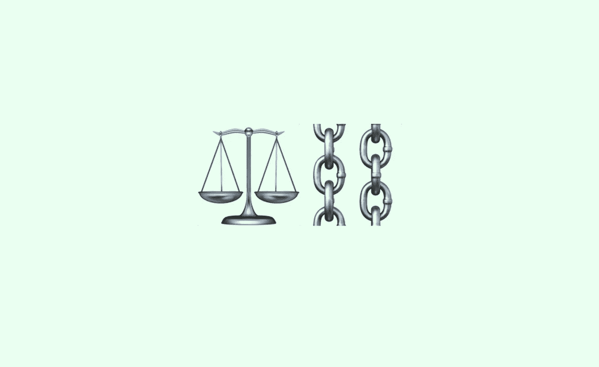

# 2019 年 Stablecoins(我们还没到吗？)

> 原文：<https://medium.com/hackernoon/stablecoins-in-2019-are-we-are-not-there-yet-1e5686eea203>

# 传统的电子货币仍然占主导地位

在 2017 年，USDT ( [Tether USD](https://tether.to) )无疑是一个不可否认的市场主导者。一年后——2018 年，有几十个项目上报。截至 2019 年，他们现在有两百多个。“第一包”之外的一些项目已经关闭，一些暂时还只是意向的消息，但可以有把握地说，至少有数百个 stablecoin 项目现在处于不同的发展阶段。

至于那些在生产和生活中的稳定的硬币，那些在交易所交易的，也没有太多可追踪的。在 [CoinMarketCap](https://coinmarketcap.com) 的帮助下，我设法找到了目前为止 23 个 stablecoins 的数据。按装订对象和抵押品类型对硬币进行分组会更容易。这些类别如下。

按证券类型:
👉传统资产
👉加密资产
👉无担保的

并且按币种:
👉美元
👉欧元
👉CNY
👉金色的

> 在传统和替代稳定货币中，美元仍然是最受欢迎的钉住货币。

2019 年 1 月，stablecoins 的总供应量几乎回到了峰值，尽管 USDT 的供应量减少了近 10 亿美元。如果说早期 Tether 的不透明性引起了怀疑，那么现在毫无疑问的是，USDT 的一部分可能不是由美元提供，而是由借款人 Tether Limited 或 Tether International Limited 的债务提供。新的 stablecoins 成功利用了系绳信任危机，从 USDT 手中夺走了部分市场——系绳的主导地位已经连续五个月低于 75%。

> 尽管竞争对手取得了成功，但系绳仍然占据主导地位。

对于非国有货币实验项目的支持者来说，前景并不乐观:传统电子货币，即使登陆了区块链，也很难被称为货币思想的先锋。

尽管许多 stablecoin 项目梦想帮助委内瑞拉人民，但迄今为止，交易仍然是 stable coin 的主要用例。

*如果你对其他区块链的公益项目感兴趣，可以查看* [*这篇文章*](https://hackernoon.com/blockchain-for-social-good-reviewing-top-use-cases-in-2018-85b6b36f4c3d?source=your_stories_page---------------------------&gi=674b72d4cac7) *。*

区块链上的数字货币以美元为担保，在稳定货币中波动性最低，可以按面值兑换成本国货币——这种稳定货币在每日交易量方面无条件领先也就不足为奇了。

> stablecoins 几乎整个交易所的成交额都是以美元为担保的数字货币的成交额。

# 有黄金的消息吗？

至于黄金担保的硬币，2018 年的主要事件是推出了来自 [Digix DAO 项目](https://digix.global)的 stablecoin DGX，这是以太坊区块链的第一个 ICO 项目。随着资产的代币化，我们可以预计由黄金支持的稳定硬币的数量会增加，但迄今为止，市场上这种代币很少，其市场相对较小。到目前为止，只有 DGX 保持了相对的价格稳定并提高了报价。其余“黄金”硬币的价格历史与稳定硬币的市场历史不同。

> DGX 的价格不像黄金(gold)的价格那样稳定，但是根本没有其他的“稳定”🤷市场上‍♂️黄金价格稳定。

对金本位的支持者来说也有坏消息:市场上有[金奥风格的纸币](https://en.wikipedia.org/wiki/Austrian_krone)，但是市场并不想把它们当作货币使用。与国家货币挂钩的稳定币不同，它们不作为报价货币在加密货币交易所使用。在电子商务的代表中，使用黄金作为记账单位和货币的其他功能并不流行。与黄金挂钩的智能纸币数量没有增加。

# 智能钞票

[戴](https://makerdao.com/en/)是唯一成功的智能钞票，即一种由智能合约控制的加密货币抵押品担保的稳定货币。这个稳定的硬币周围的生态系统正在动态发展。戴在集中和分散的交易所与国家货币、比特币、顶级替代币和其他稳定货币进行交易。

戴提供贷款和存款，在电子商务中采用戴，该项目[吸引了 A16Z](https://www.ccn.com/how-can-andreessen-horowitz-profit-from-its-15m-investment-in-a-stablecoin) 的 1500 万美元投资。Maker 是以太坊迄今为止最成功的 DAO，资本总额为 7 亿美元，ETH 提供的总要约中约有 2%是为 DAI 提供的承诺。

尽管戴取得了成功，但加密货币保护的稳定货币数量并没有像区块链上传统数字货币的数量那样快速增长。比戴早几年推出的智能钞票项目正经历艰难时期。DAI 市场的历史始于 BitShares 的主要智能纸币(包括 bitUSD(第一种智能纸币，GBG 和 DAI 都源自这种纸币)的发行高峰期。现在，戴的报价超过了所有其他智能纸币的报价总和。

> 戴——是迄今为止唯一成功的智能钞票。

在 BitShares、 [Steem](https://steem.com) 和 [Golos](https://golos.io) 中，stablecoin 只是平台令牌之一，这个平台存在的原因并不能归结为这个令牌，这意味着与团队和创客社区相比，开发和推广这些项目的团队和社区的激励措施并不多。然而，戴成功的主要原因并不在于此。

主要原因是抵押物的选择。原生以太坊代币是继比特币之后的第二个，比特币、Steem 和 Golos 区块链的原生代币在新 altcoins 的背景下丢失。至于像 [Synthetix](https://www.synthetix.io) (以前的 Havven)这样的智能纸币项目，他们使用的不是区块链的本地令牌，而是他们系统的内部令牌，这种令牌的流动性比 ETH 差得多，作为他们稳定硬币的担保。

# 没有完全安全性的稳定连接

在没有完全安全保障的 stablecoins 细分市场，即菲亚特 stablecoins、部分预订和优惠券的 stablecoins，出现了一些响亮的消息，但这种类型的 stablecoins 市场尚未取得进展。

这一领域最重要的新闻是 [Basis 项目](https://www.basis.io)的关闭——这是第一个由顶级风险投资家投资 1.33 亿美元支持的菲亚特 stablecoin 项目[。通过发行和赎回股票和债券并吸引投资来管理私人法定货币的供应，比在现有法律领域实施这一概念要容易得多。](https://techcrunch.com/2018/12/13/basis-backed-with-133-million-from-top-vcs-to-build-a-price-stable-cryptocurrency-says-its-shutting-down-and-returning-the-money/)

Basis 明确地推动了其他计划通过发行证券来管理稳定货币供应的项目放弃这种模式。[碳](https://www.carbon.money)，原本计划创建一个具有法定稳定币和碳信用安全的系统，仅限于在区块链创造传统的数字货币。Fragments 将模型变成了一个带有菲亚特 stablecoin 的单壁系统，并被称为 [Ampleforth](https://www.ampleforth.org) 。为了控制代币的供应，也计划使用债券和股票。虽然这个项目的团队没有报告令牌组学的变化，但没有关于推出这种稳定硬币的计划的消息。

这一领域的另一个损失是[NuBits](https://nubits.com)——第一款菲亚特 stablecoin。在供应量急剧增加，利率迅速下降之后，这种稳定的货币无法恢复。项目团队及其社区的活动几乎为零。

与 NuBits 社区相反，在 fiat stablecoin Telegram 聊天中，每天的消息比 MakerDAO 聊天多。然而，MNX 无法将市场价格保持在目标水平，该公司的出价因区块链 Minex 矿的矿工获得报酬而提高。根据计划，MNX 的价格被预测会增长，事实上，它的动态早已是负面的。

> USNBT 和 MNX 无法保持目标速率。

尽管如此，法定货币仍然是货币思想的先锋。如果 Basis 和 NuBits 只是试图创造一种现代国家货币的私人模拟，那么 BitBay 和 Ampleforth 正在试验货币史上没有模拟的模型。

比特贝正在试验一种可以被称为“最后手段”的方法。为了推高 BitBay 的价格，或者只是为了防止其下跌，这种稳定货币的持有者投票暂时冻结其资产负债表的一部分，以暂时降低 BitBay 的市场报价。同时，与传统意义上的 stablecoins 不同，BitBay 没有任何固定的目标价。

在安普尔福思，稳定的铜供应的减少将通过非传统的市场途径(货币干预，出售债券或股票，停车)来实现。通过按比例减少所有 Ampleforth 持有者的资产负债表，可以减少 Ampleforth 的供应量，从而提高其市场价格。作为被没收硬币的回报，安普尔福思持有者将一无所获。另一方面，当有必要提高安普尔福思的报价时，新创造的代币将以同样的“非市场”方式分配:它们将按照余额的比例在所有安普尔福思持有者之间免费分配。

# 寻找全球尺度和稳定的货币篮子

全球货币首先是一种全球性的价值尺度。全球市场需要一个全球计量单位。加密货币宣称拥有全球货币的地位，稳定货币也不例外。为了寻找这样一种全球性的衡量标准，稳定的货币既与特别提款权挂钩，也与新的一篮子国家货币和金属挂钩。脸书正在考虑提供一种与一篮子国家货币挂钩的稳定货币。提比略科技公司提供了一个代币，里面有一篮子用来生产现代电子产品的金属。

这种篮子作为价值储存手段可能很有吸引力，但在现阶段将其作为全球价值衡量标准似乎不太可能。全球价值的衡量标准仍然是美元。世界货币体系向将各国货币汇率与特别提款权或另一篮子货币挂钩的转变，目前还没有计划。正是各国货币与某一篮子货币挂钩，就像欧洲货币单位的情况一样，使得这一篮子货币成为一种受欢迎的价值衡量标准。特别提款权从未被用作世界货币体系的基础，因此，与欧洲货币单位不同，它们不被市场认可。至于一篮子不稳定的加密货币，开放公共区块链的全球生态系统还太年轻，没有必要使用这样一篮子货币来衡量价值和货币。

霍比交易所进行了一项实验，创造了一种 [HUSD 代币](https://www.ccn.com/huobi-launches-multi-stablecoin-husd)，可以从四种稳定币(帕克斯、TUSD、USDC 和 GUSD)中选择一种进行平价兑换。面值赎回很快被取消，HUSD 2.0 只能以加权平均市场汇率兑换上述稳定的硬币。 [CementDAO](https://www.cementdao.com) 正在开发一个 stablecoins 聚合器，Reserve 计划转而为 stablecoins 提供一篮子令牌化资产，Neutral 和 dForse 报道了一篮子 stable coins 的开发情况。

# 两个商业案例:证券和佣金

在本文的最后，我想提请您注意与稳定项目的商业日常工作相关的两个问题。

第一:在第一次分发后重新设计第二个令牌。第二:对使用 stablecoins 收取额外费用。

先说第一个。

如果代币的所有权以交易佣金、铸币税、贷款利息或股息的形式产生收入，那么这个代币就是证券。通过出售代币(证券)吸引资金的项目，并不总是获得所有必要的官方批准。也许这就是为什么 Maker 和 [Chronobank](https://chronobank.io) 在首次发行后改变了第二枚代币的设计(分别是 MKR 和时间)。现在，这些代币的持有者无权分享向相应 stablecoins 用户收取的佣金。鉴于加密货币监管的收紧，这种变化的法律方面将不可避免地成为辩论的主题。

稳定的货币项目与规范证券发行和流通的现实之间的冲突导致了不同的结果。一些人关闭了项目，另一些人完全改变了代币的设计，你甚至会发现那些人只改变了第二个代币的设计，一些人按照当前立法的要求准备发行证券。

使用稳定币收取额外费用的问题是，用户不仅要用区块链的本地代币向矿工支付佣金，还要支付项目费。

Carbon 使用元交易允许其用户向 CUSD 的以太坊矿商支付佣金，而不是在 ETH。这种解决方案改善了用户体验，但是没有解决额外交易费用的问题。不管以何种代币收取佣金，用户都会产生额外的费用。离线交易可以让你避免这些额外的成本，但是这种解决方案不太可能吸引 stablecoin 项目，因为 stable coin 项目的商业模式是建立在额外佣金的基础上的。

佣金影响稳定硬币的互换性。稳定币的发行、使用和赎回费用可能不同。稳定债券的发行、流通和赎回条款可能会有所不同。由于技术、经济或法律原因，在几款区块链上推出的相同 stablecoin 可能无法完全互换。

UPD 2019 年 6 月 3 日

自从这篇文章发表后，我也发现了项目[中立](https://neutralproject.com)。Neutral token 已于 2019 年 5 月推出，因此这将只是其活动的第一个月。NuSD 中性美元是一个稳定的货币篮子——完全由基础稳定货币担保——能够添加新的未来成分，以补充稳定货币的增长。中性美元有助于提供一种波动性更低、风险更低的令牌，同时促进其成分的流动性和可互换性。