# Stablecoins 还不太稳定🤷🏻‍♂️

> 原文：<https://medium.com/hackernoon/stablecoins-not-quite-stable-yet-%EF%B8%8F-4481b1b41d44>

Stablecoins 是秘密世界中讨论的一大部分，可能是有充分理由的。它们目前占加密资产总市值的约 2%，这无疑使它们进入了加密资产领域的前 5 名(与货币、智能合约平台、隐私币和交换令牌一起)，这是一个令人印象深刻的壮举。它们的效用是毋庸置疑的，因为在一个高度不稳定的资产世界中，它们是解决巨大采用障碍的一个看似合理的解决方案。因此，当考虑触发下一波采用的关键支点可能是什么时，许多人将 stablecoins 放在了前面和中心。

集群的生态系统在加密冬天(特别是从 2018 年第四季度开始)得到了显著发展，新进入者挑战 Tether 的垄断地位，旧功能在其基础上不断迭代和改进(如戴)。尽管如此，稳定的硬币边缘仍然粗糙。他们声称的稳定性一再受到挑战，流动性经常匮乏，而市场领导者的生存能力已经让专家和投资者陷入了长达多年的“政治迫害”。

在接下来的章节中，我的目的是概述该领域近年来的发展情况，着眼于市场份额和流动性等关键变量，对稳定的货币波动性及其各种来源提供一些颜色，并进一步说明稳定的基本驱动因素是什么，以及这些因素如何成为当前发行人关注的一些关键领域。让我们开始吧。

**相对市场份额:系绳受到挑战**

让我们先来看看过去几年 stablecoin 领域的竞争格局是如何发展的。下面的图考察了被考察的稳定点的相对市值之间的关系。这里的重点是该领域最具活力的竞争对手，而不是更多的边缘玩家，如 Digix Gold、bitUSD 和 Steem Dollars。

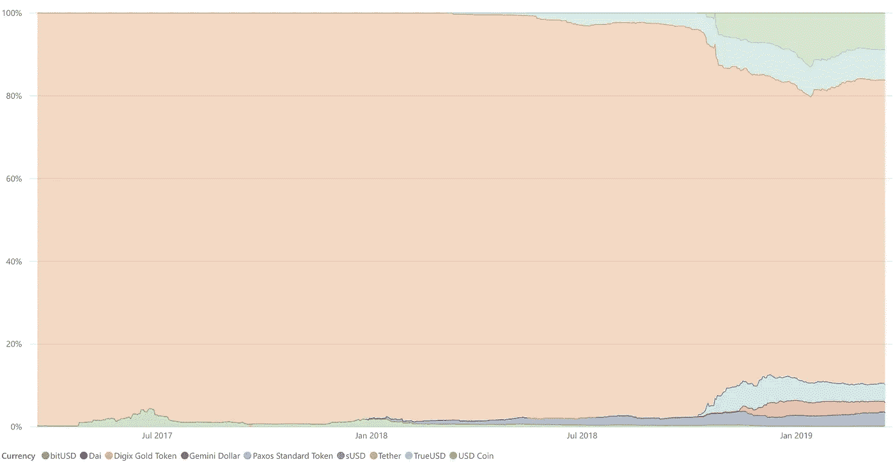

Evolution of relative marketcap shares of popular stablecoins (source: coinmarketcap.com)

all powerful Tether 以高达 92%的市场主导地位开始，以大约 75%的市场主导地位结束，随着 USDC 和双子星美元在竞争格局中的引入，新进入者在 2018 年 11 月左右变得咄咄逼人，这与 BSV 分叉和 2018 年 11 月中旬的重大抛售相吻合。如果是亚历克斯·琼斯写的这篇文章，它会读起来像“温克列维，阿姆斯壮，韩吉和法克托什，推翻泰瑟的舞台”我们会保持冷静，坚持数据。关于 11 月抛售之前稳定币领域的情绪，请参见 2018 年 10 月 4 日的[这篇文章](https://www.hash21e8.io/home-2/2018/10/4/tether-the-3b-bounty)。

绘制过去一年“挑战者”的相对市场份额时，事情变得更加有趣。戴今年开始作为孤星，它发现自己只占挑战者空间的约 15%，TrueUSD、和 Gemini 以决定性的方式进入该空间。

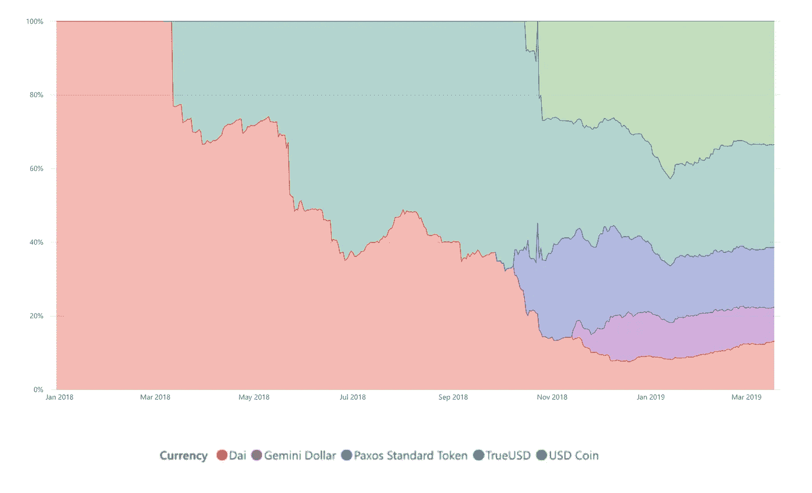

Evolution of the new entrant space in stablecoins (source: coinmarketcap.com)

从绝对值来看，过去一年稳定的硬币市场从未超过 3B 美元大关，新进入者占据了系绳“解开”创造的空间，但没有增加超过该阈值的总资本。也许这是对 stablecoin 特遣队当前 SAM 的认可。

Marketcap development in the stablecoin space over the past year (source: coinmarketcap)

自 2019 年初以来，挑战者空间的相对份额在很大程度上保持不变，只有戴收复了部分失地。

**流动性:束缚远未受到挑战**

然而，市值只是故事的一部分。另一个原因可以说是流动性。借用[韦斯·莱维特对同一主题的](https://decentralpark.us18.list-manage.com/track/click?u=9a68e4e5747a7e6c8d8516308&id=b98e3a37fc&e=20c738a8d2)精彩分析，以下是截至 2019 年[1 月 4 日](http://airmail.calendar/2019-01-04%2012:00:00%20GMT)的竞争者的排名。

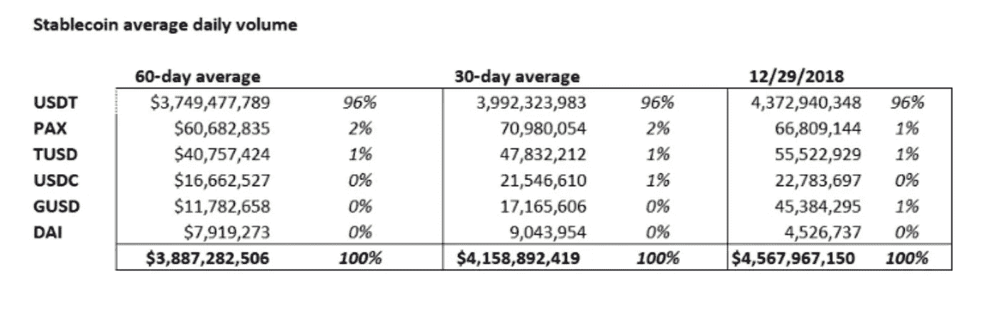

[Wes Levitt: How stable are the top stablecoins? A quantitative analysis](/coinmonks/how-well-do-the-top-stablecoins-perform-a-quantitative-analysis-c56d022719b)

尽管在市值方面，Tether 已经向新进入者承认了一些优势，但就流动性而言，它仍然占据着主导地位，而且优势明显。另一方面，尽管戴有其优点，但在交易场所肯定很难找到。

**稳定:白日梦**

看了过去两年市场在市值、市场份额和流动性方面的发展，现在我想把大家的注意力转移到稳定性上来，稳定性是这一类别的大承诺。这是过去两年的情况。

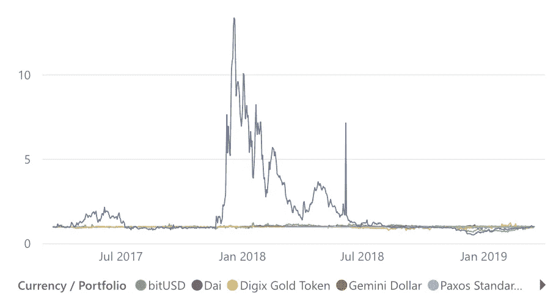

Source: Decentral Park Capital reporting tool

哇——好吧，所以 Steem 美元在相当长的一段时间里(准确地说是 7 个月)都表现得格外疯狂。把它从图片中去掉，给了我们一个更容易理解的观点。下面的图表概述了自 2017 年 3 月以来，如果一个人在任何时候购买价值 1 美元的稳定币，会发生什么。

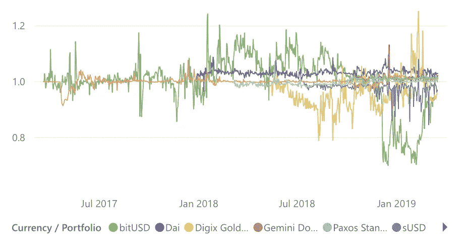

Source: Decentral Park Capital reporting tool

bitUSD、sUSD 和 Digix Gold 是该集团中最不稳定的，没有很好地适应 2018 年 1 月和 2019 年 12 月等高度波动的时期。

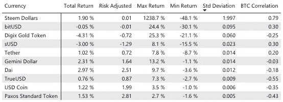

Performance of buying $1 worth of each stablecoin at any point it became available in the past 2 years

再说一次，我不会太关注 Steem 美元，尽管如果他们在 2017 年 3 月买入并在 2018 年 1 月卖出，就会获得丰厚的利润；奇怪的弯曲，但还好。上图中特别有趣的是 stdev(波动率的代表)和 BTC 相关性指标。

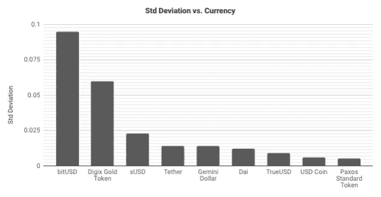

Source: coinmarketcap

bitUSD 和 Digix Gold 是该集团中最不稳定的资产(很可能是因为与其他资产相比，它们的交易量较弱)，而 USDC 和 Paxos 是最不稳定的资产。值得一提的是，戴保持了良好的波动性，特别是考虑到这是唯一一个算法驱动的解决方案，也是过去 6 年中唯一一个加密抵押产品(bitUSD 在类似的模式下工作，使用 BTS 而不是 ETH 作为抵押品)。

现在让我们来看看与比特币的相关性。

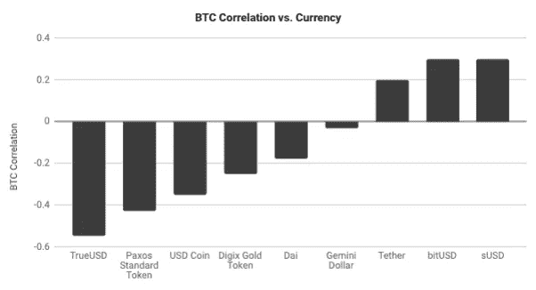

Source: coinmarketcap

这就是事情变得真正有趣的地方！波动性最小的稳定币(TUSD、帕克斯、USDC)显示出与 BTC 的高度中度负相关，这强烈表明了它们的效用性质，意味着它们主要用于保护交易场所免受比特币波动的影响。换句话说，随着交易场所对比特币的需求急剧增加，比特币的抛售可能会导致钉住汇率的向上突破。鉴于它们的资本总额比 Tether 的低得多，再一次，缺乏足够的供应以及它们可以说更值得信赖的品牌，可以为这种关系的驱动因素提供可信的解释。考虑到另一方面发生的事情(比特币价格上涨)，我将避免关注 bitUSD 和 sUSD，因为它们在交易场所的效用相对有限，这种相关性在很大程度上可以解释为资本基础和流动性有限。另一方面，系绳是一个奇怪的例子。作为“交易者的工具”，它已经相当成熟，人们会认为它与 TUSD、帕克斯和 USDC 有着相似的特征。事实并非如此。事实上，Tether 与比特币表现出微弱的正相关性，这意味着当比特币价格升值时，对 Tether 的需求会增加(推动其脱离盯住汇率——向上),而当比特币价格贬值时，情况会相反。这是否意味着 Tether 确实在 2017 年的牛市中支撑了对比特币的需求？这是一个有趣的发现，当然需要更多的研究。

**波动性:正在改善——虽然真的没有**

好了，我们已经确定稳定的 coins 比我们希望的要不稳定得多，但是这有什么改善吗？在这一节中，我们来看看稳定的硬币波动曲线是如何随着时间的推移而产生的。下图显示了过去 1 至 6 个月中相关稳定曲线的标准偏差。

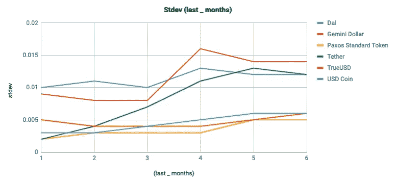

Source: coinmarketcap

检查的大多数资产都显示出积极的变化。)和 Paxos 表现出最大的改进。然而，与此同时，这段时期的后半段是大盘股波动性较低的时期。为此，我们可以将这一发现视为一个早期迹象，表明整体空间的波动性与稳定资本的波动性之间存在某种正相关关系。

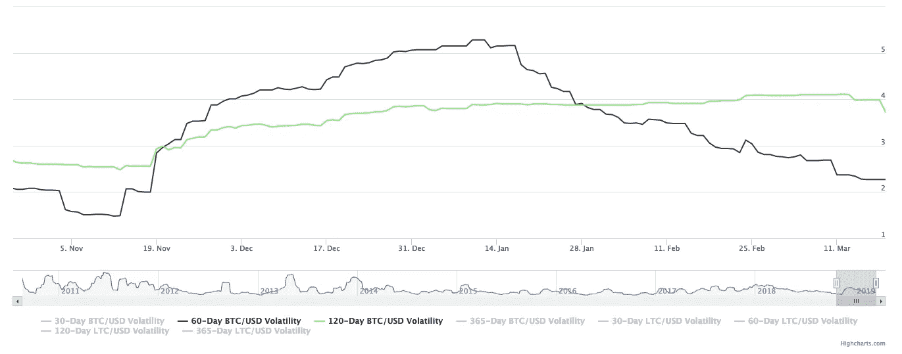

Source: bitvol.info

为了揭示这种关系的确切性质，我们转而分析稳定硬币的波动性特征的相关性，以及每种稳定硬币的波动性在多大程度上可以由比特币和系绳(Bitvol、USDTvol 等，通过简单的线性回归模型)的波动性来解释。

*注意:已经对每日收盘价进行了分析，这可以说比对连续数据进行同样的分析更加嘈杂。此外，实施 Newey-West 估计将有助于控制自相关和异方差，最终提高结果的统计显著性。*

鉴于我们已经确定更多的边缘资产(bitUSD、Steem Dollars 等)会引入噪声，我选择不将它们纳入分析，而是将重点放在 Tether、Dai、、TrueUSD 和 Gemini Dollar 上——在执行此分析时，Paxos 的数据不可用。

我们在这里要考察的是相关资产的年化 30 天波动率，定义为过去 30 天每日回报的标准差乘以 365(一年中的交易天数)的平方根。

`< stdev (30-day daily returns) * sqrt (365) >`

分析样本基于过去 6 个月的交易历史，只关注每日收盘价。下面是这段时间内被检查资产的 30 天年化波动率的结果。

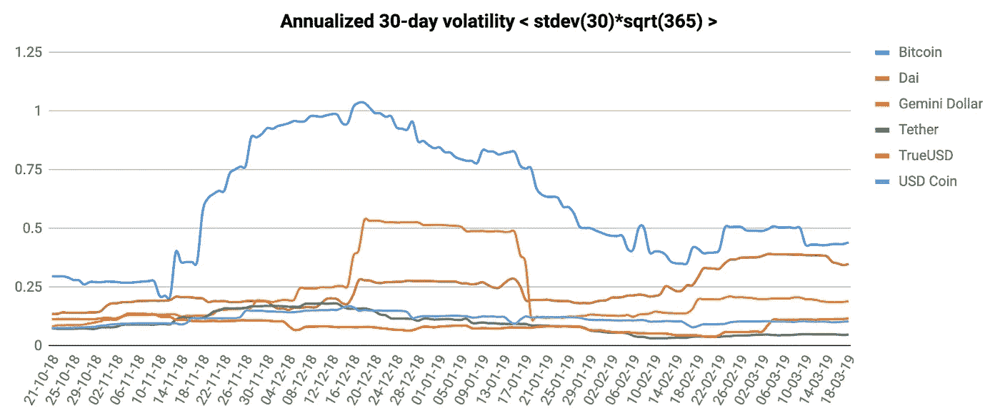

Source: Decentral Park Capital reporting tool

与本节开始时呈现的结果一致，稳定的 coins(除了和戴)的波动性曲线正在下降，而(谢天谢地！)该组中所有稳定币的波动性都低于比特币。然而，有趣的是，DAI 的波动性最近似乎一直在稳步上升，几乎与比特币持平。然而，当将 DAI 与该集团的其他产品进行比较时，人们必须认识到这样一个事实，即 DAI 是算法信贷工具制造商 DAO 的一个特征，而不是核心产品本身。

接下来，让我们看看每种资产的波动性是如何相互关联的。请记住，我们将从中获得的不是方向性数据，而是一种资产的波动性与另一种资产的波动性相一致的可能性的指示(向上或向下打破盯住)。

*比特体积 x 稳定体积相关性*

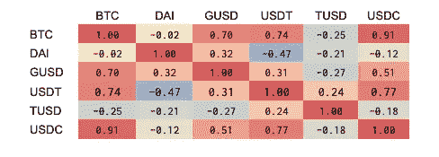

Source: coinmarketcap

这里有一些有趣的观察。比特币的波动与 GUSD、USDT 和 USDC 的波动不谋而合，而 TUSD 相对未受影响，戴也完全未受影响——这进一步表明，在这个规模上，戴是一头自成一体的野兽，有着自己的苦难。另一个值得注意的发现是 USDT 的波动性和戴氏指数的波动性之间存在适度的负相关，这意味着当 USDT 波动时，戴氏指数可能不会波动。这可能再次表明戴的流动性有限，以及这两种资产的核心用例不同。

现在，为了更清楚地说明 Bitvol 和 Stablevol 之间的关系，我们来看看几个简单的线性回归，将比特币作为自变量(影响者)，将 stablecoins 作为因变量。结果如下所示；

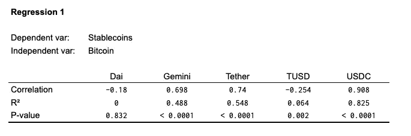

这是我们所知道的。戴的测试在统计学上没有意义。对于 TUSD 和比特币来说，这一测试的统计意义不大。在所有其他的星座中，比特沃和稳定沃(双子座< Tether < USDC), with USDC being the one where the largest part of volatility is explained by volatility in Bitcoin (82.5%). The regression plots are quite telling with respect to the relationships.

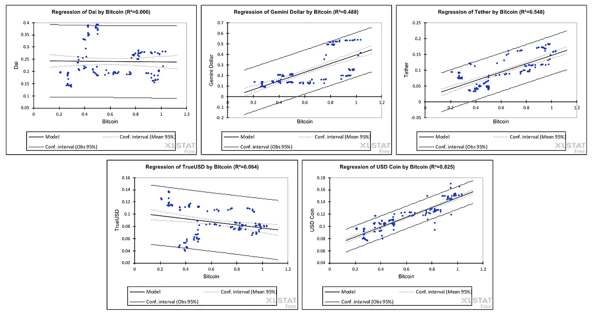

Curious as to what’s causing this? It doesn’t take much, but a quick look into the Stablecoin/BTC pairs and the liquidity thereof to understand why. In this example, I’m taking only GUSD (weak relationship) and USDC (strong relationship) to illustrate the point.

*GUSD/BTC 对*有着重要的关系

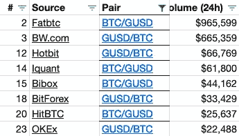

Source: coinmarketcap

*USDC/BTC 组合*

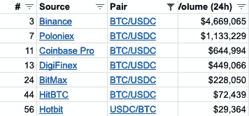

Source: coinmarketcap

鉴于 Fatbtc 和[BW.com](http://bw.com/)被发现报告虚假交易量(参见 TIE 报告[的调查结果，此处](https://decentralpark.us18.list-manage.com/track/click?u=9a68e4e5747a7e6c8d8516308&id=be1e4d1bfc&e=20c738a8d2))，我们可以相对有把握地得出结论，币安交易员在很大程度上推动了 USDCvol 和 Bitvol 之间的关系。考虑到比特币和 USDC 之间存在负相关关系，在比特币波动时期，USDC 似乎是交易者最糟糕的安全天堂——甚至没有考虑交易者在 USDC/稳定币对中可能获得的退出/套利期权。

*USDC/稳定币对*

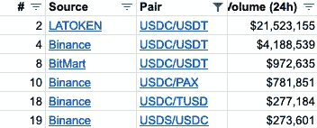

Source: coinmarketcap

据铁说，拉托肯是另一个一贯误报交易量的场所，因此不值得关注。然而，在币安的 USDC/USDT 组合，其录音量相当于在同一场地的 USDC/BTC 组合。随着系绳成为 USDC 持有者和其他一些人的退出选择，看看系绳和其他稳定债券之间的波动关系，可能会有更多的启示。

*比特币价格与稳定币价格相关性*

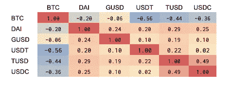

Source: coinmarketcap

结果与之前提出的价格相关性一致——在过去的 5-6 个月中，价格相关性似乎与比特币高度负相关(记住，当我们查看过去 2 年时，我们发现了微弱的正相关性)。在 stablecoin 组中，最突出的相关性实际上不是 USDC 和泰瑟之间的相关性——没有相关性，而是 USDC 和 TrueUSD 之间的相关性。也许因为与系绳的关联度很低，USDC 也许并不那么糟糕，对吗？

不对！如前所述(并通过下面的回归得到证实)，USDCvol 和 USDTvol 之间有很高的相关性，这意味着 Tether 不是从 USDC 退出的可靠途径，因为根据数据，无论是高于还是低于平价，都是一个掷硬币的决定。

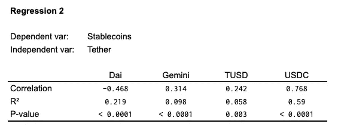

上面的回归结果证实了 DAI 确实是它自己的野兽(在 Tether vol 中只有 20%的可变性解释了 DAIvol)，而在其余部分中，USDCvol 和 Tethervol 之间的关系最强(解释了 60%的可变性)。

所以，我们这里有特瑟沃尔<> USDCvol，和一个关于方向性的未知结果；换句话说，**完全混乱👹**

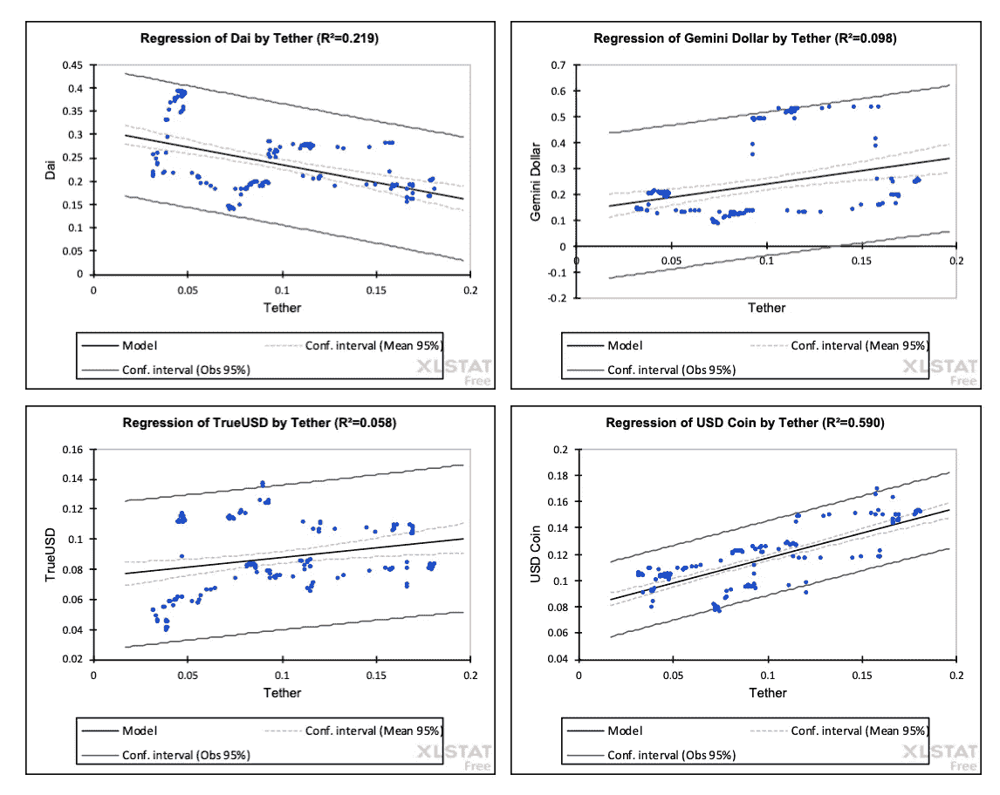

因此，我们已经在稳定硬币空间中建立了许多相互作用的关系，同时稳定硬币的波动性与比特币的波动性密切相关(在某种程度上也与比特币相关)，因此没有从根本上改善。6 个月的时间窗口可能太短，无法得出可靠的结论，但这就是我们目前所拥有的。在下一节中，我们来看看稳定资本市场对需求和供给力量的适应性差的潜在原因。

**稳定基本面:供给面放缓，需求面疲软**

让我们考虑一下稳定的硬币的稳定性的决定因素是什么。在很高的层面上，是需求和供给。在现有的模型中，供应方更适合影响稳定性——对法定抵押稳定债券影响更大，对算法、加密抵押稳定债券(如 DAI)影响较小。在前一种模式中，只要银行有足够的抵押品，发行者就可以通过直接市场操作扩大或收缩供应，以协调需求行动并维持联系汇率。在后一种情况下，事情会变得稍微复杂一些，因为在较慢的分权治理过程的调节下，钉住汇率制度中断的确认和后续行动之间的滞后时间要长得多。在这里，我不会详细介绍这是如何发生的——如果你感兴趣的话,【Trustnodes 的这篇文章是一个很好的起点。这个概念实际上非常类似于财政和货币稳定政策的滞后——这是经济学文献中一个记录非常完整的领域。

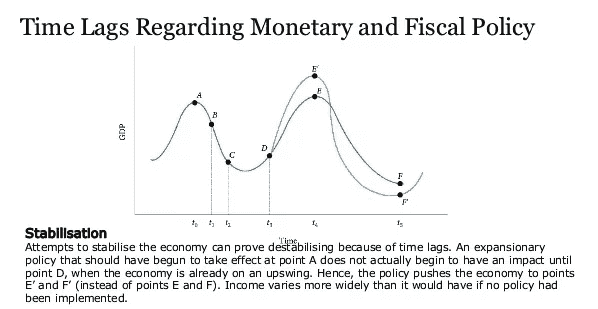

在需求方面，事情变得有点复杂。对于菲亚特抵押稳定币发行者来说，其机制等同于上述机制，具有利润意识的套利做市商的额外好处，他们可以在动荡时期进行干预，帮助联系汇率恢复平衡(更多信息见[此处](https://decentralpark.us18.list-manage.com/track/click?u=9a68e4e5747a7e6c8d8516308&id=fcd59bef86&e=20c738a8d2))。对于像道这样的发行者来说，事情变得更加复杂，因为戴元与美元之间没有 1:1 的可兑换性，因此很少或没有能力通过需求方方法影响联系汇率。

总的来说，考虑到稳定债券经常经历的剧烈波动，似乎市场的任何一方都没有在优化方面取得有意义的进展。同样，在高层次上，这可能意味着一些事情；最值得注意的是:( I)抵押品的增加没有超过需求——至少到目前为止允许通过供应方行动提供足够的波动缓冲,( ii)没有足够的做市商在该领域运营，以及(iii)总的来说，在该领域运营的发行人和做市商没有随着时间的推移变得更加复杂——关于他们在 *< peg 中断识别>、<行动决策>、<行动实施>、周期中的流程。*

为了强调这一点，让我们来看看过去一年里，上述波动最小的稳定硬币的价格走势。

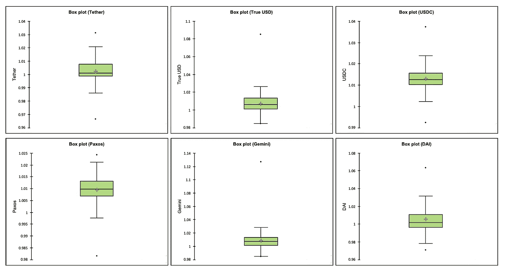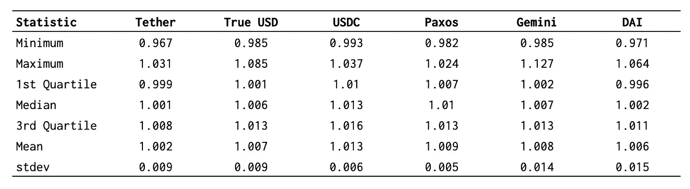

Source: Decentral Park Capital reporting tool

乍一看，似乎即使是最有竞争力的球员，在实现真正的稳定还有很长的路要走。尽管围绕它的批评，系绳似乎是一个跟随美元更密切。USDC 似乎经历了比所有其他国家更多的过度需求——显示了所检查资产的最高平均值(1.013 美元)，Paxos 波动性最小，而 DAI 波动性最大，显示了其缺乏需求侧稳定机制的弱点。此外，与 stdev 和 BTCcorrel 之间关系的分析结果一致，双子座和 USDC 在保持“钉住区以下”整洁方面表现最佳，分别达到 0.982 美元和 0.993 美元的最小值，高于大多数竞争对手。

**离别的思念**

在马拉松结束之际，让我们回顾一下我们学到了什么:

*   Stablecoins 并不稳定，看起来也不像是在接近它。
*   Tether 仍然是王道，尽管在 2018 年已经明显减弱。
*   $3B 似乎是当前形式和用例集的稳定内容的 SAM。
*   鉴于 Stablevol 与 Bitvol 的高度相关性，最近几个月的大量波动性下降可以用同时降低的 Bitvol 来解释。
*   在这些国家中，USDC 和帕克斯是最稳定的——尽管 USDC 在挂钩汇率上表现稳定。
*   稳定硬币的波动性与其与比特币的相关性之间存在微弱的负相关性——稳定硬币与比特币的相关性越强，波动性可能就越小——这或许是其流动性的证明？
*   在比特币波动性越来越大的时候，USDC 是一个糟糕的安全天堂，而对于寻求逃离 BTC 的人来说，TUSD 可能是最好的选择——两者都与比特币的价格(唯一的价格)呈弱负相关，与 Bitvol 呈负相关(当比特币波动时，TUSD 可能不会)。
*   戴是它自己的野兽，相对孤立于其他人——为“信贷工具第一，稳定的货币第二”的方法提供了一些验证。
*   稳定的硬币发行者可能(还)没有在直接市场操作和努力吸引各自市场的做市商方面部署足够的资源来维持联系汇率。

最终，权力越大，责任越大；稳定的恐龙在相对较短的时间内积聚了巨大的力量。它们的效用是毋庸置疑的，而且它们很可能在进一步推动 Dapps 和 crypto 作为一个整体的采用方面发挥关键作用。也就是说，为了跨越鸿沟，稳定的硬币发行者需要承担赋予他们的权力所要求的责任。这样做，否则就会被一个新进入者打破，这个新进入者已经打破了市场的双方，其产品是一个真正的保值堡垒。

*像这样？霍拉对着我* [*碎碎念*](https://twitter.com/es21e8) 🙋🏻‍♂️