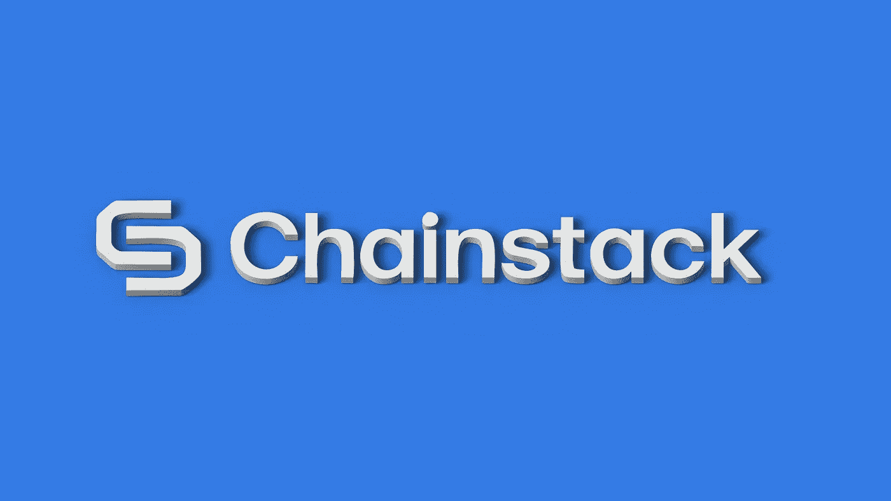
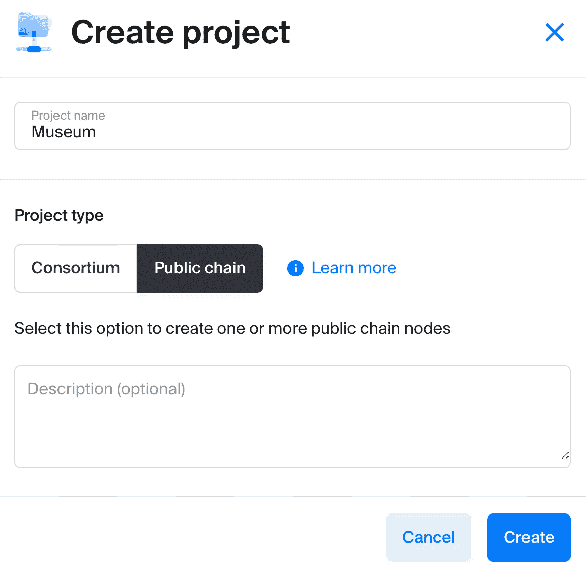
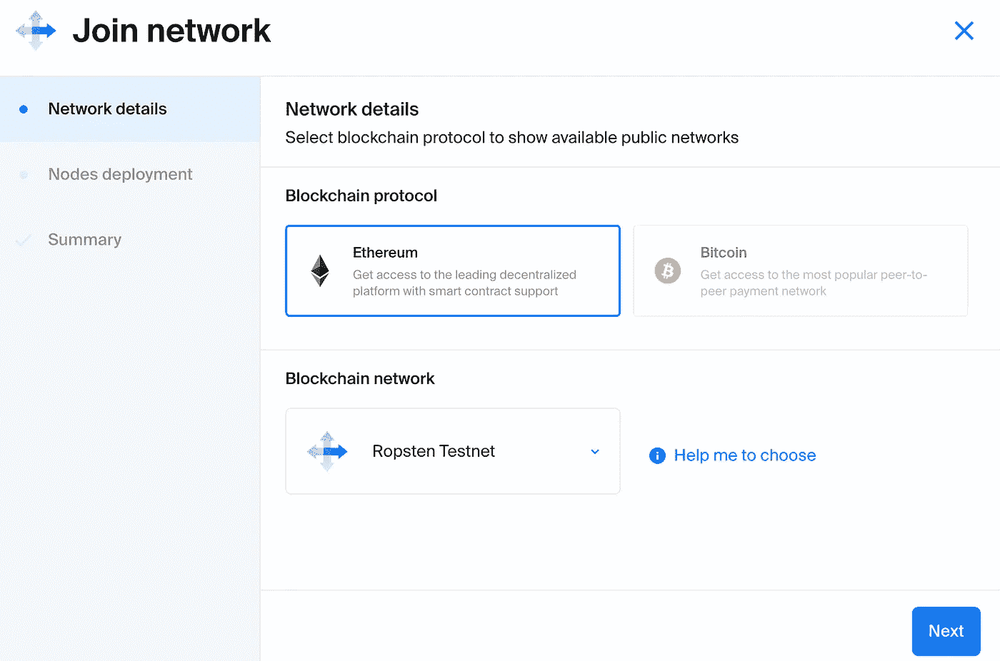
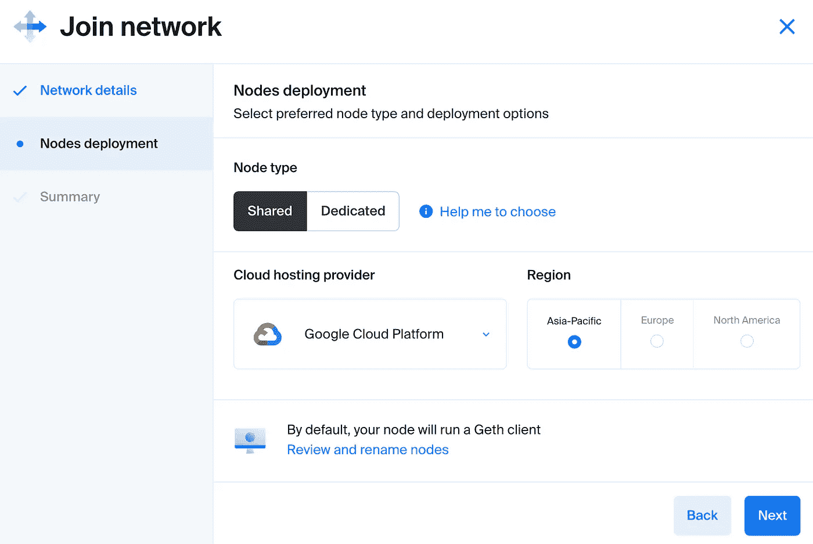
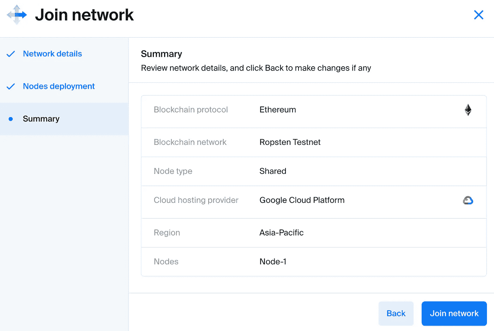
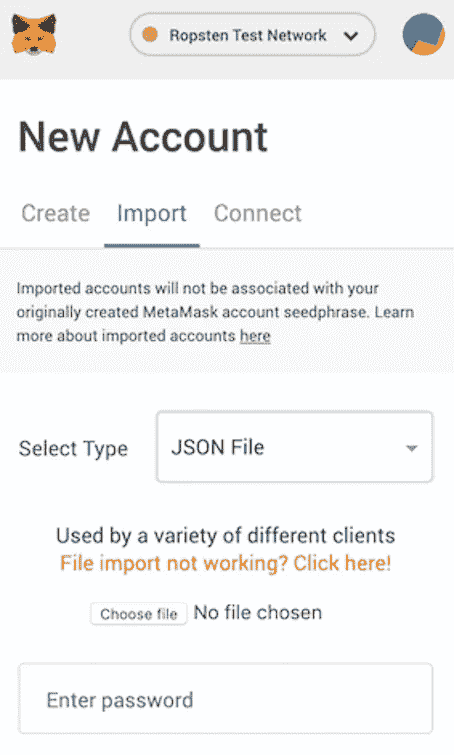
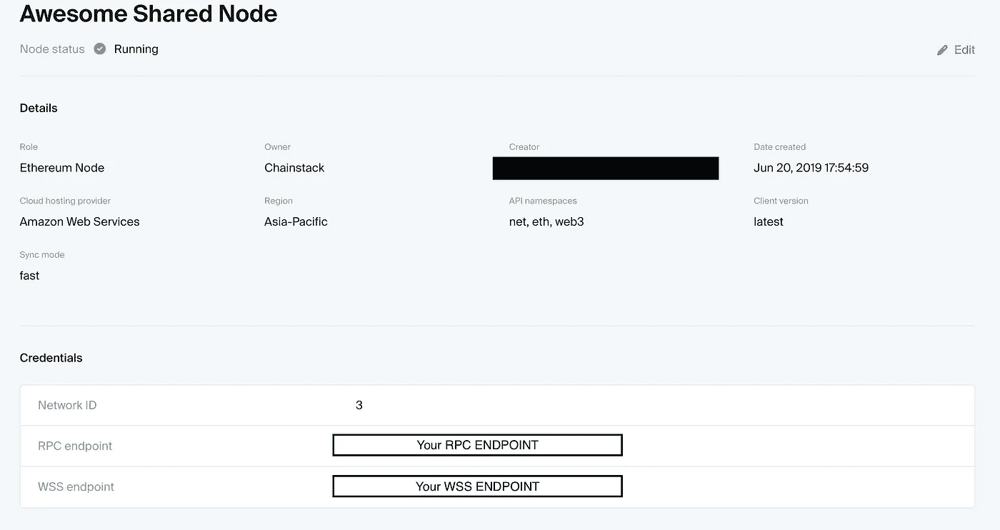
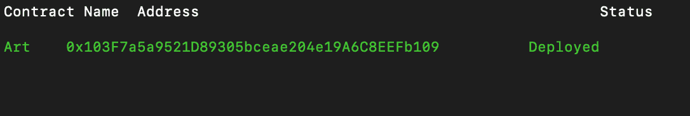
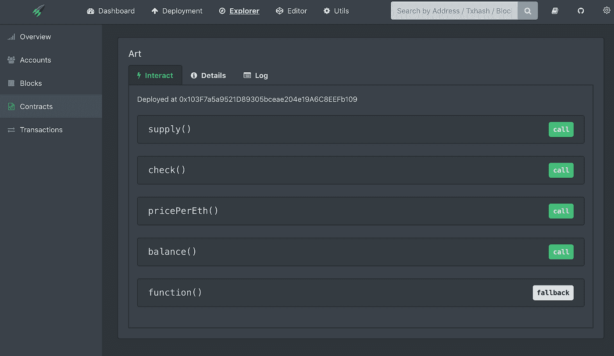
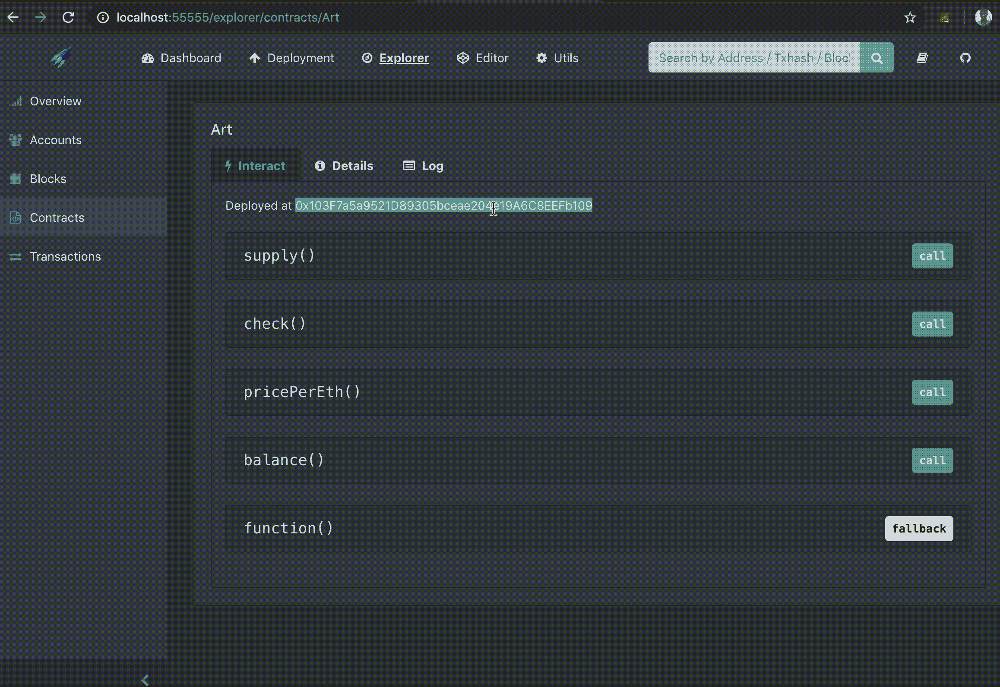

# 在 10 分钟内启动并部署您自己的完全同步以太坊节点

> 原文：<https://medium.com/hackernoon/start-and-deploy-your-own-fully-synced-ethereum-node-in-under-10-minutes-bf2e6b512cce>



如今，部署智能合同比您想象的更容易。通过将流行的 Embark 框架与 Chainstack 在 Mainnet 上快速部署以太坊节点的能力相结合，智能合约部署就像发送电子邮件一样简单。

# 属国

在继续之前，您应该安装这些依赖项:

NPM

[Geth](https://github.com/ethereum/go-ethereum/wiki/Building-Ethereum)

一旦我们安装了这些依赖项，我们就可以安装 Embark 了。

```
npm install -g embark
```

此外，您应该安装元掩码来简化以后的交互过程。

# 智能合同

高价值资产的部分所有权可以通过智能合同实现。

《蒙娜丽莎》是一件价值约 1 亿美元的艺术品，面向散户投资者拍卖。由于散户投资者没有资金购买完整的《蒙娜丽莎》，所以《蒙娜丽莎》可以在以太坊虚拟机上用 1000 个代币来表示。因此，拥有 1 枚代币就相当于拥有 1/1000 的蒙娜丽莎，每枚代币正好值 100，000 美元。资产代币化也使得投资者可以很容易地交易他们认为合适的代币。

我设计了一个简单的智能契约来修饰蒙娜丽莎，名为 Art.sol。

# 艺术溶胶

```
 pragma solidity = 0.5.0;contract Art{
  uint public supply;
  uint public pricePerEth;
  mapping( address => uint ) public balance;constructor() public {
    supply = 1000;// There are a total of 1000 'mini' Lisa Monas
    pricePerEth = 100000000000000000; // 1 token = 0.1 ether
  }

  function check() public view returns(uint) {
    return balance[msg.sender];
  }
  function () external payable {
    balance[msg.sender] += msg.value/pricePerEth; 
    supply -= msg.value/pricePerEth;              
  }
} 
```

我们把一个蒙娜丽莎的价格定为 0.1 以太。这意味着，要想拥有蒙娜丽莎 1/1000 的股份，投资者只需向智能合约投入 0.1 以太。

将上面的代码保存为 Art.sol。我们将使用 Embark 将智能合约部署到以太坊测试网(Ropsten ),这样您就可以部署它并与之交互，而无需花费真正的以太网。

# 旋转你的以太坊节点

当开发人员想要部署智能合约时，事务被广播到一个节点。开发人员必须相信远程节点是完全诚实的，用技术术语来说，非拜占庭式的。更好的选择是运行您自己的完整以太坊节点，这有几个好处，例如:

1.高使用率没有节流
2。确保对区块链的所有交易都是正确的
3。如果节点位于同一地理位置，则延迟更低

Chainstack 使创建 Ropsten testnet 节点变得很容易。通常这需要 12 个小时，但 Chainstack 的 Bolt 只需 10 分钟就能完成所有工作。因为我们不想花费太多时间，所以让我们将智能合约部署到一个 Ropsten 节点。

我为 Chainstack 工作，在 Chainstack，我们可以在 10 分钟内创建一个新的以太坊节点:)

让我们从注册一个免费的 [14 天试用](https://console.chainstack.com)开始吧。

我们将我们的项目称为博物馆，选择“公共链”作为我们的项目类型(当然，因为我们正在处理以太坊，这是一个公共链)。点击“创建”,你的项目就准备好了。



Let’s create our project in the Chainstack console

现在单击 Embark 项目列表以获得“加入网络”模式。您可以在这里指定各种参数来加入以太坊网络。对于本教程，选择 Ropsten testnet:



Choosing the Ropsten Testnet

点击“下一步”来配置我们的个人以太坊节点。让我们选择一个共享节点，因为这对于本教程来说已经足够了。



You can choose a dedicated node if you want to :)

在摘要页面，点击“加入网络”,等着看 Chainstack 的 DevOps for 区块链编织它的魔法吧！



The node will be magically created

# 智能合同部署

在我们的本地机器上，让我们创建一个新的 Embark 项目:

```
embark new Art
cd Art
```

现在，让我们将之前创建的智能合同复制到`contracts`文件夹中。

```
cp \path\to\art.sol .\contracts
```

我们准备部署我们的合同。但是我们如何让 Embark 连接到我们刚刚创建的 Chainstack 节点呢？为此，让我们创建一个将契约部署到网络的钱包。

```
geth account new
```

按照说明创建您的新帐户。对于本教程，我们将使用一个密钥库文件。您可以通过键入以下命令来获取密钥库文件的路径:

```
geth account list
```

这将生成您创建的地址以及相应密钥库文件的路径。在本教程的剩余部分，我们假设 keystore 文件位于`/PATH/TO/KEYSTORE/UTC-123.123`。

让我们也将 keystore 文件复制到项目目录，以便稍后可以轻松地将其导入元掩码。

```
/PATH/TO/KEYSTORE/UTC-123.123 .
```

最后，将密钥库文件导入元掩码:



Importing the keystore file

复制钱包的地址，在这里认领一些 Ropsten ethers [。](https://faucet.ropsten.be/)

# 连接到链栈节点

现在转到 Chainstack 中的节点细节页面，并获取它的 RPC 端点。如果您忘记了如何操作，只需登录 Chainstack，然后导航到您的项目页面。点击你的项目博物馆。接下来，单击您的网络名称，并在下一页中选择您想要连接的节点。它应该会将您带到这个页面:



注意最后的 RPC 和 WS 端点。

位于`/config/contracts.js`的文件包含环境配置。这个文件告诉登上要连接的节点。让我们为这个教程创建一个名为`chainstack`的。复制下面的代码，并将其添加到最后一个花括号之前的`contracts.js`的末尾。确保相应地更改`privateKeyfile`、`password`和`host`的变量。

```
chainstack: {
    deployment:{
      accounts: [
        {
          privateKeyFile:"/PATH/TO/KEYSTORE/UTC-123.123",
          password:"PASSWORD"
        }
      ],
      host:"RPC_ENDPOINT",
      port:false,
      protocol:"https",
      type:"rpc"

    },
    dappConnection: [
      "$WEB3",  // uses pre existing web3 object if available (e.g in Mist)
      "ws://localhost:8546",
      "http://localhost:8545"
    ],
    gas: "auto",

  }
...
```

我们都准备好了。要部署协定，请在目录的根目录下运行下面的代码。

```
embark run chainstack
```

`run`后面的`chainstack`参数告诉 Embark 使用 contract.js 中的`chainstack`配置

您的终端应该显示如下内容:



恭喜，您已经成功部署了自己的合同:)

# 与智能合同交互

Embark 方便地创建了一个前端应用程序(名为 Cockpit ),供我们使用我们的合同。

将此输入到您选择的浏览器中:

```
http://localhost:55555/explorer/contracts/Art
```

系统将提示您输入登录令牌。到你的终端，在 Embark 控制台输入`token`。这将立即生成令牌并将其复制到剪贴板。回到您的浏览器，您现在可以登录了。

现在，您将进入刚刚部署的智能合同的合同页面。请随意点击任何功能并进行实验。



All of the functions that we specified in Art.sol is conveniently displayed here

# 向智能合约发送一些以太

让我们使用部署了 Art.sol 的同一个以太坊帐户发送一些以太，并获得“迷你”Lisa Monas 作为回报。

首先让我们看看我们有多少“迷你”丽莎·莫娜。在 Embark 的驾驶舱中执行 check()函数。毫不奇怪，它返回值 0。

```
check() //returns 0
supply() //returns 1000
```

现在复制智能合约的地址，并向该地址发送一些乙醚。先送 0.1 乙醚吧。



回到 Embark 的驾驶舱，让我们在大约 30 秒后尝试调用函数 check()和 supply()(我们必须先挖掘事务)。

```
check() //returns 1
supply() //returns 999
```

瞧啊。您刚刚购买了 1 幅“迷你”蒙娜丽莎。你现在正式拥有《蒙娜丽莎》1/1000 的所有权，这是一件极其昂贵的艺术品，直到现在大多数人都买不起。也祝贺您，因为您刚刚部署了自己的智能合同并与之进行了交互！

# 结论

我希望本教程已经帮助您体会到使用流行的框架(比如 Embark 和 Chainstack 的快速节点部署)来部署智能契约是多么容易。

在 Chainstack，我们一直在寻找改进的方法，所以请随时给我们留言。

【console.chainstack.com 的 尝试连锁经营