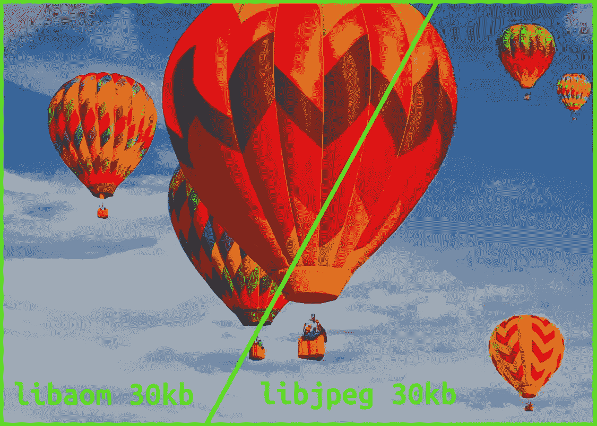
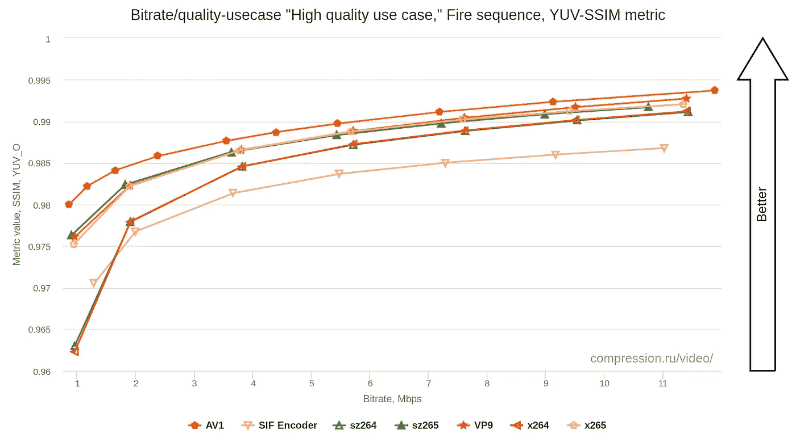
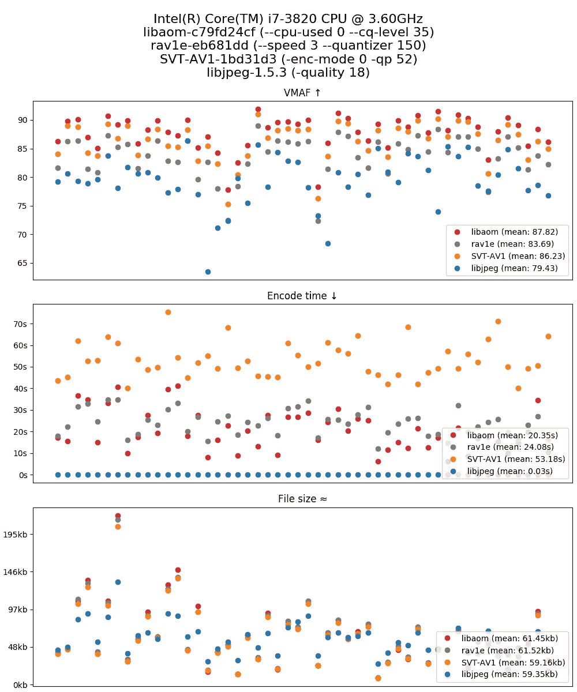
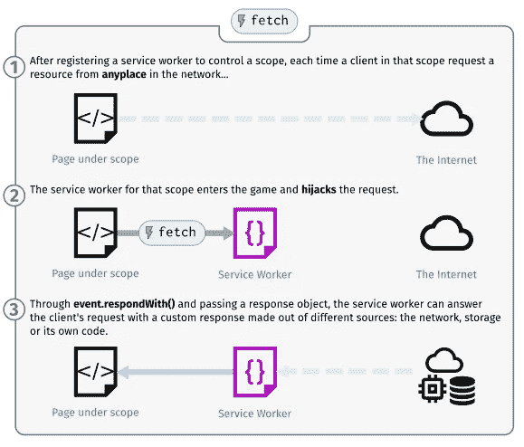
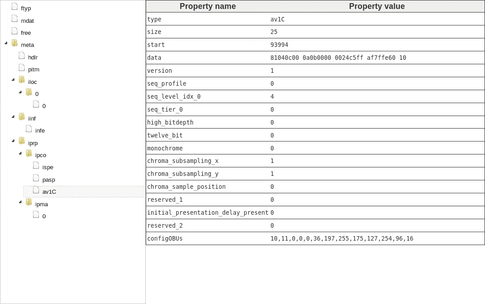
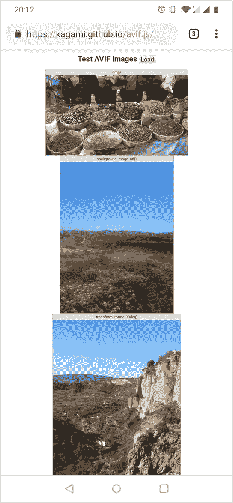

# 立即开始使用高级图像压缩

> 原文：<https://medium.com/hackernoon/start-using-superior-image-compression-today-932e8e086b72>



*本文提出了新图像编解码器的使用案例，并介绍了在前端和后端使用它的库。*

# 压缩概述

首先，为什么要用更好的压缩，网络带宽不是每年都在增加吗？为什么媒体行业[继续推动](http://blog.chiariglione.org/forty-years-of-video-coding-and-counting/)要求更高压缩比的编解码器标准？

这有三个主要原因:

*   **网络覆盖**。虽然你在 5G 蜂窝附近实现了 20 Gbps，但镇上有许多地方的速度根本不是那么快。
*   **流量成本**。即使你下载得很快，大多数电信公司也会对每一字节的数据收费。
*   **更高的分辨率和质量**。12.9 英寸平板电脑至少需要 [8K 才能达到](https://www.wolframalpha.com/input/?i=sqrt((12.9%5E2+%2F+2)+*+(655.6%5E2)+*+(16%2F9)))[人眼分辨率](https://en.wikipedia.org/wiki/Fovea_centralis#Angular_size_of_foveal_cones)，理想情况下无损。我们还没有到那一步。

例如，我经常在地下浏览网页，在隧道内，奇妙的 LTE Advanced 转换为荒谬的 100 Kbit/s。在我主持并经常访问的论坛上，用户上传的照片大多没有经过任何预处理，因此通常图片需要 1-4 MBs，如果你不时打开一堆照片，这就相当多了。更喜欢 800×1200 而不是 2000×3000(导出照片的典型分辨率)会很奇怪，因为后者在高 DPI 显示器上看起来更好。

因此，更高的压缩率是必不可少的，但我们不是已经有了大量的解决方案吗？基于 VP8 格式的 WebP 怎么样呢？VP8 格式是 JPEG 的替代品，最近在大多数浏览器中获得了支持。此外，还有许多其他候选标准，例如 JPEG 2000、JPEG XR 以及基于 HEVC 视频编解码标准的 HEIF。

另一件值得注意的事情是，800×1200 的 4 MB 照片显然没有优化，即使使用普通的 JPEG，我们也可以将它们压缩到 500 KB，而不会损失太多的视觉质量。更有先进的 JPEG 编码器，如 [mozjpeg](https://github.com/mozilla/mozjpeg) 和 [guetzli](https://github.com/google/guetzli) 。



MSU Codec Comparison (April 4, 2019)

嗯，AV1 的[编码工具，由开放媒体联盟开发的新视频编码格式，似乎是目前最有希望获得最高压缩的工具，尤其是在低比特率的情况下。例如，参见](https://jmvalin.ca/papers/AV1_tools.pdf)[的这个](http://www.compression.ru/video/codec_comparison/hevc_2018/#hq_report)和[的这个](https://forum.doom9.org/showpost.php?p=1857587&postcount=1234)基准。既然我们无论如何都需要重新压缩图像来获得新格式的好处，为什么不选择最好的呢？

> 如果你对利用 AV1 进行视频压缩感兴趣，可以看看我之前关于这个主题的文章。

AV1 的另一个优势是它是一种免版税的格式，这意味着你不必向专利持有者付费。不幸的是，软件专利仍然是一个东西。像 JPEG XR 这样的格式没有被广泛采用主要是因为涉及到专利。因此，从技术和法律角度来看，基于 AV1 的解决方案都很有吸引力。

# 认识 AVIF

AVIF (AV1 静止图像文件格式)是基于 AV1 的一种新的静止图像格式。就在最近，1.0.0 的规范发布了，而[也获得了批准，这意味着它已经可以用于生产了。AVIF 文件基本上是一个 AV1 关键帧，打包在 ISOBMFF 容器中，几乎与 HEIF 结构相同，除了使用 AV1 视频格式而不是 HEVC。](https://github.com/AOMediaCodec/av1-avif/commit/67a92add6cd642a8863e386fa4db87954a6735d1)

理论上看起来很棒，但实践呢？鉴于这种格式的新颖方面，工具支持目前并不尽如人意。例如，最新版本的 Chrome 和 Firefox 支持 AV1 视频解码，但仍然不能显示 AVIF 图像，通常需要一些时间才能添加新格式。例如，参见 [Firefox 问题](https://bugzilla.mozilla.org/show_bug.cgi?id=1443863)。

编码也一样。大多数现有软件甚至不知道这种格式。所以我必须自己实现编码和解码库。有关详细信息，请参见下一节。

# 编码 AVIF

如前所述，AVIF 文件无非是 ISOBMFF 容器中的 AV1 intra 帧。所以我们可以使用任何可用的 AV1 编码器来产生实际的图像。

目前可用的三款开源 AV1 编码器， [libaom](https://aomedia.googlesource.com/aom/) 、 [rav1e](https://github.com/xiph/rav1e) 和 [SVT-AV1](https://github.com/OpenVisualCloud/SVT-AV1) 选哪个？



Comparison of intra coding efficiency

由 av1-bench 制作的这张图宣传 libaom 是一个明显的赢家:它在 VMAF 指标上得分最高，其最慢的编码预设实际上比竞争对手的更快，至少在我的 AVX2 之前的 CPU 上是这样。(提供 libjpeg 结果供参考。)这可以用 SVT-AV1 和 rav1e 中选择的速度比质量的权衡来解释。这还不错，尽管静态图像被表示为单帧视频，即使使用最慢的压缩设置，编码一帧也不需要太长时间。所以 libaom 应该是个不错的选择。不是说如果需要的话，我们不能通过速度控制让它更快。

> 我还用我的眼睛比较了 libaom 和 SVT-AV1 编码，因为客观指标不是唯一的事实来源。从我的主观角度来看，它与 VMAF 结果非常相关，尽管有时很难从两者中选择最好的。

所以选择了 AV1 编码器，接下来呢？我要用 AVIF 的论坛后端是用 Go 写的，所以我需要一个该语言的库。经过一番搜索，我找到了[官方 avif 维基](https://github.com/AOMediaCodec/av1-avif/wiki)中提到的 [libavif C 库](https://github.com/joedrago/avif)。它可能工作得很好，应该允许编写 Go 绑定，但是为了更好地理解这种格式，我决定自己编写一个。

由于我们不会从头开始实现 encoder，所以整个库可以归结为 libaom cgo wrapper 和 pure Go ISOBMFF muxer。

libaom 提供了典型的编码器库 C API。我们需要准备帧，即将像素数据封装到库的结构中，对其运行编码功能，并返回结果。

大多数编码器都是用 [Y'CbCr 颜色模型](https://en.wikipedia.org/wiki/YCbCr)操作的，而 [4:2:0 子采样](https://en.wikipedia.org/wiki/Chroma_subsampling#4:2:0)是最常见的。我正在使用标准 Go 库中的图像包从用户提供的图像中获取 RGB 像素值。它支持解码最流行的 JPEG 和 PNG 格式。像素英寸。png 已经被存储为 RGB 和 for。jpg Go 会自动将它们转换成 RGB。我们只需要将 RGB 转换成 Y'CbCr BT.709 4:2:0 有限范围，并可以传递给编码器。如果听起来很吓人，不用担心。该操作归结为将每个像素的 R、G 和 B 分量乘以某个系数和少量加法。

现在我们需要将数据传递给 libaom，我使用小型 C 包装器 [av1.c](https://github.com/Kagami/go-avif/blob/master/av1.c) 来简化 C 和 Go 之间的互操作性。libaom 的 API 非常简单，但是有几件事值得注意:

*   即使是单幅图片，我们也采用两遍编码。libaom(和 libvpx) [以这种方式产生更好的结果](https://forum.doom9.org/showpost.php?p=1860083&postcount=1117)。
*   CRF(libaom 术语中的 Q 模式)很好地映射到我们习惯的 JPEG 转换器的质量滑块。只是从 0 到 63 的范围有点不同，其中 0 表示无损，63 表示质量最差。嗯，编解码器可能很奇怪😉
*   我们可以在 0 到 8 的范围内控制编码速度，4 是默认的，这似乎是合理的。
*   多线程是默认启用的，否则会太慢。行-mt 并行度和 4 个瓦片给出了相当好的结果。

Go 部分在 [avif.go](https://github.com/Kagami/go-avif/blob/master/avif.go) 中可用。

编码器部分已经完成，现在是复用器部分。集装箱的规格可在这里免费获得。[这里的](https://standards.iso.org/ittf/PubliclyAvailableStandards/c066067_ISO_IEC_23008-12_2017.zip)是 HEIF 分机[这里的](https://aomediacodec.github.io/av1-avif/)是 AVIF 分机。我就不赘述了，你可以在 [mp4.go](https://github.com/Kagami/go-avif/blob/master/mp4.go) 里查看最终实现，代码应该是不言自明的。实现这么多 ISOBMFF 盒看起来很乏味，但实际上这很有趣。

整个围棋库在这里发表[。使用归结为`avif.Encode`调用和一点准备/错误处理样板文件:](https://github.com/Kagami/go-avif)

```
package main

import (
    "image"
    _ "image/jpeg"
    "log"
    "os"

    "github.com/Kagami/go-avif"
)

func main() {
    if len(os.Args) != 3 {
        log.Fatalf("Usage: %s src.jpg dst.avif", os.Args[0])
    }

    srcPath := os.Args[1]
    src, err := os.Open(srcPath)
    if err != nil {
        log.Fatalf("Can't open sorce file: %v", err)
    }

    dstPath := os.Args[2]
    dst, err := os.Create(dstPath)
    if err != nil {
        log.Fatalf("Can't create destination file: %v", err)
    }

    img, _, err := image.Decode(src)
    if err != nil {
        log.Fatalf("Can't decode source file: %v", err)
    }

    err = avif.Encode(dst, img, nil)
    if err != nil {
        log.Fatalf("Can't encode source image: %v", err)
    }

    log.Printf("Encoded AVIF at %s", dstPath)
}
```

更多详情参见 [GoDoc 文档](https://godoc.org/github.com/Kagami/go-avif)。`go-avif`还提供简单的 CLI 实用程序，通过控制台的单一命令将图像转换为 AVIF 格式。你可以在这里下载 Windows、Linux 和 macOS 的二进制文件。用法备忘单:

```
# Encode JPEG to AVIF with default settings
avif -e cat.jpg -o kitty.avif# Encode PNG with slowest speed and quality 15
avif -e dog.png -o doggy.avif --best -q 15# Fastest encoding
avif -e pig.png -o piggy.avif --fast
```

# 解码 AVIF

现在我们可以生成 AVIF 文件，但是我们如何显示它呢？如前所述，浏览器还不支持它，我们不能简单地将新的解码器库发布到浏览器，我们受限于 JavaScript 和各种 web APIs。

幸运的是，在过去的十年中，浏览器供应商实现了很多这样的功能，这使得添加新的图像格式成为可能，并且几乎实现了本地集成。我特别指的是[服务人员](https://developer.mozilla.org/en-US/docs/Web/API/Service_Worker_API/Using_Service_Workers)和[网络组装](https://developer.mozilla.org/en-US/docs/WebAssembly)。



Service Worker fetch interceptor (MDN docs)

第一个 API 提供了一种方法来拦截页面上发生的任何获取请求，并使用定制的 JavaScript 处理的答案进行响应。令人印象深刻，不是吗？如果没有这个特性，我们将被限制在命令式的*解码我的文件并在这里画出它*风格的库 API，它当然也是可用的，但是很难看。我们，web 开发人员，习惯于透明的 polyfills，它将实现细节隐藏在引擎盖下，提供珍贵而干净的 API。对于图像格式，这意味着能够显示它与``标签，CSS 属性等。你可能已经猜到了，我将要提出的库正是使用了这种嵌入机制。

第二个 API 呢？由于格式本身还不被支持，我们还需要以某种方式解码它，也就是说，将字节转换成实际的像素来显示。嗯，JavaScript(显然)是图灵完全语言，所以完全有可能用纯 JS 编写任何复杂度的解码器。这实际上在过去已经演示过了，例如参见 [JavaScript MPEG-1 解码器](https://github.com/phoboslab/jsmpeg)。

不幸的是，解码器往往计算量很大，尤其是在 AV1 等新格式的情况下。即使是用计算机最好的朋友语言如 C 和汇编语言实现的本机代码也往往很慢，因为完全可以访问 SIMD 指令、线程和其他东西。

最近，我们在 JS land 中获得了一个有用的工具，可以帮助完成这类任务。这是 WebAssembly，一种新的二进制格式，旨在以接近本机的速度评估代码。

我已经写了一篇关于在网络上使用它的文章,所以这里就不赘述了。我们需要知道的是，它允许以这样的形式转换用 C/C++编写的库，即它可以在网页内执行，而无需对代码进行任何更改。这尤其有用，因为已经存在很好 AV1 解码器。我说的是 [dav1d](https://code.videolan.org/videolan/dav1d) ，当前的艺术状态

> 有一点值得注意，因为这个原因，我们不会用 WebAssembly 获得全速( [< 7 ms](https://www.reddit.com/r/AV1/comments/azrxfu/aomdec_vs_dav1d_021_performance/) 每全高清帧)的原生代码。它目前是 32 位的，没有 SIMD，没有线程(或者在标志后面)，沙盒也带来了一些开销。但是对于静止图像，100-200 毫秒的延迟应该没问题。

我们需要编写的唯一代码是 C 和 JavaScript 的小包装器，用于将所有东西粘合在一起。可以分别在 [dav1d.c](https://github.com/Kagami/dav1d.js/blob/master/dav1d.c) 和 [dav1d.js](https://github.com/Kagami/dav1d.js/blob/master/dav1d.js) 文件中看到实现。此处和 npm 处[均有完整的聚合填料。](https://github.com/Kagami/dav1d.js)

WebAssembly 很酷，但是我们能做得更好吗？最敏锐的读者应该已经注意到，AVIF 的 AV1 和视频中的完全一样，所以我们应该能够使用已经发布的 HTML5 视频的 AV1 编解码器进行解码。原来我们可以！嗯，至少在支持 AV1 的浏览器中，它还是前沿技术。

棘手的是，我们不能将 AVIF 文件原样插入到`<video>`标签中，这根本行不通。我们需要编写 ISOBMFF 容器格式的解析器(demuxer ),以便提取帧(OBUs)的实际内容。然后编写一个 muxer 将该帧打包成可播放的. mp4 视频，该视频也使用 ISOBMFF 容器。



AVIF file in ISOBMFF Box Structure Viewer

这原来是相当有趣和令人兴奋的任务，我的实现可以在[这里找到](https://github.com/Kagami/avif.js/blob/master/mov.js)。我建议你也浏览一下 [ISOBMFF 规格](https://standards.iso.org/ittf/PubliclyAvailableStandards/c068960_ISO_IEC_14496-12_2015.zip)。MP4 文件类似于 XML，即具有一些属性和内容的嵌套标签，但是是二进制的。设计干净简单，我真的很喜欢。

在类型化数组中获得. mp4 文件后，我们需要将其转换为 blob 并传递给标准视频元素。信不信由你，但事实证明这确实是一项艰巨的任务。这是因为在 Service Worker 内部，你不能访问 DOM，也不能用`document.createElement`创建新的 HTML 元素。失败。

经过一番思考，我得出了一个解决方案，这个方案让图书馆的架构变得非常笨拙。因为我们必须在接收它的同一个服务工作者中响应截取的获取事件，但是只能在主线程中处理它，所以我们将只使用消息传递来完成解码任务并返回结果。结果证明它运行得相当好。而且比 dav1d 的 WebAssembly 版本快一点，因为可以访问 SIMD 之类的东西。

还有一件小事需要做。浏览器不会理解解码器返回的未压缩 Y'CbCr 帧。我们只能用标准``标签支持的图像数据来响应。那些是 JPEG，PNG，BMP 和类似的。最简单的解决方案是使用 canvas 组件的标准`toDataURL("image/jpeg")`方法来获取字符串形式的 JPEG 数据。虽然这种方式会导致质量和性能的损失，所以我实现了小的。纯 JS 中的 bmp muxer 改为: [bmp.js](https://github.com/Kagami/avif.js/blob/master/bmp.js) 。BMP 可以包含未压缩的 RGB 像素数据，所以这只是一个写头和重新排序 RGB 到 BGR 三元组的问题。



avif.js demo in Chrome for Android

整个库在这里发布[，也在](https://github.com/Kagami/avif.js) [npm](https://www.npmjs.com/package/avif.js) 发布。用法非常简单:

```
// Install library 
npm install avif.js// Put this to reg.js and serve avif-sw.js from web root
// Both scripts should be transpilled (either manually with e.g.
// browserify or automatically by parcel)
require("avif.js").register("/avif-sw.js");// HTML
<body>
  <!-- Register worker -->
  <script src="reg.js"></script> <!-- Can embed AVIF with IMG tag now -->
   <!-- Or via CSS property -->
  <div style="background: url(image2.avif)">
    some content
  </div>
</body>
```

你也可以在这里看到演示。

我只对它的一点不满意:服务人员是复杂的、脆弱的和错误电话 API。例如，有关服务人员更新机制的详细信息，请参见此处的。你很容易搞乱和破坏整个网站。否则将无法获得更新版本。否则获取请求将永远挂起。不用说，所有这些事情都发生在我开发`avif.js`的时候。希望不会再有类似的问题，因为代码已经稳定了。让我们也希望 web 标准的作者将在服务工作者 API 的下一次迭代中改善这种情况。

# 未来的想法

现在开始使用 AVIF 的大部分工作已经完成，但仍有许多地方需要改进:

*   更好的压缩是很好的，但是我们如何知道当我们重新编码时原始图像的质量被保留？有各种各样的客观指标，如 PSNR、SSIM 或现代 VMAF，但它们根本没有定义我们应该瞄准的“视觉识别”分数。即使他们会，我们应该如何映射编码器的 QP 到分数？
*   我将在我的网站上收集一些关于 AVIF 使用率的统计数据，也许会在下一篇文章中分享。
*   让我们期待 Chrome、Firefox、Edge 甚至 Safari 能很快增加对 AVIF 的原生支持。`avif.js`应该对支持旧版本仍然有用。
*   AVIF 的工具可能会好得多。现在我们仅限于[这一小部分 AVIF 感知软件。如果能在流行的图像查看器和转换器中得到支持，那就太好了。](https://github.com/AOMediaCodec/av1-avif/wiki)
*   AV1 解码器 polyfill ( `dav1d.js`)可能[更小更快](https://github.com/Kagami/dav1d.js/issues/1)，它还没有调到最大。但是由于 polyfill 只是老浏览器才需要，所以没那么重要。