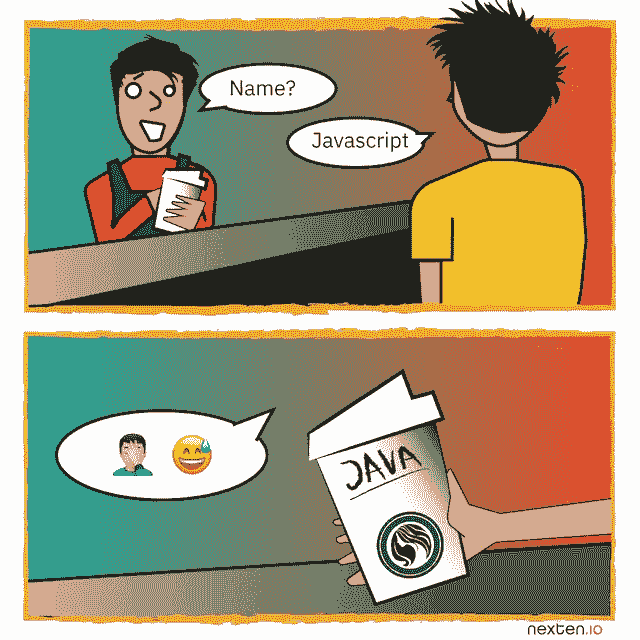
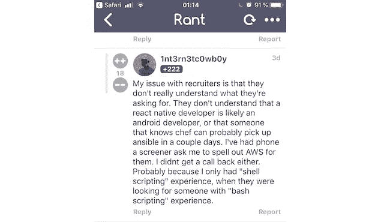
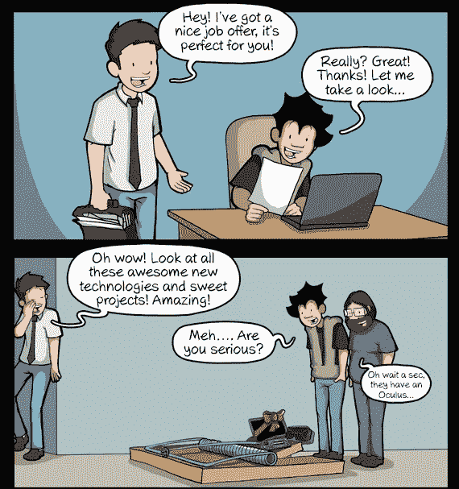
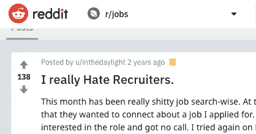

# 从技术面试开始。

> 原文：<https://medium.com/hackernoon/start-with-a-technical-interview-8e185242eeb7>

如果(一些)招聘人员卖咖啡…

[on nexten.io devs are contacted by tech people instead of HR.](https://nexten.io)

在 2018 年成为一名开发者意味着被数百条提供“惊人工作机会”的消息攻击。不幸的是，通常很难评估这些“惊人的机会”是否真的值得你花费时间。

# 令人悲伤的事实

事实是，仍然有很多没有技术背景的招聘人员来找你。对我来说，这感觉像是浪费时间，原因有二。

首先，一个非技术人员应该如何解释和讨论复杂的技术挑战，**并激发你的灵感？**

其次，没有技术背景，**几乎不可能确保你在技术上胜任挑战**。

*上一句普通的痛骂*

# *“让我们在最后问最重要的东西，这样我们会浪费时间”…*

*…从来没有人说过。然而，与逻辑相反的是，招聘过程的两个关键步骤通常只发生在最后——技术面试。*

*直到有人可以具体解释技术挑战，你需要等待技术面试。你的技能也是如此。只有与技术经理的讨论才能确认你的能力符合公司的需求。*

*这意味着决策所需的基本信息只有在最后才被发现。为什么？！*

# *提高质量而不是数量*

*雇主们抱怨吸引科技人才有多难，他们通常会归咎于市场，这是一个有力的论据。这里肯定缺乏技术人才，招聘人员和猎头超载。*

*然而，我怀疑雇佣更多的后者会改变什么。这就像当产品是 s-t 的时候雇佣更多的销售人员一样。它只是不解决根本问题。如果公司试图吸引你而不是让你沮丧，他们应该看看他们的方法。*

## *我们对他们*

**

*社会学理论解释说，“外群体的规模越大，相应的内群体就越认为它威胁到自己的利益，导致内群体成员对外群体持更加消极的态度。”*

*在我们的背景下，很明显，技术人员属于内群体，而招聘人员属于外群体。通过在谷歌上快速搜索，很明显“对外部群体(招聘者)的负面态度”并不是一个神话。*

*现在，考虑到这两个群体，有两种方法来解释一个机会。*

*从外部群体(招聘人员)的角度来看，应该是这样的:*

> *“嗨，戴夫，*
> 
> *我有一个好机会给你。工资范围是 x-y€。*
> 
> *我们公司有很好的发展和学习新技术的计划。我们的许多开发人员每周都会花几个小时来进一步培训自己。*
> 
> *我们正在解决这个问题，我们的技术团队正试图通过使用[编码语言关键字]来解决这个问题。他们也使用敏捷方法。*
> 
> *我们的技术团队真的很棒，他们工作效率很高，也很聪明。"*

*从团队的角度来看:*

> *“嗨，戴夫，*
> 
> *我和我的团队目前正在努力解决这个问题，我们需要像你这样有技能的人来帮助我们进一步开发[技术术语]。我们已经有了[科技行话]和[科技技术]，现在是时候[科技行话]了。*
> 
> *我的人力资源经理让我知道你在寻找一个成长和学习的地方。根据我自己的经验，我可以告诉你，我们被允许每周分配一些时间用于自我发展。我今年开始学习 Golang，所以我每周花 4 个小时来学习。*
> 
> *哦，顺便说一句，3000 公司的技术团队的报酬真的很不错。根据你的经验，这个范围通常是 x-y€。"*

*如果你觉得更有可能回复第二条信息，你会同意:当被一个团队成员联系时，我们自然会感到更舒服。部分是因为同龄人说着同样的语言，开着同样的玩笑，理解我们的痛苦。*

**

## *减少挫败感，停止浪费时间*

*除了更有可能吸引 it 人才的注意之外，从一开始就让 IT 团队参与进来的另一个好处是更高的效率，而且[研究证实了这一点](https://nexten.io/blog/studies-confirm-tech-teams-more-efficient-in-it-recruiting/)。平均而言，IT 团队雇佣一名开发人员所需的面试时间要少 50%。*

*原因很简单，在这篇文章中已经讨论过了，但是我们再来一次:在技术面试中，讨论的是鼓舞人心的部分。你将创造什么，你将如何战胜挑战，以及你为什么会成功。*

*虽然人力资源经理推动招聘流程(搜索和选择)，但应该是首席技术官和技术主管直接联系候选人。他们应该是经过筛选和挑选的候选人的第一接触点。这样可以确保高质量的信息，因为候选人可以立即谈论激励他们的东西:他们将从事的技术。*