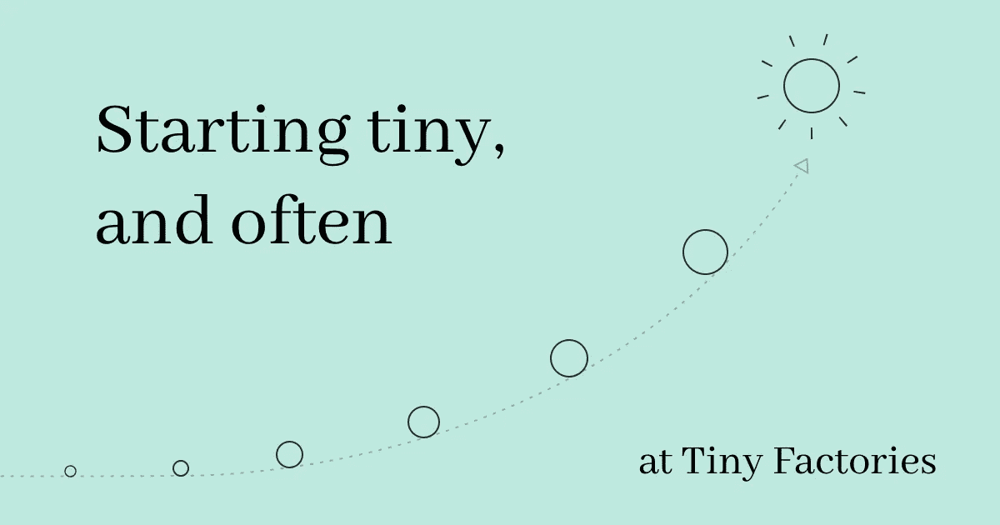
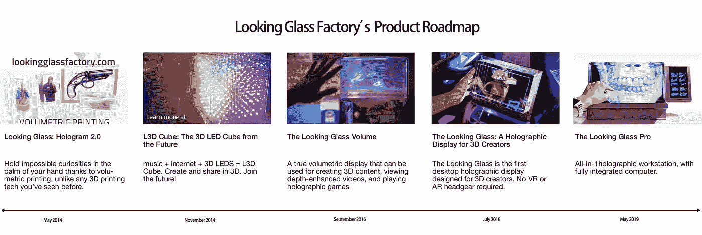
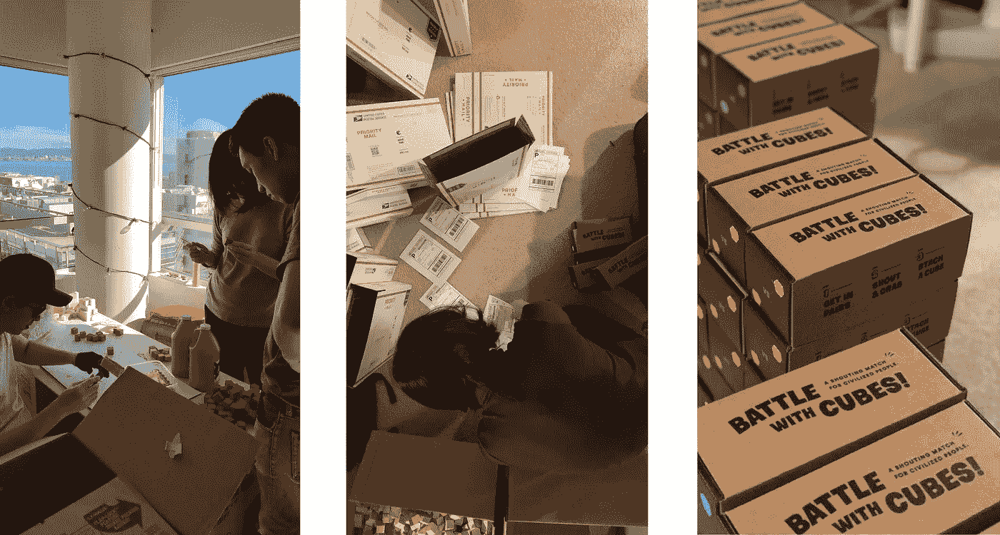
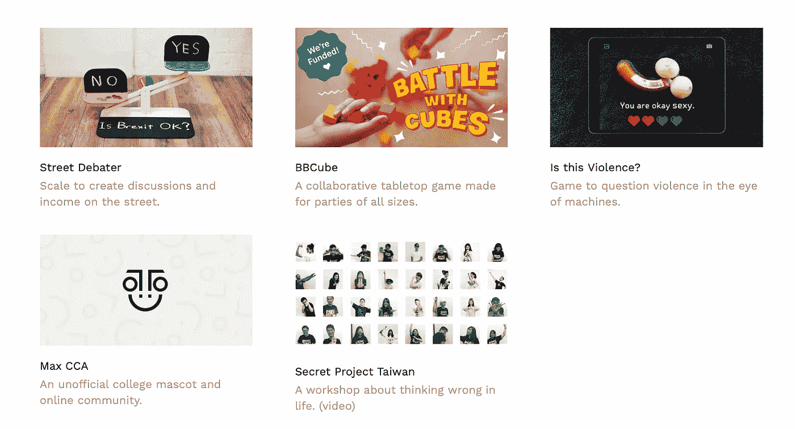
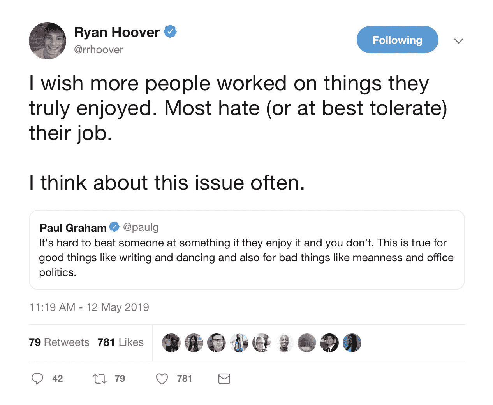
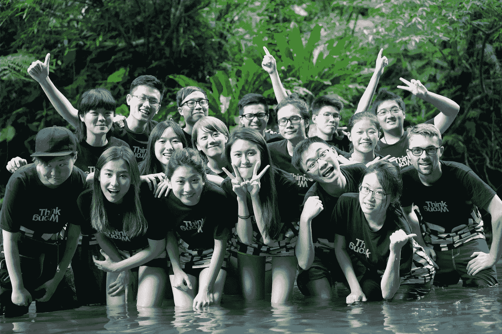

# 开始很小，但经常

> 原文：<https://medium.com/hackernoon/starting-tiny-and-often-at-tiny-factories-a067fc73e3db>

> 我大学毕业已经一年了，我以我没有预料到的方式成长。通过在各种组织做合同工作，我现在对我的长期愿望以及如何实现有了更好的了解。

从这个月开始，我的目标是在接下来的 12 个月里每月推出一款产品。我决定这样做，试图回答我一直以来的两个问题:

# 1.理想和现实之间的差距

城市规划、人机交互和教育都是我广泛感兴趣并希望在有生之年做出贡献的话题。让我印象深刻的一件事是，在过去的几十年，甚至几个世纪里，有多少强有力的建议和调查被提出和进行。然而，大多数这些(乌托邦式的)建议从未实现。我一直在问自己:“如何才能开始缩小理想与现实的差距，学术与行业的差距？”我还没有答案，但我有两个假设想验证一下:

## → **作为文化运动的理想**

为了缩小理想和现实之间的差距，理想需要成为一种文化运动或一种生活方式(例如:[极简主义者](https://www.theminimalists.com/))，用一种非专家也能理解、内化，甚至成为其大使的语言。这要求我们扩展现有的词汇。

发明新的词汇通常很难，但是拥有新的词汇(以及新的生活方式)在尽可能扩展我们的认知方面起着至关重要的作用。两个相对较新的运动/生活方式是极简主义(感谢[、极简主义者](https://www.theminimalists.com/)、玛丽·近藤和其他人)，以及制造者运动(感谢私人实验室、制造者和其他人)。这两个运动的成功之处在于它的名字很容易记，也很容易理解。

强调品牌和传播工作重要性的另一种方法是，想想当你听到[网络中立]vs[互联网歧视]时的情绪，以及[上传文件夹到云端]vs[发送文件夹到数据服务器]的区别(我认真交谈过的许多人都认为他们是在上传数据到天上的云)。

## → **理想是微不足道的倡议**

为了缩小理想和现实之间的差距，需要把理想一口一口地介绍给世界。很多时候，人们很难联想到一个真正新的(不同的)未来，更难在短时间内将未来融入他们的生活。因此，理想应该以更小的块来介绍，这样它才是“可消化的”。

激发这一想法的公司是[窥镜工厂](https://lookingglassfactory.com/)和他们建造全息显示器的旅程。他们从提供立体 3d 打印开始，并像滚雪球一样将他们的产品变成更接近他们最初目标的东西。

简而言之，要将理想转化为可理解和可操作的东西，需要做大量的品牌和沟通工作。

# 2.用我们自己的方式创造

这听起来可能很天真，但是当我从学校过渡到职业世界时，我面临的一个惊喜是我缺乏创造性的独立性。当你从一个初级职位起步时，你(显然)没有机会制定规则和发号施令。然而，我发现当我在一个没有许可的环境中工作和操作时，我工作得更好。我最好的项目都源于问一个问题“如果?”全速前进，尝试新事物。可以理解的是，在工作中，也有一些财务和组织上的限制，需要项目和实验想法以不同的速度发展。虽然这没有什么错，但我开始问自己:

> "怎样才能建立一个无需许可的职业？"

Ex: Behind-the-scenes of shipping [BBCube](https://www.kickstarter.com/projects/1324099197/quickstarterbbcube-a-shouting-game-for-civilized-p?ref=project_link), a successfully crowdfunded tabletop game full of loud and frenzied collaboration and communication.

# 信仰的飞跃

在评估和探索了不同的道路之后，我想我已经选定了我想尝试的东西。我发现一些同龄人也对获得创造性独立感兴趣。我们将一起尝试一种合作孵化器模式，在这种模式下，我们将帮助彼此转变为全职探索和推出独立产品。为了避免其他环境中可能存在的一些不必要的压力和竞争文化，我们还就收入共享模式达成了一致，这将鼓励我们所有人相互协作和支持。(这部分受到了 [Otherlab](https://medium.com/u/7b22f38ff495?source=post_page-----a067fc73e3db--------------------------------) 、 [Indie.vc](https://medium.com/u/2932d151e989?source=post_page-----a067fc73e3db--------------------------------) 和 [Earnest Capital](https://earnestcapital.com/) 运作模式的启发。)

Small scale products and workshops we have worked on in the past.

这里的想法是， [Tomo Kihara](https://medium.com/u/3627bb308c03?source=post_page-----a067fc73e3db--------------------------------) ， [William Felker](https://medium.com/u/5d5ef26897a1?source=post_page-----a067fc73e3db--------------------------------) ，我和其他志同道合的人将相互依赖地工作，以[微型工厂](https://tinyfactories.space/)的名义，每个月制作并推出软件、硬件、软件产品和工作室。有了这个模型，我们希望能够融合制造、学习和交流的界限，以探索我们与世界的关系和对世界的集体贡献。

# 一起变得勇敢

A tweet from Ryan Hoover

最近，Product Hunt 的创始人瑞安·胡佛在推特上写道:“我希望更多的人从事他们真正喜欢的事情。”有无数的原因可以解释为什么我们中很少有人过着自己真正喜欢的生活方式。虽然我承认能够想到这一点已经是一种特权，但我经常想知道，人们需要改变职业或生活方式才能获得这种享受。

包括我在内的大多数人都有许多想法或(职业)道路，我们希望去探索。然而，这些道路往往需要在生活中做出冒险的改变，很少有人最终在早年追求他们真正感兴趣的东西。如果和其他人一起实现信仰的飞跃更容易，那么为什么不找一群人一起去做呢？

在 2015 年和 2016 年的夏天，我在台湾和一群年龄相仿的陌生人一起测试了这一点。那是我一生中最美好的两个夏天。你可以在这里了解更多关于那个[的信息。](http://weiweihsu.com/2019-02-20/becoming-courageous-together)

Secret Project Taiwan 2016: A week-long workshop where 15 college students came together to think of wild ideas, make small bets, and test them out together, on a 500-acre large farm south-east of Taipei

# 学会在公共场合建造

作为一个已经在湾区生活了 4 年多的人，我发现大多数人更喜欢做一个*大揭露*而不是分享他们正在建设的东西。这背后有几个心理原因。然而，我感兴趣的是变得更加透明，分享我在变得(或未能变得)有创造力和经济独立的旅程中的酸甜苦辣。

我非常期待这个机会，让我探索广泛的项目:产品/服务是物理的、模拟的、数字的、通用的、单一目的的、自助的、有用的、无用的、及时的、永恒的等等。

对于每一个产品，我还计划发布一个视频，以博客帖子或推特无法封装的方式捕捉和分享项目的细节。我一直对视频和动画感兴趣，这将是我学习所有这些的机会！

# 这有意义吗？

不久前，有人问我，我说:“在你的 Twitter 个人资料上，你说你对自我实现、城市系统和增强人类智慧感兴趣。比如说，推出一个设计插件如何与这些目标和兴趣保持一致？”这是一个很好的问题。

在最近的[播客](https://www.breaker.audio/venture-stories/e/46331227)中，[蒂姆·奥雷利](https://medium.com/u/8bd20f383de4?source=post_page-----a067fc73e3db--------------------------------)讨论了扩大我们拥有的词汇(以及心态)的重要性。我的一个元目标是在两个方面扩展词汇表:

*   可能的职业道路:虽然我的中期目标是从事能源第一和隐私第一的项目，但我相信，如果我能在一个月的周期内练习制作、推出、改进、营销、销售产品，我会更有用，因为所有这些都是我需要锻炼的肌肉，最好是尽早和经常锻炼。这不仅会为进入不同的市场创造机会，还会为产品留出呼吸的空间，并随着时间的推移有机增长。
*   与更广阔的世界交流的方式:技术将会更加深入我们的生活。我注意到的一个模式是，数字产品或服务通常被视为 100%的技术项目。直到最近，越来越多的人才意识到，一个产品不仅是一个技术项目，也是一个社会项目、文化项目、政治项目、环境项目和[插入人性特征]，所以我认为对我(和其他人)来说，重要的是学会在不牺牲他人生命的情况下承担风险。

虽然这里有一个更大的目标，但我会从小事做起。在接下来的 6 个月甚至 12 个月里，我所做的事情可能与我在这里描述的目标相去甚远。我们会看到的。

# 结束语

我经常听到这样一句话“不成功便成仁”。我一直在想，如果对于我所做的一些工作，我既不想做大也不想回家呢？考虑到我现在住的地方，这可能相当违背直觉。然而，我相信有很多人对自己的创造/调查感兴趣，共同的内涵是，你只能通过节省一吨，然后舒适地消耗这些节省来做到这一点。我希望看到一个可供选择的未来，在那里，任何想要按照自己的方式创造的人都可以通过一些支持结构来实现。

> 每个人都应该有机会释放自己的创造潜能，只要他们愿意。

在你到达你的目标之前，总会有一段旅程或远足。老实说，我对此非常紧张和兴奋；推出成功的产品需要很多技能，而我还不具备。但是，我感觉这是一个机不可失的事情。趁我还年轻，没有什么束缚，我想做一些 20 年后都不可能做的事情。如果这是一个小小的成功，我将会专注于更复杂的项目/产品，需要更多的关注。

## 加入我们的小工厂！

仍然有很多问题需要解决，这就是为什么我们创造了一个空间，让我们在相当短的时间内进行实验并学到很多东西。

如果你是设计师、编码员、插画师或任何制作东西的人，并有兴趣加入在线小组或现场营地，请通过 [**和**](https://tiny-factories.typeform.com/to/hotpAx) 表格报名！如果你想知道小工厂在做什么，请关注我们的 [**时事通讯**](https://camp.us20.list-manage.com/subscribe/post?u=46af769d909161af00534514a&id=46c661d0ff) **。**

# 谢谢你

特别感谢 Andy Shimmin 和 Melissa Kim 分享了对该草案许多版本的深思熟虑的评论。

对 Tomo Kihara 和 Will Felker 表示感谢，感谢他们同意一起变得勇敢。让我们看看我们将从这里走向何方！

如果没有以前的同事和工作环境，我也不会在这里。我非常感激在我过去的实习和工作中有机会和许多有才华的人一起工作。

# 相关阅读

这是一系列引导或帮助我思考的文章

*   [蒂姆·奥莱利](https://medium.com/u/8bd20f383de4?source=post_page-----a067fc73e3db--------------------------------)写了关于[硅谷最受欢迎的增长战略的根本问题](https://qz.com/1540608/the-problem-with-silicon-valleys-obsession-with-blitzscaling-growth/)
*   Sahil Lavingia 写了关于反思我未能建立一个十亿美元公司的文章
*   Jon Yongfook 写了 12 个月内 12 家创业公司
*   我参与撰写了 CCA 非官方吉祥物背后的
*   我写了关于[变得勇敢，一起](http://weiweihsu.com/2019-02-20/becoming-courageous-together)