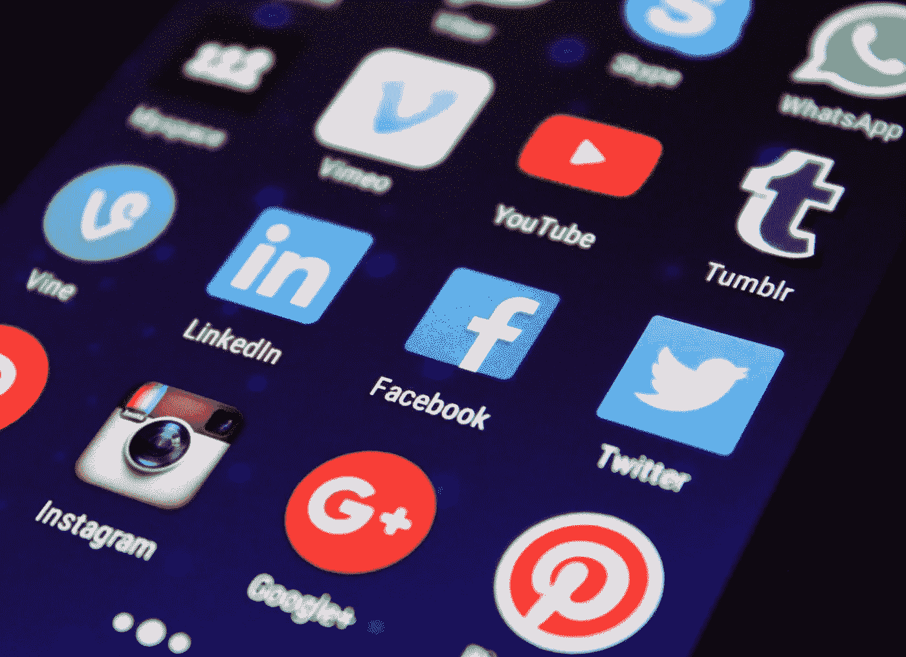
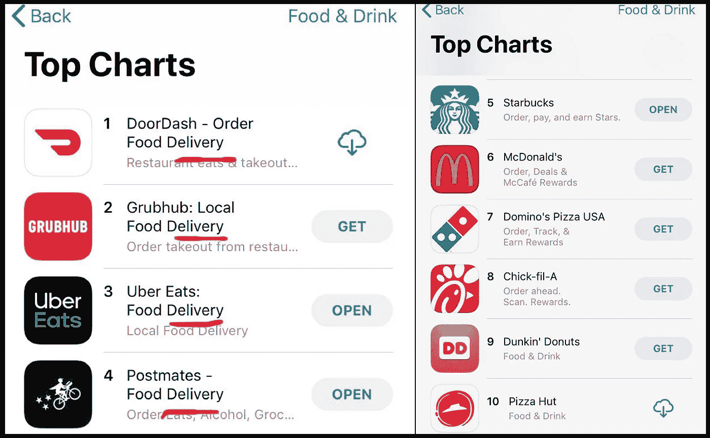

# 创业聚集机会:提前订购和联系信息/社交图中心

> 原文：<https://medium.com/hackernoon/startup-aggregation-opportunities-order-ahead-contact-info-social-graph-hub-9760fcccece3>

在我进行了为期 30 天的从手机中删除所有应用程序的试验后仅仅四个月，我失望地承认我又恢复了 70 个应用程序。虽然这仍然比我最初删除所有内容时少了 66 个，但还是太多了。坦率地说，我有点羡慕像[微信](https://www.bloomberg.com/news/articles/2018-11-07/super-apps-asia-s-new-innovation-to-change-cities-economies)这样的[中国“超级应用](https://a16z.com/2018/01/13/super-apps-china-product-innovation-wip/)，它们在一个统一的应用程序中聚集了消息、拼车、电子商务、游戏和更多功能。我不认为美国版的“超级应用”会很快出现，因为这些功能都是最有价值的美国科技公司(脸书/苹果、优步/ Lyft、亚马逊等)的焦点。).但是，正如网景公司前首席执行官吉姆·巴克斯代尔的名言，“做生意只有两种方式赚钱:一种是捆绑销售；另一个是**解绑。**”

在移动应用领域，我认为是时候进行一些捆绑了。以下是我认为时机已经成熟的几个具体机会:

# **餐厅忠诚度/订单提前量**

前几天，我发现自己在 Chipotle 排队等候午餐。配料的快速休闲柜台上方悬挂着一个牌子，上面写着“*跳过排队:下载 Chipotle 应用程序并提前订购！*“那一刻，我决定，如果我必须在手机上安装一个完整的专用 Chipotle 应用程序，那就不值得跳过这一行——我甚至不经常去那里吃饭！现在，[我坚信排队将在 25 年后成为过去，但我拒绝为我去过的每家餐厅下载单独的应用程序。](https://hackernoon.com/25-things-that-wont-exist-in-25-years-1d475cd9590a)

Food delivery are the top-4 apps in “Food & Drink,” followed by individual restaurants’ loyalty program apps. And yes, I have downloaded Pizza Hut’s app before.

你可能会说“*等一下——有很多聚合的美食应用！DoorDash，Grubhub，Uber Eats，还有 Postmates！难道这些就不能增加一个‘取货’选项吗？*

简而言之，没有。这些公司是围绕着简化和整合食品订购的交付需求而建立的。这包括每家餐厅统一的用户界面/设计，高额费用(高达标价的 30%加上消费者的送货费)，以及明显缺乏与餐厅共享客户数据。虽然这可能对食品配送*和*来说是可行的，但提前订购/忠诚度计划需要彻底的反思。

餐馆建立自己独立的移动点餐/忠诚度应用程序，以拥有客户信息和消息，创造品牌用户体验，激励用户更频繁地点餐。

一些餐厅品牌的移动点餐应用执行得非常好:[据报道，Sweetgreen 有超过 50%的订单来自其移动应用](https://www.recode.net/2018/12/17/18144250/sweetgreen-jonathan-neman-fast-food-salad-delivery-blockchain-kara-swisher-decode-podcast)，而[星巴克的移动点餐&支付占所有交易的 13%以上](https://investor.starbucks.com/press-releases/financial-releases/press-release-details/2018/Starbucks-Reports-Record-Q3-Fiscal-2018-Revenues-and-EPS/default.aspx)。这些应用的成功通常被[归功于用户友好和品牌用户体验/设计，吸引忠诚度计划，以及与其他平台和服务的集成，如 Apple Pay。](https://themanifest.com/app-development/success-starbucks-app-case-study)

拥有客户关系和建立用户体验对 Sweetgreen 来说非常重要，因此该公司计划通过其现有的应用程序建立自己的配送网络，而不是依赖第三方配送合作伙伴(及其高昂的费用)，如 Uber Eats、Postmates 等。

从后勤上来说，提前订餐要简单得多，而且任何整合者都应该与餐馆密切合作。餐厅和消费者都可以从中获益的一个例子是:

*   消费者可以搜索新的餐馆，并保留一份他们“最喜欢的”或他们选择去过的餐馆的清单。
*   餐厅可以为他们的“页面”整合/构建设计，以创造品牌用户体验。或者，该应用程序可以有一个默认/白标选项来快速加入，甚至为没有这种选项的餐厅建立定制的忠诚度计划。
*   用户可以一键注册新餐馆。聚合应用程序会自动填写任何必要的信息——支付信息、电话号码、电子邮件等。
*   消费者可以选择接收来自各个忠诚度计划/餐厅的通知和信息。
*   忠诚度计划被单独跟踪，就像它们是单独的应用程序一样。
*   餐厅可以访问客户信息、订单分析和沟通渠道。

这个提议似乎对消费者和餐馆都是双赢的。我可以随心所欲地在任何一家餐厅使用无缝预订/移动支付，反过来，餐厅排队更短，可以直接找到我。

# 联系信息/社交图中心

你有没有遇到过这样的人，要么交换了名片(今年是哪一年？)，或者要了他们的电子邮件地址，然后在 LinkedIn / Twitter 上单独查找，或者给他们发邮件要了他们的电话号码，这样你就可以给他们发短信/打电话了？

如今，我们有这么多不同的联系和沟通渠道，这可能会让人不知所措。

我想有一个中心枢纽，所有人的联系信息/公共配置文件都可以访问。这可能包括电话号码、电子邮件地址、物理地址(工作/家庭)、LinkedIn、Twitter、Instagram、Whatsapp、脸书、Medium、Spotify 等。它可能看起来像这样:

*   用户输入他们愿意分享的所有联系信息/资料，并为每一条设定规则。这可能意味着我的 LinkedIn 个人资料对所有人都是公开的，但只有当你已经有我的电话号码(或者如果我们在 LinkedIn、脸书等网站上有联系)时，你才能看到我的电子邮件地址。)
*   用户还可以设置分组规则，以确定谁可以看到哪些信息:职业、工作、个人、大学朋友等——所有人都可以访问不同的联系信息或社交网络。
*   为了找到某人，你必须有一个联系信息或确认连接。例如，我可以找到 John Doe，因为我有他的电子邮件地址，或者我们在 LinkedIn 上联系。
*   John 的隐私设置决定了我可以查看哪些其他联系信息，但是如果我还没有访问权限，我也可以请求某些信息。例如，我想为我的婚礼给约翰发送一个“保存日期”——如果他默认不允许我查看他的地址，我可以通过这个中心请求访问，同时提供一个理由。
*   批量请求信息的能力:我可以设置一个带有特定信息的信息请求，而不是必须给每个我没有家庭地址的人发电子邮件/短信(“嗨，我今年要发出节日贺卡，很想知道你的地址，这样我就可以把你包括进来！”)并选择要包含的连接。

如果这个构建和执行得很好，它将是你需要给任何人的唯一一条联系信息，不管你的联系背景如何。

您是否知道任何服务/平台正在利用这些聚合机会？如果是的话，我很乐意聊天！