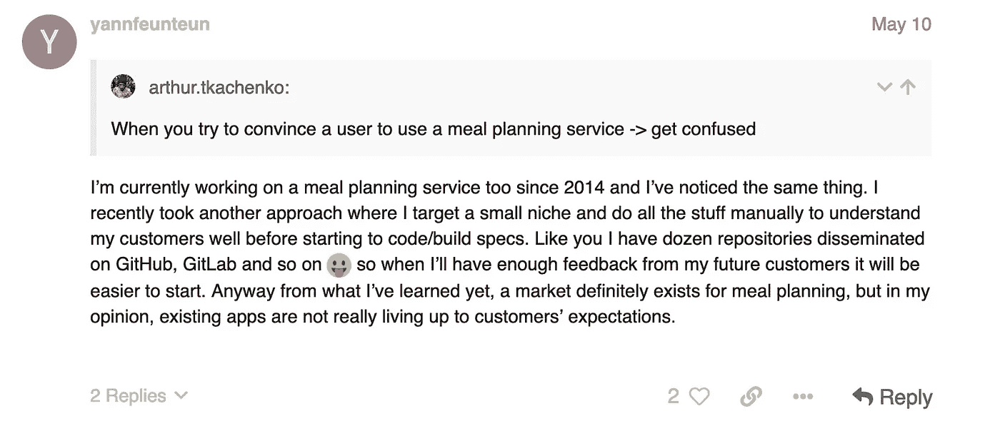
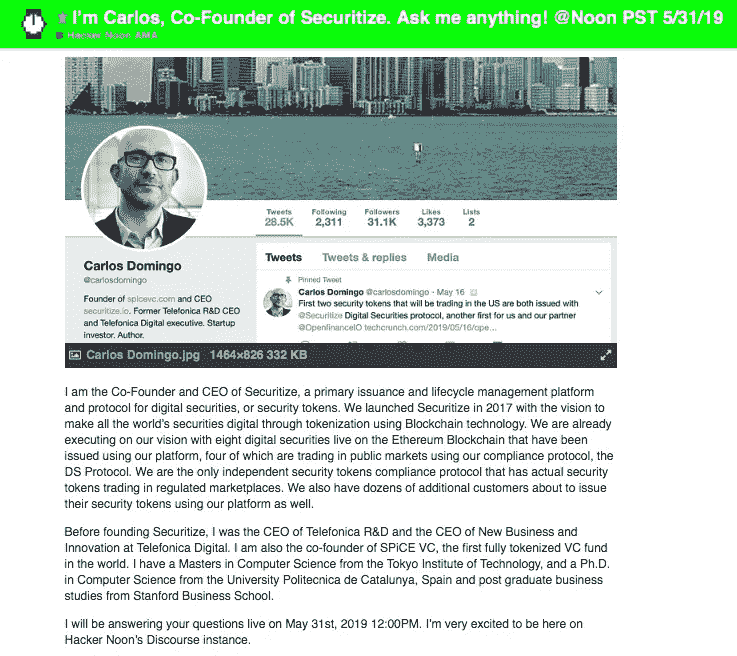
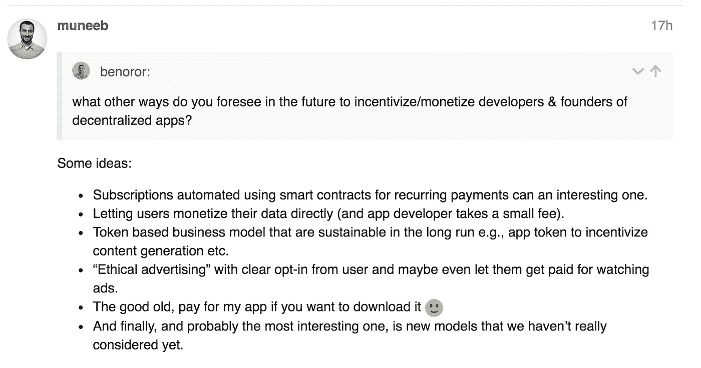
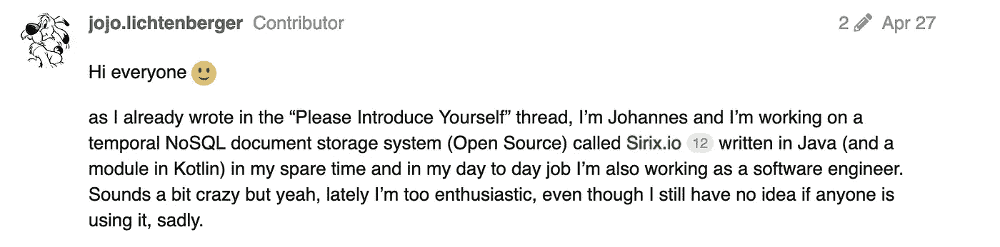
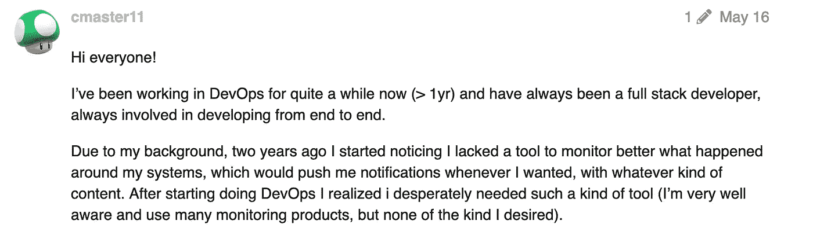

# 创业讲故事:通过在公共场合打造你的产品来获利

> 原文：<https://medium.com/hackernoon/startup-storytelling-profit-by-building-your-product-in-public-d5783597d6fb>

[**(Who wants a Hackernoon sticker?)**](https://community.hackernoon.com/t/who-wants-a-hackernoon-sticker/20)

嘿黑客们，

**你知道吗:**2018 年，Buffer onboarded 新增用户 1，415，697 人——其中 32，991 人现在是付费客户。他们横跨 6 大洲的 80 多人远程团队在社交媒体上吸引了 1，196，413 名集体粉丝和关注者，实现了 18，346，077 美元的收入，比 2017 年增长了 24%。

我知道所有这些，因为 Buffer 的首要价值是*默认透明*，这些信息(以及更多信息)都可以在他们的 [open.buffer 子域](https://open.buffer.com/)上免费获得，以及他们的公共产品路线图。

这里的教训是？

## [**公开制造产品**](https://community.hackernoon.com/c/product) **有利可图。**

[Hackernoon](http://hackernoon.com) 和它的[技术专业人士社区](https://community.hackernoon.com)知道这一点:只需问问超级用户[亚瑟·特卡琴科](https://community.hackernoon.com/u/arthur.tkachenko)，他正在使用我们的[开放软件开发论坛](https://community.hackernoon.com/c/Software-Development)记录他在一个食品技术初创公司 的网络[项目上的进展，并邀请他否则无法接触到的人提供想法和意见:](https://community.hackernoon.com/t/food-alliance-project-diary/2034)

**@**[**yannfeunteun**](https://community.hackernoon.com/u/yannfeunteun/summary)

[阅读更多产品谈。](https://community.hackernoon.com/c/product)

# 不要错过黑客正午 AMAs:

## [今天问一个问题【T27:](https://community.hackernoon.com/t/i-m-carlos-co-founder-of-securitize-ask-me-anything-noon-pst-5-31-19/2912)[我是卡洛斯，Securitize 的联合创始人。问我什么都行！@太平洋标准时间 2019 年 5 月 31 日中午](https://community.hackernoon.com/t/i-m-carlos-co-founder-of-securitize-ask-me-anything-noon-pst-5-31-19/2912)

## 阅读周二的摘要:[我是 Muneeb，Blockstack 的联合创始人。问我什么都行！](https://community.hackernoon.com/t/im-muneeb-co-founder-of-blockstack-ask-me-anything-noon-pst-5-28-19/2808/48)

# 来自 Hacker Noon 社区的更多创业和软件开发故事:

## [我花了一年时间重新发明了 Node.js 框架](https://hackernoon.com/i-spent-a-year-to-reinvent-a-node-js-framework-b3b0b1602ad5)作者[我赖爷 Sandiarsa](https://hackernoon.com/@ktutnik)【11 分钟阅读】

*为什么是另一个框架？我不是住在山洞里，我知道外面有十几个这样的 TypeScript 框架，其中一些非常成熟，甚至已经有了 LTS 版本。我花了一些时间在一些使用服务器端 TypeScript 框架的项目上工作，感觉很好，我们有很多已经成熟的选择，并且有很好的社区。但我仍然有一种感觉，有一些技术需求和规范使它值得再创建一个。*

## 我是如何强迫自己每天使用 pizza API 编码的。作者[Sri ram ananthakrishnan](https://hackernoon.com/@sriram.maven1193)【4 分钟阅读】

周一晚上，在从大学回家的路上，我坐了很长时间的公交车，我开始渴望吃披萨。嗯，我心想，“如果有一个 API，那该多好啊？”。

## [关于我的开源项目的帮助](https://community.hackernoon.com/t/help-regarding-my-open-source-project/2284) — [Johannes](https://community.hackernoon.com/u/jojo.lichtenberger)

**@**[**jojo.lichtenberger**](https://community.hackernoon.com/u/jojo.lichtenberger)

## [创建你的第一个 React 原生应用](https://hackernoon.com/building-your-first-react-native-app-77a192734ff1)作者[内森·托马斯](https://hackernoon.com/@nwthomas)【10 分钟阅读】

我可以保证这一步值得你花时间，就像双份奥利奥或者一只快乐的金毛小狗。我们将在 React Native 中使用免费的天气 API meta weather 构建一个简单的天气应用程序。这里有一个我们将要制作的 [*成品*](https://snack.expo.io/@nwthomas/react-native-app-demo) *的例子。我甚至加入了一个高阶组件和一些额外调味的浅色样式，所以你可以看到 React Native 并不那么疯狂。*

## [像独角兽一样工作:理解敏捷冲刺的真正价值](https://hackernoon.com/work-like-a-unicorn-understanding-the-real-value-of-agile-sprints-8523a3d89ff0)作者[霍利·赫斯特-雷利](https://hackernoon.com/@h2rproductsci)【6 分钟阅读】

*我想分享我对一个话题的想法，这个话题对于那些试图在一个业务中实践真正的敏捷软件开发的团队来说是一个真正的痛点，这个业务不一定与它需要的所有东西都在同一页面上。如果你一直在使用敏捷框架，或者即使你没有，你可能对“冲刺”的概念很熟悉，这是一种在时间限制的迭代中交付工作软件的推动，通常是一周或两周。但是短跑经常引起关注的是一些不同的东西…*

## 作为互联网创业公司的联合创始人和一对双胞胎的父亲，如何保持较高的工作效率

我总是对生产力有一种健康的痴迷。自从我毕业后，我就成了一名连续创业的企业家，每一项新业务的工作量都在增加。2001 年，21 岁的我在哈萨克斯坦开办了第一家提供 IT 服务的公司，2002 年我在法国开办了国际电信业务，为全球提供廉价的长途电话服务。2015 年，我开发了一款冥想应用，但失败了。同年，我成了一对双胞胎的父亲，我的生活发生了天翻地覆的变化🙃

## [DIY——由](https://hackernoon.com/diy-build-your-own-decentralized-thermostat-7acb6a2833d4)[Islam El-Ashi](https://hackernoon.com/@imake)【7 分钟阅读】制作你自己的分散式恒温器

*我们将探索如何构建“分散式”恒温器，在此过程中，我们将探索分散式物联网的概念。从最基本的定义来看，分散式物联网是指不依赖集中式云服务或中间人进行通信的物联网。*

## [凯文·胡](https://hackernoon.com/tips-on-landing-a-software-engineering-job-post-bootcamp-fac8778e3fc7)[【12 分钟阅读】训练营结束后获得软件工程工作的技巧](https://hackernoon.com/@kvinhu)

【2018 年 12 月，我在富斯塔克学院(Fullstack Academy)毕业，在毕业之际踏上了一段奇特的旅程。我参加了兼职沉浸式项目，这意味着我在全职工作，我的项目持续了大约七个月。毕业前三个月，我得到了一个机会，与一家金融科技初创公司签订了一份为期三个月的合同，成为谷歌 G 套件的开发人员。虽然有风险，但我想要的只是继续作为一名开发人员学习，并获得更多的行业经验，使我在毕业后更有市场。所以我就一头扎了进去。我签了三个月的合同，2018 年 12 月，我失业了。

## [我们正在为](https://hackernoon.com/we-are-developing-an-open-source-editor-for-presentations-9cfc69571133)[大卫·达尔·布斯科](https://hackernoon.com/@david.dalbusco)【5 分钟阅读】的演示开发一个开源编辑器

*我刚从一次家庭旅行回来，现在正坐在里斯本和苏黎世之间的飞机上，我想我可以利用我的旅行时间写一篇关于我们的项目 DeckDeckGo(用于演示的开源编辑器)的非技术性博客文章(对我来说是新的东西)。在这篇文章中，我将尝试总结我们是谁，我们为什么要开发这个项目，以及我们在开发过程中所处的位置。*

## [停止“创新”，告诉我们你做了什么](https://hackernoon.com/stop-being-innovative-and-just-tell-us-what-you-do-50559db17a8f)作者[诺亚·惠勒](https://hackernoon.com/@iamnoahwheeler)【4 分钟阅读】

我坐在一个挤满人的房间的后排，参加一个当地集会的演讲。每个人都有自己的一份比萨饼，并急切地等待着听演讲者告诉我们有关创新的知识。他首先告诉我们技术是如何进步的。然后，他概述了思考创新过程的框架。最后，他给幻灯片下了一个定义，并告诉我们这是他如何看待创新的。

## [哪些营销人员忘记了由](https://hackernoon.com/what-marketers-have-forgotten-about-marketing-b713fb0d519d) [Shira Feuer](https://hackernoon.com/@shira.feuer) 进行的营销【11 分钟阅读】

我和很多公司谈过，他们说“我们非常擅长效果营销，现在我们需要打造品牌。”这是我在任何地方都能看到的一种模式。这是一个问题。我一次又一次地听到同样的事情，这是因为 ***我们已经忘记了营销和销售之间的区别。***

## 做了一个新的通知工具，我正在寻找一些测试版的测试者——[阿尔贝托·马凯蒂](https://community.hackernoon.com/u/cmaster11/summary)

**@**[**cmaster11**](https://community.hackernoon.com/u/cmaster11/summary)

## [关于困难事情的简单事情](https://hackernoon.com/the-easy-thing-about-hard-things-a88c1c81091f)由[克里斯·赫德](https://hackernoon.com/@ChrisHerd)【5 分钟阅读】

*在我活在这个星球上的越来越多的岁月里，我几乎没有取得什么成就，所以这不是一些回顾过去并开出让我成为世界领先企业家的生存偏见的创业颂歌。那个* ***是*** *我希望我的前进方向，我认为停在平衡点上——我建立的初创公司会继续上升还是会崩溃——是一个很好的点，让我对我最初到达这里的情况有一个概述。*

## [斯科特·胡佛](https://hackernoon.com/9-keys-to-remote-freelancing-c060727fda40)【19 分钟阅读】远程自由职业的 9 个关键

我决定写一份更有思想、更完整的远程自由职业指南。这些建议来自我作为自由职业首席财务官的真实经历。

## 一家初创公司的首席执行官在成长模式中面临的挑战(以及如何克服这些挑战？)by[Tarun Kohli](https://hackernoon.com/@tarun_kohli)【7 分钟阅读】

我完全可以在二进制的世界里畅游，想象令人愉快的用户体验。我一直相信上帝存在于细节中，并且会在处理架构、代码和用户界面设计的复杂细节时获得巨大的满足感。这些技能帮助我发布了成功的软件，并为公司建立了最初的信誉，但当公司开始发展超过这个阶段时，人们需要一个完全不同的关注点。

## 高级工程师长什么样？由[杰里米·怀特](https://hackernoon.com/@JeremyWight)【6 分钟阅读】

*这是我与团队成员分享的东西，鉴于它在内部得到的强烈反响，我认为它可能对其他工程经理、董事、初创公司首席技术官、高级工程师、有抱负的技术领导者等有所帮助。*

## 你现在在做什么？继续，[给哈克农社区一个引擎盖下的巅峰](https://community.hackernoon.com)。你永远不知道你会学到什么，或者你会遇见谁！

[黑客正午科技](https://medium.com/u/c7899df0cba0?source=post_page-----d5783597d6fb--------------------------------)里面见

附言 [**谁想要哈克农贴纸？**](https://community.hackernoon.com/t/who-wants-a-hackernoon-sticker/20)