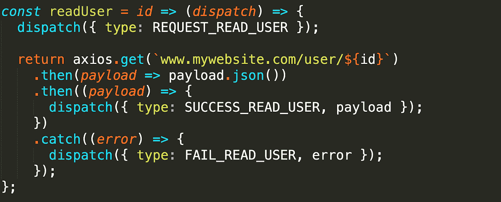
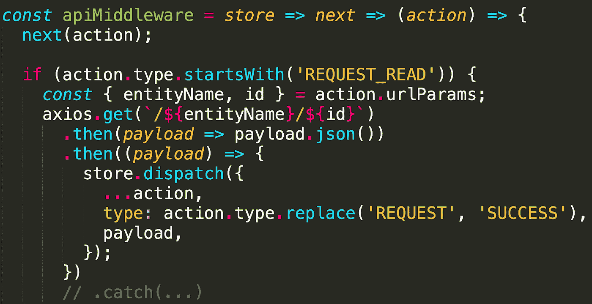
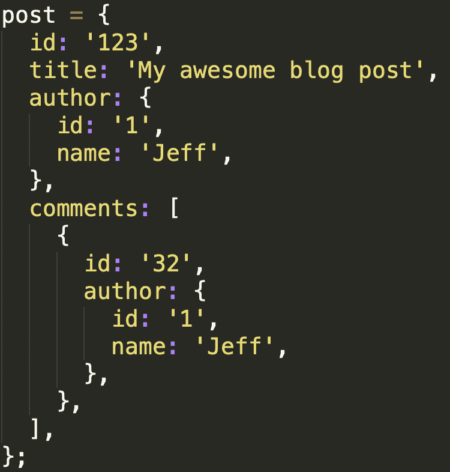
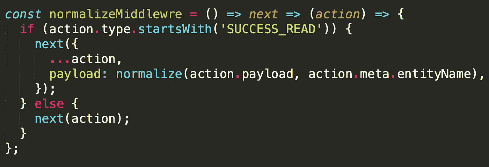
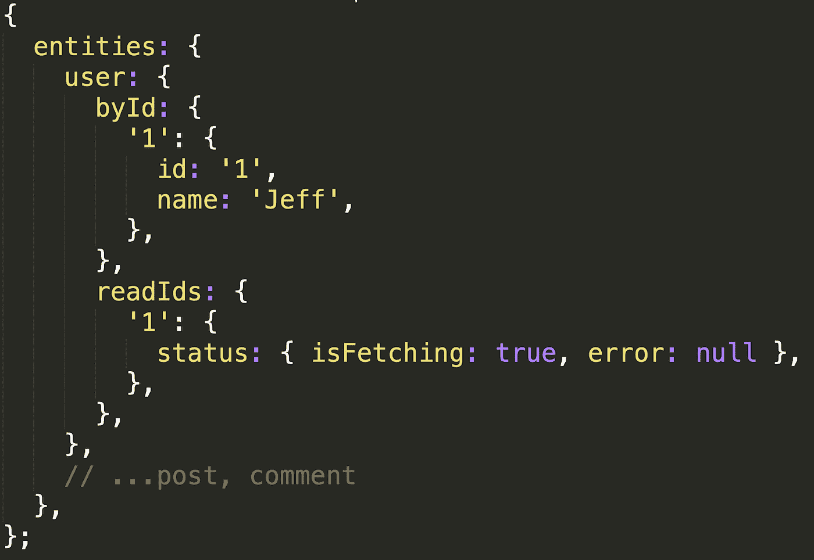
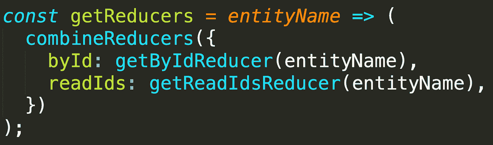
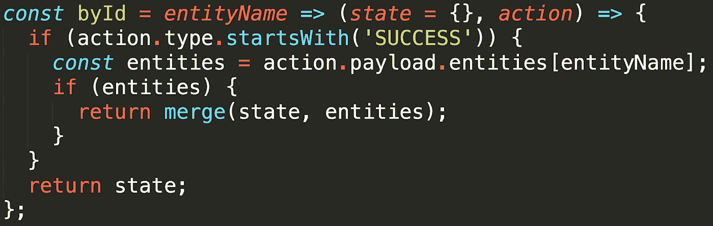
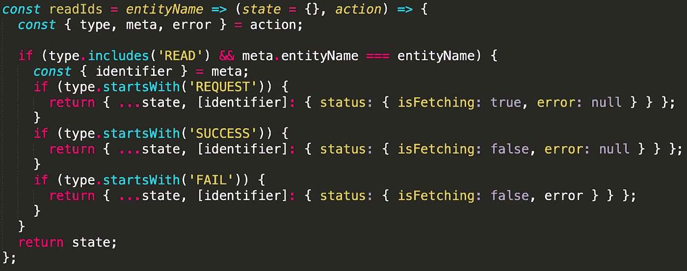

# 如何为 REST api 设置 Redux

> 原文：<https://medium.com/hackernoon/state-management-with-redux-50f3ec10c10a>

## 关于如何以通用方式设置 Redux 的指南，以减少样板文件并简化高达 90%的 API 调用

# 动机

我在 React London Meetup 上做了一个关于 Redux 状态管理的演讲，我想写一篇文章来更深入地解释我提出的解决方案的架构。

您还可以在本文末尾找到一个具有完整 Redux 设置的 [Github](https://github.com/onoufriosm/redux-setup-guide) repo，准备用于真实世界的 React 应用程序，以及我的演讲视频。

# 问题是

Redux 是一个令人惊叹的库。它非常简单，同时功能强大。它也非常灵活。这很好，因为它让我们可以自由地按照我们想要的方式设置它，并根据我们的应用程序的需要来调整它。但是这种灵活性也使得将它集成到大型应用程序中变得困难，因为我们有太多的方法可以做到这一点。

关于如何设置 Redux 来执行 api 调用的一般共识是:

*   声明常量(`REQUEST_ACTION`、`SUCCESS_ACTION`、`FAIL_ACTION`)
*   创建一个负责分派请求操作的操作创建者
*   使用 API 服务调用端点(使用像 redux-thunk、saga、observables 这样的第三方库来实现)
*   接收有效载荷。如果成功，派遣`SUCCESS_ACTION`，如果不成功，则派遣`FAIL_ACTION`
*   处理减速器中的有效负载
*   连接 redux 以对组件做出反应(使用`mapStateToProps`和`mapDispatchToProps`)

并且这必须为每个单独的 API 调用重复**。这很快导致大量重复的样板文件和不可维护的代码。**

# 解决办法

让我们看看如何通过一个读取单个用户的例子来解决上述问题。

**动作创建者**

现在，如果我们想要读取一个用户，我们通常要做的第一件事就是声明一些常量，如下所示:

我们要做的第一个改进就是彻底**去掉这些**！我们真的不需要将它们声明为常量。我们可以很容易地动态计算它们，并通过一些单元测试来确保一切按预期运行。

我们通常要做的下一件事是像这样定义一个动作创建者:

这个动作创建器使用 redux-thunk 首先发送一个`request`动作，然后执行 API 调用并根据响应触发一个`success`或`fail`动作。但是这段代码有两个问题:

1.  这个动作创建者非常特定于`user`实体。读取实体的功能几乎是相同的，所以只为用户定义一个动作创建者是不太可重用的。例如，如果我们想读取一个组实体，代码几乎是相同的。
2.  我们通过触发请求动作和 api 调用来混合关注点。动作创建者应该只负责发送动作。

让我们看看如何解决这些问题。动作创建器被重写，其唯一的责任是触发一个`REQUEST`动作。同时，它现在能够用于系统中的任何实体。它看起来是这样的:

从这个动作创建者的名字可以看出，它是通用的(与上一节的`readUser`相对)。它可以被系统中的任何实体使用。这个动作创建者接受两个参数:这个`entityName`(可能是`user`、`group`、`post`等等)和我们想要读取的实体的 ID。此操作创建者正在启动具有以下字段的操作:

1.  类型，将是`REQUEST_READ_${entityName}`(我们将`entityName`设为大写只是为了统一)
2.  `urlParams`，它将保存我们将用来计算我们将调用的 API 端点的参数。
3.  元数据，将被我们的 reducers 和中间件使用。

因此，我们在这里实现的是创建一个动作创建器，它可以与系统中的任何实体一起工作，类型是动态计算的，因此我们不再需要常数，它的唯一目的是返回一个动作。

**API 中间件**

接下来，我们想要创建一个 API 中间件，我们将把所有用于发送 API 调用的逻辑放在其中，然后根据响应分派成功或失败的操作。

这是它看起来的样子:

这里我们监听其类型以`REQUEST_READ`(例如`REQUEST_READ_USER`)开始的任何动作，然后我们调用 API 端点并根据响应触发`SUCCESS`或`FAIL`动作。

这里需要注意两件事是:

1.  在上一节的请求动作中定义的`urlParams`用于计算 api 端点。
2.  动作类型也是动态计算的。

因此，这个 API 中间件适用于系统中的任何实体，消除了动作类型常量和任何外部库的使用，使我们能够进行 API 调用。

**规范化中间件**

接下来，我们应该规范化我们从 API 得到的响应。在我们看到如何做到这一点之前，让我们看看什么是规范化:

许多应用程序处理本质上是嵌套的或关系的数据。下面显示了一个示例:

Payload with nested data (before normalization)

这是一个`post`实体，它有一个作者和一些评论(评论本身也有作者)。

通过规范化，我们可以返回包含 id 的嵌套实体，这些 id 收集在字典中。下面你可以看到`post`的规格化版本。

Normalized Payload

所有嵌套数据现在都通过`id`键引用一个实体。

规范化数据的一个主要好处是更新变得非常容易。例如，如果我们将带有`id` 1 的用户名从“Jeff”更改为“Peter ”,那么使用第一种方法，我们需要在两个地方更新它。但是对于规范化的数据，我们只需要在一个地方更新它。您可以看到第一种方法如何在大型应用程序中变得不可维护。在非标准化版本中，我们可能最终不得不在 20 个不同的地方更新状态！

规范化有效负载的中间件将如下所示:

在这里，我们监听其类型以`SUCCES_READ`(例如`SUCCES_READ_USER`)开始的任何动作，然后规范化有效载荷数据。

**注意:**对于我们所有的标准化需求，我们将使用 [normalizr](https://github.com/paularmstrong/normalizr) 库

**减速器-存储结构**

这就是我们将如何构建我们的商店:

来自我们 api 的所有数据都将存在于`entities`键下。在该目录下，我们将为系统中的每个实体保留一个密钥(例如`user`、`post` e.t.c)。

在每个实体键下，我们将有:

1.  一个`byId`键，我们将在这里保存从我们的 API 返回的有效载荷(在一个规范化的结构中)。
2.  一个`readIds`键，我们将在这里保存 api 调用的状态。

为了达到这个目的，我们需要一个 reducer creator。reducer creator 是一个接受参数并返回 reducer 的函数，如下所示:

这个`getReducers` reducer 创建器接受`entityName`参数并返回两个 reducer(使用`[redux](https://github.com/reduxjs/redux)`库的`combineReducer`函数)。

# **重要提示:**

我们将不得不为系统中的每个实体调用这个 reducer creator。所以**每个**实体都有自己的`byId`和`readIds`减速器。当我们解释减速器如何工作时，理解这一点很重要。每个 redux 动作都要经过所有的 reducers。这意味着在每一个`byId`和每一个`readIds`缩减器中，我们只需要考虑与这个缩减器对应的实体相关的动作类型或动作有效负载。为了充分理解这些减速器是如何工作的，看看 Github repo(在本文末尾)也是一个好主意。

**byId 减速器**

`byId`缩减器将监听任何以`SUCCESS`(例如`SUCCESS_READ_USER`)开始的动作类型，如果在我们的有效载荷中有这个实体类型的数据，它将在状态中被合并。例如，如果我们的有效载荷看起来像上面规范化有效载荷中的数据，并且这是`comment`实体的`byId`缩减器，则有效载荷的注释部分将被合并到状态中。

**准备好减速器**

在这里，我们将听到任何以`READ`开始的动作，这是相关的`readIds`减速器。例如，如果动作是`REQUEST_READ_USER`并且这是`user`实体的`readIds`缩减器，我们将继续更新状态。

**连接高阶组件**

当我把 redux 代码和 react 代码连接起来时，我最不想做的事情就是减少样板文件。通常，在我们想要与 redux 连接的每个 React 组件中，我们必须使用`react-redux`的连接库，然后定义一个`mapStateToProps`和一个`mapDispatchToProps`函数来实现这一点。为了实现可重用性，我想将这段代码移到一个更高阶的组件(HOC)中，如下所示:

这个特设收到了两个论点。`entityName`和一个`id`。然后它传递给我们的孩子三个论点:

1.  一个读取函数，调用我们在前面章节看到的`readEntity`动作创建器。
2.  `entity`是从相关`byId`减速器中选择的数据。
3.  `status`是从相关`readIds`缩减器中选择的 api 调用的状态。

这个 HOC 可以这样使用:

在第 22 行中，我们实现了上面看到的特设。我们传递两个必需的参数。的`entityName`，在这种情况下，它将是`user`，因为我们要读取一个用户。以及`id`，在本例中是`1`，因为我们想要读取 id 为 1 的用户。

特设给我们三个参数(读，状态，实体)。然后在我们的`User`组件中，我们可以在组件挂载时调用`read`。我们还可以使用状态来查看 api 调用是否已经完成。如果有，那么我们显示用户名，否则我们可以显示一个`Loading..`文本。

这里我们可以看到 react 组件中的样板文件减少了多少。我们唯一需要连接 react 和 redux 并进行 read api 调用的就是使用这个 HOC。

# 概述

1.  我们**去掉了动作类型常量**
2.  我们定义了一个通用的 **readEntity 动作创建器**,它可以被系统中的任何实体使用，它唯一的职责就是触发请求动作。
3.  我们定义了一个 **api 中间件**来调用我们的端点，并根据响应触发成功或失败操作。
4.  我们定义了一个**标准化中间件**负责标准化我们的有效负载。
5.  我们定义了一个**get reducers**reducer creator，它返回两个子 reducer**byId 和 readIds**
6.  我们将逻辑移动到**连接**我们的 react 组件和**高阶组件中的 redux。**

# 达到 90%的覆盖率(或更高)

需要注意的是，上面所有的代码都是非常通用的。这意味着我们可以读取系统中的任何实体，而无需编写任何额外的代码。但是，为了实现 90%或更多的 api 调用需求，我们必须处理以下所有情况:

1.  创造
2.  ead
3.  更新
4.  删除
5.  以多对多关系将一个实体与另一个实体连接或分离。

我们必须允许单个或多个实体(例如，我们应该能够读取单个用户或多个用户，或者一次删除一个或多个帖子)。

实际上，为了实现这一点，不需要很多额外的代码。

你可以在下面的 Github repo 中找到完整的代码库。

# Github 回购

 [## onofriosm/redux-设置-指南

### 描述如何以一种通用的方式设置 Redux 以方便 90%的 api 调用的指南…

github.com](https://github.com/onoufriosm/redux-setup-guide) 

本报告作为如何以通用方式设置 Redux 的指南。这是一个麻省理工学院许可回购，所以请随意使用它，叉它或使用它作为一个灵感。

# React 伦敦 meetup 演讲视频

 [## 学习 React -最佳 React 教程(2019) | gitconnected

### 排名前 49 的 React 教程-免费学习 React。课程由开发人员提交并投票，使您能够…

gitconnected.com](https://gitconnected.com/learn/react)