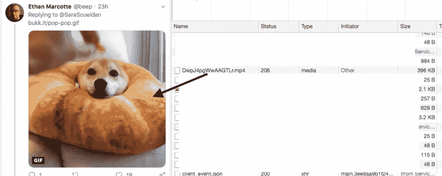
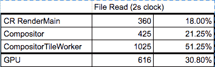
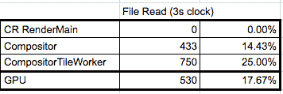
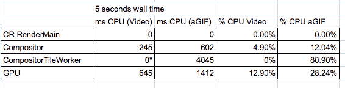
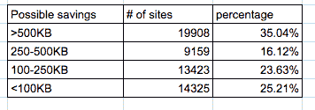

# 网络现状:动画 gif

> 原文：<https://medium.com/hackernoon/state-of-the-web-animated-gifs-b8ef0d61f8a0>

每隔几个月，我都喜欢深入研究 HTTP 档案，以了解 web 是如何使用各种技术的。2018 年写了关于[图片、](https://dougsillars.com/2018/05/21/state-of-the-web-top-image-optimization-strategies/) [视频](https://dougsillars.com/2018/10/25/state-of-video-smashing-magazine/)[Base64 编码](https://calendar.perfplanet.com/2018/performance-anti-patterns-base64-encoding/)。在今天的帖子中，我想看看网络是如何使用动画 gif 的。(顺便说一下，这是 GIF 中的一个硬 G)。

在这篇文章中，我将介绍一些 aGIFs(TL；DR:它们很大，使用大量的 CPU)，然后看看 gif 是如何在移动网络上使用的(来自 HTTP 存档)。

# 谁不喜欢动画 GIF 呢？

好吧，如果我们追溯到古代计算机历史(1990 年)并阅读 [GIF 规范](https://www.w3.org/Graphics/GIF/spec-gif89a.txt)，我们会发现这个瑰宝:

> *“图形交换格式并不打算作为一个动画平台，尽管它可以以一种有限的方式完成。”*

嗯……这真是出乎意料。但是，不是每个人都在生产中使用 aGIFs 吗？

# 在生产中使用 aGIFs

如今，aGIFs 最受欢迎的应用之一是社交媒体回应。如 Twitter、脸书、Slack 等。都在使用 agif——它们到底有多糟糕？我的意思是——Twitter 甚至在每张图片上都显示了一个小小的“GIF”chy Ron:

# 假新闻:他们没有使用 aGIFs

没错——尽管图片说是 GIF——Twitter 实际上是在提供一个循环的电影文件。

# 为什么不使用 aGIFs

Tim Kadlec 最近写了一篇关于网络性能伦理的文章。我认为他的观点非常适合动画 gif。当网站发送非常大的文件时，对于使用较慢连接和较慢设备的人来说，网站需要更长的加载时间，这实际上是将一些人从对话中移除。

正如 GIF 规范所说，agif 并不是传递动画内容的最佳方式。

# 文件大小

使用 20 世纪 80 年代末的最新技术，aGIFs 通过以非常快的帧速率翻转静态 GIF 文件来制作动画。每秒 0–60 个 GIF 文件意味着大量的图像，这些文件可以迅速膨胀到非常大的尺寸。另一方面，视频文件使用跨时间维度的压缩，创建较小的文件大小来传送完全相同的内容。这篇文章顶部的 Shaq/Cat shimmy aGIF 是 2.5MB，但 mp4 的重量只有 119 KB，小了 95%。

本质上，Twitter(和其他社交媒体平台)正在使用这种方法来传递我们都喜欢的 aGIFs(稍后会有更多相关内容)。

# CPU 成本

由于 aGIFs 只是图像的连续渲染，CPU 和 GPU 必须在浏览器中连续渲染每一帧。在一台 Moto G4 上测试(使用 [WebPageTest](https://www.webpagetest.org/result/190110_XY_7b0b408c8001698b0a6daa19d0248b90/) ，使用 Chrome Tracing 选项，我发现 CPU 和 GPU 都相当忙于渲染 aGIFs。在下载过程中，我发现 CPU 上的一个工作线程大约 90%的时间在运行，GPU 大约 30%的时间在运行。

现在，CPU 工作是在一个工作线程上完成的——所以它不会影响 Javascript 等的解析。但是，所有这些处理必须在 aGIF 显示在屏幕上之前发生，这可能会进一步延迟您的 aGIF 在具有脚本和其他 CPU 密集型任务(如附加图像)的页面上的交付。

# 加载后:进一步的 CPU 影响

由于屏幕必须重新渲染 aGIF 的每一帧，只要 GIF 在屏幕上，CPU 和 GPU 就一直在使用。下面的数据是页面加载 15-18 秒后 CPU/GPU 处理器的消耗情况——设备上唯一发生的事情是 GIF 动画，CPU 和 GPU 的利用率仍然分别接近 40%和 18%。

调整 GIF 的大小(我设置宽度=100%)，增加了合成器 TileWorker 的时间(这是有意义的——它是[光栅化图像](https://aerotwist.com/blog/the-anatomy-of-a-frame/))。我将这张较大图像的处理器使用情况与自动播放/循环播放的[视频](https://dougsillars.github.io/VideoPerf/shaq.html)进行了比较，视频的 CPU/GPU 使用情况要低得多:

(注意:视频 TileWorker 为 0，因为视频的栅格化是在非 Chrome 录制的硬件上完成的)。

# 今天在网上使用 aGIFs

到目前为止，我已经展示了 aGIFs，虽然很棒，但确实很大，需要下载大量数据，一旦开始播放，就需要大量设备资源来继续在浏览器中播放。 [Lighthouse performance](https://developers.google.com/web/updates/2018/05/lighthouse#use_video_formats_for_animated_content) 审计现在建议将所有动画移动到电影文件，并估计下载节省的 KB，以及切换到电影格式节省的时间。12/15/2018 HTTP Archive 记录了前 120 万移动网站的灯塔报告。

在 120 万个网站中，我们看到 56，815 个网站有 aGIF 文件，占所有评估网站的 4.6%。Lighthouse 告诉我们将 aGIFs 转换为视频的潜在节省。事实证明，35%的手机网站可以保存超过 500KB 的数据，75%的网站通过切换到视频文件可以保存超过 100KB 的数据。

换句话说，20，000 个(占 HTTP 档案中所有网站的 1.6%)移动网站可以通过从 aGIFs 转向视频文件来减少至少 500 KB 的动画负载，42，400 个网站可以节省超过 100 KB。下载时间、渲染时间，然后在设备上以更少的 CPU 和 GPU 开销完成。

# 结论

动画循环内容(媒体的 aGIF)在这里停留。然而，使用 aGIF(格式)应该被否决，你应该切换到循环电影文件。这不仅可以更快地提供内容，使用更少的处理器时间和更少的数据，还可以让更多的人访问您的页面——那些使用较慢连接和较慢设备的人。

*原载于 2019 年 1 月 15 日*[*【dougsillars.com*](https://dougsillars.com/2019/01/15/state-of-the-web-animated-gifs/)*。*