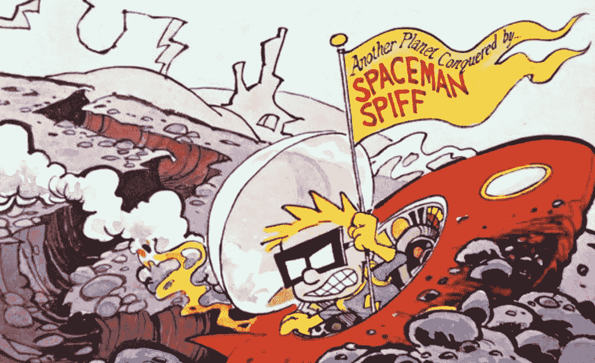
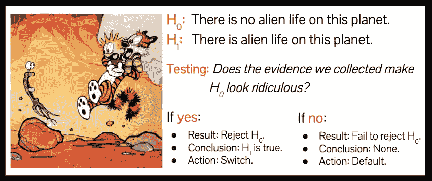

# 一句话的统计推断

> 原文：<https://medium.com/hackernoon/statistical-inference-in-one-sentence-33a4683a6424>

每一个[假设测试](http://bit.ly/quaesita_statistics)——从 STAT101 到你最害怕的博士资格考试——都可以归结为一句话。正是 20 世纪 20 年代的[大洞察力](https://en.wikipedia.org/wiki/Statistical_Methods_for_Research_Workers)催生了你今天在野外遇到的大多数统计追求。你可以从中得到我们的纪律，所以如果你想理解[的统计](http://bit.ly/quaesita_statistics)，就在视平线上涂鸦这句话，并每天冥想。

Image: [SOURCE](https://i.pinimg.com/originals/d3/69/17/d369178c4d82b67722037dc1b85c39c5.jpg)

序言够了！这是魔法咒语本身:

> "我们收集的证据让我们的零假设看起来可笑吗？"

我不是在开玩笑；这就是全部了。经典假设检验是这样的。每一个。单身。时间。看到它被剥去牙齿和爪子，你们这些带着 STAT101 伤疤的人可能会感到失望。你们中的其他人可能很难理解，所以让我们看一个简单的例子。*如果这个例子不够温柔，那就改为读* [*这个*](http://bit.ly/quaesita_hypexample) *。*

# 用外星人做假设检验

你刚刚被选中进行终极冒险:在行星上寻找外星生命。不幸的是，就像每一份理想的工作一样，总有一个经理。你邪恶的经理给了你一个微不足道的用户界面。它只有两个按钮:是和否。

This is the entirety of your control panel. YES, there is alien life here. NO, there’s no alien life here. There is no way to input maybes, comments, or hedging.

更糟糕的是，你的经理没有给你搜索整个星球的预算。你所能做的就是着陆，选择一个方向，开始行走直到你的氧气供应变得不稳定，然后回头按下这两个按钮中的一个。因为你只会在大行星上着陆，而你的氧气罐里没有足够的氧气来梳理它们表面的每一英寸，你将面临不确定性:你可能最终不知道真正的答案是什么。

# 步骤 1:默认动作是什么？

每个假设检验都从同一个地方开始。[决策者选择默认行动。如果你不检查任何证据，这就是你承诺要采取的行动。换句话说，如果你连这个星球都没有登陆，你会按是还是不是？](http://bit.ly/quaesita_damnedlies)

这不是一个只有一个正确答案的问题。这是一个 MBA 问题，实际上取决于你的太空探索公司的政治，所以我们将使用[两种可能的违约来演示这个例子。](http://bit.ly/quaesita_yesbutton)如果你和大多数读者一样，你更喜欢默认的“否”按钮，那么我们就先用这个吧。

> 默认操作:按“否”按钮。

# 第二步:可选择的行动是什么？

…在这里，你会认为统计数据很难。替代行动就是如果你不接受你的默认选择，你将会做什么。

> 替代操作:按“是”按钮。

如果你读了[我对这一切如何运作的分析](http://bit.ly/quaesita_damnedlies)，你会回忆起你最终按下“是”的唯一方式是如果证据让你觉得按下“否”是愚蠢的

# 第三步:什么是零假设？

你刚刚降落在一个星球上，你问自己，*“如果我知道这个星球的一切，什么情况下不按钮会是一个快乐的选择？”*如果这个星球上没有外星生命。答对了。这是无效假设(H0)。

> H0:这个星球上没有外星生命。

# 第四步:另一个假设是什么？

另一个假设(H1)是当空值为假时一切都为真。

> H0:这个星球上没有外星生命。
> 
> H1:这个星球上有外星生命。

哒哒！您已经建立了假设，并准备收集和分析一些数据。

# 收集数据

你是一个勤奋的灵魂，所以你不会只是驶过那些撞上“不”的行星。你会着陆你的宇宙飞船，走出去，开始朝着某个悲惨的方向走三个悲惨的小时，然后跋涉回来。在这整个过程中，你观察到…没有外星人。

> 统计:0 外星人。

# 我们学到了什么有趣的东西？

当我在直播课上讲授这一点时，典型的反应是，“在这三个小时的徒步旅行中，没有看到外星人。”这个回答可能有点不正确，因为我们是如何制定决策的。

> 你如何制定决策很重要。并不是所有的决策都适合 STAT101 教授的方法。

通过从事经典统计学，我们同意一个法律契约，即只有人口对我们感兴趣。这是整个地球的表面，而不是三小时步行的微小样本。

> 样本统计:0 外星人在 3h 徒步旅行。
> 
> 人口参数:？？整个星球上的外星人。

如果我们正在做[分析](http://bit.ly/quaesita_analysts)，我们可能会对我们刚刚观察到的这个小事实感到兴奋，但这不是我们在这里的目的。我们在做统计，所以任何关于整个星球的不具信息性的东西都是无聊的。我们不能说我们没有看到外星人，是因为这个星球上没有外星人，还是因为他们在另一块我们还没有翻过的岩石下面。我们没有办法区分这两种可能性。所以，我们再试一次。一个字的回答。我们学到了什么有趣的东西？

> 没什么。我们没有学到什么有趣的东西。

这太神奇了。你看到这里发生了什么吗？

我们刚刚分析了数据，我们已经(正确！)除此之外什么也没学到。我们允许自己这么做的频率有多高？跟我一起说:我什么也没学到，我为此感到骄傲！

你应该养成经常什么都不学的习惯，因为如果你每次测试假设都坚持学数据之外的东西，你会学到一些愚蠢的东西。

当你在做涉及[置信区间和 p 值](http://bit.ly/quaesita_statistics)的[类统计推断](http://bit.ly/quaesita_statistics)时，什么都不学是一件非常好的事情。

# 这不是分析！

如果这让你不舒服，深呼吸。在涉足统计领域时，你可能会像分析师一样思考。这里有龙！

> 分析关心这里有什么，而统计更关心那里没有什么。

每个人都有资格做[分析](http://bit.ly/quaesita_datasci):简单地看一个数据集，总结你所看到的。“这些是电子表格中的事实。没有观察到外星人。”在分析中，你每次都会学到一些有趣的东西，因为你感兴趣的范围是你眼前的数据。分析只有[一条黄金法则](http://bit.ly/quaesita_datasci) : *坚持数据，不要超越数据。*在那个安全的空间里，优秀是以你的数据嬉戏有多快来衡量的，而且你不会出错……除了偶然进入统计领域。可怕的事情潜伏在你的数据之外。

在不伤害自己的情况下超越电子表格需要一种不同的心态，这就是为什么统计更棘手。我们怎么称呼那些不理解哲学就到处跑的牛仔类型的人？对自己和他人都是一种危险。

> 当你与未知战斗时，微妙的事情很重要。

有些人似乎认为，每当他们分析数据时，宇宙欠他们超越事实的洞察力。如果我们像伊卡洛斯一样从我们知道的东西跳到我们不知道的东西，为什么我们会认为这很容易？

> 如果每次测试假设都坚持学东西，那你会学到一些愚蠢的东西。

当你做统计时，拥抱什么也学不到的可能性。(从这篇文章开始？)

# 万物跳动的心脏

统计学是在不确定的情况下改变你想法的科学。如果我们对坚持我们的证据称之为愚蠢的努力感到可笑，我们会改变主意，这就是为什么每个假设检验都归结为同一个核心问题:

> "我们收集的证据让我们的零假设看起来可笑吗？"

至于家庭作业，你现在可以去推导大部分的统计数据。(或者你可以继续看，也没关系。)

# 分析外星数据

我们在路上没有看到外星人，我们的无效假设是这个星球上没有外星人。我们对这个大测试问题的答案是什么？证据让我们的空看起来很可笑吗？怎么会呢？样本中没有外星人与人口中没有外星人是完全一致的。

现在想象一下，如果我们不是在路上看到外星人，而是看到这个绿色的小家伙。

假设那是外星人(而不是泡菜)，我们学到了什么？如果我告诉你我观察到了这个外星人，我还在考虑这个星球上没有外星生命的可能性，你会告诉我你观察到了一个傻逼。

这个证据让我的零假设看起来很可笑！当证据让一个假设看起来很荒谬时，我们该怎么办？我们不坚持那种无稽之谈。摆脱它！

因为我们总是狡猾地设计我们的两个假设，使它们跨越所有的可能性，拒绝一个迫使我们接受另一个。作为优秀的常客，我们一开始对这个星球没有任何看法。当然，我们有最喜欢的动作，但是你不需要意见。初学者似乎会被理解按钮(动作)和理解行星(假设)之间的区别绊倒，但你不会，对吗？

# 觉得可笑？拒绝！

如果我们的证据让我们回答*【是的】*我们的大测试问题，我们拒绝这个荒谬的假设，并作出有利于选择的结论。我们现在觉得执行默认动作很可笑，所以我们切换到另一个动作并按 YES。所以我们已经获得了关于这个星球的整体知识:上面有生命！

# 不觉得可笑吗？什么都没学到。

我们对测试问题的回答是*【否】*的场景呢？在 STAT101 课堂上，他们教你在这种情况发生时写下这首令人费解的歌谣:“*我们未能拒绝零假设，并得出结论，没有足够的统计证据支持这个星球上存在外星生命。”*我确信这个表达的唯一目的是让学生的手腕紧张。我总是允许我的本科生这样写:我们没有学到任何有趣的东西。

# 恭喜你，你什么也没学到！

一无所获似乎是一场悲剧。我们花了这么多精力来收集和分析我们的数据…我们从中得到了什么？什么都没有？！在我们悲叹和捶胸之前，记住我们不是来这里了解事情的。我们在这里是为了决策，我们的最终目标是行动的明智选择，而不是知识。我们是来按按钮的，该死。

当涉及到决策时，这个框架实际上非常坚固。我们的默认行为是我们的保险政策，这使得我们可以什么都不学。它给了我们一份合同，上面写着，*“如果我什么都不知道，我会这么做。”*

通过进入这个推理游戏，我们宣布我们很乐意在不知情的情况下采取默认行动……如果不是这样，我们就不应该出现在统计中。如果没有默认操作，这些都没有意义。

我们的默认动作是按下“否”按钮，所以这就是我们在拒绝无效假设失败时所做的。我们采取满意的行动，因为没有理由改变主意。这是正确的行动吗？难倒我了。但是我们做了诚实的努力来说服自己，现在我们正问心无愧地做着我们计划要做的事情。

未能拒绝零假设并不意味着我们相信这里没有外星人。据我们所知，它们就在下一个岩层附近。如果仅仅因为我们没有找到它们就断定它们不在这里，那我们就太傻了。如果我花了 5 分钟找我的钥匙却一无所获，这并不意味着它们不在我的公寓里。意思是我不知道他们在哪。有区别。(你的蜘蛛感应是不是不舒服的刺痛？然后读[这个](http://bit.ly/quaesita_statistics)。)

> 没有理由改变主意吗？按计划进行默认操作。这是正确的行动吗？\_(ツ)_/欢迎来到不确定性。

**总结一下:**假设检验的游戏就是要确定我们收集的证据是否让我们的零假设看起来很荒谬。一切都取决于我们如何看待根据证据改变我们的想法。

要想知道在一个默认行为是“是”而不是“否”的平行宇宙中会有什么不同，请阅读这里的。(提示:万物皆变！)

# 感谢阅读！YouTube AI 课程怎么样？

如果你在这里玩得开心，并且你正在寻找一个为初学者和专家设计的有趣的应用人工智能课程，这里有一个我为你制作的娱乐课程:

Enjoy the entire course playlist here: [bit.ly/machinefriend](http://bit.ly/machinefriend)