# 偷偷进入高性能登录页面

> 原文：<https://medium.com/hackernoon/steal-your-way-to-a-high-performance-landing-page-149ea067520d>

## 优化软件产品登录页面的三步盗窃策略

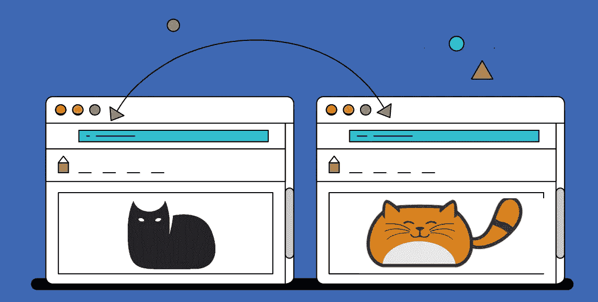

我第一次被要求为一个软件产品创建一个登陆页面时，我不知道这个页面应该是什么样子。

三年过去了，我才获得了启动某个项目的信心。在那段时间里，我研究了我能找到的每一个网站，并努力建立一个能让销售尽可能简单的网站。首先，我对竞争对手进行了分析。

在这篇文章中，我将分享我在过去三年中在我们竞争对手的网站上发现的观察和想法。

在我们的项目中，我们不断改变我们的登录页面，并为我们的产品创建额外的页面，以最大限度地提高投资回报率。

然而，并不总是清楚我必须改变什么，以及我必须运行什么样的 A/B 测试。这就是为什么我总是关注竞争对手。我将在下面提供他们网页的分析。为了进行分析，我选取了我们直接竞争对手的 20 个登录页面。

关于我们公司的几句话。我们为 Mac 和 PC 生产桌面照片编辑软件。这很重要——一款面向摄影师的桌面软件产品。

在我们的业务中，登陆页面可能是网站或特定营销活动中最重要的部分。通常，有多达 5 个关键因素使其工作。我过去常常把一个平台想象成一张空白的画布，所以在上面放一些元素必须能吸引游客。

首先，一个登陆页面必须激发兴趣，激发灵感，并解释产品是关于什么的。此外，它还必须做其他一些事情:

*   鼓励使用产品的欲望。
*   展示主要特征和差异。
*   为访问者提供足够的信息。

一切都必须在很短的时间内完成。

不幸的是，没有魔术棒来制作一个完美的登录页面。但是我的目标是强调和测试一组特定的元素，这些元素是大多数竞争对手经常使用的。我希望这些分析和我的发现能激励你在你的网站上尝试一些新的东西。

## 第一步:准备一份竞争者名单。

该榜单按 Alexa 指数排名:

1.  [苹果照片](https://www.apple.com/lae/macos/photos/)
2.  [土坯灯箱](https://www.adobe.com/products/photoshop-lightroom.html)
3.  [Pixlr](https://pixlr.com/)
4.  [Movavi](https://www.movavi.com/photo-editor/)
5.  [照片](https://www.fotor.com/)
6.  [Picmonkey](https://www.picmonkey.com/photo-editor)
7.  [亲和力](https://affinity.serif.com/ru/)
8.  [InPixio](https://www.inpixio.com)
9.  [极光博士](https://skylum.com/aurorahdr)
10.  [ACDsee](https://www.acdsee.com/en/index)
11.  [DxO PhotoLab](https://www.dxo.com/dxo-photolab/)
12.  [On1 原始照片](https://www.on1.com/products/photo-raw/)
13.  [黄玉](https://topazlabs.com/)
14.  [Polarr](https://polarr.co)
15.  [人像专业版](https://www.portraitprofessional.com/)
16.  [像素化器](https://www.pixelmator.com/pro/)
17.  [抓一个](https://www.phaseone.com/en/Capture-One.aspx)
18.  [AfterShot Pro](https://www.aftershotpro.com/en/products/aftershot/pro/)
19.  [透镜球](https://lensball.com/)
20.  [风景 Pro](https://www.landscapepro.pics/)

## 第二步:设置要探索的关键要素。

下面描述的因素对我的特殊情况很重要，对你的任务可能不一样。无论如何，每个人在与同事的日常纠纷上都需要证据。

元素列表:

标题、描述、首屏行动号召、免费试用、注册获得免费试用、页面价格、产品优势、功能列表、交互元素、视频、截图、前后照片、页眉、固定页眉、页脚、任何社交证明、客户反馈、奖项。

最终的表格如下所示:

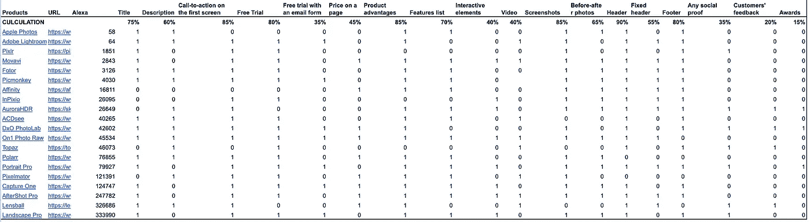

## 第三步:分析每个元素。

在收集信息的帮助下，让我们确定每个特定元素的使用频率。

有几个有趣的统计事实:

> 75% —包含标题
> 
> 60% —在标题后包含描述
> 
> 85% —在第一个屏幕上包含行动号召
> 
> 80% —包含免费试用
> 
> 35% —让用户仅在输入电子邮件后下载试用版
> 
> 45% —显示产品价格
> 
> 85% —包含产品优势
> 
> 70% —显示功能列表
> 
> ***多媒体***
> 
> 40% —包含视频
> 
> 85% —包含屏幕截图
> 
> 85% —包含前后照片
> 
> ***页眉页脚***
> 
> 90% —包含页眉
> 
> 55% —包含一个固定的标题，在滚动时保留在屏幕上
> 
> 80% —包含页脚
> 
> ***社会证明***
> 
> 35% —包含某种形式的社会证明
> 
> 20% —包含评论
> 
> 15% —包含奖励

## 这些数字告诉我们什么？

我没有任何页面的具体转换率，所以我无法定义哪个元素起作用(统计上)。然而，这个分析的目标是定义一系列的想法。这些信息足以完成这一任务。

以下是我的主要发现:

## 标题:脱颖而出之道。

简短而难忘的标题形成了访问者的期望。它必须强调产品优势，将产品与竞争对手区分开来。

## 测试想法:

*   新标题的测试
*   在标语后添加或更改描述

以下是一些竞争对手的例子:

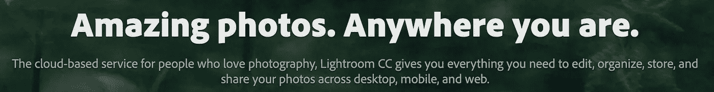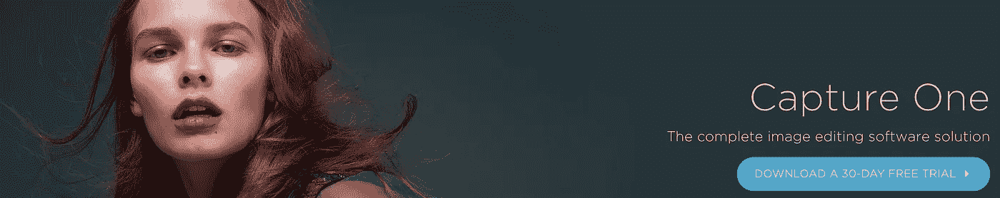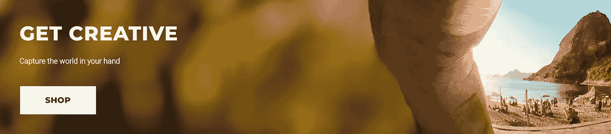

实际上，我无法从统计数据上证明对一个标题转化率的影响。因素当然重要，但是稍微改一下，影响就显现不出来了，不敢大刀阔斧的改。

## 免费试用:确定型号。

免费试用按钮大大降低了熟悉产品的人的销售转换率。同时，缺少一个按钮，无法获取新客户。

找到折中的方法不仅对登陆页面优化很重要，对整个产品也很重要。大多数竞争对手在他们的页面上使用试用模式，这形成了客户习惯。不试一试就购买软件产品是很难被说服的。

## 测试想法:

*   测试按钮的数量。
*   测试行动号召“免费试用”与“立即下载”。
*   澄清按钮优先级:试用 vs 购买。
*   试用前先测试一下注册表格。
*   测试每个通信信道的不同按钮。

以下是一些竞争对手的例子:

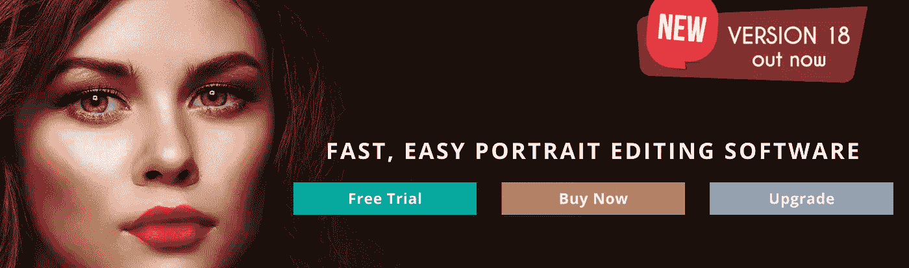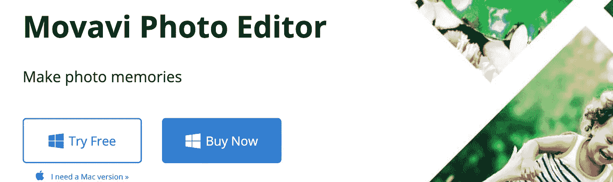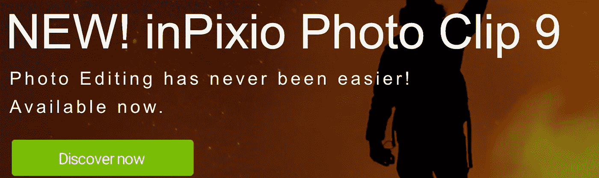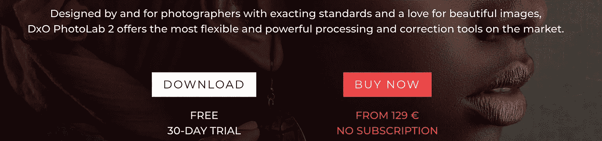

这些测试是无止境的，但是最佳模式是存在的:为新访问者和熟悉产品的访问者创建两个独立的登录页面。根据我的发现，新访客可以试用，其他人会对“立即购买”按钮做出反应。

Adobe 就是这样工作的。访问者登录后，他们的主页会发生变化:

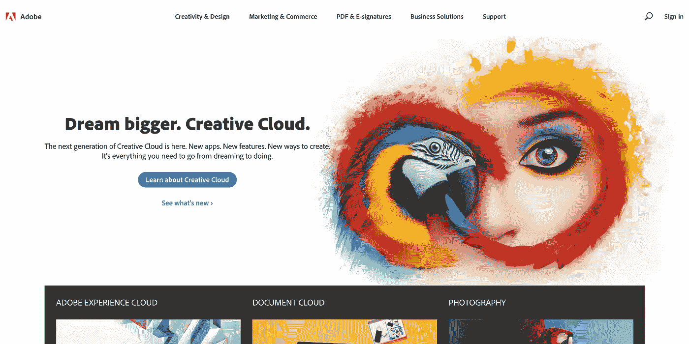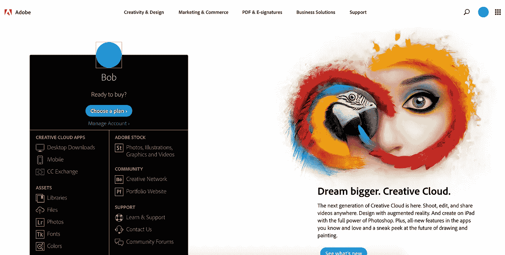

## 行动号召:在第一个屏幕上吸引访问者。

几乎所有我们的竞争对手(85%)的页面都在第一屏包含行动号召，这会严重影响转化率。绝对值得测试。

## 测试想法:

*   测试行动号召的新短语——试试“下载”这个词
*   尝试不同的颜色和格式。
*   测试在第一个屏幕上显示产品特性的交互元素。

以下是一些竞争对手的例子:

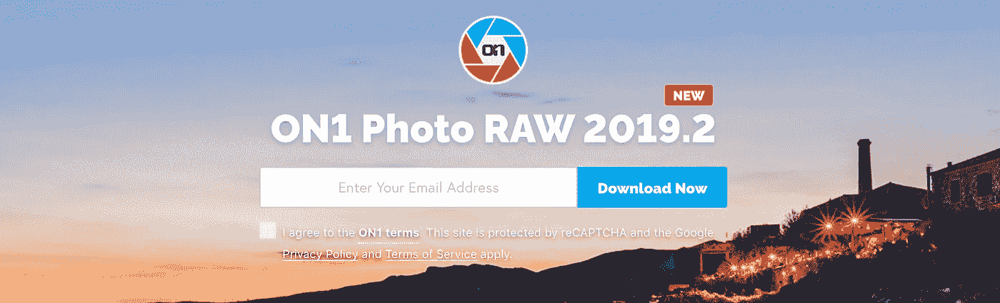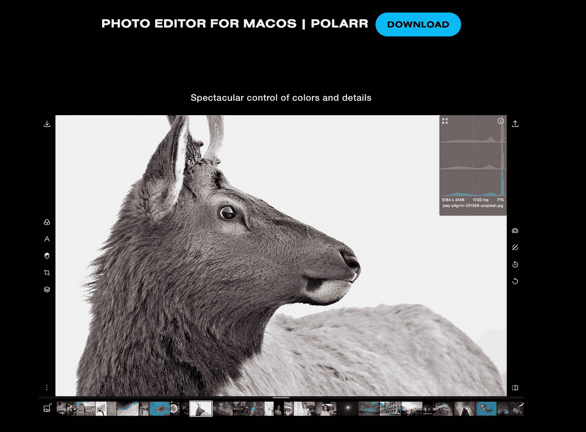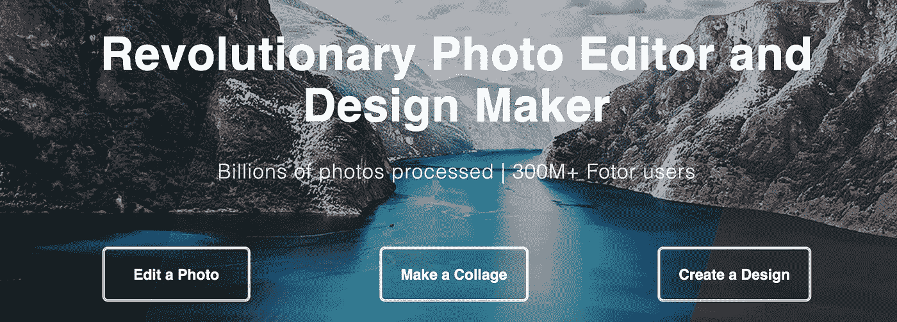

我的测试表明，只有一个行动号召的页面比有多个按钮的页面效果更好，比如同时有“购买”和“立即试用”两个按钮。

## 特点:解释产品的工作原理。

70%的竞争对手展示了其产品功能的详细列表。Adobe Lightroom 是个例外，它不需要解释。在你的产品如此受欢迎并且大多数访问者已经知道它是如何工作的之前，你需要解释你的产品特性。

有许多不同的方式来解释产品是什么:截图，视频，互动元素等等。

## 测试想法:

*   用截图解释产品的作用。观众是视觉对象，所以每个图形元素都很重要。
*   视频可以提供额外的竞争优势。
*   测试“之前/之后”元素，向没有经验的观众展示照片编辑器的功能。
*   尽早展示产品界面。下面是一些竞争对手的例子:

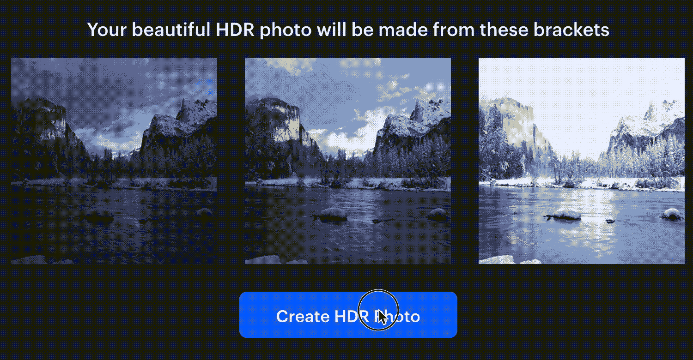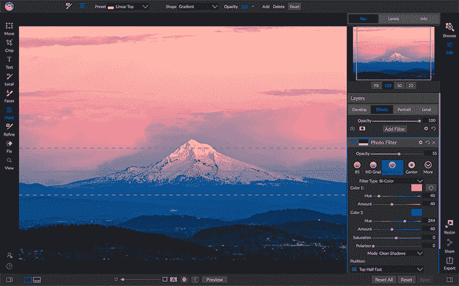

Photo: on1.com

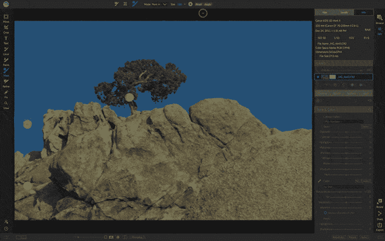

Photo: on1.com

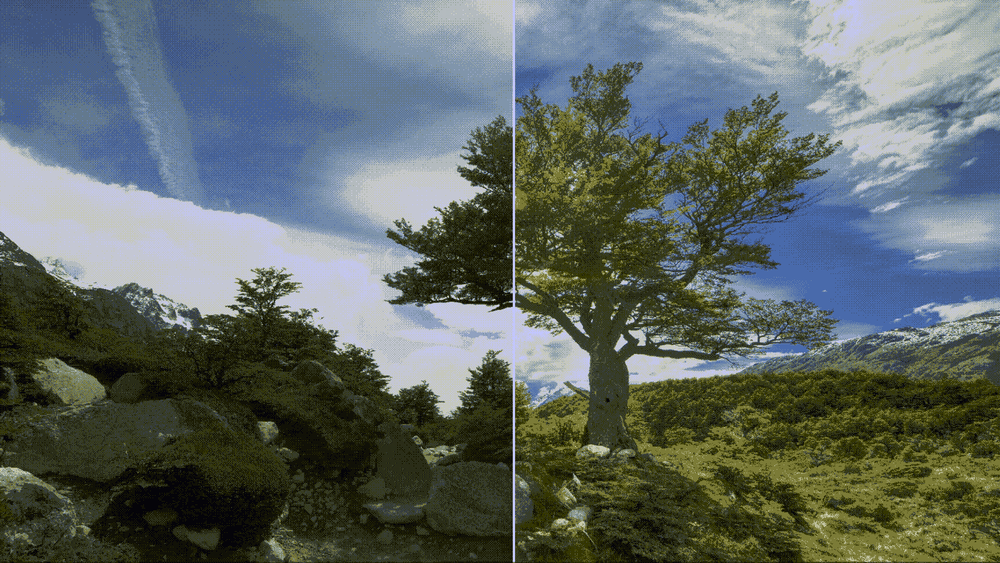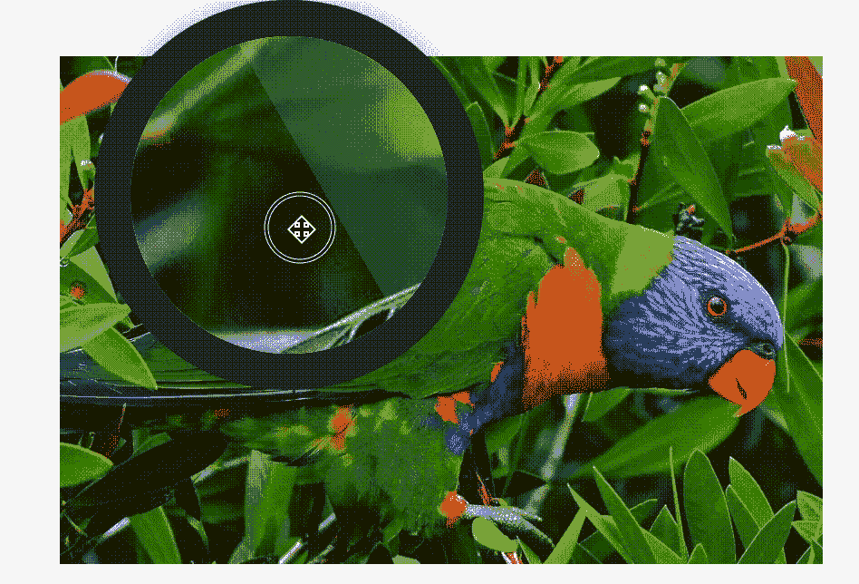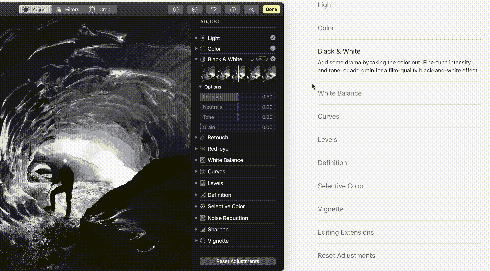

## 社会证明:确定重要性。

令人惊讶的是，大多数页面(65%)没有使用任何形式的社交证明。
测试评论、奖励、评级和其他形式的社交证明的影响很重要。作为一家以客户为导向的公司，这是区别于竞争对手的绝佳方式。

## 测试想法:

*   添加客户评论列表。
*   收集功能建议和请求。
*   尽早显示 Trustpilot 评级。
*   展示品牌大使。

以下是一些竞争对手的例子:

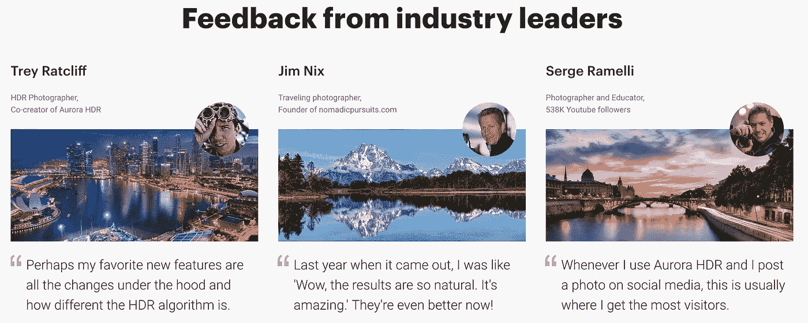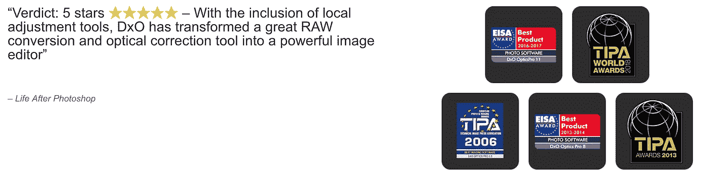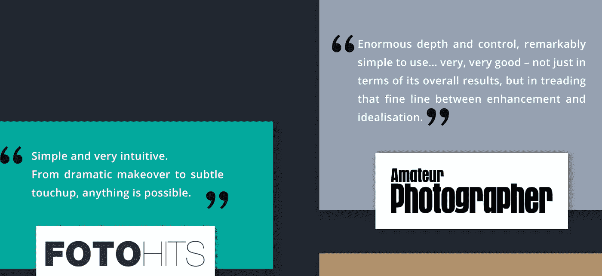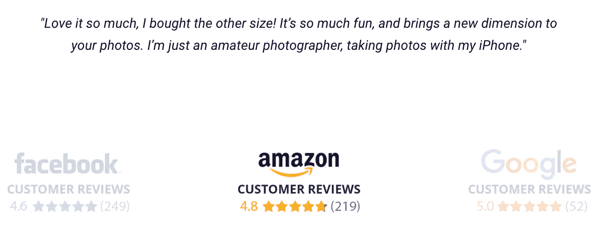

重要的是要记住，适合我的想法不一定适合你的目标。而且，不同类型的流量，优化方法会表现出不同的效果。这只是一系列值得检验的想法。所以最后的名单是:

我希望我的分析能启发你改进你的网站。在做出任何改变之前，分析你当前的行为数据，以便与未来的改变进行有意义的比较。

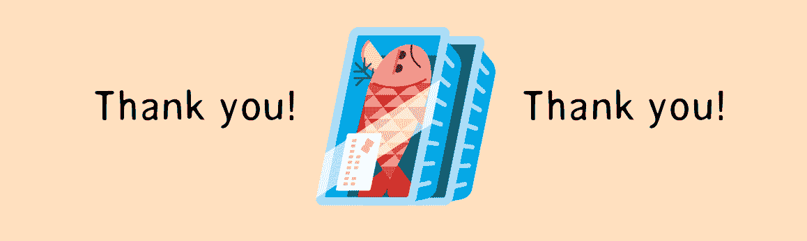