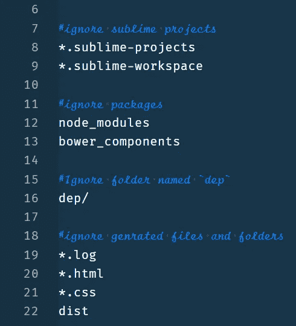

# 在 GitHub 上推送您的第一个项目的分步指南！！

> 原文：<https://medium.com/hackernoon/step-by-step-guide-to-push-your-first-project-on-github-fec1dce574f>

> *能让你工作一半的步骤！！*


Photo by [Samuel Zeller](https://unsplash.com/@samuelzeller?utm_source=medium&utm_medium=referral) on [Unsplash](https://unsplash.com?utm_source=medium&utm_medium=referral)

> 首先选择您的项目&在项目的根目录下打开您的终端。

## **1。**T5 检查 Git 版本

```
**git --version** 
```

> 如果没有显示 git 的版本，请访问官方网站 [**git**](https://git-scm.com/) 并根据您系统的操作系统下载 git。

## **2** 。**如果我们是第一次设置 git，我们可以用名称& email 配置 git。**

```
**git config --global user.name "Your_Name"
git config --global user.email "Your-Email"**
```

## **3。初始化 Git 存储库**

```
**git init**
```

> 注意:-在项目的根目录下
> 
> 它初始化本地项目中的 git 存储库&将创建包含重要文件夹和文件的`.***git***` 文件夹。

## **4。将文件提交到 git repo 中。**

**有三个步骤:-**

**第一步** : **我们需要在暂存区添加一个文件。**

```
**git add <File_Name>  {{For Single File}}
git add .            {{For all the files in current Directory}}**
```

> **注意** :-在 **<文件名>** 处添加您的文件，如果您想要选择当前目录中的所有文件，请使用{{。}}或{{ * }}
> 
> 集结地 :-集结地是我们可以购买一些物品并放入桶中的地方。

要检查是否添加了文件，请使用以下命令:

```
**git status**
```

**第二步** : **提交文件到 git repo 就是写一个提交消息。**

> m =消息

```
**git commit -m "First Commit"**
```

> N **注** :-在“**双引号**里，你要写你的消息。

**步骤 3** : **将文件推送到远程存储库。{{Github}}**

> 现在在 git-hub 上创建您的帐户，并创建一个存储库。
> 
> 要在远程存储库中添加文件，请使用以下命令:

```
**git remote add origin git@github.com:"Username_on_github"/"Repository_Name"**
```

> **注意** :-上面的命令是一个单独的命令&现在输入你的 git-hub 用户名(不带任何引号)和你的库名(不带任何引号)。

像这样

```
**git remote add origin git@github.com:XYZ/project.git**
```

> 如果你不明白这一点，那么去你在 git-hub 上的仓库，点击**克隆或下载**按钮，用 SSH 方法复制 **url** 。

牵制

```
**git remote -v**
```

## 5.创建 SSH 密钥。

> **我们为什么使用 SSH？**
> 
> 通过使用 ssh 协议，我们可以连接并验证远程服务器和服务。使用 ssh 密钥，我们可以连接到 GitHub，而无需在每次访问时提供用户名和密码。在 HTTPS 方法中，您每次访问都需要填写我们的用户名和密码，这非常不方便。
> 
> Git 将一个远程 URL 与一个名称相关联，我们默认的远程通常被称为" **Origin** "

**1。生成新的 ssh 密钥并将其添加到 ssh 代理中。**

```
**ssh-keygen -t rsa -b 4096 -C "email"**
```

> **注意** :-把你的邮件放在“双引号”里。

这将使用提供的电子邮件作为标签创建一个新的 ssh 密钥。

**1.1。对于默认文件，请按{{ ENTER }}**

```
**/home/{{username_of_pc}}/.ssh/id_rsa: ENTER**
```

**1.2。输入密码。**

**1.3。现在我们的标识已经保存在**中

```
**Private Key : /home/{{username_of_pc}}/.ssh/id_rsa
& Public Key : .ssh/id_rsa.pub**
```

**2。将我们的 ssh 密钥添加到 ssh 代理中**

```
**eval "$(ssh-agent -s)"
it gives like {{agent_id : 15800}}**
```

**3。现在，我们将 ssh-agent 的 SSH 私有密钥添加到我们的默认路径中。**

```
**ssh-add ~/.ssh/id_rsa**
```

**4。向您的 github 帐户添加新的 ssh 密钥。**

> 将 ssh 密钥复制到我们的剪贴板。

1.  **自动方法(使用 Xclip)**

```
**On Ubuntu
sudo apt-get install xclip****on Manjaro
Open Octopi -> Download Xclip****Xclip-set clip <~/.ssh/id_rsa.pub**
```

**2。手动方法**

```
**Home/.ssh/id_rsa.pub
Open this file and copy your key.**
```

> 现在转到[github.comT21](https://github.com/)下**个人资料照片**(下拉)设置使用**侧边栏** {{ **宋承宪& GPG 键** }}然后转到电脑上的这个目录 **{{Home/。ssh/id_rsa.pub}}**
> 打开这个文件**复制**你的**密钥**。
> 
> 创建新的 **SSH** 密钥用描述性**标签对文件进行标题**将密钥粘贴到“密钥字段”**点击** {{添加 SSH 密钥}}

**5。现在测试 SSH 连接。**

```
**ssh -T git@github.com**
```

运行后，它会在终端上显示这个消息！！

```
**Hi {{ USERNAME }}! You've successfully authenticated but github does not provide shell access.**
```

## **6。最终推动**

```
**git pull --rebase origin master 
git push origin master** 
```

> **注**:无论推什么分支，都要换‘主’。
> 
> 然后，您可以成功地将文件推送到远程服务器，并建立 SSH 连接。

检查连接

```
**git log**
```

# 一些其他有用的 git 概念。

> 有些概念可以帮助你更深入地理解 git。

## **1。创建一个新分支。**

```
**git checkout -b Branch_name**
```

如果你想换回 master branch。

```
**git checkout master**
```

如果要删除分支。

```
**git branch -d Branch_name**
```

## **2。更新合并。**

将本地存储库更新为最新提交

```
**git pull**
```

合并活动分支中的另一个分支。

```
**git merge <branch>**
```

> 在这两种情况下，git 都试图自动合并变更。不幸的是，这并不总是可能的，并且结果是冲突的。

我们可以通过编辑 git 显示的文件来手动合并这些冲突。

```
**git add <filename>**
```

在合并更改之前，我们可以预览。

```
**git diff <source-branch> <target-branch>**
```

## **3。标记。**

我们可以给出标记(第 1.0.0 行)

```
**git tag 1.0.0 {{1b2eld63ff}}**
```

> **注** : {{这是提交 id 的前 10 个字符。}}

## 4.Git 日志。

通过 Git 日志，我们可以研究存储库历史。

***高级*** :

1.  *只看某作者的提交。*

```
**git log --author <name>**
```

2.*非常压缩的日志。*

```
**git log --pretty=oneline**
```

*更可取的格式*

```
**git log --pretty=format:"%h - %an, %ar : %s"**
```

3.*它会* *只显示已经更改的文件。*

```
**git log --stat**
```

## **5。替换本地更改。**

```
**git checkout --filename** 
```

> (如果我们做错了什么),那么这将用文件头中的最后内容替换文件。

如果我们想放弃所有本地更改和提交，从服务器获取最新的历史记录

```
**git fetch origin
git reset --hard origin/master**
```

## 6.永远不要忘记创建你的。gitignore 文件。

> **Gitignore file** 是指定我们想要忽略的文件或文件夹的文件。

**有几种方法可以指定那些**

*   首先，你可以指定特定的文件名。这里有一个例子，假设我们要忽略一个名为`**readme.txt**`的文件，那么我们只需要在`**.gitignore**`文件中写入`**readme.txt**`。
*   其次，我们也可以写扩展名。例如，我们将忽略所有的`**.txt**` 文件，然后写入`***.txt**`。
*   还有一种方法可以忽略整个文件夹。假设我们想忽略名为`**test**`的文件夹。然后我们就可以在文件中写`**test/**`了。

像这样



.gitignore file

## 有用的提示

**1。内置 git Gui。**

```
**gitk**
```

**2。使用彩色 git 输出。**

```
**git config color.ui true**
```

**3。使用交互式添加。**

```
**git add -i**
```

## 一些有用的文章、资源库和教程

*   [***github/hub***](https://github.com/github/hub)*{ {*一个命令行工具，让 git 更容易与 GitHub 一起使用* }}*
*   *[***15 Git 命令你可能不知道***](https://zaiste.net/15-git-commands-you-may-not-know/)*
*   *[***使用命令行***](https://help.github.com/en/articles/adding-an-existing-project-to-github-using-the-command-line) 向 GitHub 添加现有项目*
*   *[***如何成为 Git 专家***](https://medium.freecodecamp.org/how-to-become-a-git-expert-e7c38bf54826)*
*   *[***资源学习 Git***](http://try.github.io)*
*   *[](https://guides.github.com/introduction/git-handbook/)*
*   **[***学习 Git 分支***](https://learngitbranching.js.org/)**
*   **[***jrod***](https://github.com/jlord)***/***[***git-it-electronic***](https://github.com/jlord/git-it-electron)**
*   **[***GitHub Learning Lab***](http://lab.github.com)**
*   **[***吉特-塔***](https://www.git-tower.com/windows)**
*   **[***资源帮你学习 Git***](https://speckyboy.com/resources-for-learning-git/)***{ { SpeckyBoy } }*****
*   **[***目测 Git 参考***](https://marklodato.github.io/visual-git-guide/index-en.html)**
*   **[***学习 Git 的完整资源***](https://cssauthor.com/resources-for-learning-git-and-github/)***{ { CSS author } }*****
*   **[***netroy***](https://gist.github.com/netroy)***/***[***git tutorial . MD***](https://gist.github.com/netroy/1319215)**

## ****忽略****

*   **[***Git-Git 忽略文档。***](https://git-scm.com/docs/gitignore)**
*   **[***。g 忽略文件-忽略 Git | Atlassian Git 教程***](https://www.atlassian.com/git/tutorials/gitignore) 中的文件**
*   **[***git ignore . io***](https://www.gitignore.io/)**

## **教程**

*   **[***Git 完整版:Git***](https://www.udemy.com/course/git-complete/)***{ { Udemy } }***循序渐进指南**
*   **[***Git 一份 Web 开发人员的工作:掌握现代工作流程***](https://www.udemy.com/git-a-web-developer-job-mastering-the-modern-workflow/)***{ { Udemy } }*****
*   **[***GitHub 终极:大师 Git 与 GitHub —初学者到专家***](https://www.udemy.com/github-ultimate/)***{ { Udemy } }*****
*   **[***Git 速成班:一小时 Git 速成班***](https://www.udemy.com/git-going-fast/)***{ { Udemy } }*****
*   **[***Git&GitHub boot camp&与最流行的 ide***](https://www.udemy.com/git-bootcamp-with-github-learn-step-by-step/)***{ { Udemy } }*****
*   **[***饭桶必备训练***](https://www.lynda.com/Git-tutorials/Git-Essential-Training/100222-2.html)***{ { Lynda } }*****
*   **[***代码学校:Git Real***](https://www.pluralsight.com/courses/code-school-git-real)***{ { plural sight } }*****

## **书**

*   **[***Git 袖珍指南***](https://www.amazon.in/Git-Pocket-Guide-Richard-Silverman/dp/1449325866)**
*   **[***Pro Git***](https://github.com/progit/progit2)**
*   **[***饭桶要领***](https://www.oreilly.com/library/view/git-essentials/9781785287909/)**

****

**Photo by [Pankaj Patel](https://unsplash.com/@pankajpatel?utm_source=medium&utm_medium=referral) on [Unsplash](https://unsplash.com?utm_source=medium&utm_medium=referral)**

> **最后，请您分享您对这篇文章的看法。:)**
> 
> **找到有用的东西了？按住👏来支持和帮助别人找到这篇文章。感谢阅读！！**

> **在 Instagram 上关注我[@ hypnosiss _ _](https://www.instagram.com/hypnosisss___/?hl=en):)**