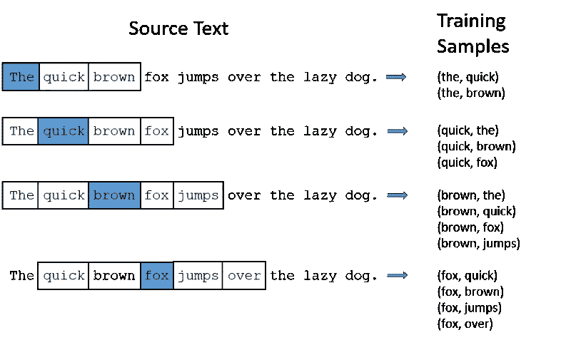
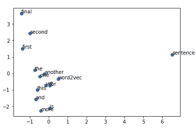

# 使用 Gensim 步入 NLP — Word2Vec

> 原文：<https://medium.com/hackernoon/stepping-into-nlp-word2vec-with-gensim-e7c54d9a450a>

## word2vec 嵌入和用例介绍


Photo by [Dmitry Ratushny](https://unsplash.com/@ratushny?utm_source=medium&utm_medium=referral) on [Unsplash](https://unsplash.com?utm_source=medium&utm_medium=referral)

自然语言处理(NLP)是计算机科学和人工智能的一个领域，也就是现在与计算机和自然语言中的人类互动有关的 T2。目标是让系统像我们一样完全理解各种语言。它是自然语言处理产品/技术的驱动力，如虚拟助手、语音识别、机器翻译、情感分析、自动文本摘要等等。在这篇文章中，我们将使用 Gensim 框架研究一种叫做 Word2Vec 的单词嵌入技术。

## 单词嵌入…什么！！

单词嵌入是一种 NLP 技术，能够捕捉文档中单词的上下文、语义和句法相似性、与其他单词的关系等。一般来说，它们是特定单词的矢量表示。已经说过，接下来是创建单词嵌入的技术。有许多技术可以创建单词嵌入。一些受欢迎的是:

1.  二进制编码。
2.  TF 编码。
3.  TF-IDF 编码。
4.  潜在语义分析编码。
5.  Word2Vec 嵌入。

我们将在以后的文章中讨论不同的嵌入技术，现在，我们将坚持使用 Word2Vec 嵌入。

## Word2Vec 嵌入简介

*Word2vec* 是产生[单词嵌入](https://en.wikipedia.org/wiki/Word_embedding)最广泛使用的模型之一。这些模型是浅层的两层神经网络，被训练来重建单词的语言环境。Word2Vec 可以通过两种方式实现，一种是 Skip Gram，另一种是 Common Bag Of Words (CBOW)

## 连续单词包(CBOW)

CBOW 正在学习根据上下文预测单词。这里输入将是上下文***#邻近单词*** ，输出将是目标单词。每个上下文中的字数限制由一个名为“**窗口大小**的参数决定。



例子:敏捷的棕色狐狸跳过懒惰的狗***#是的同样的例子:-)***

型号:CBOW

输入层:白盒内容

目标层:蓝色框字

窗户尺寸:5

## 跳过克

**Skip Gram** 正在学习通过单词预测上下文。这里输入将是单词，输出将是目标上下文***#邻近单词*** 。每个上下文中的字数限制由一个名为“**窗口大小**的参数决定。


例子:敏捷的棕色狐狸跳过懒惰的狗***#是的同样的例子:-)***

型号:跳过克

输入层:蓝色框字

目标层:白盒内容窗口大小:5

## 在幕后

*   如上所述，我们将使用两层[神经网络](https://en.wikipedia.org/wiki/Neural_network)。对于这个模型，后面的输入将是关于目标单词的上下文，后面是隐藏层，该隐藏层最后构建目标层与目标单词的关系。
*   在训练模型之后，语料库中的每个单词将具有其自己的关于上下文和含义的向量嵌入。
*   现在我们可以使用 *Matplotlib* 来映射单词嵌入，这可能会给我们一个如何建立关系和分配向量的清晰图像。



Word2Vec Embeddings

```
INPUT CORPUS1\. this is the first sentence for word2vec2\. this is the second sentence3\. yet another sentence4\. one more sentence
                             5\. and the final sentence
```

*   正如我们可以看到的，相似的单词基于它们的上下文被映射到附近，如“第一个”&“第二个”，“一个”&“另一个”，单词“句子”从簇中分离出来，因为它与任何其他单词都不相似。
*   从这里，我们可以使用这些嵌入来拥有相似的单词、句子或具有相同内容的文档，这样的例子不胜枚举…


Literally everywhere!!

事情说明到此，相信 ***各位*** 已经对 word2vec 有所了解了。如果没有，也不用担心！看完下面的例子，你就能有一个清晰的概念了。让我们深入了解一些 python🐍。

**让我们添加一些 Python**

正如我们之前讨论的，我们将使用 python 中的 Gensim 框架实现 word2vec。 **Gensim** 是一个健壮的[开源](https://en.wikipedia.org/wiki/Open-source_software)向量空间建模和[主题建模](https://en.wikipedia.org/wiki/Topic_model)工具包，在 [Python](https://en.wikipedia.org/wiki/Python_(programming_language)) 中实现。它使用 [NumPy](https://en.wikipedia.org/wiki/NumPy) 、 [SciPy](https://en.wikipedia.org/wiki/SciPy) 和可选的 [Cython](https://en.wikipedia.org/wiki/Cython) 来提高性能。

这里我们已经导入了需求，接下来我们将定义文本语料库。

在这一步，我们定义了我们的 **Word2vec 模型**。

这里，

*   `size`向量的维数越高，嵌入的尺寸越密(理想情况下`size`必须低于 vocab 长度。使用比词汇量更高的维度或多或少会保证“过度拟合”。)
*   低于`min_count`频率的单词在训练发生之前被丢弃(因为我们只有几行输入语料库，所以我们取每个单词)。
*   语料库被添加到 vocab 用于训练，并且训练完成。

PCA 模型用于将我们的 vocab 中每个单词的 **n** 维向量减少到 2d 向量(我们这样做是为了绘制/可视化我们的结果)。

我们将在 matplotlib 中使用散点图来绘制单词嵌入，


正如我们所看到的，单词嵌入是相互映射的。这个结果是通过使用预训练模型得到的，为了简单起见讨论了基本模型。原始模型可以在这里找到[。](https://github.com/vj-09/pretrained_vs_customtrained/blob/master/pretrained%20vs%20customtrained%20.ipynb)

## 让我们找到一些相似之处

使用这个单词嵌入，我们可以在我们的语料库中找到单词之间的相似性。

```
>>>model_1.most_similar(positive=[‘first’], topn=1)[('second', 0.8512464761734009)]
```

最相似功能是在我们的嵌入中找到与目标单词相似的单词。

```
>>>model_1.similarity('one', 'another')0.80782
```

在这里，我们发现这两个词在我们的嵌入中有相似之处。像这样，有许多有用的功能可以使用。他们可以在这里找到。

我们到此结束，希望我已经对 word2vec 嵌入做了一些介绍。在这里查看其他作品[。](/@athithyavijay)


哈哈，如果你这么认为，我们就在同一页上。下面我们连线[中](/@athithyavijay)、 [Linkedin](https://www.linkedin.com/in/vijay-athithya-79830ba1/) 、[脸书](https://www.facebook.com/vakky.vj)。