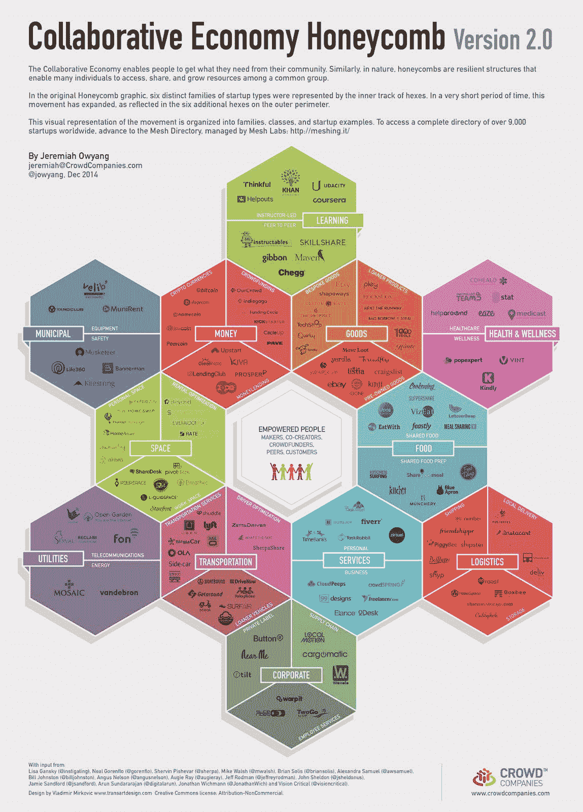
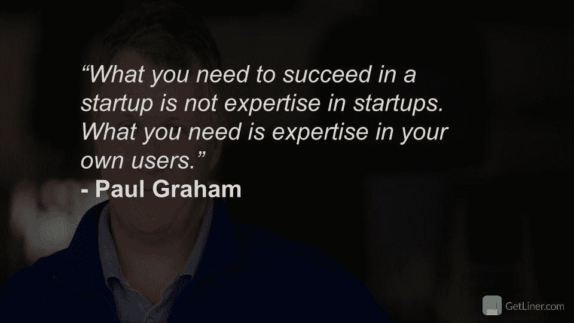
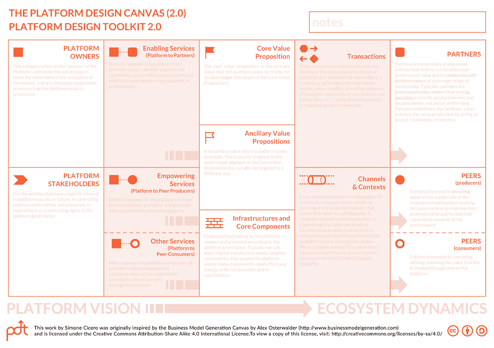

# 如何建立像 Upwork、Etsy 或 Airbnb 这样的 P2P 市场:步骤、挑战和关键指标

> 原文：<https://medium.com/hackernoon/steps-challenges-and-key-metrics-when-building-a-marketplace-like-upwork-etsy-or-airbnb-245e1f1b20d0>

Photo by [Clem Onojeghuo](https://unsplash.com/@clemono2?utm_source=medium&utm_medium=referral) on [Unsplash](https://unsplash.com?utm_source=medium&utm_medium=referral)

Upwork，Etsy，Airbnb，优步。他们有什么共同点？都是 P2P 市场，形成**协作经济**行业。今天可能是了解如何建立市场的最佳时机。这种创业公司和技术的目标群体已经足够成熟，可以实现新的想法。

普华永道[报告](https://www.pwc.com/us/en/technology/publications/assets/pwc-consumer-intelligence-series-the-sharing-economy.pdf)称，市场规模目前约为**150 亿美元**，预计到 2025 年将增长至**3350 亿美元。这意味着像 Airbnb、Etsy 或 Upwork 这样规模的新项目仍有发展空间。**

在这篇文章中，我想尽可能的简短和翔实。我们将介绍市场发展的主要里程碑，在你建立了一些东西之后，用什么标准来衡量，以及所有市场面临的主要挑战是什么。

# 什么是点对点(P2P)市场？

在线 P2P 市场是一种连接消费者和服务/产品提供商的电子商务网站。在 Etsy 上，一方提供手工制作的商品，另一方购买。Etsy 为销售和购物创造了便利的条件。Upwork 也是如此，自由职业者和企业主在寻找彼此。Airbnb 连接了主人和旅行者。

网上市场为双方提供了很好的服务。当供应商获得方便的交易手段和目标受众时，消费者获得了广泛的选择和安全，而无需创建自己的电子商务网站和在广告上花费大量资金。

下面你可以找到形成协作经济的顶级行业及其最大的参与者:

# 如何建立像 Upwork，Etsy，Airbnb 等这样的 P2P 市场？

## 一切都始于一个想法

一个想法是你生意的核心。这不是成功的唯一关键——你还应该召集合适的团队，按时发布产品。但是一个好的想法会激励优秀的人和你一起工作，它会吸引投资者，最重要的是——用户。

以下是形成和测试你的想法的主要步骤和工具。

## 1.定义您的价值主张

你给用户提供的价值是什么？

有 **4 个主要值**可以提供给用户:

*   **市场准入**。向大量消费者或供应商提供访问。
*   **价格**。以较低的价格提供一些服务。
*   **便利性**。使得一些过程更加方便。
*   **时间**。比以前更快地解决一些问题。

例如，Airbnb 允许那些无法预订酒店的人在世界任何地方无风险地预订公寓或房间。BlaBlaCar 为消费者提供低价，并在没有票的情况下让他们能够到达目的地。

你的产品如何让人们的生活变得更好？

> “到目前为止，初创公司最常犯的错误是解决没有人解决的问题”——保罗·格拉厄姆

## 2.选择市场商业模式

**佣金模式** 这是一种最简单的商业模式。你对平台上的每一笔交易收取佣金。例如，Upwork 从每笔支付中抽取 30%的费用。

**一揽子行动模式** 这种模式适用于以供应商为中心的市场，主要交易发生在平台之外。供应商购买有限数量的视图/点击查看电话号码/点击订购/联系请求。

用户付费让他们的广告被突出显示并放在列表的顶部。C2C 市场经常使用这种模式。

**CPC(每次点击成本)** 谷歌的大部分收入来自这种类型的货币化，但市场也可以利用它。例如，亚马逊有自己的广告管理系统，供应商为他们广告的点击付费。

**订阅** 用户按月付费使用市场，无需额外费用。亚马逊和易贝上的店主必须每月支付一笔费用才能留在平台上。

**免费增值** 这种模式来源于电子游戏。这样的市场可以免费使用，但机会有限。如果用户想要额外的高级功能，他们需要升级。它可以与每月付款相结合。一些自由职业平台为自由职业者提供 VIP 账号，为获得客户打开了更多的机会。

**混合起来** 随着市场的增长，他们的盈利模式变得越来越复杂，可以合并上述几种模式。

## 3.对你的商业想法进行 SWOT 分析

在进行 SWOT 分析时，你需要定义你的商业理念的所有**优势、劣势、机会和威胁。**

在你分析了你的商业理念之后，继续分析你的竞争对手。这将允许你用独特的想法创造更好的产品，并覆盖新的客户群。

## 4.定义你的目标受众

了解你的目标受众是至关重要的。你必须理解他们的痛苦，他们的渴望，他们住在哪里，他们以什么为生，他们的爱好是什么等等。

了解你的目标受众将有助于你形成正确的想法。

## 5.为你的市场创业创建一个精益画布

一个[倾斜的画布](https://canvanizer.com/new/lean-canvas)可以让你看到一个完整的画面，并要求回答进一步的问题:

*   你的客户的主要问题是什么？
*   你的产品如何解决这个问题？
*   要跟踪的关键指标是什么？
*   你的价值主张是什么？
*   你将如何接触你的顾客？
*   你的客户群是什么？
*   谁是你的主要竞争对手？
*   你的成本结构和收入来源是什么？

我还可以推荐使用来自[市场学院](http://sharetribe.com)的[平台设计工具包](http://bit.ly/PDToolkit20_DownloadPack)工具，它是专门为市场初创公司开发的。

The platform design canvas from platform design toolkit by [Marketplace Academy](http://sharetribe.com)

# 建立一个 MVP

最低价值产品(MVP)允许你在真实的市场上用真实的用户来测试你的想法，**消除了在最终产品的开发上浪费大量时间和成本的风险**。在本文的[中，我有一个关于构建 MVP 的更详细的指南。
在这个阶段，你应该聚集一个拥有一些科技技能的超级明星团队。](/elligense-team/how-to-build-mvp-step-by-step-guide-d931f78cb53f)

每个市场的基本特征是:

*   用户帐户、配置文件和设置
*   搜索和过滤器
*   聊天
*   支付系统集成
*   评论和评级

在开发团队的帮助下，或者通过使用现成的平台，如 **Magento、Sharetribe、Near Me 或 Marketplacer** ，它们可以从零开始实现。

# 使用什么技术来建立一个点对点的市场创业

如果你决定从头开始创业，你应该明智地选择一个技术栈。在多年的 web 开发中，我们在 [Relevant Software](https://relevant.software) 主要使用了两种最流行的技术栈，并取得了很好的效果。

**灯技术堆栈**

LAMP 是一个可靠的、经过时间考验的堆栈，许多开发人员都知道，所以找专家是没有问题的。

灯包括:

*   LLinux 操作系统
*   一个 pache 网络服务器
*   ySQL 数据库
*   惠普、Perl 或 Python 编程语言。

**表示技术堆栈**

MEAN 是一个完全由 JavaScript 支持的现代技术栈。它允许创建高性能和革命性的单页 web 应用程序。

平均值包括:

*   ongoDB 数据库
*   E xpress.js 服务器
*   **一个** ngular.js 前端框架
*   **N** ode.js 后端框架。

例如，Airbnb 在后端使用 Ruby (Ruby on Rails ),在前端使用 Javascript (React.js)与 Nginx web 服务器，Redis 用于缓存，Amazon Web 服务器用于托管和数据存储。

对于云托管，我们通常使用[数字海洋](https://m.do.co/c/262524ebc480)，以及 [GCP](https://cloud.google.com/) 。

技术堆栈的选择将取决于项目的复杂性和可用的预算。如果你需要有经验的创业开发者的免费咨询，你可以[在这里](https://relevant.software/contact-us)得到。

# 市场的关键指标

## 总体市场指标

这些是整个平台的关键指标:

*   **商品总量(GMV)** 是一个月或一年中通过市场购买的商品或服务的总价值。
*   **交易数量**
*   **平均订单价值(AOV)** 显示用户在一次交易中花费的金额。
    *AOV = GMV /交易数量。*
*   **收入**是公司扣除所有费用后的最终收入。
    *收入= GMV-费用。*
*   **客户获取成本(CAC)** 是为获得一个客户而在营销上花费的金额。
    *CAC =广告支出/客户数量。*
*   **注册转化率** **比率**显示了访问您平台的用户创建账户的百分比。

# 服务/产品提供商指标

这些 KPI 仅涉及市场的卖方/供应商部分:

*   **囊**。卖方/供应商采购成本。
*   **卖方/供应商的数量**。
*   卖方/供应商**增长率**。
*   **列表数量**(如果有)。
*   **队列分析。**签约后 1 个月和/或 1 年内仍然活跃的卖家/供应商的百分比。
*   **GMV 保留**。卖方/供应商在第 12 个月产生的第一个月 GMV 的平均百分比。
*   **浓度**。前 20%供应商产生的收入百分比。
*   **净启动子得分(NPS)。**范围从-100 到 100 的指数，显示卖家/供应商愿意向他人推荐某个平台的程度。

# 买家指标

一些关键的买家指标包括:

*   **BAC** 。买方收购成本
*   **买家数量**
*   **买家增长率**。
*   **每位买家的平均订单数量**
*   **每位买家的平均订单增长**
*   **重复买家投稿**。购买超过一次的买家百分比。
*   **GMV 留存**:第 12 个月卖方/供应商产生的首月 GMV 的平均百分比。
*   **浓度**。前 20%的买家产生的收入百分比。
*   **净推介值(NPS)。**范围从-100 到 100 的指数，显示卖家/供应商愿意向他人推荐某个平台的程度。

这些指标将帮助你更好地管理你的创业成长，并显示它是多么有前途。

# 最大的点对点市场挑战

## 鸡和蛋的问题

每个点对点市场都有一个共同的问题，叫做鸡和蛋的问题。问题是市场连接了两方:消费者和供应商，没有一方就没有另一方。如果买家来到市场却找不到他们想要的东西，他们就会离开。小贩也是一样，如果没有人从他们那里买东西，他们就会停止使用市场。

这个问题可以通过投入大量资金进行营销来同时带动大量用户或者先吸引一方(通过向他们付费或者开出一个好的报价)来解决。你可以在[这篇文章](http://strategictoolkits.com/strategic-concepts/chicken-and-egg-strategy-problems/)中了解更多解决这个问题的方法。

# 建立一个市场创业公司需要多少成本？

开发成本基于开发所需功能和所用技术所需的时间。然而，你可以预期你的 MVP 价格大约为**$ 30–50K**加上我们上面提到的基本市场功能。

如果你已经有了一个想法，并且想知道开发它需要多少成本，你可以[在这里](https://relevant.software/contact-us)得到一个准确的报价。

# 结论

Quote by Gary Vee

合作经济正在蓬勃发展，这是新市场诞生的大好时机。我真的相信你脑子里有一些很棒的想法想要被执行。只要记住深入思考你的商业想法和盈利模式，了解你的目标受众，通过 MVP 在 beta 用户中测试你的想法，组建一个强大的团队，并有足够的耐心度过艰难时期(相信我，他们会的)。

祝你好运。