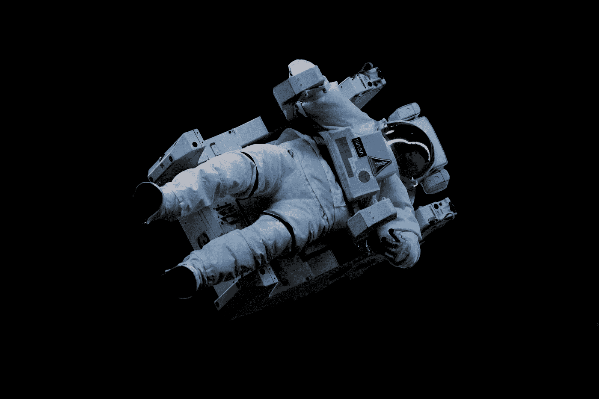

# 坚持按剧本写

> 原文：<https://medium.com/hackernoon/sticking-to-the-script-how-to-achieve-high-performance-under-pressure-4bdce0bc8d26>

## 如何在压力下实现高绩效

Photo by [Niketh Vellanki](https://unsplash.com/photos/QkSN_8XcXwQ?utm_source=unsplash&utm_medium=referral&utm_content=creditCopyText) on [Unsplash](https://unsplash.com/search/photos/astronaut?utm_source=unsplash&utm_medium=referral&utm_content=creditCopyText)

> “我们没有达到我们期望的水平，而是下降到了我们训练的水平。”—阿奇洛克斯

在太空失重状态下，卢卡·帕米塔诺的[眼睛、鼻子和嘴巴周围出现了水珠](https://www.nbcnews.com/science/nasa-cuts-spacewalk-short-due-water-leak-helmet-6C10645572)。[在太空行走时，他的冷却系统出现了裂缝](https://www.nbcnews.com/mach/science/saving-spaceman-drowning-ncna784431)，他需要尽快摘下头盔，否则他会淹死。他向队友卡伦·尼伯格发出求救信号。

在摘下头盔之前，卢卡需要通过一个气闸返回，气闸是一个允许从太空真空过渡到空间站压力的区域。当凯伦根据训练重新给气闸加压时，她担心可能需要太长时间才能完成，卢卡会淹死。她可能会违背自己的训练，更快地重新加压。然而，这可能会导致卢卡的耳膜因突然的压力而爆裂。在如此高风险的要求下，凯伦应该如何反应？

# 高要求的问题

研究表明，在精神紧张的情况下，人类的表现经常会下降(比如这里的[和这里的](https://journals.lww.com/simulationinhealthcare/fulltext/2010/10000/Higher_Mental_Workload_is_Associated_With_Poorer.4.aspx)和)。经验和培训可以[提高绩效，减少脑力需求](https://link.springer.com/article/10.1007/s00464-009-0522-3)。然而，当精神需求增加时，尽管进行了训练，表现还是会受到影响。例如，[进行了一项研究](https://journals.lww.com/simulationinhealthcare/fulltext/2010/10000/Higher_Mental_Workload_is_Associated_With_Poorer.4.aspx)，在该研究中，接受培训的外科医生使用一个简单的模拟器练习外科手术任务。当他们使用简单的模拟器练习时，他们的表现提高了，他们感知的心理需求降低了。然而，当他们被要求在一具动物尸体上执行同样的任务时(一个明显更现实的场景)，他们感知到的精神需求增加了，他们的表现下降了。

当您的团队遇到紧急的截止日期或不满意的客户等需求时，记住这样的情况会导致性能下降是很有价值的。有时，放弃团队多年来投入的训练和实践可能会加剧这种情况。你的团队可能会尝试“随机应变”，想出一种新的创新工作方式来满足需求。考虑到这种方法还没有被证实，而且你的团队也没有接受过这方面的培训，这种方法可能不会很好的工作。

# 让您的团队为高要求做好准备

练习。练习。练习。

NFL 球队不会等到比赛开始才考虑他们将如何比赛。他们一遍又一遍地上演戏剧。他们调节自己。他们研究对手。

同样可以供你的团队使用。一个重要的截止日期或一个客户投诉是你团队的超级碗。剩下的时间需要花在建立程序和实践这些程序上。当需求增加时，你的团队将能够利用他们的实践。

我为一家构建基于云的应用程序的公司工作。每天，我们都会对代码进行增强。我们每次都经历完全相同的过程。虽然每天的实际变化可能不同，但是我们用来部署的过程是完全相同的。当我们遇到紧急的客户需求时，我们能够迅速做出他们需要的改变。但是，我们不会偏离我们的日常部署流程。这保证了我们在压力下不会犯愚蠢的错误。我们不会重新发明我们的流程。我们不采取极端措施。我们不会惊慌。

这是否意味着程序不会发生变化？不要！然而，在高风险场景中使用这些变更之前，团队应该仔细考虑并实践这些变更。

练习。练习。练习。

气闸中的压力慢慢增加。虽然卢卡的通讯设备因进水而出现故障，但他仍然能够发出 OK 手势。他会没事的。压力安全稳定后，凯伦和她的团队冲过去摘下卢卡的头盔，擦去他脸上的水。

凯伦已经反复接受了急救程序的培训，这种培训很有成效。如果她惊慌失措，她可能会匆忙进行加压，不必要地破坏了卢卡的耳膜。幸运的是，她保持了冷静的头脑，利用她的训练，确保了她的团队的安全。

# 外卖:

在萧条时期，开发可重复的方法，并和你的团队一起实践它们。当你的团队面临压力时，利用你已经实践过的方法。不要指望你的团队在压力下会想出新的创造性方法。

*感谢阅读！我叫诺亚·惠勒，是 Simple Interact 的产品副总裁。如果你喜欢这个，你可能会喜欢“* [*”制作更多三明治:构建可重复业务流程的 4 个步骤。*](/@iamnoahwheeler/making-more-sandwiches-4c815f12d8e8)