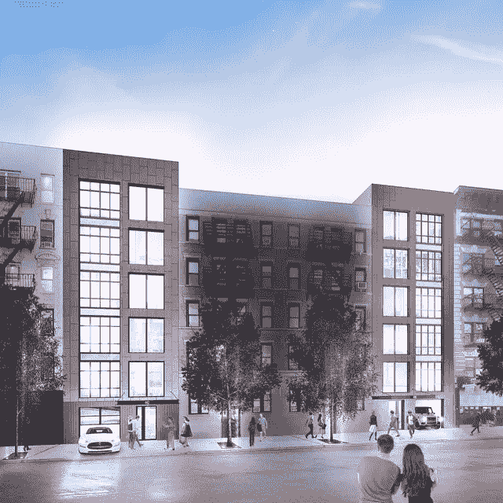

# 2019 年 STO 市场展望

> 原文：<https://medium.com/hackernoon/sto-market-outlook-2019-8d504732854a>

## 回顾 2018 年及以后的 STO 活动

如果 2017 年是公用事业令牌年，ICO 筹集了超过 56 亿美元，那么 2018 年将被认为是为新一代安全令牌铺平了道路。发行人和投资者继续对象征性化的好处感到好奇，如增加流动性、部分所有权、降低发行成本、创新结构和提高定价效率。

在对目前市场上的 130 多个 sto 进行独立研究后，以下是 2019 年形成的一些趋势。

# **市场趋势**

**交易规模:**目前的交易范围从消费科技公司规模较小的股权融资的 2M 美元到机构风险资本交易的 1B 美元不等。

**行业:**绝大多数的 sto 都发生在房地产、金融、科技和能源行业。

**结构:**收入分成、令牌化基金和资产支持交易领先，股票和债券紧随其后。

**地理位置:**由于复杂的监管环境，美国在市场上的 sto 总量上处于领先地位，瑞士位居第二。欧洲国家的额外活动引人注目，而亚洲市场虽然在 ico 中领先，但尚未赶上 STO 的活动。我们预计，在美国监管机构的引领下，未开发的市场将继续对 s to 感兴趣。

# **2018 年最具创新性发行**

为了说明上述趋势，下面列出了 2018 年一些最值得注意的发行。排名不分先后，这些案例研究是根据其创新的结构、筹集的金额和附带的品牌名称而选择的，旨在为任何开始自己发行的人提供一个起点。

# [**阿斯数字—瑞吉斯**](https://blockchain.indiegogo.com/projects/aspen/)

**行业:**房地产&酒店业

**结构**:单一不动产资产中的数字普通股

筹集金额:1800 万美元

阿斯彭酒店交易虽然规模不大，但却是区块链促成的第一笔大型商业房地产交易。数字证券为持有人提供了拥有 180 个房间的阿斯彭·圣·里吉斯度假村的部分股权，该度假村因其在落基山脉的滑雪而闻名于世。然而，这笔交易的真正独特之处在于，它将数字证券从区块链的利基市场带入了主流市场，与久负盛名的瑞吉品牌和流行的众筹平台 Indiegogo 进行了配对。

# [**安德拉资本**](https://www.andracapital.com/)

**行业:**风险投资

**结构**:令牌化基金份额

**目标加薪:** $1B

Andra Capital 是一家后期、上市前技术增长基金。该基金为其最后一次融资提供了“硅谷硬币”，以努力实现投资民主化。这个结构类似于[区块链资本(BCAP)](https://blockchain.capital/) 、[科学区块链](https://www.science-inc.com/blockchain.html)、 [Spice VC](https://spicevc.com/) 等其他令牌化的 VC 基金。Andra Fund 计划将 80%的持股用于资助 C 轮或更晚的后期公司，并保留 20%用于机会主义投资。

# [**梅塞纳斯——安迪·沃霍尔**](https://www.maecenas.co/)

**行业:**美术

**结构:**资产支持部分所有权

筹集金额:170 万美元

安迪·沃霍尔因其对艺术和文化的革命性贡献而闻名，即使在他去世后，他仍通过区块链继续着他的开拓遗产。美术符号化平台 Maecenas 凭借 [Andy 的 14 把小电椅](https://www.realwire.com/releases/First-ever-multi-million-dollar-artwork-tokenised-and-sold-on-blockchain)成功执行了美术部分所有权，推动了区块链行业的发展。通过 Maecenas 平台上的荷兰拍卖竞价，31%的艺术品以 560 万美元的估价售出。14SEC 被证明是区块链艺术品部分所有权的第一个案例。

# [**436 &曼哈顿东 14 街 442 号**](https://www.forbes.com/sites/rachelwolfson/2018/10/03/a-first-for-manhattan-30m-real-estate-property-tokenized-with-blockchain/#5da20f0d4895)

**行业:**房地产

**结构:**单一房地产资产中的数字普通股

募集金额:3000 万美元

这个豪华的曼哈顿公寓是第一个在以太坊区块链上使用 AirSwap 令牌化技术与 Fluidity 和 Propellr 合作的令牌化公寓。投资者可以选择获得该房产的模拟或数字权益，这表明对厌倦了区块链投资的投资者仍在做出让步。令牌化结构被描述为[双令牌瀑布](https://tokenwaterfall.io/)，这是一个为房地产资本化而设计的综合框架。

# [T3【Lottery.com】T5](https://sto.lottery.com/)

**行业:**博彩

**结构**:收入份额

**目标加薪:**:3 亿美元

Lottery.com，原名 AutoLotto，是一家移动彩票服务公司。该公司打算利用区块链技术，通过即时支付、透明性、灵活性和在国际市场的扩张来增强其服务。该公司以开创性的股票结构而闻名，据传该公司即将完成其 3 亿美元的融资。

# [**策罗**](https://www.tzero.com/)

**行业:** STO 交易所

**结构:**收入参与的权益

筹集金额:1.34 亿美元

由 Patrick Byrne 与母公司 Overstock(是的，折扣家具零售商)联合领导的 TZero 是“区块链证券”潮流的先锋，他建立了第一批专注于 STO 的金融交易所。为了给交易所融资，该公司在一个分散的网络上进行了第一次 STO，从那以后就一直在推广安全令牌。

# [**22x**](https://22xfund.com/)

**行业:**风险投资

**结构:**令牌化基金

**目标加薪:**:2200 万美元

22x 是为第 22 批 [500 家创业公司](https://500.co/)创建的，这是 [Spice VC](https://spicevc.com/) 的投资组合公司(其本身是一只令牌化基金)，它开创了一种新的令牌化基金结构，由来自其加速器计划的 30 家公司的股权支持。该基金由来自[证券化](https://www.securitize.io/)的杰米·芬恩运营，允许投资者持有当前一批公司高达 10%的股权。

# 【2019 年展望

随着我们进入新的一年，市场采用仍然是成功发行证券代币的最大挑战。高度依赖于家族理财室和资产管理公司等传统资本来源的发行者，继续准备打一场艰苦的战斗，让投资者了解区块链证券的潜在好处。虽然缓慢但稳定，预计 STO 的增长趋势将持续到 2019 年。

*特别感谢*[*Lori corp uz*](/@loricorpuz)*对本文研究的协助。*

___________________________________________________________________

*喜欢这篇文章吗？“鼓掌”50X 与更多读者分享。* [*推文此处*](https://twitter.com/tatianakoffman) *有反馈。*