# 股票市场预测和聚类

> 原文：<https://medium.com/hackernoon/stock-market-prediction-clustering-32e59bf61ff2>

股票市场是最动态、最不稳定的数据来源之一。
随着**金钱永不停歇**，每秒钟都会产生数据。股票价值的变化是市场和人们情绪变化的结果。

在这个项目中，我们试图预测**印度国家证券交易所** (NSE)在一段时间内涨幅居前和跌幅居前的股票。这将用于股票聚类。

这是一个基于 python 的项目，使用机器学习来预测第二天的股票价值。

## 数据

因为我们考虑的数据来自 NSE，所以我们使用 nsepy 和 nsetools 库来获取数据。nsepy 为所提供的符号提供日常数据。

[NSE 官网](https://www.nseindia.com/)

[NSE 符号列表](https://www.nseindia.com/products/content/derivatives/equities/fo_underlying_home.htm)

选取 4 家公司进行预测

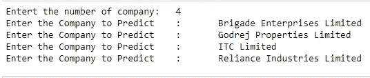

1.  旅群
2.  高德瑞地产有限公司
3.  ITC 有限公司
4.  信实工业有限公司

## 预处理

该模型主要使用 4 个特征进行预测，即开盘、盘高、盘低和收盘。因此，我们放弃了数据帧中的额外功能。

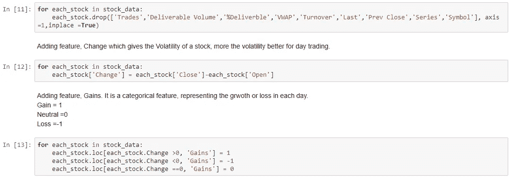

数据帧中添加了 2 个功能，这提供了洞察力。

1.  变化——代表股票每天的变化或波动。
2.  收益-代表日常价值的收益或损失的分类特征。

一旦去掉了额外的特征，我们就有了上市股票的 *df.head()* 和 *df.describe()* ，分别提供了数据帧的前 5 个值和统计描述。

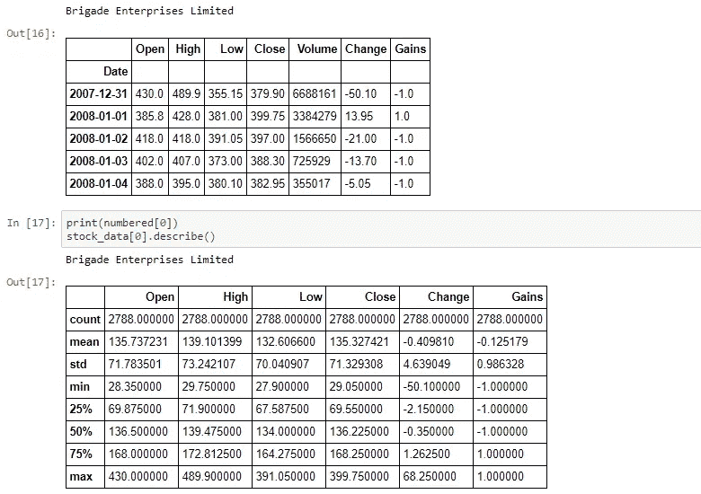

Brigade Enterprises Limited

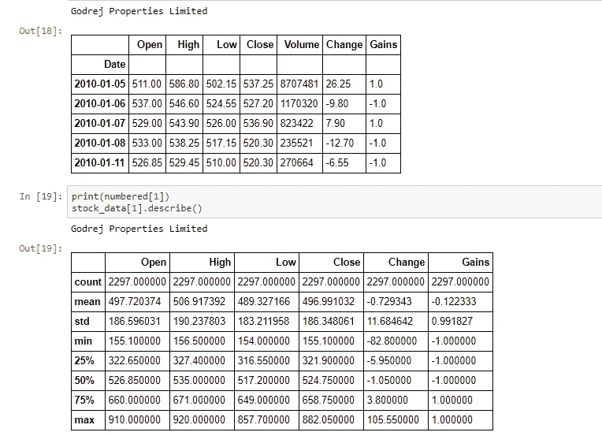

Godrej Properties Limited

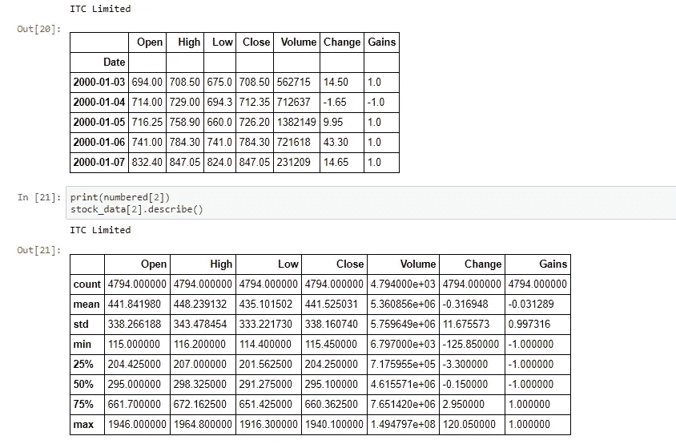

ITC Limited

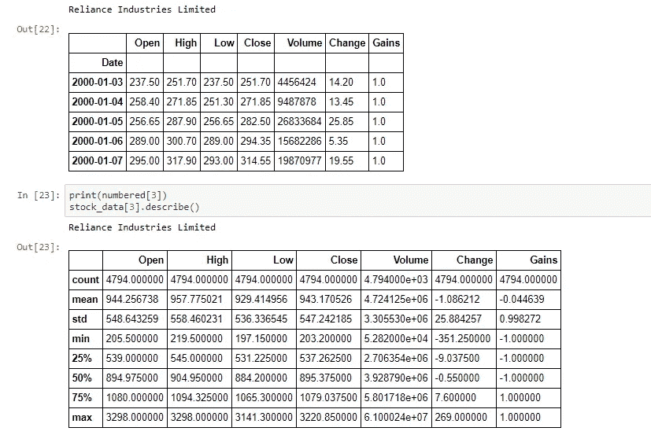

Reliance Industries Limited

## 形象化

可视化这些年来的特征，这为我们提供了关于公司过去趋势和波动性的信息。

此外，还包括 OHLC、HLC 和历年收盘价图，用于说明金融工具价格随时间的变化

**旅组**

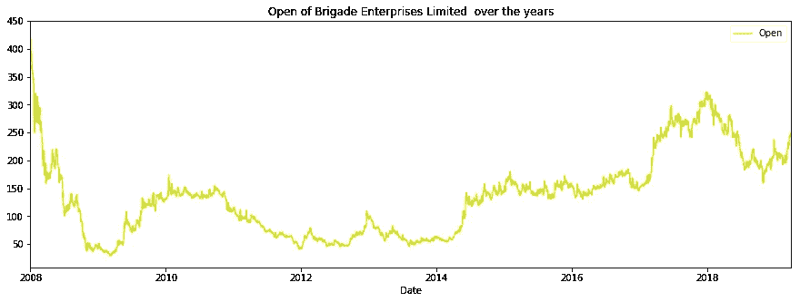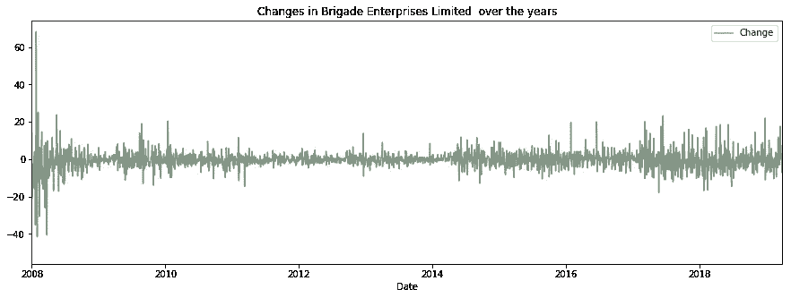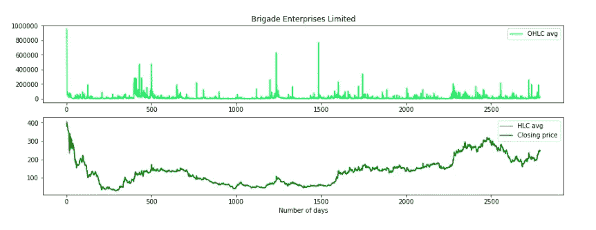

OHLC and HLC Values over the years

**Godrej 房地产有限公司**

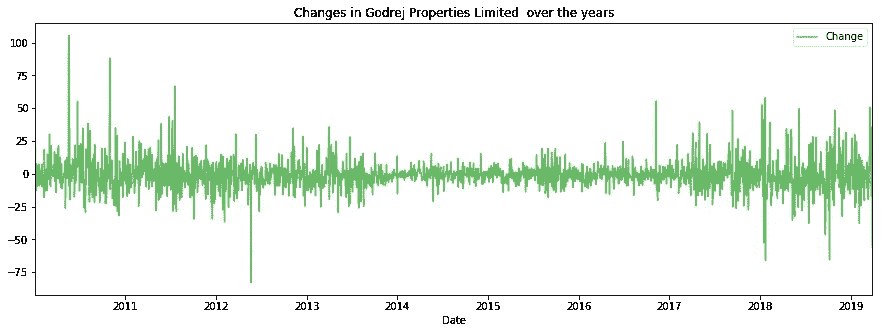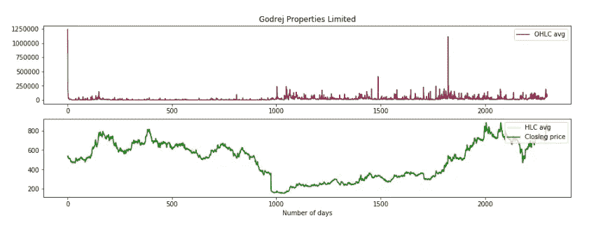

OHLC and HLC Values over the years

**ITC 有限公司**

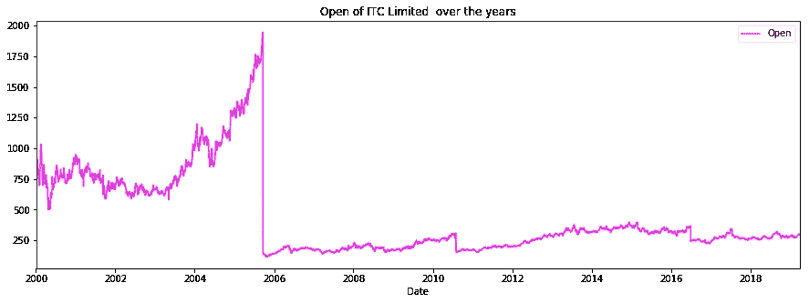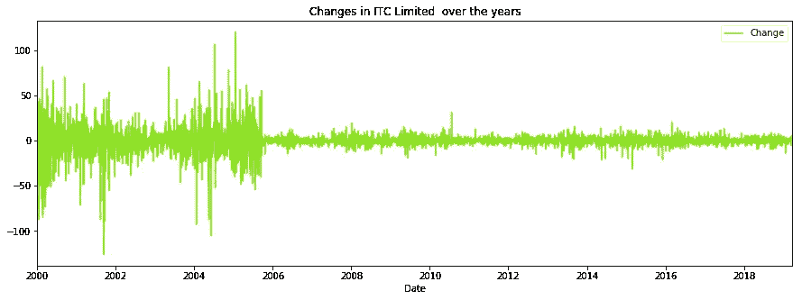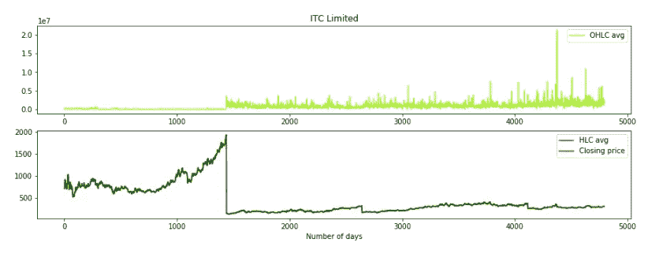

OHLC and HLC Values over the years

**信实工业有限公司**

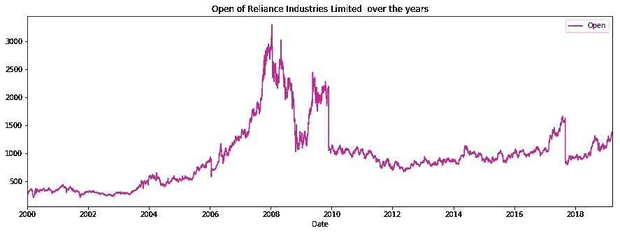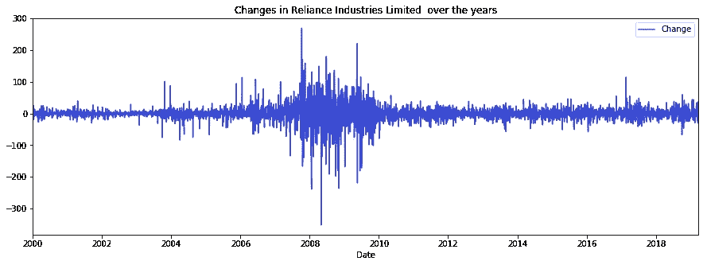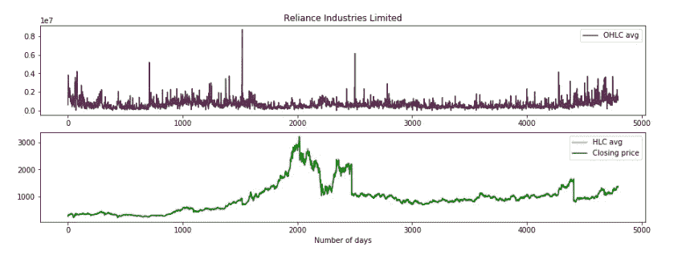

OHLC and HLC Values over the years

## 预言；预测；预告

预测是使用 lstm ( **长短期记忆网络**)完成的，因为它们非常擅长提取时间序列数据中的特征。

列车测试以 75-25%的比例进行。

每种股票总共 5 个周期。

在对每只股票分别进行训练后，模型对测试数据集进行预测，并计算 RMSE ( **均方根误差)。**

我们得到以下相同的结果。

**旅组**

测试数据集 5.13 上的 RMSE

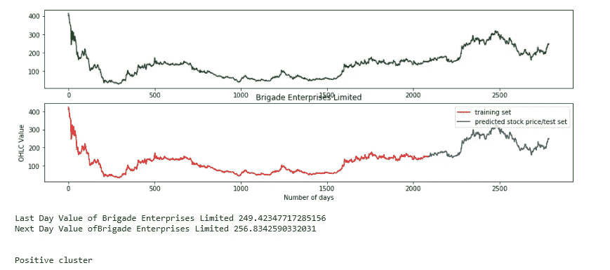

**戈德雷吉地产有限公司**

测试数据集 14.72 上的 RMSE

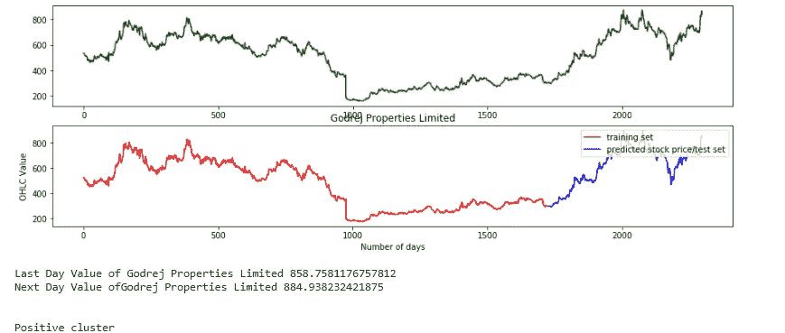

**ITC 有限公司**

测试数据集 6.38 上的 RMSE

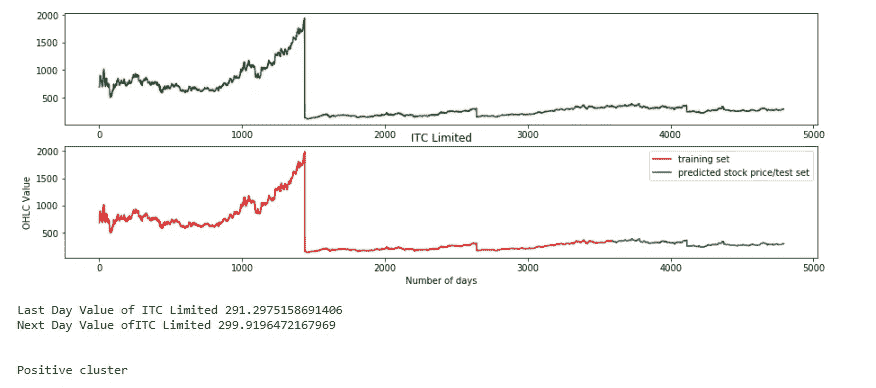

**信实工业有限公司**

测试数据集 29.19 上的 RMSE

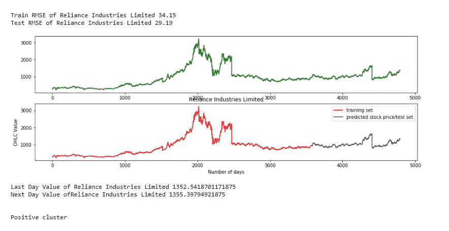

这篇文章包括完整项目的一个模块，即使用神经网络进行预测。项目的另一个方面包括关于公司股票的项目的情感部分。

当结合两个模块的结果，我们可以集群股票的收益或损失。

完整的代码，请访问我的 github 库:

 [## sahilverma 0696/股票市场预测分类

### 使用股票市场数据和多重聚类算法预测最佳方法…

github.com](https://github.com/sahilverma0696/Stock-market-prediction-clustering)