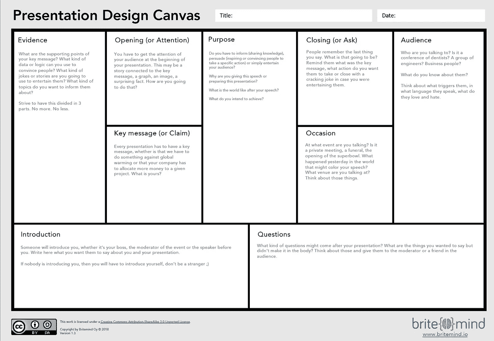

# 为工程师讲故事——第二卷

> 原文：<https://medium.com/hackernoon/storytelling-for-engineers-vol-2-dac768c567e1>

Photo by [Nong Vang](https://unsplash.com/photos/9pw4TKvT3po?utm_source=unsplash&utm_medium=referral&utm_content=creditCopyText) on [Unsplash](https://unsplash.com/search/photos/storytelling?utm_source=unsplash&utm_medium=referral&utm_content=creditCopyText)

每次我去找我的老板，我都会得到同样的回答:“*不要带着问题来找我，带着解决方案来找我*”。

我会很沮丧，因为我以为我在解决问题…看在上帝的份上，我是个工程师！我就是这方面的高手:**解决问题**。

我会稍微调整一下幻灯片，拿走一些显然没有被理解的非常重要的东西，然后再放回去。同样的故事。我不得不一次又一次地回去，无数次。

挫折感不断增加，我过去常常对“*和其他人*”发火。

直到我开始明白问题不在于“其他人”，而在于我自己。

更具体地说:*我呈现事物的方式。*

作为工程师，我们热爱细节，热爱技术和世界的内部运作。

Photo by [Pat Taylor](https://unsplash.com/photos/12V36G17IbQ?utm_source=unsplash&utm_medium=referral&utm_content=creditCopyText) on [Unsplash](https://unsplash.com/?utm_source=unsplash&utm_medium=referral&utm_content=creditCopyText)

像任何优秀的钟表匠一样，我们知道时钟是如何工作的，可以花几个小时谈论手表里的齿轮和杠杆。

尽管手表是时尚物品。

如果他们想把手表卖给任何人，头脑正常的人都不会谈论齿轮和杠杆。

每个人都会谈论象限，皮革腕带，价格。

很少有人有时间去了解细节，即使他们有，也不会对你推销你的想法有太大帮助。

## 给我执行摘要

这是执行摘要:**技术正充斥着商业世界**，越来越需要技术男孩和女孩(也就是正在阅读本文的**你**)来让商业运转。

糟糕的是，一般来说，技术人员不太擅长以一种“另一边”的其他人都能理解的方式来呈现事物。

正因为如此，我们在没有真正听取技术人员意见的情况下做出了决定。

感觉糟透了。大时代。

## 我哪里知道？

我知道是因为我自己也不擅长做这个。

那时我开始意识到我真的需要更好地讲故事。

因为我是一名工程师，所以我需要一个框架，一个能让我在构建演示文稿时更轻松的东西。

一些逻辑。

一些有意义的事情。

## 开头是一个要点列表

我开始研究演讲的艺术，希望能从中汲取科学知识，了解最成功的演讲者背后的东西。

我开始做一个要点列表，非常简单:

*-开启*

*-车身*

*-结论*

这很有道理，但许多东西被遗漏了。

我额外增加了一些东西:

*-关键信息*

*-观众*

*-场合*

有时我会从观众开始，有时从场合开始。

有时候我只想先关注关键信息。

其他时候，开场是激发我创作灵感的事情(假设我有一个:D)。

一个要点列表是不够的。它太压抑，太连续，太局限。

所以我想建立一个思维导图。但这只是一个类固醇的子弹列表，太分散了…我不能一下子控制住一切。

就在那时，我看到了桌子上的《商业模式生成》一书，我想:“*嘿，如果我用画布呢？*

这就是它如何开始自己工作的(谢谢亚历克斯！).

## 然后它变成了一块画布

有了演示设计画布，我可以思考所有的事情，然后马上写出演讲的脚本。

在 20 分钟内，我可以记下主要内容，不再盯着幻灯片看几个小时。

它节省了我大量的时间。

你可以看到下面的演示设计画布，并在这里下载 PDF 高分辨率版本。

这幅油画将多年的工作、学习和经历浓缩在一张 A4 纸上。

它是一种工具，就像任何工具一样，它真的取决于你学会如何使用它。

一旦你有了这个，一切都会变得像钉子一样。

甚至这篇博文也是在画布上构思的。

这是一个传递信息的工具，让自己做好承受人群的准备。

它帮助你思考那些你经常忘记思考的关键领域。

它增加了你的同理心，因为它帮助你站在他人的立场上。

而且作为一个加号**它是怪异的逻辑**:)

## 帮我一个忙

我希望有了这个，世界各地的工程师将越来越能够向每个人讲述故事，不管他们的技术实力如何。

因为不被理解很糟糕。这种感觉是我个人非常讨厌的，所以我需要做些什么来改变它。

**它不仅仅适用于工程师**当然，它适用于所有类型的人，但作为一名工程师，我知道我真的需要它，我也知道像我这样的人真的很欣赏它。

如果你喜欢这个想法，请帮我一个忙，分享给周围的人，喜欢它，并把链接发送给需要它的朋友，如果你分享上面的链接，我将能够知道谁下载了它，并使用它来发展社区。

谢谢大家！🙏

*这是我几年前写另一篇文章* *的续篇，那是我花了多长时间想出解决问题的方法:】*