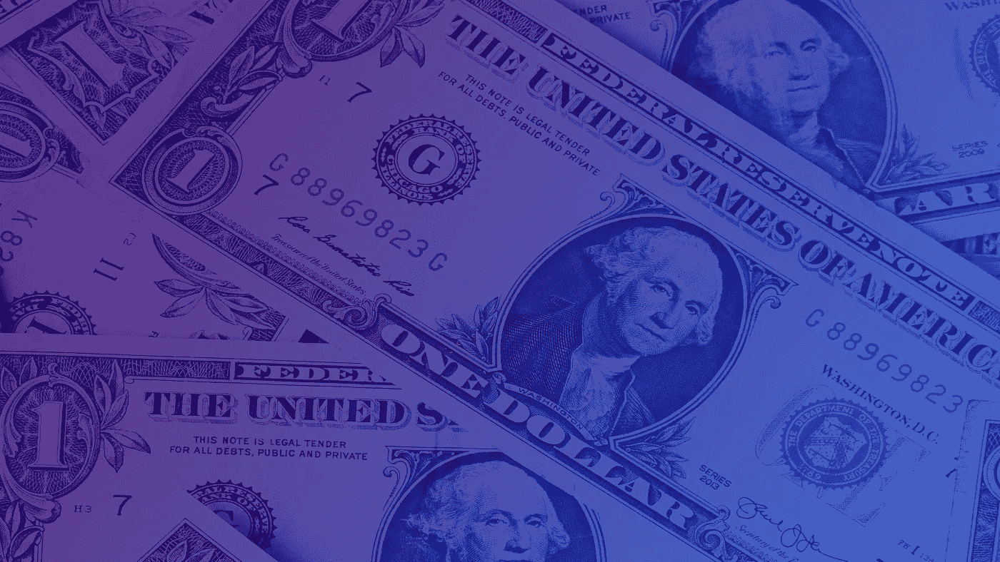
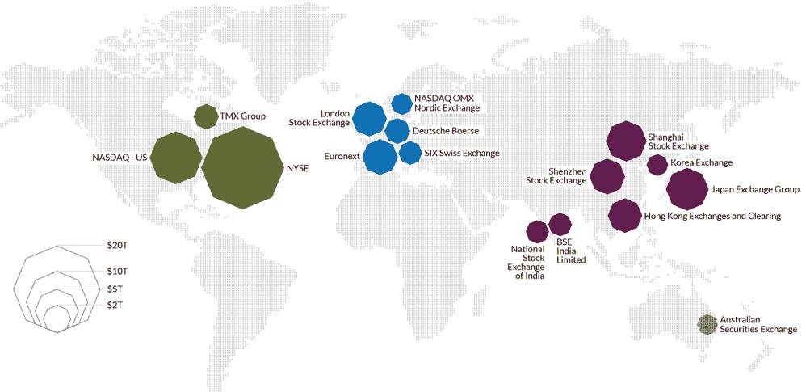
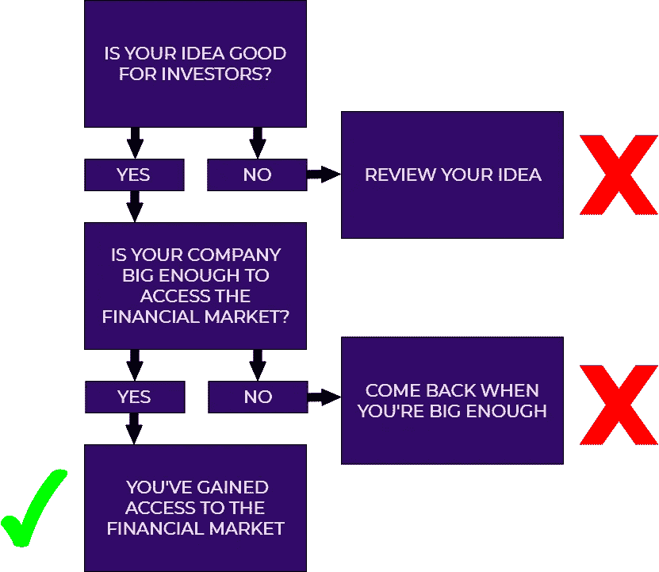
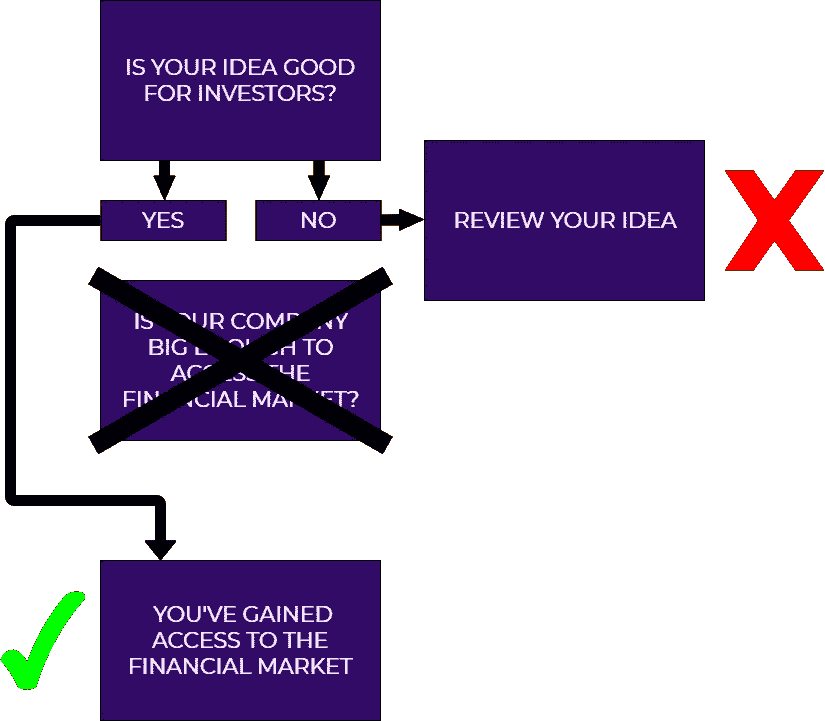

# STOs & CoinBX:即将到来的价值数万亿美元的革命

> 原文：<https://medium.com/hackernoon/stos-coinbx-the-coming-revolution-worth-hundreds-of-trillions-of-dollars-2dc12c53fd90>

Find out more at [aXpire.io](https://axpr.io/)

在公开市场上交易的股票和证券已经存在了几个世纪。中世纪时，第一个金融市场出现在意大利北部，商人之间进行信贷和贸易权利交易。

后来，在发现的时代，这类活动在荷兰也很盛行，最显著的用途是资助非洲和亚洲的商业探险；荷兰东印度公司的“首次公开募股”也许是股票市场对它所服务的社区的重要性的最好例子。

如今，金融市场是国际经济的重要支柱。截至 2017 年 2 月，[全球股票交易总市值为 69 万亿美元](https://www.visualcapitalist.com/all-of-the-worlds-stock-exchanges-by-size/)，约为全球 GDP 的 100%。流通中的证券总量是这个数量的好几倍；例如，[的债务即将达到 250 万亿美元](https://www.bloomberg.com/news/articles/2019-01-15/global-debt-of-244-trillion-nears-record-despite-faster-growth)，超过世界 GDP 的三倍。

Image Rights: [Visual Capitalist](https://www.visualcapitalist.com/), [‘The Money Project’](https://www.visualcapitalist.com/all-of-the-worlds-stock-exchanges-by-size/)

## 一家公司决定进行 IPO(首次公开募股)和/或从监管市场寻求资金的背后有几个原因。

其中包括:

*   获得更廉价的资本。
*   增加公司的曝光率、声望和公众形象。
*   通过股权创造、债务发行等创造多种融资渠道。

获得更廉价的资金是最重要的原因，它使公司能够以低成本筹集资金，从而为其扩张提供资金。一个不能广泛进入金融市场的公司是一个潜力有限的公司。

## 虽然在股票市场上市有很多好处，但只有少数公司能达到这个目标。这是由于该过程的一些不利方面，包括:

*   巨大的法律和会计成本。
*   公开披露财务和业务信息的要求。
*   公司管理所需的时间、精力和注意力。

出于所有这些原因，只有最大的公司才能进入金融市场，这使得许多中小企业没有机会从金融市场筹集额外的资本。

## 多亏了区块链和 aXpire 的 CoinBX，这种情况可能很快会改变。

证券令牌化的主要优势包括:

*   降低上市成本(中小企业将首次能够轻松进入资本市场)。
*   在世界各地全天候交易，市场对所有人开放(今天，为了购买美国股票，投资者需要进入纽约证券交易所或纳斯达克，但这并不总是可能的)。
*   小投资者能够投资于他们想要的公司的可能性，从而成为资本市场的重要组成部分，确保他们在没有任何中介机构干扰的情况下获得回报。
*   降低寻求资金的公司的资金成本。

最后一点是迄今为止最重要的一点，可能会开始彻底改变我们所知的经济；投资取决于 IRR(内部收益率或回报率)或 NPV(净现值)，这些数字要么依赖于资本成本，要么与资本成本相比较。

资本成本越低，可以投资的项目数量就越多。启动的项目越成功，就就业和生产的商品/服务而言，经济效益就越高。

潜力是巨大的，可以通过资助和授权给社区和投资者带来真正价值的公司，引发一场尚未看到的经济革命。

未来几年，价值数十万亿美元的资产可能会被令牌化，全都在区块链！

除此之外，几个缺乏流动性的行业可以通过自己的令牌化来加速发展。举例来说，这可能会影响初创企业。向零售资本开放创业公司将有助于更多公司获得资金，让它们茁壮成长，提高经济收益率和创新。由于认证法和金融市场的高准入门槛，目前这是不可能的。

## CoinBX 计划如何成为 STO 革命的一部分？

计划很简单；aXpire 将允许在其完全兼容的平台 CoinBX 上提供安全令牌，从而为中小企业、初创公司和社区项目提供支持。

aXpire via CoinBX 与在令牌化的法律、税务和审计方面拥有最丰富专业知识的合作伙伴合作，可以为任何希望实现其价值的人提供统包解决方案。

我们的绝对目标是将全球的资本寻求者和投资者联系起来，摆脱传统金融市场所经历的任何过时的限制。一旦你意识到安全令牌将带来的巨大价值，一切都会变得非常令人兴奋。

从下面的流程图中可以清楚地看到 s to 与 CoinBX 合作的诸多优势。

# 如何在 STOs & aXpire 的 CoinBX 之前筹集资本(在银行圈之外)

# 如何在 STOs & aXpire 的 CoinBX 之后筹集资本(在银行圈之外)

s to 使最小的公司也能进入金融市场。这是前所未有的，好处是巨大的。

## 什么可以标记化？

几乎所有值钱的东西。是的，*一切*。资产的代币化已经开始，昂贵的房子被分割成几个代币，在另类投资机会中出售。然而，这只是标记化的众多应用之一。

**可以标记:**

*   房地产
*   商品
*   股票
*   债务
*   派生物
*   等等(任何有经济价值的合同)

**那么，你是:**

*   一家寻求融资的初创公司？
*   寻求资金扩张的中小企业？
*   寻找新机会的小投资者？

如果是这样，请成为 STO 革命的一部分，并通过给 info@axpire.com[发电子邮件与 aXpire.io 取得联系！](mailto:info@axpire.com)

*本文由 aXpire 社区成员 gian Luca via*[*match bx . io*](https://matchbx.io/)撰写