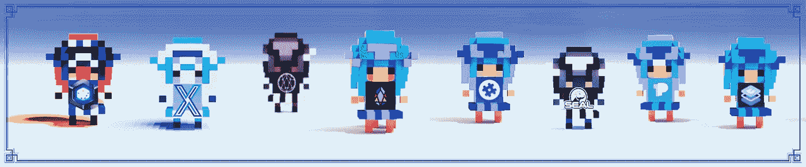
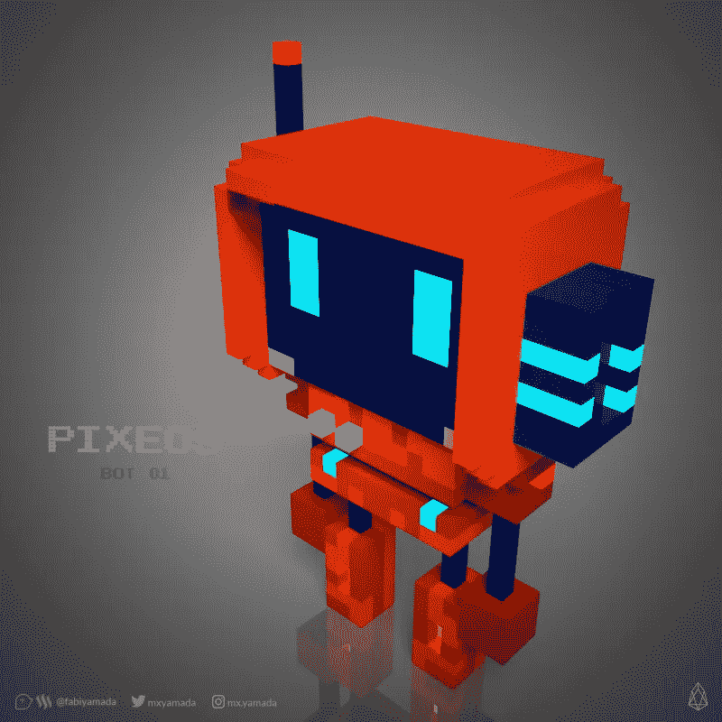
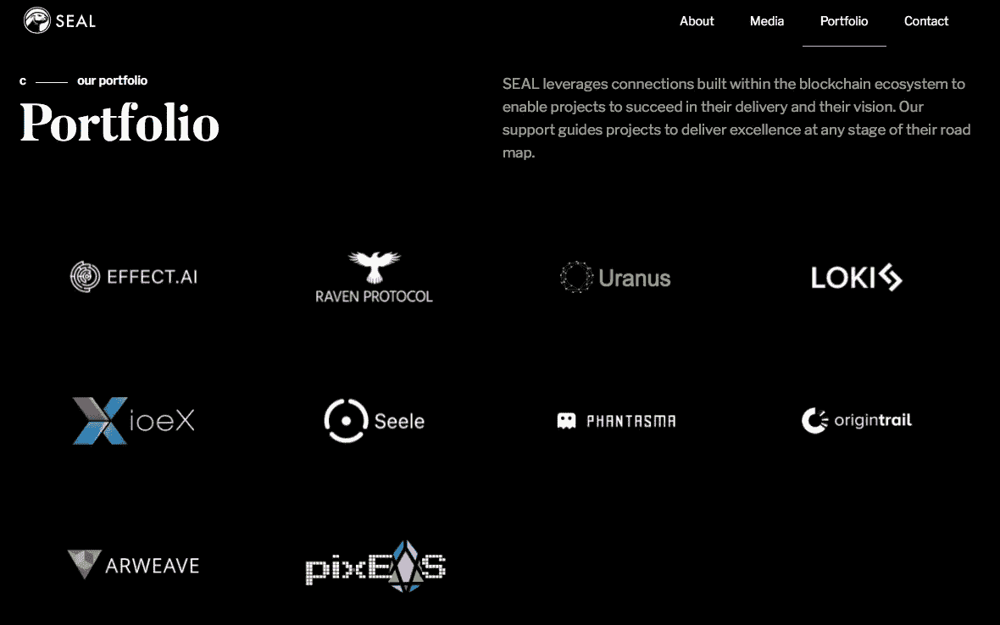

# PixEOS 的战略伙伴关系

> 原文：<https://medium.com/hackernoon/strategic-partnerships-of-pixeos-c61da713cf0e>

art by Stellabelle

## PixEOS 构建于 EOSIO 之上，EOS io 是最强大的分散应用基础设施，我们的愿景体现了协作精神。

当我们竭尽全力，肩并肩，朝着同一个目标前进时，伟大是可能的。我们不一定要手拉手唱 Kumbaya，但我们都可以挑战自己，同时朝着同一个方向走。

**那是什么方向？**

主流采用 EOS 是 pixEOS 背后的驱动力。没有协作就不会发生。我们清楚地认识到这一点，因为创始人已经建立了一个成功的企业，协作发挥了关键作用。

如果我们像孤立的狗一样，在地窖里咆哮，守着自己微薄的骨头，我们就无法成就伟大。我们知道协作对能源有着复合效应，我们已经看到这种能量在我们的电报团队中日益增长。 ***为什么会这样？*** 因为我们一直在为我们的社区提供服务。我们已经举行了许多比赛，Telegram Rains，一个正在进行的 pixEOS 令牌口袋空投，我们的机器人 Voxie 向请求它们的人提供免费的 EOS 帐户代码。我们的第一款涂料 dApp pixEOS Paint 将于 2019 年 1 月底推出。

Voxie the pixEOS Telegram bot designed by @fabiyamada

## 在 pixEOS，我们的使命是创造尽可能最好的用户体验和多媒体产品，因此我们与各种不同的组织建立了许多战略合作伙伴关系来支持这一愿景。

每个战略合作伙伴为我们提供了一套独特的资源，其中包括从令牌经济学指导，风险资本投资到区块链发展支持等一切。我们的伙伴关系是互利的，并创造了一个强大的协作 EOS 生态系统。

除了我们的战略合作伙伴关系，我们还与组织建立了许多重要的合作关系，这些关系对于实现 EOS 主流化的长期目标同样至关重要。我们想对我们的媒体合作伙伴， [Trybe](https://trybe.one/members/pixeos/blog/) ，[白兔](https://www.whiterabbiticos.com)，[编剧](https://www.theeoswriter.io)和莫兰说一声。莫兰在宣传 pixEOS 在中国方面做得非常出色。所有这些组织都非常有助于宣传 pixEOS。

其他超级支持项目，如 [GenerEOS](https://www.genereos.io) 和 [EOS Cafe Block](https://www.eoscafeblock.com) 已经与我们合作，创建一个更加统一的 EOS 生态系统，并帮助使 EOSIO 平台更加用户友好和协作。

我们要感谢我们所有的战略伙伴和合作者的持续支持，我们期待着在未来与更多认同我们合作精神的组织合作。

**以下是我们当前战略合作伙伴关系的一瞥:**

## **比特饼**

 [## Bitpie - Hi 区块链

### 编辑描述

bitpie.com](https://bitpie.com) 

*Bitpie 采用 HD wallet(分层确定性，协议 BIP32/44)技术构建。Bitpie 平台无法触及用户的数字资产。迄今为止，他们已经存储了价值超过 150 亿美元的加密货币。*

BitPie 是一个多链资产钱包，最近增加了 EBTC，伊思和 EUSD 配对。这里有一个关于 EBTC、伊思和 EUSD 的解释:“EBTC、伊思和 EUSD 是 EOS Mainnet 上的跨链稳定成员，它们以 1:1 的比例与 EOS Mainnet 上的 BTC、瑞士联邦理工学院和 USDT 挂钩。这些 stablecoins 由 Bitpie 操作的网关接受。官方网站:[https://eosstablecoin.com](https://eosstablecoin.com/)

Bitpie 将允许 pixEOS 在 pixEOS 平台上集成这些配对。

## **赛博格拉斯**

 [## Cypherglass -美国首屈一指的 EOS 砌块生产商

### Cypherglass 很荣幸成为 EOS 砌块生产商候选人。我们相信 EOS 和分散化的力量…

www.cypherglass.com](https://www.cypherglass.com) 

位于 EOS 区块链的美国方块制作团队 Cypherglass 正在为我们的游戏技术和记号结构提供持续的战略指导。此外，Cypherglass 还投资了 pixEOS，推荐顶级区块链开发人员来审计我们的智能合同，并参与开发我们的平台。他们是我们在推广方面的顶级合作伙伴，也是让人们意识到团结一个被广泛采用的 EOS 生态系统的必要性的有力帮手。

## **骰子**

 [## Dice -社交游戏平台

### 最佳 EOS 利润分享赌博平台

骰子一](https://dice.one) 

Dice 是 EOS 区块链上的一个大型社交游戏平台。用户可以从玩中赚取骰子代币，然后从下注中获得分红。平台和令牌都基于以用户为中心的设计。DICE 和 pixEOS 将很快实现相互平台令牌支持。

## **地球大气层**

 [## EOSphere—服务于整个 EO sphere 的企业级数据块生产和治理

### 我们对 EOS 社区的核心责任是帮助治理和管理 EOS。我是区块链。我们相信我们的…

www.eosphere.io](https://www.eosphere.io) 

EOSphere 是 EOS 区块链上的一个澳大利亚砌块生产商团队。EOSphere 是我们最早的 BP 创始支持者和投资者，并提供持续的业务发展咨询。EOSphere 向我们介绍了 EOS 生态系统，并一直支持我们。此外，EOSphere 还在合作伙伴和其他重要领域提供业务开发。

## **LITEX**

 [## LITEX -您的一切加密资产

### LTXN 及其智能合约确保了稳定性。支付渠道建立在智能合约上，智能合约…

litex.io](http://litex.io) 

Litex 是一个完全去中心化的加密货币支付生态系统。LITEX 建立在 LTXN(LITEX 网络)之上，支持即时小额支付，服务费用极低。Litex 将为 pixEOS 提供以太坊第二层集成。

## **海豹突击队**

 [## 海豹

### 海豹突击队与我们的独立数字媒体资源合作，涵盖区块链技术和…

印章.大写](https://seal.capital/#about-us) 

Seal 是一个由区块链专家组成的投资团体，其主题是:*“实现明天的颠覆性想法”。* Seal 已经投资了 pixEOS，与许多早期创业公司如 Effect.ai 和 Raven Protocol 合作，并为 pixEOS 核心团队提供了几个月的支持。

-Seal website: [https://seal.capital/#about-us](https://seal.capital/#about-us)

## **代币袋**

 [## TokenPocket - 你的通用数字钱包 | EOS 钱包 - 以太坊钱包 - 墨客钱包 - ENU 钱包 - 井通钱包

### TokenPocket 是一个集 EOS 钱包，以太坊钱包，墨客钱包，ENU 钱包，井通钱包等于一体的去中心化通用数字钱包。集成多底层的 Dapp, 支持查看实时行情、币币兑换等功能。

www.mytokenpocket.vip](https://www.mytokenpocket.vip) 

Token Pocket 是 EOS 领域中最人性化的钱包之一。Token Pocket 为 pixEOS 用户提供免费的 EOS 账户，并通过糖果盒系统运行 pixEOS Airdrops。在 pixEOS Telegram 中获取关于免费 EOS 帐户的信息:[https://t.me/PIXEOS](https://t.me/PIXEOS)

我们有比上面列出的更多的伙伴关系，当我们建立新的伙伴关系时，我们会让你知道细节。感谢我们所有的战略合作伙伴、合作者和朋友，他们为包括 pixEOS 在内的整个 EOS 生态系统的成功做出了贡献。也感谢我们社区中所有的早期支持者，他们真的在改变。您可以在我们的网站上找到我们所有合作伙伴的完整列表: [https://www.pixeos.io](https://www.pixeos.io)

*艺术创作和文章撰写由*[*Stellabelle*](https://giphy.com/channel/stellabelle)*为 pixEOS。由 Fabi Yamada 设计的 Voxie 机器人。*

*pixEOS 艺术家:@ yusaymon @ juliakponsford @ fabiyamada @ reinhard-schmid @ gama*

*如果你有兴趣成为 pixEOS 的艺术家，请阅读此文:*[*https://hacker noon . com/pixEOS-featured-artists-FAQ-71fa 696 ad5 e 2*](https://hackernoon.com/pixeos-featured-artists-faq-71fa696ad5e2)

## **官方 pixEOS 链接**

Website: [https://www.pixeos.io](https://www.pixeos.io/)
Twitter: [https://twitter.com/eos_pix](https://twitter.com/eos_pix)
Instagram: [https://instagram.com/pixeos.io](https://instagram.com/pixeos.io)
pixEOS Telegram group: [https://t.me/PIXEOS](https://t.me/PIXEOS)
pixEOS Announcement channel: t.me/pixeosio
pixEOS Chinese group, 中国社区: [t.me/pixEOSChina](http://t.me/pixEOSChina)
pixEOS Korean group: [https://t.me/pixEOSKorea](https://t.me/pixEOSKorea)
Trybe: [https://trybe.one/members/pixeos/blog/](https://trybe.one/members/pixeos/blog/)
Whitepaper English: [https://pixeos.io/pdf/pixeos_1_25_12a_en.pdf](https://pixeos.io/pdf/pixeos_1_25_12a_en.pdf)
Whitepaper Chinese: [https://pixeos.io/pdf/pixeos_1_25_12a_cn.pdf](https://pixeos.io/pdf/pixeos_1_25_12a_cn.pdf)
E-mail: team@pixeos.io