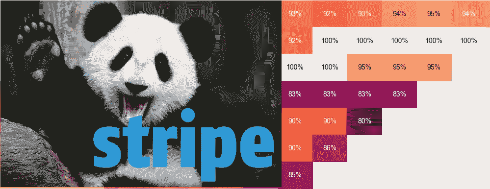
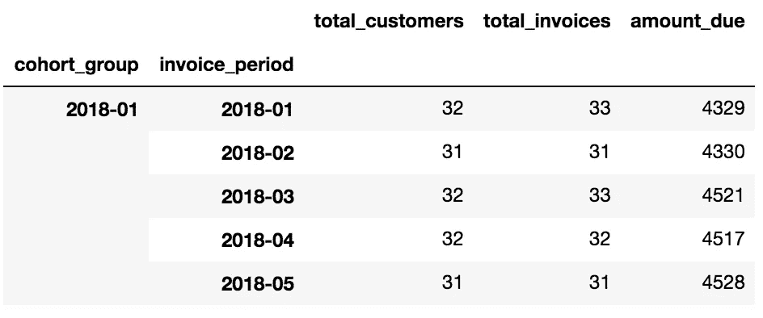
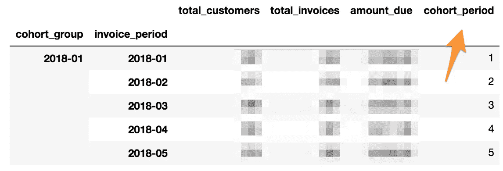
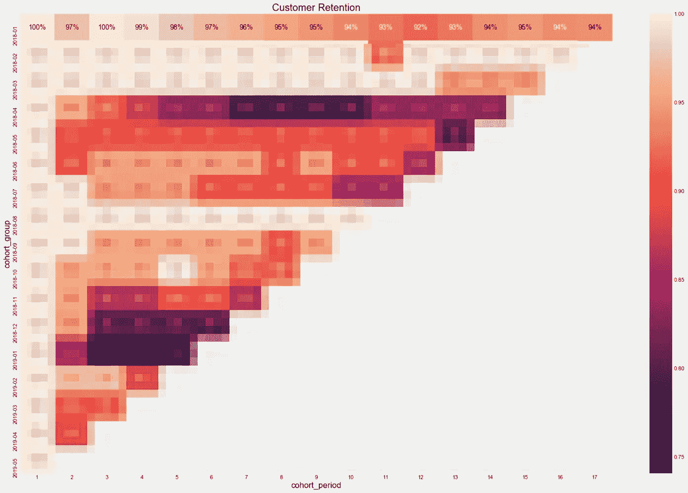
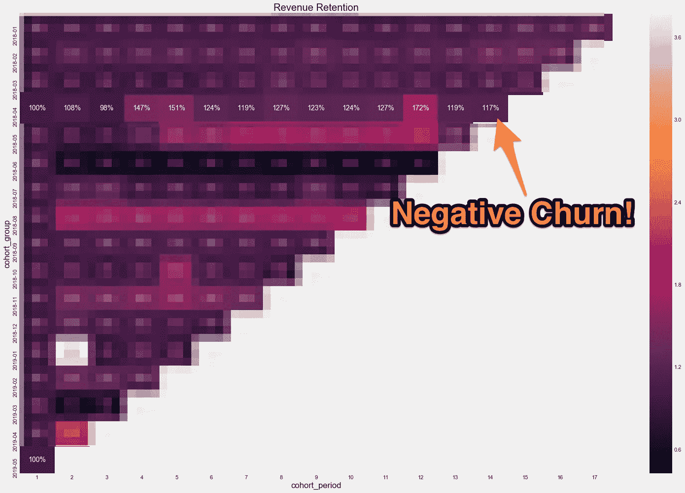

# Python 和熊猫的条纹队列分析

> 原文：<https://medium.com/hackernoon/stripe-cohort-analysis-with-python-and-pandas-d931959cf7e>



Did you know Pandas get stoked about bamboo and cohorts?

我在做咨询的时候开始了我的第一个 SaaS 产品。SaaS 的收入在增加，但这比不上我的时薪。傻乎乎的，我发现很难对高薪小时工说不。

**为什么？我没看过** [**队列分析**](https://avc.com/2009/10/the-cohort-analysis/) **。**我不明白长期缓慢稳定的订阅增长的价值。我不明白，一点点入职帮助往往会导致后期几乎没有收入。真是个笨蛋！

在这篇文章中，我将展示如何从你的[条纹](https://stripe.com)发票中生成你的客户群群组分析。如果这感觉像很多代码，不要担心。**最后，我将分享一个 Python 脚本，它用一行代码生成了一个条带群组热图。**

# 工具

我将使用 [Jupyter 笔记本](https://jupyter.org)和几个 Python 包。如果你是 Python 新手，我建议[通过 Anaconda](https://www.anaconda.com/distribution/) 安装 Jupyter 笔记本。这将同时安装[Pandas](http://pandas.pydata.org/)—*Python 数据分析库*。Jupyter 笔记本为您提供了一种交互式的方式来探索您的数据和分享您的分析。

# 方法

我将遵循 Greg Reda 的[群组分析的开创性方法](http://www.gregreda.com/2015/08/23/cohort-analysis-with-python/)，并将其应用于您的条纹发票。

## 1.出口条纹发票

我们将从条纹发票建立群组。我们可以很容易地将您的条纹发票导出到带有 [PetalData](https://petaldata.app) 的熊猫数据框架中。将以下内容粘贴到你的笔记本上:

如果你有成千上万的发票(希望你有！)，下载需要一点时间。下载时，拿起你最喜欢的饮料。

## 2.基于“已创建”列创建“发票 _ 期间”列

Petaldata 创建的 Pandas dataframe 有一个`created`列，这是发票创建的时间。由于大多数订阅服务是按月的，我们将按月分组。下面的代码以类似于`2019-05`(即 2019 年 5 月)的格式命名您的群组。

```
df['invoice_period'] = df.created.apply(lambda x: x.strftime('%Y-%m'))
```

## 3.根据客户的第一张发票创建“群组”列

当你的客户收到第一张发票时，他们就存在了。我们会根据发票的日期将他们分配到他们的群组。

```
df.set_index('customer_email', inplace=True)df['cohort_group'] = df.groupby(level=0)['created'].min().apply(lambda x: x.strftime('%Y-%m'))
df.reset_index(inplace=True)
```

## 4.按群组组& invoice_period 汇总数据

现在，我们按群组和发票期进行汇总。我们的一级指数将是客户签约的月份(例如:`2018-01`)，我们的二级指数将是每个发票期(例如，从 2018 年 1 月起的每个月):

```
grouped = df.groupby(['cohort_group', 'invoice_period'])# count the unique customers, invoices, and total revenue per group + period
cohorts = grouped.agg({'customer': pd.Series.nunique,
                       'created': "count",
                       'amount_due': np.sum})# make the column names more meaningful
cohorts.rename(columns={'customer': 'total_customers',
                        'created': 'total_invoices'}, inplace=True)
cohorts.head()
```

这将生成如下输出:



## 5.标记每个群组的群组周期

比较不同的群组(例如:2018 年 3 月和 2019 年 3 月的注册在第二个月如何比较？)，我们需要在每一行上标注从首次购买开始的月数:

```
def cohort_period(df):
    df['cohort_period'] = np.arange(len(df)) + 1
    return dfcohorts = cohorts.groupby(level=0).apply(cohort_period)
cohorts.head()
```

您将看到新的`cohort_period`列:



## 6.创建函数以生成热图

随着时间的推移，可视化群组可能会产生噪音。为了更容易理解，我们将使用 [Seaborn](http://stanford.edu/~mwaskom/software/seaborn/) 热图。下面的函数来自 Greg 的[博客文章](http://www.gregreda.com/2015/08/23/cohort-analysis-with-python/)，并允许我们轻松地从多个栏目生成热图。

将这些添加到您的笔记本中:

```
def cohort_heatmap(cohorts,col,title):
    size = group_size(cohorts,col)
    over_time = cohort_over_time(cohorts,size,col)
    _cohort_heatmap(over_time,title)

def group_size(cohorts,col):
    # reindex the DataFrame
    cohorts.reset_index(inplace=True)
    cohorts.set_index(['cohort_group', 'cohort_period'], inplace=True)# create a Series holding the total size of each cohort_group
    return cohorts[col].groupby(level=0).first()def cohort_over_time(cohorts,group_size,col):
    return cohorts[col].unstack(0).divide(group_size, axis=1)def _cohort_heatmap(cohort_over_time,title):
    plt.figure(figsize=(24, 16))
    plt.title(title)
    sns.heatmap(cohort_over_time.T, mask=cohort_over_time.T.isnull(), annot=True, fmt='.0%');
```

## 7.客户保持

都到这种地步了！只需运行以下程序，以热图的形式查看一段时间内的客户保持率:

```
cohort_heatmap(cohorts,"total_customers","Customer Retention")
```

这会产生:



## 8.收入留存

你有 SaaS 的圣杯吗，[负面搅动](https://www.profitwell.com/blog/how-to-achieve-negative-churn-and-why-it-matters)？这意味着即使有客户流失，你的人均收入也会随着时间的推移而增长。让我们看看:

```
cohort_heatmap(cohorts,"amount_due","Revenue Retention")
```



# 你还能把它带到哪里？

*   使用绝对数字和百分比
*   按客户 _ 国家过滤
*   按自定义字段筛选
*   按客户规模过滤(例如:保留最大的客户)
*   加入 [Hubspot 数据](https://petaldata.app/datasets/hubspot/)(例如:通过有机搜索注册的客户的留存率)

# 现在就试试吧！

我已经用 Python 脚本创建了一个 [GitHub repo](https://github.com/petaldata/stripe-cohort-analysis) 来完成上面的所有步骤。要使用:

```
git clone [git@github.com](mailto:git@github.com):petaldata/stripe-cohort-analysis.git
STRIPE_API_KEY=[YOUR API KEY] python stripe_cohort_analysis.py
```

该脚本将随着时间的推移生成您的客户群的两张热图(在当前目录中保存为 png)。