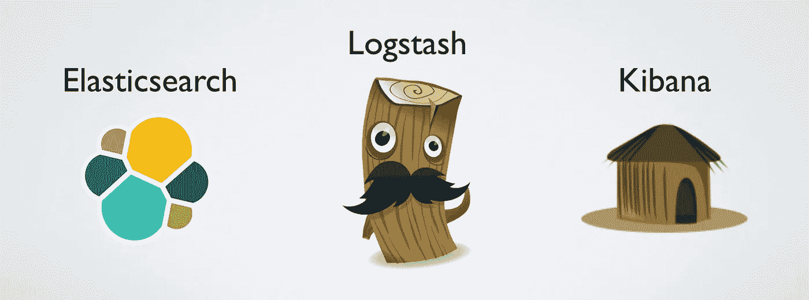

# 如何使用 Grok 结构化 Logstash 中的非结构化数据

> 原文：<https://medium.com/hackernoon/structuring-unstructured-data-with-grok-bcdbb240fcd1>

## 转换日志数据的 Elastic (ELK)堆栈提示和技巧

如果你正在使用 Elastic (ELK)栈，并且对将定制日志映射到 Elasticsearch 感兴趣，那么这篇文章就是为你准备的。

ELK Stack 是三个开源项目的缩写:Elasticsearch、Logstash 和 Kibana…